# Chương 1. Định nghĩa và thành phần của kiến trúc phần mềm

Hai team vẫn có thể tranh luận dù cùng nói *web ba lớp* hay *microservices*, bởi *kiến trúc* vừa là các hộp và đường nối trên sơ đồ, vừa là bộ quy tắc khiến hệ thống tiến hóa theo thời gian, vừa là cách nó đáp ứng những yêu cầu hiếm khi gói gọn trong một user story. Chương này cố định từ vựng theo các trường phái hay dùng — Bass *et al.* [1], IEEE/ISO [3], [4], Richards và Ford [6] — phân biệt kiến trúc với thiết kế và triển khai, rồi giới thiệu các *góc nhìn* (4+1 [2], C4 [8]) để cùng một hệ thống vẫn đọc được với người kinh doanh, vận hành và lập trình. Thuật ngữ được mở nghĩa ngay trong đoạn đầu tiên chúng xuất hiện; sơ đồ Mermaid, sơ đồ SVG và **sketchnote** (ghi chú trực quan phác tay) trong `assets/figures/part-01/` bổ trợ trực quan (xem [00-QuyUoc-Soan-Thao.md](../00-QuyUoc-Soan-Thao.md)).

## 1.1. Vì sao “kiến trúc” khó định nghĩa một cách gọn?

**Kiến trúc phần mềm** (*software architecture*) là cách tổ chức **toàn bộ** hệ thống phần mềm ở mức cao — khác với viết một hàm hay một lớp. Người ta khó “gói một câu” vì kiến trúc đồng thời là **cấu trúc** (*structure*): các thành phần và chỗ chúng nối với nhau trên sơ đồ; là **quyết định và nguyên tắc** (*decisions & principles*): luật chơi khi phát triển và khi hệ thống **tiến hóa** (*evolution*) theo thời gian; và là cách hệ thống đáp ứng **yêu cầu phi chức năng** (*non-functional requirements*, NFR) như hiệu năng hay bảo mật — những yêu cầu thường không nằm trong một user story đơn lẻ nhưng quyết định hệ thống “có dùng được trong thực tế hay không”. Chẳng hạn, hai dự án đều nói “web app ba lớp”; dự án A chỉ tách thư mục cho đẹp nhưng vẫn gọi SQL từ giao diện, dự án B cấm tuyệt đối tầng trình bày chạm CSDL — **cấu trúc vẽ giống nhau** nhưng **quyết định kiến trúc** khác hẳn.

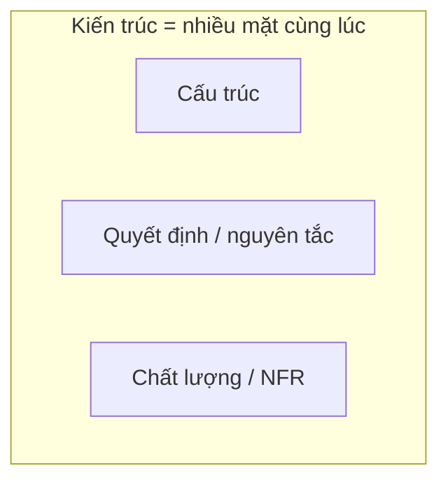

**Figure 1.2.** Sketchnote: *kiến trúc* đồng thời là **cấu trúc**, **quyết định / nguyên tắc** và **NFR** — hai sơ đồ “giống nhau” vẫn có thể khác *luật chơi*. *Source:* SVG gốc (CC BY-SA 4.0); `figures/sketchnotes/README.md`.

## 1.2. Ba cách định nghĩa thường gặp (Bass, IEEE, Richards & Ford)

**Bass, Clements và Kazman** [1] viết: kiến trúc là **một hoặc nhiều cấu trúc** của hệ thống, gồm **thành phần phần mềm** (*software components* — có thể là dịch vụ, lớp, module), các **thuộc tính nhìn thấy từ bên ngoài** (*externally visible properties* — ví dụ API công khai, giao thức, thời gian phản hồi cam kết được, chứ không phải code nội bộ), và **quan hệ** (*relationships* — gọi hàm, gửi message, đọc chung DB…). Chẳng hạn, hai microservice trao đổi qua REST công khai; “REST + JSON + URL `/orders`” là thuộc tính nhìn thấy; cách service parse JSON bên trong **không** phải phần kiến trúc theo nghĩa Bass nếu không ảnh hưởng hợp đồng bên ngoài.

**IEEE 1471-2000** [3] (tinh thần được chuẩn hóa tiếp trong **ISO/IEC/IEEE 42010** [4]) nhấn mạnh **tổ chức cơ bản** (*fundamental organization*), các **thành phần**, quan hệ của chúng với nhau và với **môi trường** (*environment* — pháp lý, tổ chức, hệ thống bên ngoài như cổng thanh toán), cùng **nguyên tắc** chi phối thiết kế và **tiến hóa** (*evolution*). Chẳng hạn, ứng dụng y tế phải lưu log truy cập theo quy định bệnh viện — đó là **môi trường** định hình kiến trúc (bắt buộc có audit trail), không chỉ là “một tính năng nhỏ”.

**Richards và Ford** [6] gom thành bốn phần dễ nhớ: **Structure** (phong cách tổng thể: monolith, microservices…), **Architecture characteristics** (các *-ilities*: khả dụng, mở rộng…), **Architecture decisions** (quy tắc cứng), **Design principles** (hướng dẫn mềm). Chỉ nói “chúng tôi là microservices” mới chỉ nói **Structure**; nếu chưa nói *-ilities* và quyết định, chưa đủ **một bức tranh kiến trúc** theo họ. Chẳng hạn, “Microservices, p99 checkout < 1s, mỗi service một DB, ưu tiên giao tiếp bất đồng bộ” — đã có structure, một phần characteristics, decisions và principles.

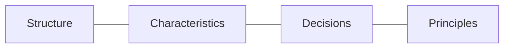

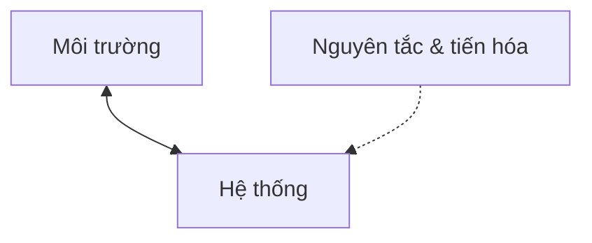

## 1.3. Kiến trúc không phải bản thân phần mềm đang chạy

**Biểu diễn kiến trúc** (*architectural representation*) là sơ đồ, tài liệu, ADR — dùng để **phân tích** và **thương lượng** trước khi đổ quá nhiều chi phí vào mã. **Phần mềm vận hành** là tiến trình, container, request thật — có thể đổi bản build mà vẫn giữ cùng quyết định ranh giới. Chẳng hạn, đổi từ Jenkins sang GitHub Actions **không** đổi kiến trúc logic “hai service không share DB”; chỉ đổi **công cụ triển khai** (*deployment tooling*).

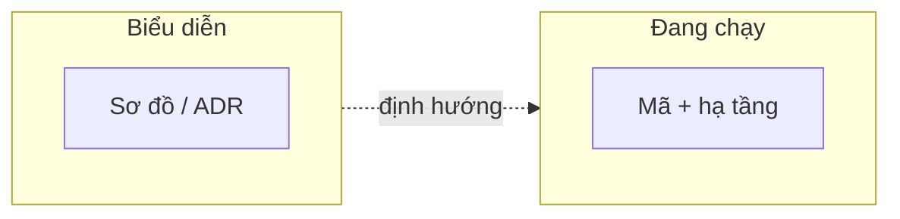

**Figure 1.1.** Sketchnote (phác tay / ghi chú trực quan): cộng tác trên *biểu diễn* (C1, ADR…) trước khi đầu tư sâu vào triển khai — phong cách minh họa “sketchnote”, không thay cho sơ đồ kỹ thuật đầy đủ. *Source:* SVG gốc trong repo (CC BY-SA 4.0); xem `figures/sketchnotes/README.md`.

## 1.4. Kiến trúc, thiết kế và triển khai

**Kiến trúc** trả lời *cái gì* và *vì sao* ở phạm vi **toàn hệ thống**; thay đổi muộn thường **đắt** vì kéo theo nhiều team và dữ liệu. **Thiết kế** (*design*) chi tiết hóa **một phần** hệ thống (module, bounded context) — vẫn quan trọng nhưng bán kính ảnh hưởng nhỏ hơn. **Triển khai** (*implementation*) là chọn **framework, phiên bản thư viện, cấu hình** cụ thể — dễ đổi hơn nếu không phá vỡ hợp đồng kiến trúc. Cùng một mạch: ở tầng kiến trúc có thể quy ước “mỗi bounded context một database; giao tiếp giữa context qua API hoặc sự kiện”; ở tầng thiết kế, trong context Đơn hàng ta chọn kiểu ports/adapters; ở tầng triển khai, gateway là Kong 3.x, message là Kafka, service Đơn hàng chạy Spring Boot 3. Nếu sau này thay Kong bằng **AWS API Gateway** mà **ranh giới và luồng** giữ nguyên, đó vẫn là đổi **triển khai**, không phải đổi kiến trúc tổng thể.

**Đánh đổi** (*trade-off*) nghĩa là chọn A thường hy sinh một phần B (ví dụ nhất quán mạnh đổi lấy độ trễ). Ở tầng kiến trúc, **lý do** (*why*) chấp nhận đánh đổi cần được ghi rõ — thường trong ADR.

Richards và Ford [6] gom tinh thần đó thành **hai mệnh đề** mà nhiều team dùng như *kim chỉ nam* (không phải định luật tự nhiên, nhưng là **từ vựng nghề**): (1) *Everything in software architecture is a trade-off* — mọi lựa chọn kiến trúc đều là đánh đổi; không có kiến trúc “tối ưu tuyệt đối” cho mọi bối cảnh, chỉ có phương án **ít tệ nhất** khi đã nói rõ rủi ro. (2) *Why is more important than how* — **rationale** (vì sao) quan trọng hơn mô tả chi tiết **cách** cài (framework, phiên bản): khi bối cảnh đổi, *how* sẽ đổi nhưng *why* vẫn phải đọc được từ ADR để tránh lặp lại tranh luận cũ.

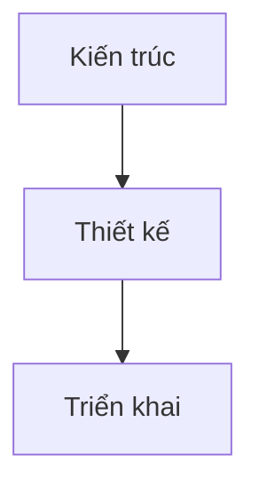

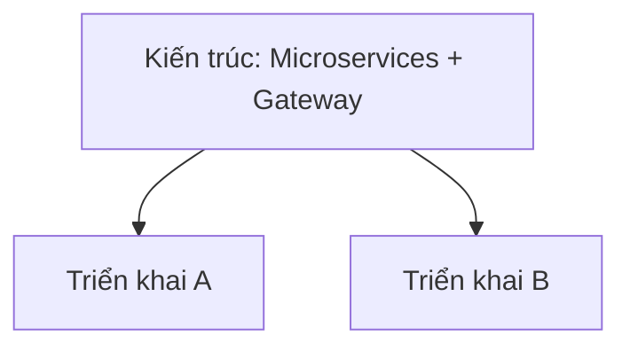

## 1.5. Ẩn dụ xây dựng và “hàng ngàn quyết định”

Ẩn dụ **bản vẽ nhà** vẫn dạy được nhiều điều: cả kiến trúc xây dựng và kiến trúc phần mềm đều phải nghĩ **tải**, **lối thoát hiểm** (dự phòng, failover), **đường ống** (luồng dữ liệu) và chi phí **sửa sai muộn**. Điểm **khác** quan trọng: phần mềm **tiến hóa** liên tục theo sprint và phản hồi thị trường; **sao chép** triển khai (scale out, thêm instance) thường rẻ hơn xây thêm một tầng nhà; và “tường” trong PM thường là **hợp đồng logic** (API, schema sự kiện) — hai sơ đồ hộp giống nhau vẫn có thể khác **luật phụ thuộc** nên không an toàn nếu chỉ nhìn hình. Vì vậy ẩn dụ chỉ hữu ích khi ghép thêm **quyết định** và **NFR** đo được, không dừng ở hình minh họa.

**Quyết định kiến trúc sớm** (*early architectural decision*) là chọn sớm thứ tạo **ràng buộc dây chuyền** cho mọi việc sau (ví dụ mô hình dữ liệu phân tán). **Trì hoãn quyết định** (*deferring decisions*) có chủ đích giúp tránh khóa vào công nghệ khi **bối cảnh** (*context*) chưa rõ — nhưng chỉ hợp lý nếu đã có **nguyên tắc** neo (ví dụ “luôn tách xác thực qua interface để đổi IdP sau”). Đối với quyết định sớm, một cam kết điển hình là “dữ liệu cá nhân không rời EU”; đối với trì hoãn có chủ đích, ta có thể nói “chưa chọn Keycloak hay Auth0, nhưng mọi app chỉ nói chuyện với lớp *IdentityAdapter*” — giữ ranh giới mà chưa gắn tên sản phẩm.

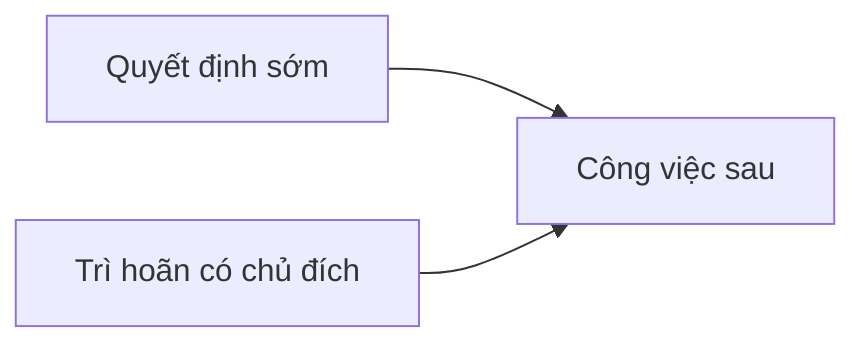

## 1.6. Structure, characteristics, decisions, principles (mở rộng)

**Structure** đã nói ở trên. **Architecture characteristics** là các mục tiêu chất lượng mang tính hệ thống — thường gọi là *-ilities* (ví dụ **khả dụng** *availability*, **khả năng mở rộng** *scalability*). **Architecture decisions** là **quy tắc bắt buộc** (vi phạm phải qua cơ chế ngoại lệ, ví dụ **ARB** — *Architecture Review Board*). **Design principles** là **khuyến nghị** (được phép lệch nếu có lý do trong ADR). Một **quyết định** có thể là “lớp UI không được import driver CSDL”; một **nguyên tắc** có thể là “ưu tiên message giữa Thanh toán và Kho để giảm **ghép chặt** (*tight coupling*)”, tức hướng dẫn mềm hơn và thường được ghi lại khi team chủ đích lệch khỏi nó.

**Separation of concerns** (*SoC*): tách những phần **đổi vì lý do khác nhau** (giao diện vì UX, giá vì chính sách, lưu trữ vì hiệu năng) để giảm tần suất thay đổi dây chuyền và để nhiều người làm song song ít đạp chân nhau. **SOLID** quen ở lớp và package; ở **quy mô kiến trúc** thường đọc như sau [6]: **S** — mỗi service hoặc bounded context nên có **một lý do chính** để đổi (tránh “god service”); **O** — mở rộng qua **hợp đồng** (API, plugin, event) thay vì sửa lõi dùng chung; **L** — thế hệ implementation sau vẫn giữ **lời hẹn** với khách hàng của hợp đồng; **I** — client chỉ phụ thuộc **API tối thiểu** cần (tránh “fat” integration); **D** — lõi nghiệp vụ phụ thuộc **abstraction** (*ports*), không phụ thuộc trực tiếp DB hay bus cụ thể. **DRY** (*don’t repeat yourself*): không nhân đôi **luật nghiệp vụ** ở nhiều nơi — nếu hai service copy cùng rule, cân nhắc thư viện domain, module chung có biên rõ, hoặc một service thật sự; **nhưng** DRY cực đoan trong một package `common` khổng lồ lại tăng coupling và phá ranh giới. **YAGNI** (*you aren’t gonna need it*): không dựng phân tán “cho tương lai” khi chưa có ranh giới giao tiếp và năng lực vận hành — **trì hoãn** (*defer*) kèm nguyên tắc neo (xem §1.5). **KISS** và **principle of least surprise**: cấu trúc đủ đơn giản để người mới đọc sơ đồ đoán đúng luồng chính. **Fail fast**: vi phạm hợp đồng (schema, auth) nên bị **bắt sớm** ở biên hệ thống, không âm thầm lan vào trạng thái khó sửa.

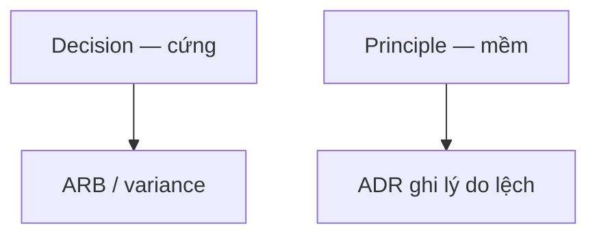

## 1.7. Nhiều góc nhìn: 4+1 và C4

**Góc nhìn kiến trúc** (*architecture view*) là một “ảnh chụp” hệ thống theo một khía cạnh; **quan điểm** (*viewpoint*) là góc nhìn của một nhóm **bên liên quan** (*stakeholder* — PM, vận hành, dev…). **Mô hình 4+1** (Kruchten) [2] gồm **Logical** (cấu trúc logic chức năng), **Process** (luồng, đồng thời), **Development** (cấu trúc mã, package), **Physical** (triển khai, máy, mạng), cộng **Scenarios** (kịch bản +1 để kiểm tra các view thống nhất). **Mô hình C4** (Brown) [8] xếp bốn mức: **Context** (C1 — hệ thống trong thế giới), **Container** (C2 — app, DB, queue), **Component** (C3 — thành phần trong một container), **Code** (C4 — lớp, tùy chọn). Chẳng hạn, vận hành đọc **Physical** + một phần **Process** (failover). PO đọc **Scenarios** “đặt hàng thành công / thất bại thanh toán”.

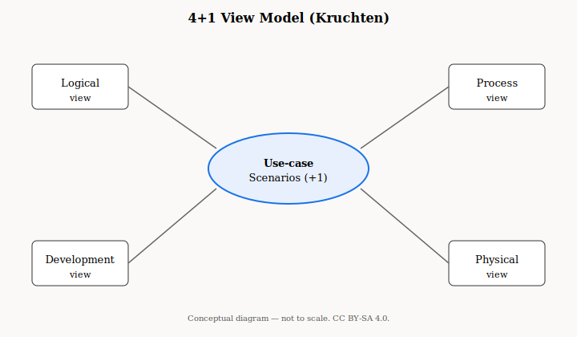

**Figure 1.3.** The 4+1 view model: use-case/scenarios (+1) liên kết các *logical, process, development, physical* views. *Sources:* Kruchten (1995) [2]; sơ đồ gốc trong repo (SVG, CC BY-SA 4.0). Đối chiếu bản vẽ trong tạp chí *IEEE Software* hoặc giáo trình của bạn.

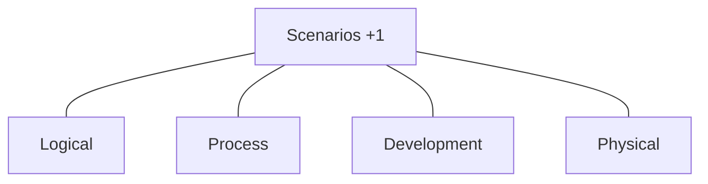

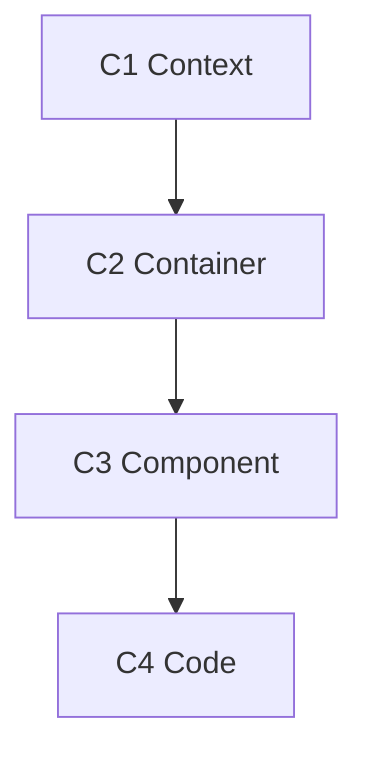

**Figure 1.4.** Thứ bậc các mức C1–C4 (Mermaid). *Source:* mô hình C4 [8]; ký hiệu tham chiếu https://c4model.com/ (truy cập theo nhu cầu trích dẫn web trong APA/IEEE).

### Đồng bộ nhiều view, mức trừu tượng và chỗ dễ “lệch sơ đồ”

Mô hình 4+1 [2] và C4 [8] không tự **đồng bộ** nhau: cùng một thay đổi (thêm queue, tách DB) phải được phản ánh ở **logical / development** (ai phụ thuộc ai), **process** (luồng sync–async), **physical** (pod, region) và **scenario +1** (kịch bản kiểm chứng). Khi chỉ cập nhật một lớp — ví dụ vẽ C2 đẹp nhưng không cập nhật sequence cho luồng thanh toán — team vận hành và dev sẽ **diễn giải khác** về timeout và retry. **C3** (*component*) không bắt buộc cho mọi container ngay đầu dự án; nhưng khi một container phình (nhiều nhóm code, nhiều lý do deploy), thiếu C3 thường che **god component** và làm khó review phụ thuộc. Nguyên tắc thực hành: mỗi PR đụng ranh giới hoặc hợp đồng công khai nên kèm **ít nhất một** biểu diễn cập nhật (C2 diff, sequence, hoặc ADR) — tránh “sơ đồ trang trí” (*diagram as wallpaper*).

## 1.8. Lịch sử ngắn và kiến trúc động

Shaw và Garlan [9] nhắc: kiến trúc từng **ẩn** trong mã; nay cần **làm rõ** để học hỏi và kiểm soát. **Kiến trúc tiến hóa** (*evolving architecture*) không có nghĩa “không cần quyết định”, mà là quyết định được **cập nhật có kiểm soát** (ADR mới *supersedes* cũ).

**Strangler fig** (*mẫu vòng si thít*) là cách thay **monolith** (*ứng dụng một khối*) dần bằng dịch vụ mới sau **proxy** / router, giữ hệ chạy trong lúc migration. Chẳng hạn, chuyển module “Khuyến mãi” ra service riêng: traffic được điều hướng từng phần, không cắt một nhát “big bang”.

**Ranh giới lỗi** (*failure domain* / *blast radius*): mỗi quyết định kiến trúc cũng định nghĩa **phạm vi** một sự cố có thể làm hỏng — một process, một container, một AZ, hay cả nền tảng messaging. Tách triển khai và **database per service** thu hẹp blast radius theo service nhưng **tăng** số điểm có thể hỏi độc lập và số cách hệ thể hiện “một phần sập” (*partial failure*). Vì vậy “phân tán” không chỉ là chủ đề scale mà là chủ đề **xác suất lỗi đồng thời** và **hành vi khi suy giảm** (*degradation*) — thường phải thiết kế cùng lúc với **timeout**, **bulkhead** (*ngăn cháy lan*), **circuit breaker** và kịch bản *-ilities* trong Bass *et al.* [1].

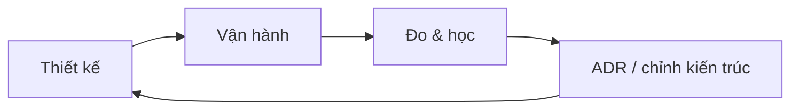

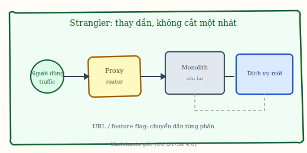

**Figure 1.5.** Sketchnote: *strangler fig* — traffic qua **proxy / router**, chuyển dần sang dịch vụ mới thay vì “cắt một nhát”. *Source:* SVG gốc (CC BY-SA 4.0); `figures/sketchnotes/README.md`.

Tóm lại, kiến trúc theo IEEE là tổ chức cơ bản của hệ trong môi trường và theo thời gian; trên thực tế Richards và Ford nhắc ta không quên các *-ilities*, các quyết định cứng và nguyên tắc mềm. Nắm vững ranh giới giữa kiến trúc, thiết kế và triển khai giúp biết chỗ nào đổi rẻ và chỗ nào đổi đắt; các **view** (4+1, C4) cho phép cùng một hệ được nhìn đủ góc để thuyết phục từng nhóm stakeholder.
