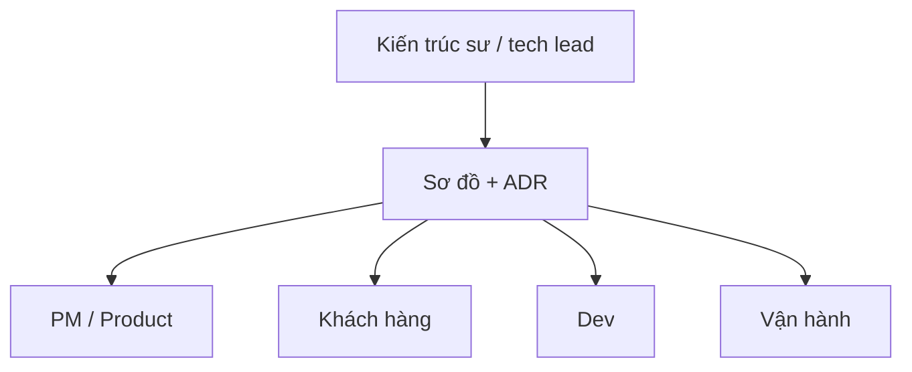
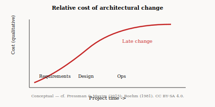
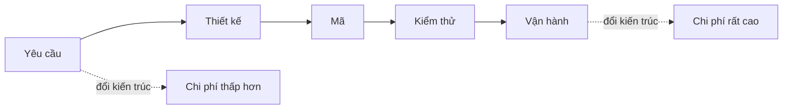
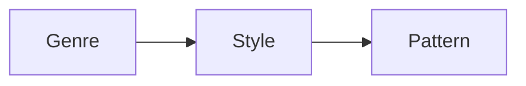
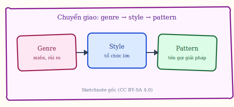
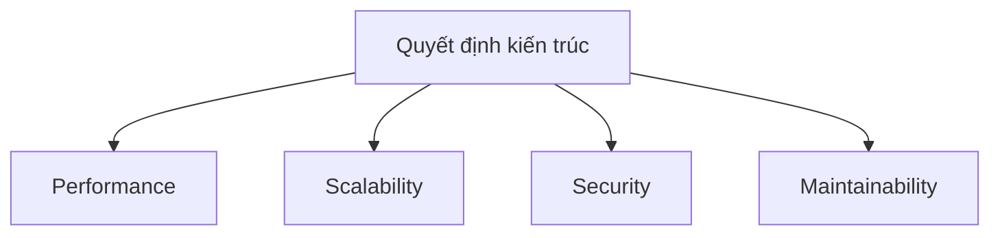
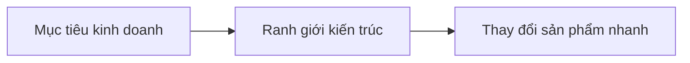
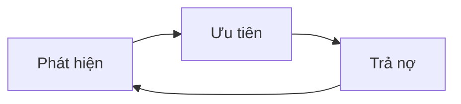
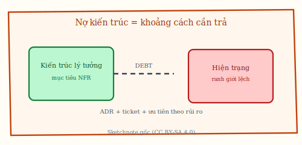

# Chương 2. Vai trò của kiến trúc: giao tiếp, chi phí và kinh doanh

Kiến trúc ít khi được “mua” như một sản phẩm độc lập; nó thể hiện giá trị khi giúp các stakeholder nhìn cùng một hệ, khi làm giảm chi phí đổi hướng muộn, và khi nối mục tiêu kinh doanh với các đặc tính chất lượng có thể kiểm chứng. Chương này đi theo ba mạch đó — từ giao tiếp tới TCO, từ chuyển giao kinh nghiệm giữa các *genre* tới nợ kiến trúc cần quản lý như nợ kỹ thuật.

## 2.1. Ba lý do cốt lõi

**Stakeholder** (*bên liên quan*) là bất kỳ ai bị ảnh hưởng bởi hệ thống: khách hàng, PM, dev, vận hành, bảo mật… **Kiến trúc** giúp **giao tiếp** (*communication*) giữa các stakeholder bằng sơ đồ và từ vựng chung — tránh mỗi người hình dung một kiểu “hệ thống trong đầu” khác nhau. Thứ hai, **quyết định kiến trúc sớm** tạo **hiệu ứng dây chuyền** (*ripple effect*): chọn mô hình **client–server** (client yêu cầu, server đáp ứng) hay **peer-to-peer** (các nút ngang hàng) ảnh hưởng tới bảo mật, vận hành và cả cách chia team. Thứ ba, kiến trúc là **mô hình thu nhỏ** (*compact model*) của hệ phức tạp — ta phân tích **điểm nghẽn** (*bottleneck*) hay **điểm đơn lỗi** (*single point of failure*, SPOF) trên mô hình trước khi đụng hàng nghìn file mã. Chẳng hạn, sơ đồ **C1/C2** (hai mức đầu của mô hình C4 — xem chương 1) cho thấy “hệ thống chúng ta” tích hợp cổng thanh toán qua webhook hay chỉ redirect — tránh PM nghĩ “đã tích hợp” khi mới có nút thanh toán.

**Figure 2.1.** Sketchnote: backlog công khai — kiến trúc và ưu tiên được **neo** vào lịch lặp; đây là minh họa *sketchnote*, không phải ảnh chụp hay biểu mẫu chính thức của framework Agile. *Source:* SVG gốc (CC BY-SA 4.0); `figures/sketchnotes/README.md`.

## 2.2. Chi phí thay đổi và ROI

**Chi phí thay đổi** (*cost of change*) thường **tăng** theo giai đoạn vòng đời: sửa yêu cầu sớm rẻ hơn sửa kiến trúc khi đã **triển khai** (*deploy*) lên production có người dùng thật. **TCO** (*total cost of ownership*) là tổng chi phí sở hữu hệ thống theo thời gian (dev + vận hành + sửa lỗi). Đầu tư 5–10% giai đoạn đầu cho kiến trúc và ADR thường được xem như **bảo hiểm rủi ro** — con số từng dự án khác nhau, nhưng **thứ tự độ lớn** (sửa muộn đắt hơn) ổn định [5], [11]. Chẳng hạn, đổi từ **monolith** sang **microservices** sau hai năm vận hành: phải **tách dữ liệu** (*data split*), đổi pipeline, đào tạo SRE — thường đắt hơn nhiều so với thiết kế ranh giới rõ ngay từ đầu (dù vẫn là một khối triển khai).

**Figure 2.2.** Chi phí thay đổi kiến trúc tương đối tăng khi càng về sau vòng đời (định tính). *Sources:* khái niệm tương thích với Pressman & Maxim (2015) và tư duy kinh tế phần mềm [11]; đồ thị gốc (SVG, CC BY-SA 4.0).

**Figure 2.3.** Vòng đời từ yêu cầu tới vận hành: đổi kiến trúc muộn thường đắt hơn (Mermaid). *Source:* tổng hợp sư phạm; đối chiếu ch. 12–13, Pressman & Maxim (2015) [5].

## 2.3. Chuyển giao kiến thức: genre, style, pattern

**Genre** (*thể loại* ứng dụng) mô tả miền (y tế, game, tài chính) — định hướng rủi ro và tuân thủ. **Architectural style** (*phong cách kiến trúc*) là họ mẫu tổ chức lớn (phân tầng, hướng sự kiện… — chương 4). **Pattern** (*mẫu*) ở đây là giải pháp đặt tên được lặp lại (API Gateway, strangler…). Chẳng hạn, kinh nghiệm **flash sale** trong e-commerce B2C chuyển sang dự án khác thành checklist: **hàng đợi** (*queue*) chống đỉnh, **idempotency** (gọi lặp thanh toán không trừ tiền hai lần), giới hạn oversell kho.

**Figure 2.4.** Sketchnote: chuỗi **genre** (miền / rủi ro) → **style** (khung tổ chức lớn) → **pattern** (tên gọi giải pháp). *Source:* SVG gốc (CC BY-SA 4.0); `figures/sketchnotes/README.md`.

## 2.4. Ảnh hưởng tới chất lượng (*quality attributes*)

**Thuộc tính chất lượng** hay **đặc tính kiến trúc** (*architecture characteristics* / *-ilities*) là những mục tiêu như **hiệu năng** (*performance*), **khả năng mở rộng** (*scalability*), **khả năng bảo trì** (*maintainability*), **khả năng triển khai** (*deployability*). Kiến trúc **không** “tự động” đảm bảo từng *-ility*, nhưng **giới hạn** cách bạn có thể đạt chúng (ví dụ kiến trúc mọi thứ qua một DB chung khó đạt deployability độc lập). Chẳng hạn, hai team “microservices” nhưng **shared database** (một CSDL chung) — **coupling** dữ liệu làm bảo trì và triển khai độc lập gần như không thực hiện được dù repo đã tách.

## 2.5. Kiến trúc như đòn bẩy kinh doanh

**Time-to-market** là thời gian đưa tính năng ra thị trường. **Business agility** (*sự linh hoạt kinh doanh*) phụ thuộc phần lớn vào việc thay đổi phần mềm có **ma sát** thấp hay không — ma sát thấp thường đến từ **ranh giới** (*boundaries*) và **hợp đồng** (*contracts*) rõ. Chẳng hạn, mở thị trường “đa tiền tệ” trong sáu tuần: nếu **pricing** và **catalog** đã tách module với API ổn định, hai team song song được; nếu mọi logic nằm trong một “khối” không ranh giới, sáu tuần thường không đủ.

Mở rộng thêm các **đòn bẩy** thường gặp [5], [6]: **lợi thế cạnh tranh** — kiến trúc cho phép thử nghiệm tính năng (A/B, flag) mà không đặt cược cả hệ; **tuân thủ và niềm tin** — audit trail, phân quyền, lưu trữ theo vùng pháp lý là *enabler* cho hợp đồng B2B; **chi phí cơ hội** — giữ monolith quá lâu khi tổ chức đã nhiều team có thể làm **chậm** quyết định sản phẩm không kém gì phân tán sớm quá mức; **định giá và vận hành** — mô hình triển khai ảnh hưởng trực tiếp biên lợi nhuận (idle capacity, egress, license). Kiến trúc sư không cần là CFO, nhưng cần **dịch** trade-off kỹ thuật sang ngôn ngữ rủi ro–doanh thu mà lãnh đạo sản phẩm hiểu.

## 2.6. Nợ kiến trúc (*architecture debt*)

**Nợ kiến trúc** là khoảng cách giữa hiện trạng và kiến trúc **lý tưởng** cần có để đạt mục tiêu — tương tự **technical debt** nhưng ở mức ranh giới và quyết định lớn. Quản lý gồm **nhìn thấy** (review, metric), **ưu tiên** theo rủi ro kinh doanh, **trả nợ** (*pay down*) theo lộ trình. Chẳng hạn, cho phép service A đọc bảng của service B “để kịp Tết” — ghi **ADR** và ticket: quý sau tách API hoặc event. Không ghi nhận → mọi người **sao chép** (*copy-paste*) pattern xấu.

Phân tách sâu hơn giúp **ưu tiên hóa**: **nợ có chủ đích** (*deliberate*) — biết đang hy sinh ranh giới để đạt deadline, đã ghi lãi suất và ngày trả; **nợ vô ý** (*inadvertent*) — do thiếu kiến thức miền hoặc áp lực, cần học và sửa có kế hoạch. Theo **hình thái**: **nợ dữ liệu** (shared schema, không có “chủ” dữ liệu); **nợ giao tiếp** (REST lẫn lộn với gọi trực tiếp DB); **nợ vận hành** (thiếu observability trên đường đi kinh doanh quan trọng); **nợ an ninh** (auth phân tán không thống nhất). Mỗi loại gắn với **triệu chứng** khác (incident postmortem vs velocity giảm vs audit fail) — tránh gom hết vào một hàng “refactor kiến trúc” vô thời hạn.

**Figure 2.5.** Sketchnote: **nợ kiến trúc** — khoảng cách giữa hiện trạng và kiến trúc cần để đạt mục tiêu; quản lý bằng nhìn thấy, ưu tiên và trả nợ có lộ trình. *Source:* SVG gốc (CC BY-SA 4.0); `figures/sketchnotes/README.md`.

## 2.7. Kiến trúc sư phần mềm: vai trò, ranh giới và năng lực

**Software architect** — trong thực tế thường **chồng lấn** với **tech lead** hoặc **engineering manager** tùy quy mô — là người **neo** các quyết định bán kính lớn: ranh giới, giao tiếp, dữ liệu, khả năng tiến hóa và đánh đổi NFR [6]. Họ **không** nhất thiết viết đa số dòng mã, nhưng thường: dẫn hoặc tham gia **architecture review** / ARB; giữ sơ đồ (C4, sequence) **đồng bộ** với repo; can thiệp khi PR **phá** quyết định đã ghi trong ADR — hoặc chấp nhận **ngoại lệ** có nhãn và hạn trả nợ. Năng lực cốt lõi gồm: **kỹ thuật** (phong cách, patterns, vận hành), **phân tích trade-off** bằng scenario và số liệu, **giao tiếp** đa stakeholder, và **kinh tế** (TCO, time-to-market). Ở đội nhỏ, vai trò có thể **xoay vòng**; ở nhiều team song song, nếu không ai giữ trách nhiệm này, kiến trúc dễ trở thành **hậu quả tích lũy** của hàng trăm quyết định cục bộ.

Tóm lại, kiến trúc là lớp ngôn ngữ và mô hình chung giữa các stakeholder; chi phí đổi hướng tăng dần theo vòng đời; các *-ilities* và tốc độ đáp ứng kinh doanh bị ranh giới và hợp đồng giữa phần hệ thống chi phối; còn nợ kiến trúc thì cần nhìn thấy, ưu tiên và trả theo lộ trình giống như nợ kỹ thuật.
