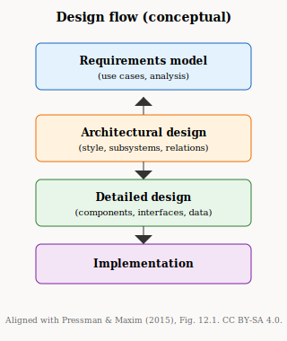
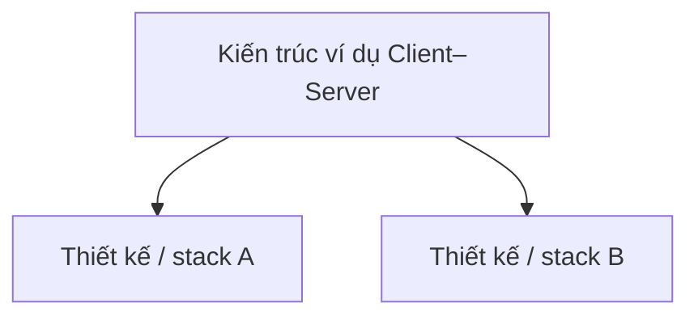
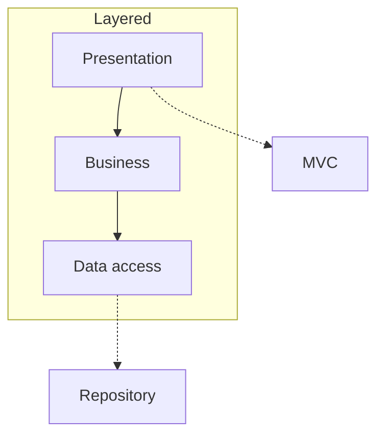
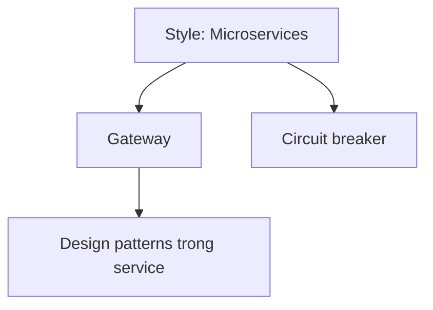
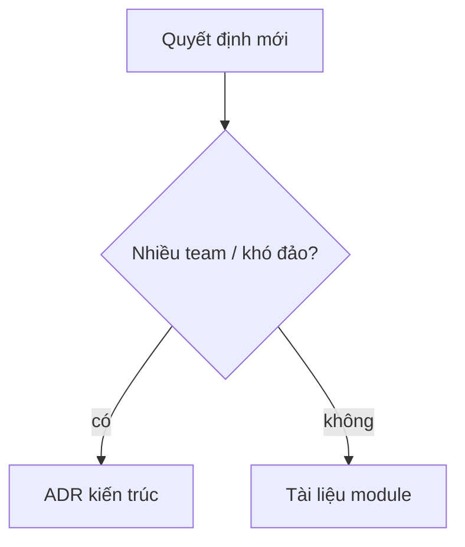
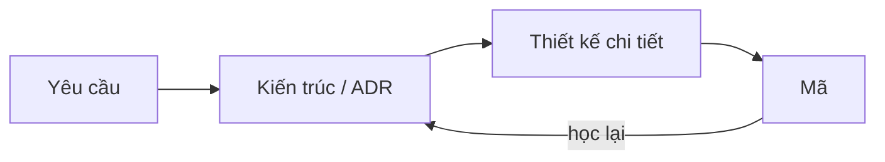
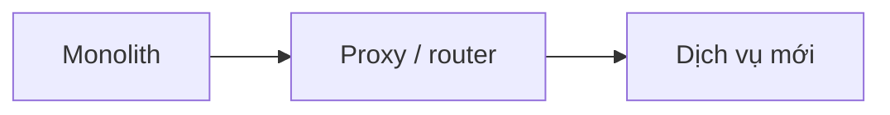
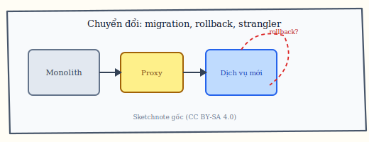

# Chương 3. Kiến trúc, thiết kế và phân tầng mẫu

Sau khi nắm *kiến trúc* ở chương trước, ta cần tách nó khỏi *thiết kế* và *triển khai* trong công việc hằng ngày, hiểu thứ bậc từ phong cách tới mẫu kiến trúc rồi tới mẫu thiết kế cổ điển, và biết chỗ nào bắt buộc ghi ADR cùng cách chuyển đổi có migration, rollback hay strangler khi hệ đã chạy.

## 3.1. Thiết kế là một “thể hiện” của kiến trúc

Pressman [5] ví: **thiết kế** (*design*) là *một thể hiện* (*instantiation*) của **kiến trúc** (*architecture*), giống **đối tượng** (*object*) là thể hiện của **lớp** (*class*) trong lập trình hướng đối tượng. Nghĩa là: **client–server** có thể được **cài đặt** (*realize*) bằng stack Java EE, .NET hay Node — cùng **kiến trúc logic**, khác **lựa chọn công nghệ**. Đổi framework **không** tự đổi kiến trúc, trừ khi framework **ép** mô hình kết nối khác (ví dụ ép mọi thứ qua một bus nội bộ). Chẳng hạn, kiến trúc “web ba lớp presentation – business – data”. Thiết kế A: ASP.NET Core + EF Core. Thiết kế B: Spring + JPA. Ranh giới lớp giống nhau, **triển khai** khác.

**Figure 3.1.** Thiết kế trong bối cảnh kỹ thuật phần mềm: từ mô hình yêu cầu xuống thiết kế kiến trúc rồi thiết kế chi tiết và cài đặt. *Sources:* tương ứng Figure 12.1 (p. 226), Pressman & Maxim (2015) [5]; sơ đồ gốc (SVG, CC BY-SA 4.0).

**Figure 3.2.** Sketchnote: triển khai vật lý và cloud — nhắc *physical view* / hạ tầng là một phần chi phí–rủi ro của kiến trúc. *Source:* SVG gốc (CC BY-SA 4.0); `figures/sketchnotes/README.md`.

**Figure 3.3.** Một kiến trúc (ví dụ client–server) có thể có nhiều thể hiện thiết kế / stack (Mermaid). *Source:* Pressman [5]; Richards & Ford [6].

## 3.2. Mẫu kiến trúc so với mẫu thiết kế (GoF)

**Mẫu kiến trúc** (*architecture pattern*) — đôi khi trùng ý với **phong cách** — tác động **toàn bộ** ứng dụng hoặc một khối lớn: **Layered** (phân tầng), **MVC** (*Model–View–Controller*: tách mô hình dữ liệu, giao diện, điều khiển), **Microservices**. **Mẫu thiết kế** (*design pattern*, bộ GoF [10]) tác động **một vài lớp**: **Factory** (tạo đối tượng), **Observer** (thông báo thay đổi). Cả hai **cùng tồn tại**: kiến trúc chọn “khung”, design pattern tổ chức code **bên trong** từng phần của khung. Chẳng hạn, hệ **Layered**; tầng presentation dùng **MVC**; tầng persistence dùng **Repository** (trừu tượng hóa truy cập dữ liệu — thường gọi là pattern tầng ứng dụng).

## 3.3. Phân cấp: Style → architectural pattern → design pattern

**Architectural style** đặt khung lớn nhất (ví dụ **microservices**: nhiều dịch vụ nhỏ triển khai độc lập). Trên khung đó, **architectural patterns** giải bài toán cụ thể: **API Gateway** (một cửa vào cho client), **circuit breaker** (*cầu dao*: ngắt gọi khi downstream lỗi để khỏi **cascade failure* — lỗi lan truyền), **database per service** (mỗi dịch vụ một CSDL), **Saga** (chuỗi bước bù **giao dịch phân tán**). **Design patterns** (Strategy, State…) nằm **trong** từng service. Chẳng hạn, trong service Thanh toán, **Strategy** chọn Stripe vs MoMo — đó là design; quyết định “thanh toán là service tách DB” là architectural.

## 3.4. Quyết định kiến trúc so với quyết định thiết kế

**Architecture decision** ảnh hưởng **nhiều team**, thường **khó đảo ngược** (*irreversible* hoặc đắt để đảo), định hình **giao tiếp**, **dữ liệu** hoặc **triển khai** toàn cục. **Design decision** gắn **một module**, dễ đổi hơn, thường là **công nghệ cụ thể** (*concrete technology*). Một ranh giới kiểu “**database per service** — không hai service ghi chung một schema” là quyết định kiến trúc; còn “context Đơn hàng dùng PostgreSQL 16” là thiết kế trong phạm vi context đó. Câu hỏi “REST hay GraphQL cho **toàn** API công khai?” thường là **vùng xám**: nếu ảnh hưởng mọi client và chiến lược versioning, đó là kiến trúc; nếu chỉ phục vụ một màn hình nội bộ, có thể chỉ là thiết kế. Tương tự, **event-driven** (giao tiếp chủ yếu bằng **sự kiện** *events*) giữa hai **bounded context** là quyết định kiến trúc, trong khi chọn **RabbitMQ** hay **Kafka** là phần triển khai hoặc thiết kế tích hợp.

## 3.5. Vị trí trong quy trình phát triển

**Architectural design** là hoạt động lặp, không phải một lần “vẽ xong rồi thôi”. **BDUF** (*big design up front*) cực đoan là thiết kế quá nặng trước khi học từ mã; **zero architecture** là không có ranh giới — cả hai đều rủi ro. Các thiết kế con (dữ liệu, UI) **phụ thuộc** (*depend on*) quyết định kiến trúc. Chẳng hạn, **Sprint 0** vẽ C1/C2 và 2–3 ADR (auth, ranh giới). Mỗi **PI** (*program increment*) có mục “kiến trúc” khi epic chạm ranh giới.

## 3.6. Chuyển đổi có kiểm soát: migration, rollback, strangler

**Tính thu hồi** (*reversibility*) và **quyền chọn** (*optionality*): quyết định kiến trúc khác nhau ở **chi phí đảo ngược**. Gắn chặt vào một vendor độc quyền (đặc thù query, lock-in middleware) làm giảm quyền chọn sau này; **ports/adapters**, **schema versioned**, **feature flag** và **dual-write có hạn** là cách mua **thời gian** để học từ production trước khi cam kết không thể đổi. Không phải mọi thứ đều nên “trì hoãn vô hạn” — ranh giới và NFR an toàn thường phải **quyết sớm**; nhưng với công nghệ thay thế tương đương (cache A vs B), ADR nên ghi rõ **điểm tái đánh giá** (*review by date* hoặc ngưỡng tải) thay vì giả vờ quyết định là vĩnh viễn [6], [12].

**Migration** (*di trú*) là kế hoạch chuyển từ trạng thái kiến trúc này sang trạng thái khác theo bước. **Rollback** (*hoàn tác*) là cách quay lại khi bước migration thất bại. **Strangler** (mẫu đã nói chương 1) tách dần monolith qua **proxy** điều hướng traffic. Chẳng hạn, tách “Báo cáo”: (1) library dùng chung, (2) process riêng nhưng DB chung (**nợ có kiểm soát**), (3) DB riêng khi tải đủ.

**Figure 3.4.** Sketchnote: **migration** có **rollback** và lộ trình **strangler** (proxy đưa traffic sang phần mới từng bước). *Source:* SVG gốc (CC BY-SA 4.0); `figures/sketchnotes/README.md`.

## 3.7. Luật Conway và cấu trúc tổ chức

**Luật Conway** (*Conway’s law*): tổ chức thiết kế hệ thống **bắt chước** cấu trúc giao tiếp nội bộ của chính tổ chức — bài gốc của Conway [13] mô tả hiện tượng này ở quy mô dự án lớn; Richards và Ford [6] đưa lại trong ngữ cảnh kiến trúc hiện đại và team sản phẩm. Ba team ít phối hợp dễ dẫn tới ba **khối triển khai** hoặc ba pipeline tách — đôi khi là **ranh giới lành mạnh**, đôi khi là trùng lặp và mâu thuẫn hợp đồng. Ngược lại, vẽ mười microservice “đẹp” khi vẫn **một đội** toàn năng có thể tạo **ma sát vận hành** không tương xứng. **Đảo ngược Conway** (*inverse Conway maneuver*): chủ đích **tổ chức lại team** (feature team theo bounded context, platform team…) để **kéo** kiến trúc về hướng mong muốn — công cụ tổ chức là một phần công cụ kiến trúc. Kiến trúc sư vì vậy cần đọc **org chart** và cách họp hằng tuần như đọc **đồ thị phụ thuộc**: đôi khi sửa kiến trúc phải đi đôi với **điều chỉnh ranh giới trách nhiệm** hoặc luật giao tiếp giữa đội.

Như vậy, kiến trúc, thiết kế và triển khai là ba tầng khác phạm vi và khác độ khó khi đổi; phong cách dẫn tới các mẫu kiến trúc, bên trong từng phần mới tới lượt các mẫu thiết kế; quyết định kiến trúc đáng được neo bằng ADR; và mọi thay đổi lớn trên hệ đang chạy nên có kế hoạch migration, phương án rollback và thỉnh thoảng cả lộ trình strangler từng phần.
