# Chương 4. Thể loại, phong cách và kết hợp kiến trúc

Cùng một sơ đồ kỹ thuật có thể phục vụ *y tế*, *game* hay *thương mại* — *genre* đổi thì rủi ro, tuân thủ và thứ tự ưu tiên *-ilities* cũng đổi. Chương này đi từ genre sang **phong cách kiến trúc** (thành phần, đầu nối, ràng buộc), qua các họ mẫu điển hình — bám phân loại trong Pressman & Maxim (2015), ch. 13 [5] — tới kiến trúc lai và những câu hỏi gợi ý khi phải chọn hướng trong bối cảnh thật.

## 4.1. Genre — thể loại ứng dụng

**Genre** (*thể loại*) là cách nhóm ứng dụng theo **miền** (*domain*): y tế, tài chính, game, hệ điều hành… Genre **không** thay thế **phong cách kỹ thuật**, nhưng định hướng **tuân thủ** (*compliance*), **rủi ro**, và *-ilities* ưu tiên (ví dụ **auditability** — khả năng kiểm toán / truy vết thao tác). Chẳng hạn, ứng dụng **y tế** thường ưu tiên **privacy** (quyền riêng tư) và **safety** (an toàn); game real-time ưu tiên **throughput** (số sự kiện xử lý/giây) và **latency** (độ trễ) — cùng có thể dùng client–server nhưng **tiêu chí thiết kế** khác hẳn.

**Figure 4.1.** Sketchnote: *genre* bán lẻ / logistics — nhiều hệ (WMS, TMS…) phải khớp miền nghiệp vụ và tuân thủ. *Source:* SVG gốc (CC BY-SA 4.0); `figures/sketchnotes/README.md`.

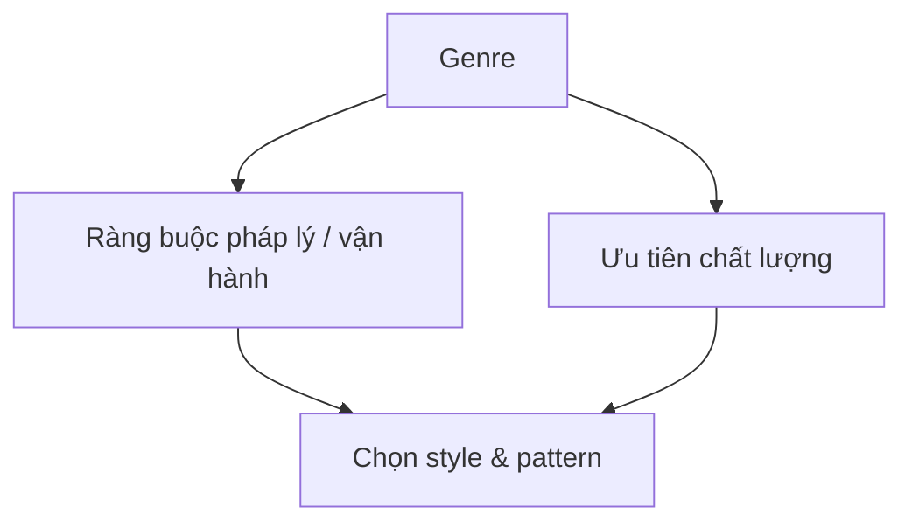

## 4.2. Phong cách kiến trúc: component, connector, constraint

Một **architectural style** mô tả họ hệ thống qua **components** (*thành phần* — đơn vị có thể triển khai hoặc gói logic), **connectors** (*đầu nối* — RPC, message bus, HTTP, shared DB…), **constraints** (*ràng buộc* — quy tắc được phép nối thế nào), và thường có **semantic model** (*mô hình ngữ nghĩa* — hiểu ý nghĩa luồng dữ liệu để suy ra thuộc tính tổng thể). Hai hệ đều “có **REST**” (phong cách giao tiếp HTTP + resource) nhưng bên trong một hệ toàn **request–response đồng bộ**, hệ kia dùng **event bus** — **connector** nội bộ khác, **đánh đổi** khác. Chẳng hạn, REST ra ngoài cho đối tác; bên trong microservice vẫn dùng **message broker** (*trung gian tin nhắn*) để giảm **coupling**.

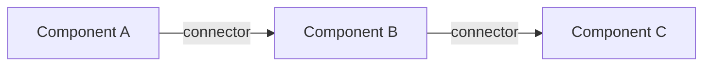

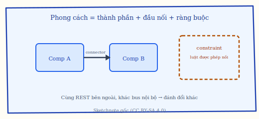

**Figure 4.6.** Sketchnote: **phong cách kiến trúc** — *components*, *connectors*, *constraints* (cùng “REST” vẫn có thể khác bus nội bộ và đánh đổi). *Source:* SVG gốc (CC BY-SA 4.0); `figures/sketchnotes/README.md`.

## 4.2a. Triển khai tập trung (monolith) so với phân tán

**Monolith** (thường là **một đơn vị triển khai** chứa phần lớn chức năng) và **distributed** (nhiều đơn vị qua mạng) là **hai cực trên một trục** — ở giữa có **modular monolith**: một artifact build nhưng **ranh giới module** và luật phụ thuộc rõ trong repo. Bảng sau hay dùng khi dạy và khi viết ADR so sánh phương án:

| Khía cạnh | Tập trung / monolith (kể cả modular) | Phân tán (microservices, …) |
|-----------|--------------------------------------|-----------------------------|
| **Gọi nội bộ vs mạng** | Ít overhead mạng, ít partial failure | Latency, timeout/retry, **circuit breaker** |
| **Deploy & vận hành** | Một pipeline; rollback đơn giản hơn | Nhiều service, versioning, observability tập trung |
| **Dữ liệu** | Một DB dễ transaction ACID | **Database per service** → eventual consistency, saga |
| **Scale** | Scale cả khối theo “chiều cao nhất” | Scale từng phần theo nghiệp vụ |
| **Tổ chức** (Conway) | Một nhóm dễ đồng bộ | Nhiều team song song — cần hợp đồng và SRE |

Không có đáp án “luôn phải phân tán”: nhiều hệ **bắt đầu modular monolith** rồi tách khi tải, tốc độ đổi hoặc ranh giới tổ chức buộc triển khai độc lập (xem §4.6 và strangler, chương 1).

## 4.3.1. Data-centered — kiến trúc tập trung dữ liệu

**Data-centered architecture** đặt **data store** (kho dữ liệu trung tâm); các thành phần khác đọc/ghi. Biến thể **repository** (client chủ động kéo dữ liệu) và **blackboard** (thông báo khi dữ liệu đổi, phù hợp suy luận hợp tác). Chẳng hạn, một PostgreSQL “của tổ chức” cho CRM nội bộ, nhiều app đọc chung — tích hợp đơn giản nhưng **SPOF** và áp lực scale lên một kho.

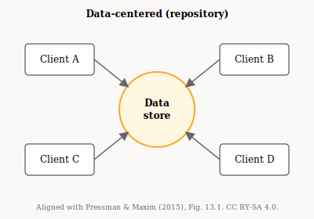

**Figure 4.2.** Data-centered architecture: nhiều client quanh một kho dữ liệu. *Sources:* Figure 13.1 (p. 259), Pressman & Maxim (2015) [5]; SVG gốc (CC BY-SA 4.0).

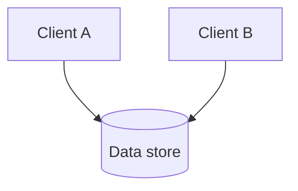

## 4.3.2. Pipe-and-filter — ống và bộ lọc

**Pipe-and-filter**: dữ liệu đi qua chuỗi **filter** (bước biến đổi) nối bởi **pipe** (kênh truyền). Mỗi filter ít biết về filter khác — dễ tái sử dụng bước. Chẳng hạn, OCR ảnh → làm sạch → trích field → ghi warehouse — phù hợp **ETL** (*extract–transform–load*).

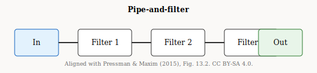

**Figure 4.3.** Pipe-and-filter: dữ liệu qua chuỗi bộ lọc. *Sources:* Figure 13.2 (p. 260), Pressman & Maxim (2015) [5]; SVG gốc (CC BY-SA 4.0).

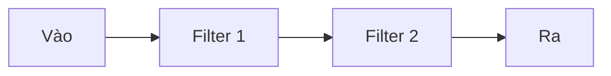

## 4.3.3. Call-and-return, OO, layered

**Call-and-return** (*gọi–trả về*): luồng điều khiển phân cấp (main gọi subroutine). **Object-oriented** nhấn **encapsulation** (*đóng gói*). **Layered** tách **presentation** (giao diện), **business** (nghiệp vụ), **data access** (truy cập dữ liệu) với quy tắc phụ thuộc theo chiều dọc. Chẳng hạn, CRUD nội bộ: MVC + ba lớp trong một **deployment unit** (*đơn vị triển khai*).

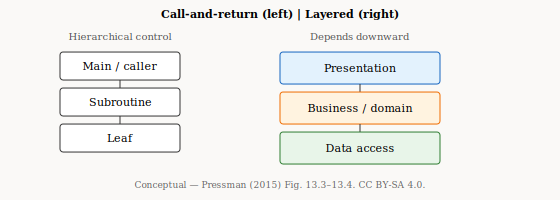

**Figure 4.4.** Call-and-return (trái) và layered architecture (phải). *Sources:* gộp ý Figure 13.3–13.4, Pressman & Maxim (2015) [5]; SVG gốc (CC BY-SA 4.0).

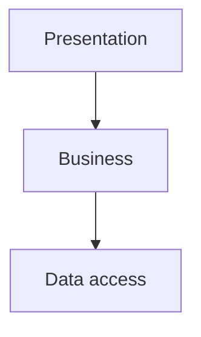

**Figure 4.5.** Phân tầng ba lớp điển hình (Mermaid — cùng ý với phần phải của Figure 4.4). *Source:* [5].

## 4.3.4. Client–server và P2P

**Client–server**: vai trò **client** (yêu cầu) và **server** (phục vụ) rõ ràng; thường có **centralization** (*tập trung*) dễ quản lý. **Peer-to-peer** (*P2P*): các **peer** ngang hàng — khó quản lý hơn nhưng có thể chịu lỗi / scale theo kiểu khác. Chẳng hạn, web cổ điển là client–server; một số **CDN** và **blockchain** gần P2P.

## 4.3.5. Microservices

**Microservices**: nhiều **service** nhỏ, **deploy** độc lập, thường **database per service**; giao tiếp qua mạng. **API Gateway** làm điểm vào thống nhất (auth, routing). Đổi lấy linh hoạt scale là **operational complexity** (*độ phức tạp vận hành*) và **distributed transactions** (*giao dịch phân tán*) — thường dùng **Saga** thay cho transaction SQL xuyên DB. Chẳng hạn, `Order`, `Payment`, `Inventory` scale riêng; đặt hàng cần **choreography** hoặc **orchestration** của saga (điều phối bước bù).

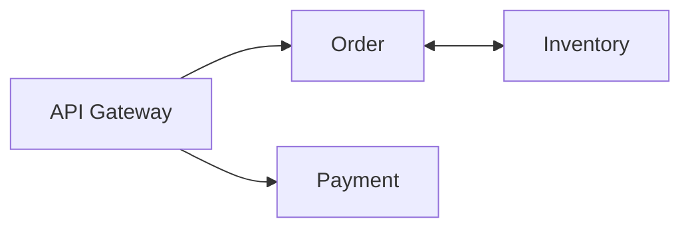

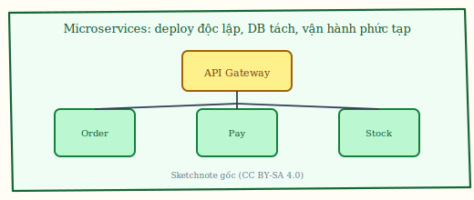

**Figure 4.7.** Sketchnote: **microservices** — gateway, dịch vụ triển khai độc lập, giao tiếp qua mạng (nhớ chi phí vận hành và giao dịch phân tán). *Source:* SVG gốc (CC BY-SA 4.0); `figures/sketchnotes/README.md`.

## 4.3.6. Event-driven architecture (EDA)

**EDA** (*kiến trúc hướng sự kiện*): **producer** phát **event**, **consumer** xử lý bất đồng bộ — giảm **temporal coupling** (ghép theo thời điểm). Cần rõ **delivery semantics** (ví dụ **at-least-once** — giao ít nhất một lần, có thể trùng) và **idempotency** (xử lý lặp an toàn). Chẳng hạn, `OrderPlaced` → email, trừ kho, analytics cùng subscribe.

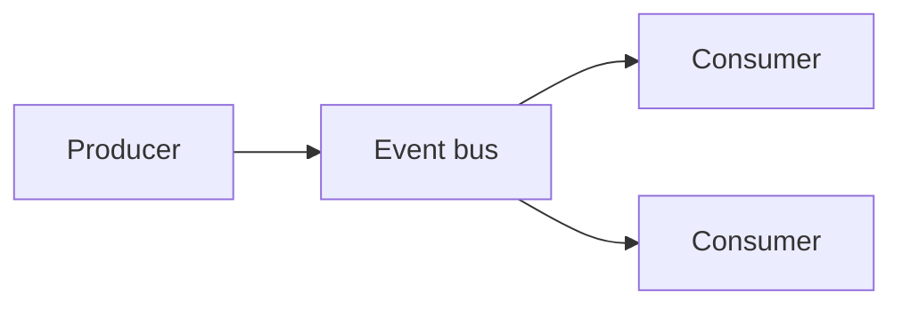

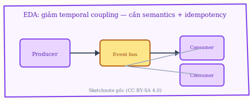

**Figure 4.8.** Sketchnote: **EDA** — giảm ghép theo thời điểm; cần **semantics** giao sự kiện và **idempotency**. *Source:* SVG gốc (CC BY-SA 4.0); `figures/sketchnotes/README.md`.

Mở rộng **EDA** vượt ra khỏi “có message queue”: cần phân biệt **event** (*đã xảy ra* — ví dụ `OrderPlaced`) với **command** (*yêu cầu làm* — `PlaceOrder`) và đôi khi **document** (*ảnh chụp trạng thái* — snapshot đồng bộ read model). Nhầm lẫn loại tin làm sai **idempotency** và **ordering**: consumer có thể cần **khóa theo partition** (cùng `orderId` vào cùng một consumer) để giữ thứ tự nghiệp vụ; hoặc chấp nhận **song song** nhưng dùng **version** / **causal** metadata. **Delivery semantics** thực tế gần như luôn là **at-least-once** hoặc **at-most-once**; “exactly-once” end-to-end thường là **tổ hợp** idempotency + dedup + transaction outbox chứ không phải một cờ magic trên broker. **Transactional outbox** (*outbox pattern*): ghi DB và “hàng đợi ghi sự kiện” trong **cùng** transaction để không mất event khi process chết giữa chừng — phổ biến khi DB là nguồn sự thật. **Poison message** (*tin độc*): consumer lỗi lặp vô hạn — cần **DLQ** (*dead-letter queue*), giới hạn retry, và metric để không “im lặng” nuốt backlog. Cuối cùng, EDA làm **quan sát** (*observability*) khó hơn request–response: trace phải theo **correlation id** xuyên bus; không có thì postmortem sau sự cố partial failure sẽ mù.

## 4.3.7. Serverless

**Serverless** (*không quản lý server* theo nghĩa vận hành): hàm / dịch vụ chạy theo **event**, nhà nền tảng lo máy. Hạn chế: **cold start** (lần đầu gọi sau im lặng chậm hơn), **timeout**, **vendor lock-in** (*phụ thuộc nhà cung cấp*). Chẳng hạn, resize ảnh khi upload S3; không hợp job chạy vài giờ liền trừ khi chia nhỏ.

## 4.4. Mẫu kiến trúc đặt tên (POSA, literature)

**Pattern** ở đây là giải pháp đã đặt tên: **API Gateway**, **strangler**, **saga**… giúp team nói chuyện ngắn. Pattern **không** thay phân tích đánh đổi. Với mẫu **strangler**, router chuyển dần URL từ monolith sang service mới trong khi hệ vẫn phục vụ người dùng.

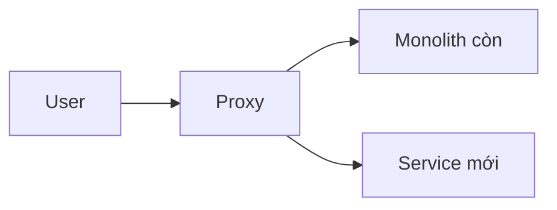

## 4.5. Hybrid architecture

**Hybrid** (*kiến trúc lai*): kết hợp nhiều style trong một hệ — ví dụ **SPA** + **BFF** (*backend for frontend*: API riêng cho một loại client) phân tầng, lõi **EDA**, một số **Lambda**. Quan trọng là **dependency rules** (*luật phụ thuộc*) và **boundaries** rõ. Chẳng hạn, bFF publish Kafka cho worker báo cáo; thumbnail xử lý serverless.

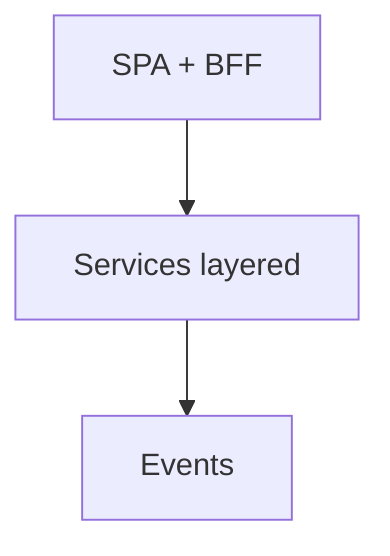

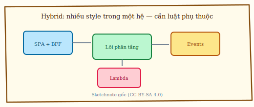

**Figure 4.9.** Sketchnote: **hybrid** — nhiều style trong một hệ; quan trọng là **dependency rules** và **boundaries** rõ. *Source:* SVG gốc (CC BY-SA 4.0); `figures/sketchnotes/README.md`.

## 4.6. Gợi ý chọn hướng theo mục tiêu

Chọn phong cách là lý luận theo bối cảnh, không phải một lần “tick” bảng. Với đội nhỏ cần **time-to-market**, **modular monolith** hoặc **layered monolith** thường là điểm xuất phát ít ma sát hơn là **premature distribution** (*phân tán sớm*) với chi phí **DevOps** chưa tương xứng. Khi tải và tổ chức đòi hỏi **scale độc lập theo nghiệp vụ** và đội đã đủ trình độ vận hành, **microservices** kèm **database per service** và **observability** (log, metric, trace) mới thường vào cuộc một cách bền vững. Nếu vấn đề chính là giảm **temporal coupling**, **EDA** và **messaging** có thể phù hợp — miễn là **eventual consistency** (*nhất quán cuối cùng*) được chấp nhận ở những chỗ cần. Khi trọng tâm là **pipeline biến đổi dữ liệu**, **pipe-filter** hay **stream processing** thường tự nhiên hơn là ép mọi thứ thành CRUD đồng bộ. Cuối cùng, khi workload theo đợt và ưu tiên là giảm vận hành máy chủ, **serverless** đáng xét nếu đo được **cold start** và giới hạn thời gian chạy — cứ lấy hình ảnh đội năm người làm MVP ba tháng: bắt đầu bằng monolith modular thường thực dụng hơn là vẽ mười hai microservice “cho đẹp sơ đồ”.

Tóm lại, *genre* kéo theo tuân thủ và rủi ro; *style* mô tả thành phần, đầu nối và ràng buộc; hệ thật thường **hybrid**; còn quyết định cuối cùng luôn cần lời giải thích bằng văn xuôi trong bối cảnh và mức **maturity** của tổ chức, chứ không thể thay bằng một bảng tra cứu tĩnh.
