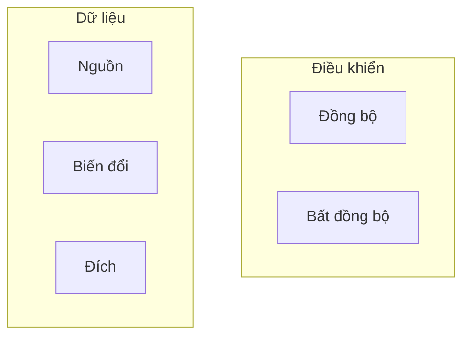
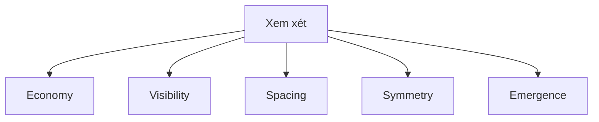
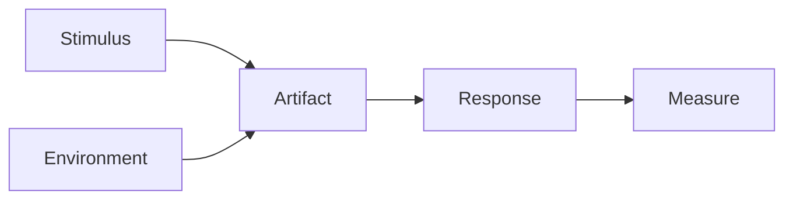
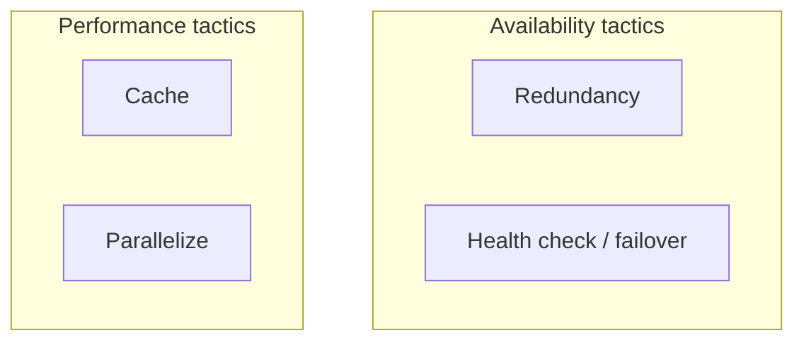
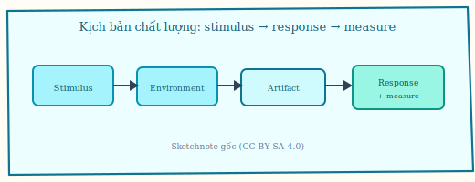
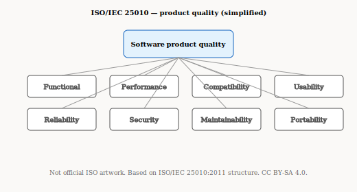
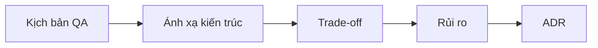
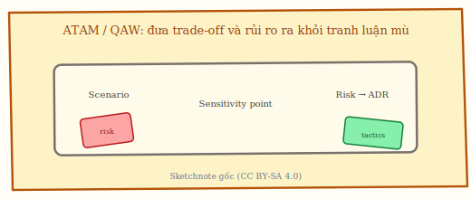
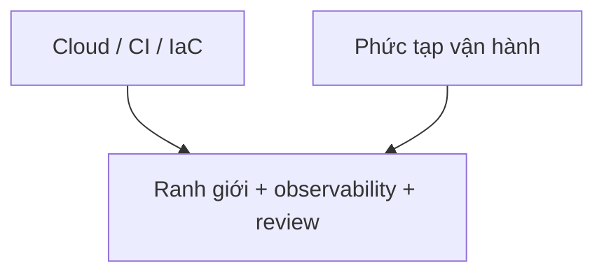

# Chương 5. Chất lượng kiến trúc, NFR và đánh giá

Hệ thống “đúng chức năng” vẫn có thể thất bại nếu không ai làm rõ luồng điều khiển, luồng dữ liệu hay các *-ilities* có thể đo được. Chương này nối các khung thực hành (Pressman, Bass/SEI, ISO/FURPS+, ATAM) với những đánh đổi thường gặp và với cách cloud/DevOps đòi hỏi observability khi kiến trúc phân tán.

**Figure 5.1.** Sketchnote: NFR “đo được” — gợi ý **SLO**/latency và **logs · metrics · traces** (observability). *Source:* SVG gốc (CC BY-SA 4.0); `figures/sketchnotes/README.md`.

## 5.1. Luồng điều khiển và luồng dữ liệu

**Control flow** (*luồng điều khiển*) mô tả **ai gọi ai**, **đồng bộ** (*synchronous*: chờ phản hồi mới tiếp tục) hay **bất đồng bộ** (*asynchronous*: gửi đi và tiếp tục, phản hồi sau). **Data flow** (*luồng dữ liệu*) mô tả dữ liệu **đi đâu**, qua **biến đổi** (*transformation*) nào, và **consistency** (*nhất quán*) cần mạnh đến đâu. Chẳng hạn, checkout: BFF gọi **sync** service Đơn hàng; cập nhật kho có thể **async** qua queue — nếu vẽ tất cả là một luồng sync, ta **đánh giá sai latency** và **điểm nghẽn**.

## 5.2. Economy, visibility, spacing, symmetry, emergence (Pressman)

Đây là năm **architectural considerations** (*điểm cần xem xét*) khi phản biện sơ đồ — không phải công thức tính. **Economy** (*kinh tế*): chi phí và độ phức tạp có xứng lợi ích không. **Visibility** (*hiển thị / dễ đọc*): người mới có hiểu cấu trúc không. **Spacing** (*khoảng cách / tách bạch*): ranh giới có đủ “không gian” để đội độc lập không. **Symmetry** (*đối xứng*): trách nhiệm có cân không (tránh một service “god”). **Emergence** (*nổi lên*): hành vi tổng thể (ví dụ sự cố lan) không lường được từ một thành phần đơn lẻ. Về **spacing**, một package `common` chứa cả rule thanh toán và resize ảnh dễ làm **mất ranh giới** — hai team đạp chân nhau và khó test độc lập.

## 5.3. Quality attribute scenarios và tactics (Bass / SEI)

**Quality attribute scenario** (*kịch bản thuộc tính chất lượng*) viết theo dạng: **stimulus** (kích thích — tải, lỗi), **environment** (điều kiện), **artifact** (phần hệ thống bị ảnh hưởng), **response** (phản ứng mong muốn), **measure** (đo được — ví dụ p95 latency). Cách này thay cho “hệ thống phải nhanh”. **Tactics** (*chiến thuật*) là mẹo thiết kế nhỏ: **cache**, **redundancy** (dự phòng), **authentication**… Một **scenario** đo được có thể viết như sau: “Khi 5k req/phút checkout, p95 API ≤ 800 ms tại region X, đo bằng **APM** (*application performance monitoring*).” Các **tactics** đi cùng thường gồm cache read model, **queue** để giảm đỉnh, và **scale out** BFF **stateless** (không lưu session trong instance).

**Figure 5.4.** Sketchnote: *quality attribute scenario* — **stimulus**, **environment**, **artifact**, **response**, **measure** (thay cho “hệ thống phải nhanh”). *Source:* SVG gốc (CC BY-SA 4.0); `figures/sketchnotes/README.md`.

### Ba nhóm đặc tính kiến trúc (Richards & Ford) và ngầm định so với rõ ràng

Richards và Ford [6] gom *-ilities* thành **ba nhóm** để brainstorming có cấu trúc — **bổ sung** cho ISO 25010 và FURPS+ (§5.4), không thay thế chúng:

| Nhóm | Trọng tâm | Ví dụ (rút gọn) |
|------|-----------|-----------------|
| **Vận hành** (*operational*) | Hệ **chạy** thế nào dưới tải và sự cố | availability, performance, scalability, reliability |
| **Cấu trúc** (*structural*) | Hệ **bố trí và đổi** thế nào theo thời gian | maintainability, modifiability, deployability, **testability**, portability |
| **Xuyên suốt** (*cross-cutting*) | Ràng buộc **trải dọc** mọi thành phần | security, privacy, legal, usability hệ thống |

Một yêu cầu chỉ thực sự trở thành **đặc tính kiến trúc** theo tinh thần [6] khi: (i) là cân nhắc **ngoài miền** thuần nghiệp vụ; (ii) **kéo theo** quyết định cấu trúc; (iii) **quan trọng** đến thành bại sản phẩm. Vì vậy không nên biến mọi dòng trong backlog thành “-ility kiến trúc” — danh sách quá dài làm giảm khả năng thiết kế **ít tệ nhất** (*least worst*), một thái độ gần với phân tích trade-off trong ATAM [1].

**Rõ ràng** (*explicit*): đã ghi trong spec (ví dụ “p95 API dưới 500 ms”). **Ngầm định** (*implicit*): không ai viết nhưng stakeholder vẫn kỳ vọng (an toàn dữ liệu, hệ vẫn bán được khi một zone sập). Kiến trúc sư thường phải **khai thác** phần ngầm định bằng workshop — QAW (§5.6) là một khung cho việc đó.

**Testability** ở mức kiến trúc: khả năng **kiểm chứng từng phần** qua ranh giới rõ — test đơn vị trong service, **contract test** giữa dịch vụ, môi trường giả lập tải; **shared database** và gọi chéo nội bộ không qua hợp đồng là những kẻ thù điển hình của testability toàn hệ.

## 5.4. ISO/IEC 25010 và FURPS+

**ISO/IEC 25010** [7] là **chuẩn** mô tả chất lượng phần mềm theo nhiều đặc tính (ví dụ **functional suitability** — độ phù hợp chức năng, **performance efficiency**, **security**, **maintainability**…). **FURPS+** là **khung** thực hành: **F**unctionality, **U**sability, **R**eliability, **P**erformance, **S**upportability, dấu **+** cho ràng buộc (pháp lý, phần cứng…). Khi làm việc với QA quen ISO, có thể nói: mục **Supportability** trong FURPS+ thường nói chuyện nhiều với **maintainability** và **portability** (khả năng chuyển môi trường) trong 25010 — **không** bảng ánh xạ cứng; cần **đối chiếu từng yêu cầu**. Chẳng hạn, yêu cầu “dễ thay DB trong 6 tháng” là **portability** + **maintainability**; ghi vào spec dưới dạng scenario có **measure**.

**Figure 5.5.** Các đặc tính chất lượng sản phẩm theo ISO/IEC 25010 (sơ đồ khái niệm, **không** phải hình chính thức của ISO). *Sources:* ISO/IEC 25010:2011 [7]; SVG gốc (CC BY-SA 4.0). Tra cứu văn bản chuẩn tại thư viện / cổng ISO của tổ chức bạn.

## 5.5. Trade-off — từng cặp xung đột

**Trade-off** (*đánh đổi*) nghĩa là cải thiện một mục tiêu thường làm xấu một mục khác. **Security vs performance:** mã hóa đầu cuối, audit chi tiết, **zero trust** thường tăng chi phí mỗi request — cần chỉ rõ **p95** chấp nhận được. **Scalability vs strong consistency:** **sharding** (chia mảnh dữ liệu) và **async** giúp scale nhưng **strong consistency** toàn cục (mọi nơi đọc cùng một “sự thật” tức thì) khó hơn — có thể chấp nhận **eventual consistency** ở một số view. **Availability vs cost:** **multi-AZ** (nhiều vùng sẵn sàng), dự phòng nóng tốn tiền. **Flexibility vs simplicity:** nhiều **plugin** / **strategy** tăng khả năng mở rộng tính năng nhưng tăng chi phí test và hiểu hệ thống. Chẳng hạn, mã hóa mọi trường **PII** (*personally identifiable information*) ở mọi tầng — đo p95 trước/sau; có thể chỉ mã hóa ở tầng persistence thay vì mọi API nội bộ.

**Định lý CAP** (Brewer; chứng minh hình thức Gilbert–Lynch [14]) là **khung tư duy** cho hệ phân tán: khi **partition** mạng xảy ra, không thể đồng thời có **consistency** tuyến tính hoá tối đa và **availability** phản hồi đầy đủ theo nghĩa mọi node đều phục vụ — phải **chọn / nới lỏng** một trong các định nghĩa (ví dụ availability “đủ tốt” với degraded mode, hay consistency **per partition**). CAP **không** phải bảng tra cứu ba chữ cái cho mọi microservice lúc bình thường; nó có ích khi thiết kế **hành vi lúc đứt link**, **quorum**, **leader election** và khi tranh luận “tại sao không thể vừa đọc mới nhất toàn cục vừa luôn phản hồi 200 ms”. Kết hợp với **PACELC** (trong tài liệu phân tán rộng rãi — *else*: latency vs consistency khi **không** partition) giúp nói rõ trade-off **độ trễ** vs **độ tươi** dữ liệu ngay cả lúc mạnh khỏe.

**Latency budget** (*ngân sách độ trễ*): mỗi *user journey* nên có **trần** thời gian end-to-end; kiến trúc phân tầng và phân tán **ăn** vào ngân sách đó bằng từng lớp (DNS, TLS, serialization, hop RPC, queue). Khi NFR chỉ nói “API nhanh” mà không phân bổ budget, team dễ tối ưu cục bộ (cache một tầng) trong khi **chuỗi** vẫn vượt ngưỡng — scenario trong §5.3 buộc gắn *measure* theo **đường đi** thật, không theo từng service riêng lẻ.

## 5.6. ATAM, SAAM, QAW

**ATAM** (*Architecture Tradeoff Analysis Method*): workshop có cấu trúc để lôi **trade-off** và **risk** kiến trúc [1]. **SAAM** (*Software Architecture Analysis Method*): nhẹ hơn, xem tác động thay đổi. **QAW** (*Quality Attribute Workshop*): tập trung **elicit** (khai thác) scenario chất lượng sớm. Dự án nhỏ có thể làm **lightweight ATAM**: 1–2 ngày + danh sách rủi ro + ADR. Chẳng hạn, liệt kê **sensitivity point** (điểm nhỏ thay đổi làm hỏng latency — ví dụ thiếu index) và **tradeoff** cache vs dữ liệu **fresh**.

ATAM “đầy đủ” trong thực hành SEI là chuỗi **bước** có thể rút gọn nhưng **không nên bỏ mất thứ tự lý luận** [1]: (1) trình bày **business drivers** và kiến trúc hiện tại; (2) thu thập **kịch bản** chất lượng (thường sau QAW); (3) **ánh xạ** scenario lên kiến trúc (tactics, điểm nhạy); (4) phân tích **cặp trade-off** và **điểm nhạy** (*sensitivity*), **điểm cân bằng** (*tradeoff*); (5) **rủi ro** và **phi rủi ro** (*non-risk*); (6) nhóm rủi ro thành **kế hoạch hành động** (ADR, spike, mitigation). **SAAM** phù hợp khi đã có thay đổi cụ thể và cần so sánh “trước / sau” trên tập scenario nhỏ. **QAW** có thể chạy **trước** ATAM để tránh workshop ATAM thiếu “mồi” từ nghiệp vụ.

**Figure 5.6.** Luồng tóm tắt đánh giá kiến trúc theo kịch bản chất lượng (Mermaid). *Sources:* ATAM/SAAM/QAW (Bass *et al.* [1], SEI); sư phạm.

**Figure 5.7.** Sketchnote: **ATAM** / **QAW** — làm *workshop* có cấu trúc để lộ **trade-off**, **sensitivity point** và **rủi ro** (thường dẫn tới ADR). *Source:* SVG gốc (CC BY-SA 4.0); `figures/sketchnotes/README.md`.

## 5.7. Cloud, DevOps, observability

**Observability** (*khả năng quan sát*) gồm **logs**, **metrics**, **distributed tracing** (theo dõi một request qua nhiều service) — giúp vận hành kiến trúc phân tán. **Fitness functions** (chương 6) tự động kiểm “độ lệch” kiến trúc. **Spaghetti integration** (*tích hợp mì*) là khi mọi thứ gọi chéo không qua hợp đồng — cloud và CI không tự sửa nếu không có kỷ luật. Chẳng hạn, có Terraform nhưng không có rule phụ thuộc trong code — kiến trúc vẫn trôi.

Tóm lại, làm kiến trúc rõ nghĩa là làm rõ luồng điều khiển và dữ liệu; năm *considerations* của Pressman là “câu hỏi phản biện” khi nhìn sơ đồ; *scenario* và *tactics* biến NFR thành thứ có thể đo; ISO và FURPS+ giúp đối thoại với QA mà không cần ánh xạ cứng; các cặp *trade-off* — kể cả khi đặt trong khung CAP/PACELC và **ngân sách độ trễ** — cần được nói theo **đường đi** thật của người dùng; còn ATAM, SAAM và QAW là các khung workshop khi muốn hệ thống hóa đánh giá thay vì chỉ tranh luận trong phòng họp.
