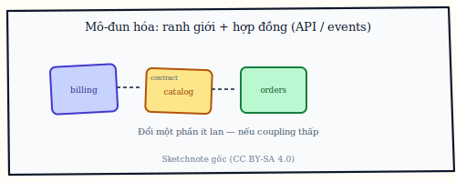
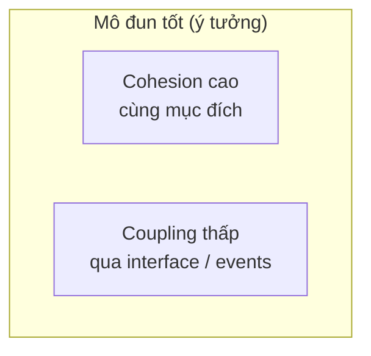
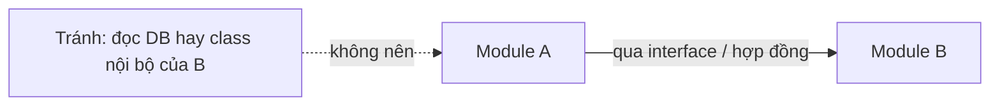
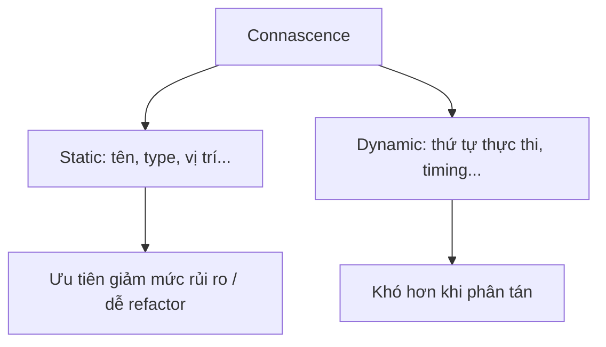

# Chương 5b. Tính mô-đun trong kiến trúc

Ranh giới kiến trúc chỉ bền khi mã bên dưới vẫn **mô đun hóa** được: cohesion trong từng phần, coupling có kiểm soát giữa các phần, và các dạng phụ thuộc tinh vi (connascence) được nhận ra trước khi hệ phân tán. Phụ chương này nối các khái niệm đó với đồ thị phụ thuộc package (abstractness, instability); bản mở rộng có trong `../../baigiang/BaiGiang_Chuong1_TongQuan_Modularity.md`.

## Mô-đun hóa và mục tiêu

**Mô đun hóa** (*modularization*) là chia hệ thành **mô đun** (*module*: package, service, thư viện…) để **cô lập** (*isolate*) phần hay đổi — giảm chi phí thay đổi. Ở mức kiến trúc, mô đun hóa “gặp” **ranh giới** (*boundaries*) và **hợp đồng** (*contracts*: API, events). Chẳng hạn, tách `billing` khỏi `catalog` để đổi cổng thanh toán mà không rebuild toàn bộ storefront.

**Figure 5b.4.** Sketchnote: **mô-đun hóa** ở mức kiến trúc — các phần (**billing**, **catalog**…) nối qua **hợp đồng** (API / events) để đổi một phần ít lan. *Source:* SVG gốc (CC BY-SA 4.0); `figures/sketchnotes/README.md`.

## Cohesion — gắn kết trong mô đun

**Cohesion** (*độ gắn kết*): các phần trong cùng mô đun cùng phục vụ **một mục đích** rõ. Cohesion **cao** thường tốt — sửa một nghiệp vụ chủ yếu chạm một chỗ. Một module `Pricing` chỉ chứa rule giá và discount, **không** nhét logger hay HTTP client vào cùng gói, là ví dụ cohesion tốt — tránh kiểu “mô đun làm mọi thứ”.

**DRY chiến lược vs chiến thuật** (phân biệt trùng lặp tình cờ và trùng lặp bất khả kháng — Hunt và Thomas [15]; áp dụng rộng trong tư duy kiến trúc ranh giới): **trùng lặp chiến thuật** (*accidental duplication* — hai đoạn vì copy-paste) nên gỡ; **trùng lặp chiến lược** (*essential duplication* — hai biểu diễn cùng kiến thức vì **ràng buộc khác nhau*, ví dụ schema DB và DTO API) đôi khi **cố ý** giữ để ranh giới độc lập tiến hóa — ép DRY bằng một model chung có thể tạo **connascence** ngược chiều deploy. Ở kiến trúc phân tán, “một rule giá” có thể xuất hiện ở service và ở báo cáo với độ trễ khác nhau; quan trọng là **biết** đó là hai bản **có lý do**, có kiểm thử và versioning, chứ không phải hai bản lệch vì thiếu giao tiếp.

## Coupling — kết dính giữa mô đun

**Coupling** (*độ kết dính*): mức phụ thuộc giữa mô đun. Coupling **thấp** và **ổn định** (qua interface, versioned API) dễ thay thế từng phần; coupling **cao** (đọc DB hay class nội bộ của mô đun khác) làm thay đổi lan nhanh. Coupling xấu điển hình là hai team dùng chung thư viện `common` chứa cả DTO thanh toán lẫn helper string — mọi thay đổi nhỏ gây build chéo; **hướng xử lý** là tách `payment-contract` (API/events) và `string-utils`, đồng thời **đánh phiên bản** cho hợp đồng (*versioned*).

**Figure 5b.1.** Cohesion cao và coupling thấp qua hợp đồng (Mermaid). *Sources:* Parnas; Myers; tổng hợp trong tài liệu modularity (xem `../../baigiang/BaiGiang_Chuong1_TongQuan_Modularity.md`).

**Figure 5b.2.** Coupling chấp nhận được qua interface so với coupling chéo nội bộ (Mermaid). *Source:* sư phạm; đối chiếu *Fundamentals of Software Architecture* [6].

## Connascence (Meilir Page-Jones và phát triển sau này)

**Connascence** (*cùng sinh / cùng phụ thuộc ngữ nghĩa*): hai phần “cùng phải thay đổi vì một lý do” — có **static** (tên, kiểu, vị trí file…) và **dynamic** (thứ tự gọi, timing…). Static thường dễ refactor hơn; dynamic khó hơn khi hệ **phân tán**. Chẳng hạn, hai service phải deploy cùng lúc vì **thứ tự field JSON** ngầm — connascence “ý nghĩa” yếu; chuyển sang schema versioned hoặc protobuf giảm rủi ro.

**Figure 5b.3.** Phân nhánh static vs dynamic connascence (Mermaid). *Sources:* Page-Jones; Coplien; cộng đồng OOP (tài liệu modularity trong repo).

## Abstractness, instability, main sequence (Robert C. Martin)

Trên đồ thị phụ thuộc package, **abstractness** (*độ trừu tượng*) đo tỉ lệ lớp interface / abstract so với tổng số lớp trong package. **Instability** (*độ không ổn định*) đo mức package phụ thuộc vào bên ngoài so với bị phụ thuộc — package “dễ đổi” thường instability cao. **Distance from main sequence** (*khoảng cách tới đường chính*): gói **vừa khó tái sử dụng** (ít abstract) **vừa dễ vỡ** (nhiều phụ thuộc ra ngoài) nằm xa vùng lý tưởng — “**zone of pain**”. Chẳng hạn, một `utils` chứa 200 hàm concrete được mọi layer import — instability cao, abstractness thấp → điểm cần tách hoặc đưa contract rõ.

**Testability và mô-đun:** ranh giới rõ (interface, hợp đồng event, fake adapter) cho phép **test nhanh** từng phần mà không dựng cả hệ; coupling chéo qua singleton, DB chung hoặc “gọi luôn class bên kia” làm **test phình** và che giấu regressions kiến trúc. Ở hệ phân tán, **consumer-driven contract** và môi trường **testcontainers** (hoặc tương đương) thường là phần “chi phí cố định” của modularization — bù lại bằng giảm thời gian hội nhập và sự cố production.

Tóm lại, *modularity* là cầu nối giữa ranh giới kiến trúc và cấu trúc mã thực tế; cohesion, coupling và connascence cho ta ngôn ngữ nói về “chỗ nào đổi một lần, chỗ nào đổi dây chuyền”; còn đồ thị abstractness/instability và các **fitness function** trên phụ thuộc giúp refactor không làm tan ranh giới đã cam kết.
