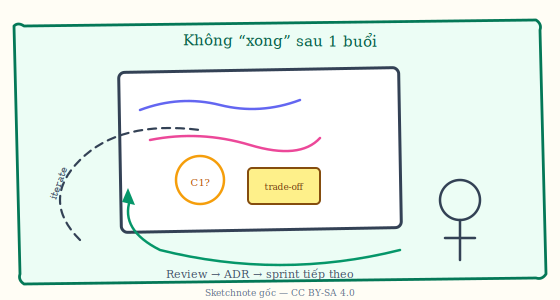
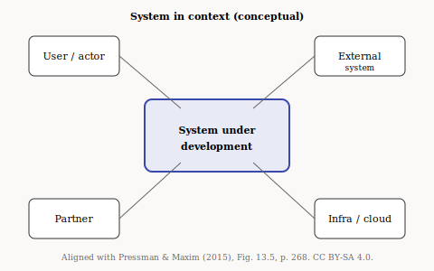
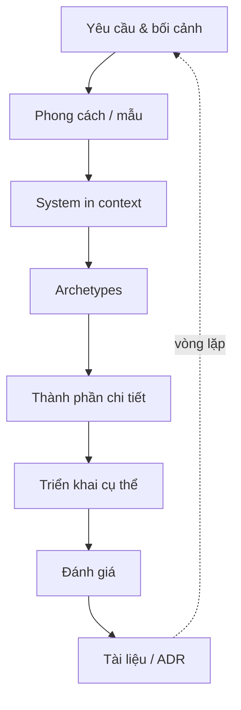
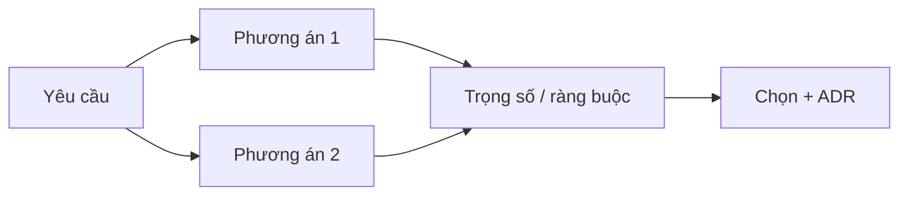
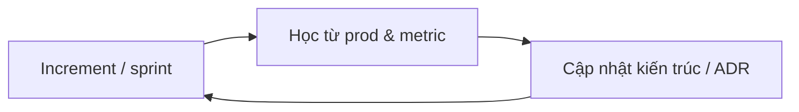
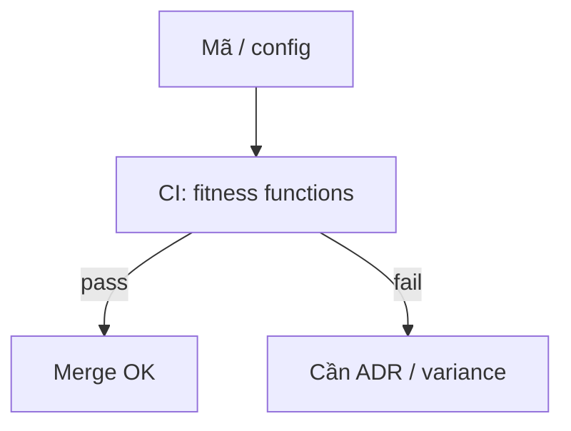
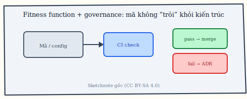
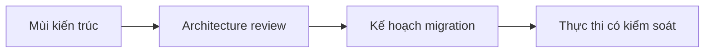
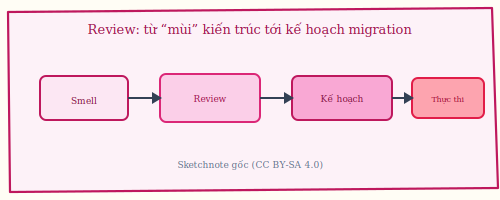
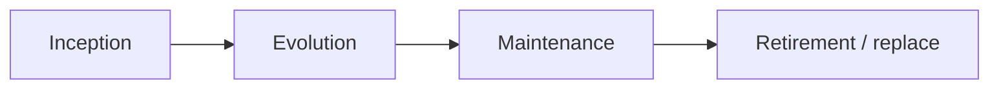

# Chương 6. Quy trình kiến trúc, quản trị và vòng đời

Kiến trúc không “xong” sau một buổi workshop: nó đi trong vòng lặp cùng mã và metric, được chọn phương án có cấu trúc, được giữ khỏi trôi bằng governance và fitness function, và có vòng đời riêng với rủi ro cần quản. Chương này mô tả các mạch đó ở mức thực hành (Pressman [5], continuous architecture, Agile, review, lifecycle).

**Figure 6.1.** Sketchnote: review trên bảng trắng và vòng lặp (iterate → ADR → sprint) — minh họa *sketchnote*, không thay cho quy trình tổ chức cụ thể của từng công ty. *Source:* SVG gốc (CC BY-SA 4.0); `figures/sketchnotes/README.md`.

## 6.1. Quy trình tổng quát (Pressman + continuous architecture)

Quy trình kiến trúc thực tế là **vòng lặp**, không phải thác nước một chiều. Bước đầu là phân tích **yêu cầu chức năng** (*functional requirements*, **FR**) — hệ thống phải *làm gì* — và **yêu cầu phi chức năng** (**NFR**, *non-functional requirements*) — phải *như thế nào* (hiệu năng, bảo mật, khả dụng…). Tiếp theo là chọn **phong cách kiến trúc** (*architectural style*) và **mẫu** (*pattern*) phù hợp bối cảnh.

**System in context** (*hệ thống trong bối cảnh*) là cách đặt hệ vào ranh giới với người dùng, hệ khác, và ràng buộc vận hành — thường vẽ ở mức **C1** trong mô hình **C4** [8] (chương 7). **Archetypes** (*kiểu mẫu thành phần*) là các “khối” điển hình (gateway, worker, read model…) trước khi gắn tên công nghệ cụ thể. **Instantiations** (*cụ thể hóa triển khai*) là chọn thật: Kubernetes, RDS, vùng region… Sau đó **đánh giá** (scenario chất lượng, rủi ro) và **tài liệu hóa** — thường bằng **ADR** (*Architecture Decision Record*, bản ghi quyết định kiến trúc). Khi giả định sai (ví dụ tải tăng gấp mười), quay lại bước ranh giới / phong cách. Chẳng hạn, sau MVP, một **bounded context** (*miền nghiệp vụ có ranh giới rõ* trong DDD) bị quá tải — quay lại chọn **read model** (*mô hình đọc* tối ưu truy vấn) hoặc **cache**, ghi ADR giải thích vì sao không tách microservice ngay.

**Figure 6.2.** *System in context*: hệ đang xây dựng và các tác nhân / hệ bên ngoài. *Sources:* Figure 13.5 (p. 268), Pressman & Maxim (2015) [5]; SVG gốc (CC BY-SA 4.0). So sánh với C1 trong C4 [8].

**Figure 6.3.** Vòng lặp quy trình kiến trúc (Mermaid). *Sources:* Pressman [5]; *continuous architecture* [12].

## 6.2. Lựa chọn mẫu có cấu trúc

**Structured selection** nghĩa là không “chọn theo cảm tính”: tổng hợp **FR + NFR** và **ràng buộc** (*constraints*: đội, ngân sách, tuân thủ, deadline), liệt kê **phương án** (*alternatives*), so sánh theo tiêu chí, chọn một hướng, làm **PoC** (*proof of concept*) hoặc **spike** (thử nhanh rủi ro kỹ thuật), rồi **ghi rõ phương án bị loại** trong ADR — để sau này không lặp lại tranh luận mù. Chẳng hạn, so **Kafka** và **RabbitMQ**: chọn Kafka vì **replay** (*phát lại*) và **retention** (*lưu log sự kiện*) phục vụ audit 90 ngày; Rabbit đủ cho thông báo nhưng không đáp ứng retention — ghi trong ADR.

## 6.3. Kiến trúc Agile

**Agile architecture** không phải “không có kiến trúc” mà là **just enough** (*đủ dùng*): đủ ranh giới và nguyên tắc để team không đi ngược hướng, nhưng không **BDUF** (*big design up front* — thiết kế lớn hết một lần ngay đầu dự án). Kiểm chứng bằng **mã** và **test**; cập nhật khi học từ production. Chẳng hạn, mỗi **epic** (*khối công việc lớn*) đụng ranh giới: trong **refinement** (*làm rõ backlog*), dành ~30 phút cập nhật sơ đồ **C2** (*container diagram*), không cần 20 trang tài liệu.

## 6.4. Governance và fitness functions

**Fitness function** (*hàm thích nghi* — thuật ngữ evolutionary architecture): kiểm tra **tự động** hoặc **bán tự động** để kiến trúc không “trôi” theo mã (ví dụ cấm vòng phụ thuộc, giữ ngưỡng **latency**). **Governance** (*quản trị*): ai được **ngoại lệ** (*exception*), qua **ARB** (*Architecture Review Board*, hội đồng rà soát kiến trúc) hay chỉ cần ADR được duyệt. Chẳng hạn, cI chạy **ArchUnit** (Java): rule “package `domain` không import `infrastructure`”. Vi phạm fail build trừ khi PR có nhãn `arch-variance` và **link ADR** giải thích.

**Figure 6.4.** Sketchnote: **governance** và **fitness function** trên **CI** — pass thì merge, fail thì cần ADR / ngoại lệ có kiểm soát. *Source:* SVG gốc (CC BY-SA 4.0); `figures/sketchnotes/README.md`.

### RFC, phân tầng quyết định và “ngân sách ngoại lệ”

Ngoài ARB định kỳ, nhiều tổ chức dùng **RFC** (*request for comments*) hoặc **design doc** một vài trang: đăng sớm, nhận bình luận bất đồng, rồi mới code sâu — phù hợp thay đổi ranh giới, chọn broker, đổi auth toàn cục [12]. **Phân tầng quyết định**: quyết định **cục bộ** trong team (thư viện nội bộ) không cần cùng vòng với quyết định **nền tảng** (chuẩn API, multi-tenant); trộn hai tầng làm ARB nghẽn hoặc ngược lại không ai giữ **đường ray chung**. **Ngân sách ngoại lệ** (*exception budget*): cho phép một số PR vi phạm rule tĩnh **có giới hạn** (ví dụ tối đa *n* lần / quý) kèm ADR — tránh văn hóa “governance chỉ là gợi ý” nhưng cũng tránh kẹt khi cần ship hotfix. **Fitness function** nên **phân loại**: một số **không thể fail** (bảo mật, PII), một số **cảnh báo** (*warn*) trước khi nâng thành fail — giảm ma sát khi đang học đường cong latency.

## 6.5. Review và tái cấu trúc kiến trúc

**Architecture review** có thể nhẹ theo **PR** (*pull request*), định kỳ theo quý, hoặc theo **release**. **Refactor kiến trúc** thay **ranh giới** (*boundaries*) hoặc **luồng dữ liệu** — khác **refactor** một vài class. Chẳng hạn, **Smell** (*mùi thiết kế*): hai **service** cùng ghi một bảng `orders` trong một DB — review quyết định **database per service** hoặc ghi nhận **technical debt** (*nợ kỹ thuật*) có kế hoạch trả.

**Figure 6.5.** Sketchnote: **architecture review** — từ *mùi* kiến trúc tới kế hoạch migration và thực thi có kiểm soát. *Source:* SVG gốc (CC BY-SA 4.0); `figures/sketchnotes/README.md`.

## 6.6. Vòng đời và quản lý rủi ro

**Lifecycle** (*vòng đời*): **inception** (khởi tạo) → **evolution** (tiến hóa) → **maintenance** (bảo trì) → **retirement** hoặc thay thế. **SPOF** (*single point of failure*, điểm chết đơn) là rủi ro kiến trúc điển hình; thêm **rủi ro nhà cung cấp** (*vendor risk*), nợ kỹ thuật — cần nhận diện, ưu tiên, giảm thiểu, giám sát. Chẳng hạn, phụ thuộc API đối tác không **SLA** (*service level agreement*): giảm thiểu bằng **cache**, **circuit breaker** (*ngắt mạch*: ngừng gọi khi downstream lỗi liên tục), và hợp đồng dự phòng.

## 6.7. Chuỗi bước phân tích phương án (formalize nhẹ)

Khi không chạy full ATAM (chương 5) nhưng vẫn muốn **lý luận có vết**, có thể lặp vòng ngắn [12]: (1) **Thu thập** FR, NFR và ràng buộc (tuân thủ, ngân sách, kỹ năng đội). (2) **Liệt kê** ít nhất hai phương án kiến trúc khả thi (kể cả “giữ nguyên + vá”). (3) **Ánh xạ** *quality attribute scenario* lên từng phương án; ghi *sensitivity point* (chi tiết nhỏ làm vỡ mục tiêu — ví dụ thiếu index). (4) **So sánh trade-off** theo ưu tiên kinh doanh, không theo sở thích công nghệ. (5) **PoC / spike** cho rủi ro chưa rõ. (6) **Chọn** một hướng, ghi **ADR** kèm phương án bị loại và hậu quả. (7) **Theo dõi** sau triển khai (metric, sự cố) và cập nhật ADR khi giả định sai. Vòng này có thể nhét vào sprint như công việc có **định nghĩa xong** (*definition of done*) cho thay đổi ranh giới.

Tóm lại, quy trình kiến trúc là vòng lặp có đo lường, PoC/spike khi cần và ADR để không mất bối cảnh; Agile không có nghĩa bỏ kiến trúc mà là *just enough* và cập nhật theo học từ production; **fitness functions** và **governance** (ARB, ngoại lệ có nhãn) giữ quyết định khỏi bị mã và deadline xóa mờ; còn vòng đời hệ thống và rủi ro (SPOF, vendor, SLA) nhắc ta rằng kiến trúc cũng “già” và cần nghỉ hưu có kế hoạch.
