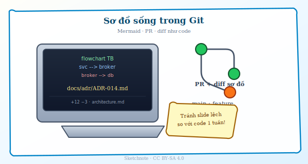
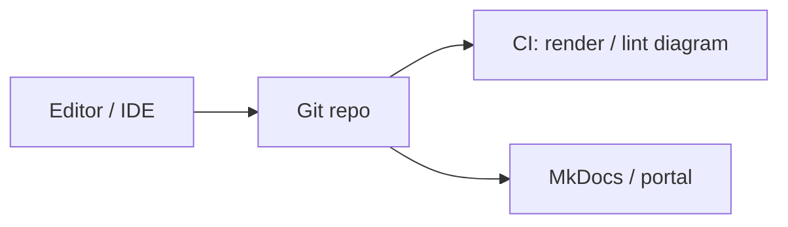
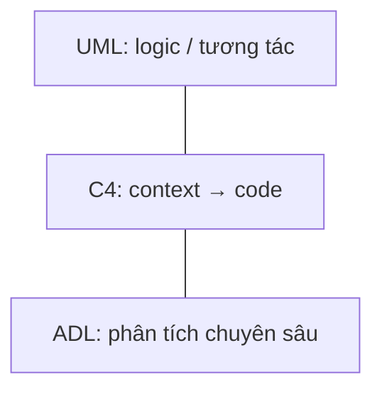
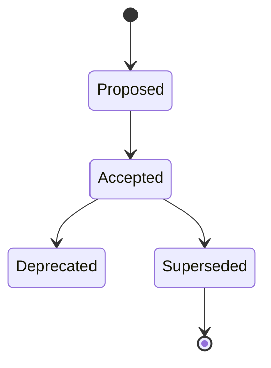
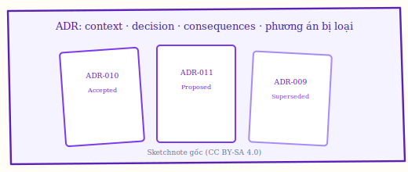
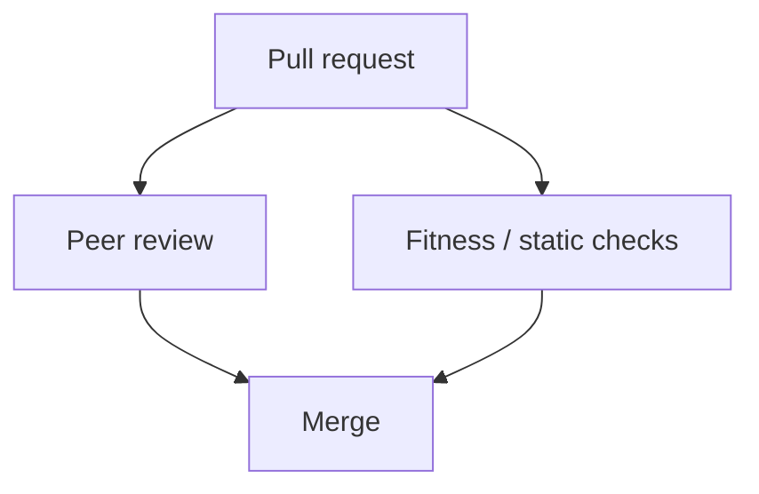

# Chương 7. Công cụ và tài liệu hóa kiến trúc

Sơ đồ và ADR chỉ hữu ích nếu sống cùng repo và cùng quy trình review như mã — nếu không, chúng trở thành “ảnh minh họa” lệch khỏi thực tế sau vài sprint. Chương này xem công cụ (diagram as code, UML, C4, ADR, phân tích phụ thuộc, policy-as-code) như phần của cách team giữ quyết định và biểu diễn đồng bộ.

## 7.1. Vai trò của công cụ

Công cụ giúp **đồng bộ** (*synchronize*) biểu diễn kiến trúc với **mã** và **hạ tầng** (*infrastructure*); chúng **không** thay phán đoán kiến trúc sư. Xu hướng **diagram as code** (*sơ đồ dưới dạng mã* — Mermaid, PlantUML, **Structurizr DSL**): lưu trong **Git**, review cùng PR, tránh “ảnh PowerPoint lệch thực tế sau một tuần”. Chẳng hạn, file `docs/architecture/container.mmd` mô tả **C2**; khi PR thêm service mới, diff sơ đồ đi cùng diff code.

**Figure 7.1.** Sketchnote: **diagram as code** + PR — tài liệu kiến trúc sống cạnh repo, tránh slide lệch thực tế. *Source:* SVG gốc (CC BY-SA 4.0); `figures/sketchnotes/README.md`.

## 7.2. UML và ADL

**UML** (*Unified Modeling Language*): **class diagram** (lớp và quan hệ), **sequence diagram** (thứ tự gọi theo thời gian), **deployment diagram** (node triển khai) — hữu ích cho **logical view** và **process view** trong tư duy **4+1 views** (xem chương 1). **ADL** (*Architecture Description Language* — ngôn ngữ mô tả kiến trúc): mô tả **hình thức** (*formal*) hơn, phổ biến trong nghiên cứu hoặc công cụ chuyên biệt. Dự án ứng dụng thường ưu **C4** (Context, Container, Component, Code) + **ADR** thay vì ADL đầy đủ. Chẳng hạn, **Sequence diagram** cho luồng thanh toán 3 bên — QA dùng để thiết kế kịch bản timeout và retry.

## 7.3. ADR — ghi quyết định

**ADR** ghi thường các mục: **Status** (trạng thái), **Context** (bối cảnh), **Decision** (quyết định), **Consequences** (hậu quả). Phần **phương án bị loại** và **trade-off** (*đánh đổi*) là giá trị lớn nhất cho người đến sau — tránh chỉ biết “đã chọn Kafka” mà không biết “vì sao không Pulsar”. Chẳng hạn, `ADR-012`: chọn **OAuth2** + **OIDC** (*OpenID Connect* — lớp định danh trên OAuth) với IdP X; **consequences**: phụ thuộc vendor, **refresh token rotation**, chi phí license.

**Figure 7.2.** Vòng đời trạng thái của một ADR (Mermaid). *Sources:* thực hành cộng đồng ADR — https://adr.github.io/ ; mô tả tương thích Nygard (xem portal ADR).

**Figure 7.3.** Sketchnote: tài liệu **ADR** xếp chồng theo **trạng thái** (*proposed*, *accepted*, *superseded*…) — giữ *vì sao* và *phương án bị loại*. *Source:* SVG gốc (CC BY-SA 4.0); `figures/sketchnotes/README.md`.

## 7.4. Phân tích, fitness function, cộng tác

**Dependency analysis** (*phân tích phụ thuộc*): công cụ như **ArchUnit**, rule **Sonar** kiểm tra hướng import. **Policy-as-code** (*chính sách dưới dạng mã*): quy tắc kiến trúc thành file cấu hình trong repo. **Pull request** là “công cụ” vì định nghĩa **cách** quyết định được **peer review** (*đồng nghiệp duyệt*) cùng lúc với fitness function. Chẳng hạn, rule “`domain` không phụ thuộc `adapter.http`” — bảo vệ **Hexagonal** (*ports & adapters*) / **Clean Architecture** (lõi nghiệp vụ không biết HTTP).

**Figure 7.4.** Pull request kết hợp peer review và kiểm tra tĩnh / fitness function (Mermaid). *Source:* thực hành DevOps / inner source.

## 7.5. Arc42, Structurizr và một nguồn sự thật

**Arc42** là **khung** tài liệu kiến trúc nhiều mục cố định (bối cảnh, ràng buộc, building blocks, runtime, triển khai…) — hữu ích khi tổ chức cần **cùng một mục lục** thay vì mỗi dự án tự bịa. **Structurizr** (DSL hoặc mã) bám **C4** [8] để sơ đồ **sinh từ text** trong Git — giảm lệch giữa slide và repo. **Một nguồn sự thật** (*single source of truth*): C4 + ADR sống trên nhánh với mã; portal hay wiki chỉ **render** bản xuất, không phải nơi sửa tay tách rời. Khi dùng song song Arc42 và C4, thường **ánh xạ** thực hành: C1–C2 ≈ bối cảnh / containers; sequence và deployment ≈ runtime / infrastructure view.

### Quy ước C4 và lỗi thường gặp khi vẽ

Brown [8] nhấn mạnh **một sơ đồ — một câu chuyện**: C2 mô tả **containers** (ứng dụng, DB, queue) và **giao tiếp**; không nhét **class diagram** đầy lớp vào cùng khung — làm mất đối tượng đọc (vận hành vs dev). **Tên** nên phản ánh **vai trò** (*Order Service*) trước khi gắn công nghệ (*Spring Boot*); công nghệ có thể ghi trong mô tả ngắn để tránh lệ thuộc sơ đồ vào phiên bản framework. **Mũi tên** thống nhất một quy ước (data vs call); ghi **sync/async** trên cạnh khi không hiển nhiên. **Anti-patterns**: C2 “spaghetti” không khác network map thực — cần **nhóm** theo boundary hoặc tách nhiều C2 theo luồng; C1 chỉ có một hộp “Hệ thống” không nói ai dùng; C3 cho mọi container dù không đổi — làm tài liệu **lỗi thời** nhanh hơn mã. **Đồng bộ với ADR**: mỗi thay đổi ranh giới trên sơ đồ nên có **tham chiếu** ADR (hoặc ngược lại) để diff PR đọc được *vì sao* hình thay đổi.

Tóm lại, chọn công cụ theo khả năng **duy trì** và khoảng cách tới mã thật; **UML** và **C4** trả lời các câu hỏi khác nhau về cùng một hệ; **ADR** giữ lại *vì sao* và *phương án bị loại* khi người viết quyết định đã chuyển team; còn phân tích phụ thuộc, policy-as-code và PR là nơi quyết định kiến trúc chạm vào CI thay vì chỉ nằm trên slide.
