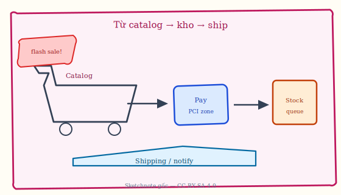
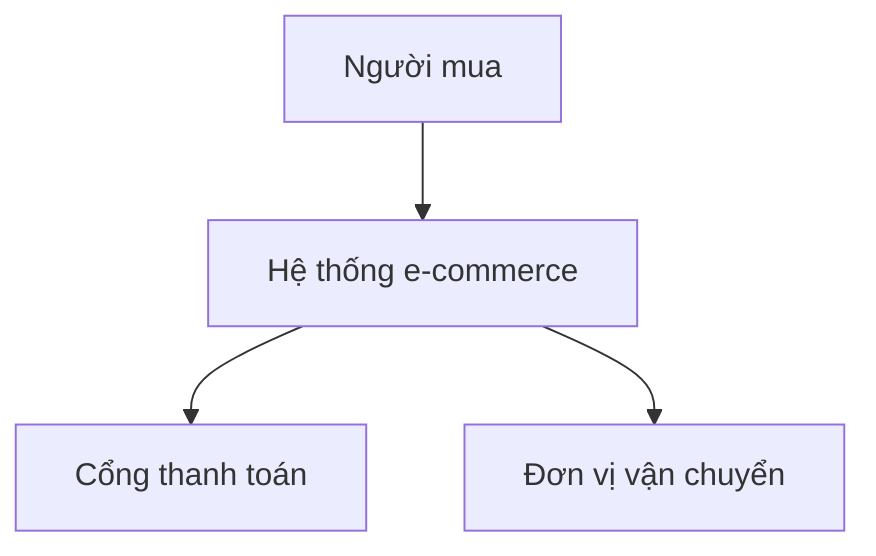
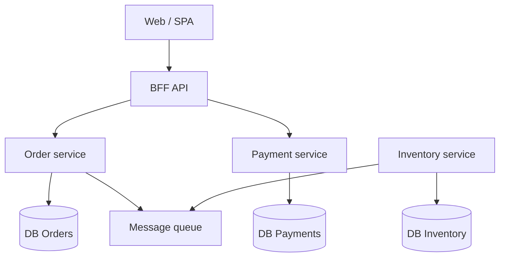
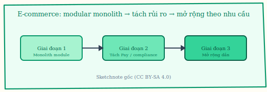
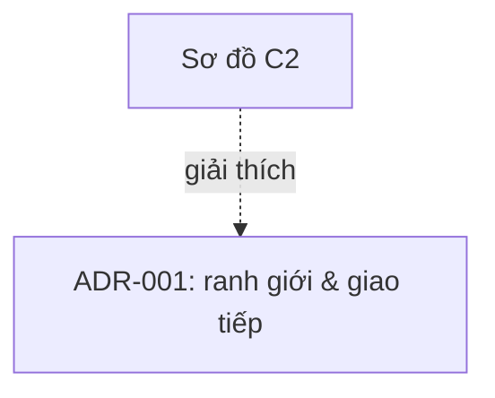
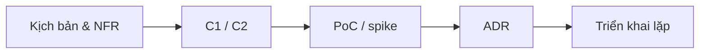

# Chương 8. Minh họa: kiến trúc nền tảng thương mại điện tử

Thương mại điện tử là *genre* quen thuộc để ôn lại toàn bộ chuỗi: NFR theo mùa và PCI, C1/C2 với BFF và queue, lựa chọn monolith modular hay microservices theo giai đoạn, và ADR gắn với sơ đồ. Đây chỉ là **minh họa sư phạm**, không thay cho đặc tả triển khai hay sizing số liệu thật.

## 8.1. Bối cảnh và yêu cầu

**E-commerce** trong ví dụ này gồm các nghiệp vụ: **catalog** (*danh mục sản phẩm*), **giỏ hàng** (*shopping cart*), **thanh toán** (*payment*), **kho** (*inventory*), **vận chuyển** (*shipping*), **thông báo** (*notification*), **báo cáo** (*reporting*). **NFR** điển hình: tải theo mùa (flash sale), **PCI DSS** (*chuẩn bảo mật dữ liệu thẻ* — vùng xử lý thẻ phải cô lập và kiểm toán), **availability** (*khả dụng*) của luồng đặt hàng, **scalability** (*khả năng mở rộng*) cho đội và traffic. Chẳng hạn, **Flash sale**: traffic ~10× bình thường; cần kịch bản scale + availability + giới hạn **oversell** (*bán quá số tồn thực*).

**Figure 8.1.** Sketchnote: một “dòng chảy” ghi chú nhanh từ **catalog** tới **payment** (vùng PCI), **stock**/queue và **shipping** — minh họa *sketchnote* trước khi đi sâu C1/C2 bên dưới. *Source:* SVG gốc (CC BY-SA 4.0); `figures/sketchnotes/README.md`.

**Figure 8.2.** Sơ đồ ngữ cảnh (C1 — ý tưởng): người mua, hệ e-commerce, cổng thanh toán, đơn vị vận chuyển (Mermaid). *Sources:* C4 level 1 [8]; minh họa sư phạm.

## 8.2. Từ ngữ cảnh tới container (C2)

**C1** (*system context* trong C4): một hộp “hệ thống của ta” và **actors** / hệ thống bên ngoài — neo ranh giới tổ chức với thế giới. **C2** (*container diagram*): các **container** ở đây là đơn vị **triển khai** (*deployable*): app, DB, queue — không phải “Docker container” hẹp; thể hiện giao tiếp **sync** (chờ phản hồi) và **async** (sự kiện/queue).

**BFF** (*Backend for Frontend*): lớp API tối ưu cho một loại client (ví dụ app mobile vs web admin), gom nhiều gọi nội bộ để giảm **chatty** (*nhiều round-trip*) từ client. Chẳng hạn, **Checkout** đồng bộ qua API; trạng thái “đã giao” có thể **async** qua **message queue** để email/SMS không chặn request.

**Figure 8.3.** Sơ đồ container (C2 — ví dụ): SPA, BFF, dịch vụ, DB riêng, message queue (Mermaid). *Sources:* C4 level 2 [8]; pattern BFF và microservices [6].

## 8.3. Lựa chọn phong cách

**Microservices** không phải mặc định: cần so với **modular monolith** (*monolith có module rõ ranh giới*), chi phí **DevOps** / **observability** (*quan sát hệ thống*), và **maturity** (*trình độ*) đội. Mục tiêu là đáp ứng **quality attribute scenarios** (chương 5), không phải số lượng service trên sơ đồ. Chẳng hạn, giai đoạn đầu: monolith modular; khi đủ năng lực, tách **Payment** trước vì **compliance** và tần suất thay đổi cao.

**Figure 8.4.** Sketchnote: **lộ trình tiến hóa** e-commerce — modular monolith trước, tách phần rủi ro / compliance, rồi mở rộng dịch vụ khi đủ năng lực vận hành. *Source:* SVG gốc (CC BY-SA 4.0); `figures/sketchnotes/README.md`.

## 8.4. ADR minh họa

**ADR** ghi **vì sao** chọn ranh giới và kiểu giao tiếp; giữ giá trị khi đổi công nghệ (Kafka ↔ Pulsar) nếu vai trò **event log + replay** không đổi. Chẳng hạn, **Context:** cần scale đội độc lập, deploy **Order** / **Payment** tách; chấp nhận **eventual consistency** (*nhất quán cuối cùng*) cho báo cáo. **Decision:** microservices + queue + **database per service**. **Consequences:** vận hành phức tạp; cần **distributed tracing**, **idempotency** (*xử lý lặp an toàn*).

## 8.5. Bài học rút ra

Đường đi gọn nhất vẫn là xuất phát từ **kịch bản** và **ràng buộc** (NFR, tuân thủ), rồi chọn **góc nhìn** phù hợp — C1/C2 gần như luôn có ích, còn **sequence diagram** đáng bỏ công khi luồng thanh toán hay đặt hàng đủ phức tạp. Mọi ranh giới và kiểu giao tiếp nên được **neo** bằng ADR có trạng thái và phiên bản để sau này đổi Kafka hay Pulsar vẫn còn đọc được *vai trò* của nó. Một lỗi hay gặp là vẽ hàng chục microservice trước khi có một luồng đặt hàng **end-to-end** chạy được trên môi trường giả lập tải — khi đó sơ đồ chỉ là trang trí.

Đi sâu thêm vài **bài học có cấu trúc**: (i) **Ưu tiên *-ilities*** theo giai đoạn — MVP thường cần time-to-market và đơn giản vận hành; khi doanh thu phụ thuộc uptime và flash sale, **availability**, **elasticity** và **idempotency** thanh toán mới leo lên đầu bảng. (ii) **Nhất quán dữ liệu** nên được **đặt tên** (sync vs eventual) theo từng use case — báo cáo real-time và kho thực không thể dùng cùng một tiêu chí mà không trade-off. (iii) **Giám sát** (*SLO*, trace qua cổng thanh toán) là một phần của kiến trúc kinh doanh, không chỉ “việc vận hành sau launch”. (iv) **Tái sử dụng pattern** (queue chống đỉnh, saga, outbox) cần **neo** vào ADR để lần sau không phát minh lại sai. (v) **Đa vùng và tuân thủ** — lưu PII, thanh toán và log audit theo **data residency** buộc C1/C2 phản ánh **ranh giới pháp lý**, không chỉ ranh giữ kỹ thuật; khi vậy, “một luồng checkout” có thể là **tổ hợp** edge + region cụ thể với policy routing, và kiến trúc phải chấp nhận **độ phức tạp vận hành** đổi lấy giảm rủi ro phạt và mất niềm tin thương hiệu.

Tóm lại, ví dụ e-commerce cho thấy cùng một miền nghiệp vụ vẫn đi từ bối cảnh và NFR tới C1/C2, rồi tới quyết định lai monolith/microservices theo giai đoạn — luôn gắn với ADR và khả năng vận hành. Ma trận quyết định, bài tập số và lab chi tiết nằm ở bài giảng gốc và tài liệu môn học.
