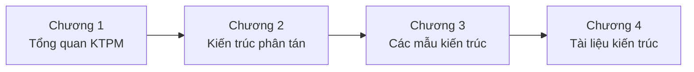

# Chương 1. Giới thiệu

Cuốn sách này được biên soạn trong bối cảnh môn học **ITEC2313 — Kiến trúc phần mềm**, dành cho chương trình đào tạo kỹ sư phần mềm và công nghệ thông tin. Nội dung tương ứng với Chương 2 của môn học — *Kiến trúc phân tán* — nhưng được mở rộng thành một tài liệu độc lập, có thể dùng vừa làm giáo trình vừa làm sách tham khảo cho người làm nghề.

**Sau khi học xong chương này, bạn có thể:** (1) Nêu mục đích sách và mục tiêu học tập (kiến thức, kỹ năng, thái độ); (2) Xác định vị trí nội dung trong chương trình (Tuần 2–3, sau Chương 1, trước Chương 3); (3) Mô tả cách sử dụng sách (đọc lý thuyết, case study, bài tập) và thời lượng gợi ý; (4) Liên hệ với các chương khác của môn học (Tổng quan kiến trúc, Các mẫu kiến trúc, Tài liệu kiến trúc).

Mục đích của sách là giúp người đọc nắm vững kiến trúc phân tán từ nền tảng đến hiện đại: không chỉ biết định nghĩa và sơ đồ, mà còn hiểu bối cảnh áp dụng, ưu nhược điểm, và cách lựa chọn công nghệ phù hợp với từng bài toán cụ thể. Sách cũng cung cấp case study, ví dụ thực tế và bài tập kèm đáp án gợi ý để người đọc có thể tự luyện tập và áp dụng vào dự án thực tế hoặc bài tập lớn.

---

## 1.1. Mục tiêu học tập

Sau khi hoàn thành phần nội dung tương ứng với cuốn sách này trong chương trình môn học, người đọc cần đạt được các mục tiêu sau đây, được nhóm theo ba khía cạnh: kiến thức, kỹ năng và thái độ.

**Về kiến thức**, người đọc cần hiểu và trình bày được khái niệm kiến trúc phân tán từ nhiều góc nhìn (Pressman [1], Tanenbaum [2], Richards & Ford [4]); phân tích được đặc điểm, ưu điểm và nhược điểm của kiến trúc phân tán so với kiến trúc tập trung; hiểu được vai trò và các loại middleware; phân biệt được các loại web services (SOAP, REST, GraphQL); và nắm được nguyên lý, đặc điểm cùng các patterns của kiến trúc microservices.

**Về kỹ năng**, người đọc cần thiết kế được kiến trúc phân tán phù hợp với yêu cầu dự án; lựa chọn được middleware và giao thức giao tiếp phù hợp; đánh giá và so sánh được các loại web services; và áp dụng được các patterns microservices vào bài tập lớn hoặc dự án thực tế. Các kỹ năng này gắn chặt với phần thực hành và case study trong từng chương.

**Về thái độ**, người đọc cần nhận thức rõ rằng kiến trúc phân tán không phải "luôn tốt hơn" kiến trúc tập trung — việc lựa chọn phải dựa trên ngữ cảnh và yêu cầu cụ thể; phát triển tư duy phân tích đánh đổi (*trade-off*) trong thiết kế kiến trúc; và có thói quen tự học, nghiên cứu thêm các công nghệ mới và tài liệu tham khảo được gợi ý trong sách.

---

## 1.2. Vị trí trong chương trình môn học

Trong khung chương trình môn học ITEC2313, nội dung tương ứng với cuốn sách này được bố trí vào **Tuần 2 và Tuần 3**, với thời lượng khoảng **11–12 giờ lý thuyết**. Đây là chương thứ hai của môn học, nên người đọc cần đã hoàn thành **Chương 1 (Tổng quan kiến trúc phần mềm)** để có nền tảng về khái niệm kiến trúc, các khung nhìn (views), yêu cầu phi chức năng và quy trình quản trị. Sau khi học xong chương này, người đọc sẽ chuyển sang **Chương 3 (Các mẫu kiến trúc phần mềm)**, nơi các mẫu cụ thể — bao gồm nhiều mẫu vốn thuộc kiến trúc phân tán — sẽ được trình bày chi tiết.

**Figure 1.1.** Vị trí Chương 2 trong chuỗi nội dung môn học ITEC2313.

---

## 1.3. Mối quan hệ với các chương khác

Nội dung sách có mối liên hệ chặt chẽ với các chương còn lại của môn học.

**Liên kết với Chương 1 (Tổng quan kiến trúc phần mềm):** Các khái niệm về kiến trúc phần mềm, thành phần, kết nối, khung nhìn kiến trúc được Chương 1 giới thiệu sẽ được áp dụng cụ thể vào bối cảnh phân tán. Chẳng hạn, khi nói đến đặc tính chất lượng (*quality attributes*) như availability, scalability, performance, người đọc sẽ nhận ra đây là các NFR đã được định nghĩa trong Chương 1 nhưng có ý nghĩa đặc biệt trong hệ thống phân tán.

**Liên kết với Chương 3 (Các mẫu kiến trúc phần mềm):** Một số mẫu trong Chương 3 — Client-Server, P2P, Broker, Event-Driven — vốn là các dạng kiến trúc phân tán. Các nguyên lý về giao tiếp qua mạng, tính nhất quán (*consistency*), khả năng mở rộng (*scalability*) và chịu lỗi (*fault tolerance*) trong cuốn sách này sẽ xuất hiện lại khi phân tích ưu nhược điểm của từng mẫu. Đặc biệt, phần microservices (Chương 5) cung cấp nền tảng cho Chương 12 của sách Chương 3, nơi trình bày các patterns bổ trợ (Saga, Sidecar, Circuit Breaker).

**Liên kết với Chương 4 (Viết tài liệu kiến trúc phần mềm):** Kiến trúc phân tán cần được tài liệu hóa cẩn thận hơn kiến trúc tập trung — nhiều thành phần, nhiều giao thức, nhiều đội phát triển. Các kỹ năng vẽ sơ đồ C4, viết ADR được học trong Chương 4 sẽ áp dụng trực tiếp lên các hệ thống phân tán đã thiết kế ở đây.

---

## 1.4. Cách sử dụng sách

Sách được tổ chức theo bốn phần chính (Nền tảng, Công nghệ giao tiếp, Kiến trúc hiện đại, Tổng kết) và phần bài tập cùng phụ lục ở cuối. Để đạt hiệu quả cao nhất, người đọc nên kết hợp đọc lý thuyết, nghiên cứu case study và làm bài tập.

**Đọc lý thuyết:** Mỗi chương thường theo cấu trúc: Khái niệm và định nghĩa → Đặc điểm → Phân loại → Ưu nhược điểm → Ứng dụng thực tế → Case study → Câu hỏi ôn tập. Nên đọc tuần tự để nắm mạch ý; với người đã quen khái niệm nào đó có thể đọc nhanh phần đầu và tập trung vào case study và bài tập.

**Case study:** Mỗi chương đều có ít nhất một case study gắn với hệ thống thực tế (e-commerce, streaming, social media…). Nên đọc kỹ phần này để thấy cách áp dụng trong bối cảnh cụ thể: yêu cầu nghiệp vụ, lựa chọn công nghệ, luồng xử lý và đôi khi là đoạn code minh họa.

**Bài tập:** Cuối mỗi chương có câu hỏi ôn tập ngắn. Phần cuối sách có thêm bài tập tổng hợp. Nên tự làm trước, sau đó mới tham khảo đáp án gợi ý trong file `99-DapAn.md`.

**Thời lượng gợi ý:** Theo syllabus, 11–12 giờ lý thuyết tương ứng với nội dung chương này. Ngoài ra nên dành khoảng **15–20 giờ tự học** cho việc đọc kỹ từng chương, nghiên cứu case study, làm bài tập và nếu có thể thử triển khai một vài ví dụ trong môi trường phát triển của mình.

---

## 1.5. Tải nhận thức và bằng chứng trong kiến trúc phân tán

Kiến trúc phân tán đòi hỏi **đồng thời** giữ trong đầu: mạng, nhất quán, vận hành, bảo mật và tổ chức đội — tải nhận thức (*cognitive load*) cao hơn kiến trúc một khối. Vì vậy, đọc song song **sách Chương 1** (khái niệm kiến trúc, NFR, khung nhìn, ADR) giúp **neo** quyết định: mỗi lần chọn Kafka thay RabbitMQ hoặc REST thay gRPC nên có thể truy về *scenario* chất lượng và *trade-off* đã ghi, không chỉ “xu hướng công nghệ”. Khi đối chiếu case Netflix/Amazon trong các chương sau, hãy tách **bằng chứng định lượng** (SLO, postmortem công khai, bài báo kỹ thuật) khỏi **lời kể** (*anecdote*): quy mô và bối cảnh khác bạn một hai bậc thì pattern vẫn học được, nhưng con số deploy/ngày không phải mục tiêu cho mọi tổ chức [4], [5].

---

*Chương tiếp theo trình bày tổng quan về kiến trúc phân tán: định nghĩa từ nhiều góc nhìn, đặc điểm cốt lõi, so sánh với kiến trúc tập trung và các thách thức khi thiết kế hệ thống phân tán.*
