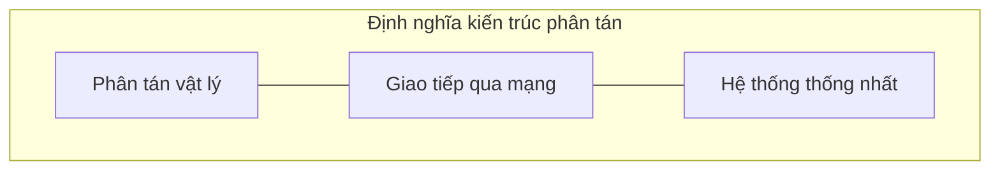
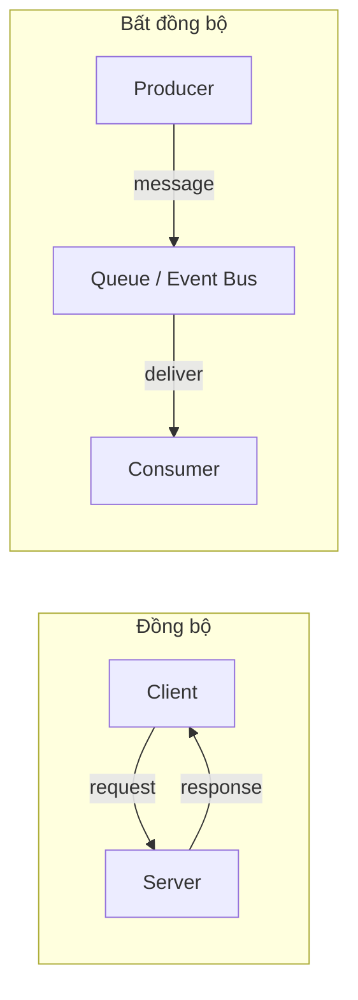
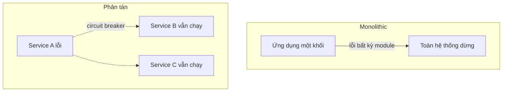
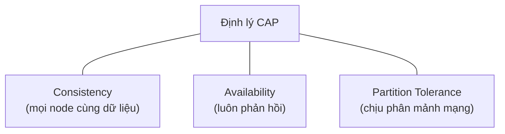
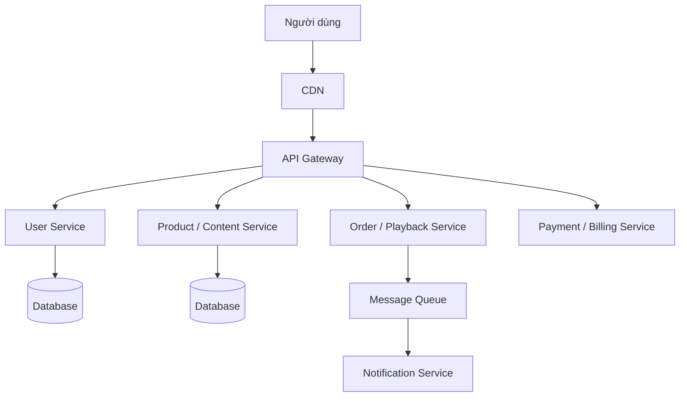

# Chương 2. Tổng quan kiến trúc phân tán

Một ứng dụng web nhỏ có thể chạy trọn trong một tiến trình, một máy chủ — dữ liệu, logic nghiệp vụ, giao diện đều cùng chỗ. Nhưng khi yêu cầu mở rộng lên hàng triệu người dùng, khi doanh nghiệp cần sẵn sàng 24/7, khi đội phát triển tăng từ năm lên năm mươi người, kiến trúc tập trung (*centralized*) dần bộc lộ giới hạn. **Kiến trúc phân tán** (*distributed architecture*) ra đời như một phong cách tổ chức phần mềm trong đó các thành phần được triển khai trên nhiều máy tính, giao tiếp qua mạng, và cùng phục vụ người dùng như thể chúng là một hệ thống thống nhất. Chương này thiết lập từ vựng chung bằng cách đối chiếu các định nghĩa phổ biến, phân tích bốn đặc điểm cốt lõi, và thảo luận các thách thức mà bất kỳ kiến trúc sư nào cũng phải đối mặt khi chuyển từ tập trung sang phân tán.

---

## 2.1. Vì sao cần kiến trúc phân tán?

Trong một hệ thống **tập trung** (*centralized*), toàn bộ phần mềm chạy trên cùng một máy chủ — giao diện, xử lý nghiệp vụ, cơ sở dữ liệu đều ở chung một tiến trình hoặc cùng một máy vật lý. Mô hình này đơn giản, dễ lý luận về tính nhất quán dữ liệu, và phù hợp với nhiều ứng dụng quy mô nhỏ. Tuy nhiên, ba giới hạn khiến các tổ chức tìm đến kiến trúc phân tán:

1. **Giới hạn mở rộng theo chiều dọc** (*vertical scaling ceiling*): một máy chủ dù mạnh đến đâu cũng có trần về CPU, RAM và I/O. Khi lượng request vượt ngưỡng, không thể "mua thêm RAM" mãi.
2. **Điểm đơn lỗi** (*single point of failure* — SPOF): một máy chủ hỏng, cả hệ thống dừng.
3. **Nút thắt phát triển** (*development bottleneck*): khi một codebase monolithic phục vụ nhiều đội, bất kỳ thay đổi nào cũng có thể ảnh hưởng phần còn lại; deploy cần phối hợp toàn tổ chức.

Kiến trúc phân tán giải quyết ba giới hạn trên bằng cách **chia nhỏ hệ thống thành các thành phần chạy trên nhiều máy**, nhưng đổi lại phải đối mặt với sự phức tạp về mạng, nhất quán dữ liệu và vận hành. Phần còn lại của chương sẽ làm rõ khái niệm, đặc điểm, đánh đổi, và các bài học thực tế.

---

## 2.2. Định nghĩa kiến trúc phân tán

Không có "một định nghĩa đúng duy nhất" vì mỗi trường phái nhấn mạnh một khía cạnh khác nhau. Dưới đây là năm góc nhìn thường gặp trong giảng dạy và thực hành.

### 2.2.1. Pressman — cấu trúc và giao tiếp

Pressman và Maxim [1] mô tả kiến trúc phân tán là kiến trúc phần mềm trong đó các thành phần được triển khai trên **nhiều máy tính khác nhau** (*nodes*), **giao tiếp qua mạng**, và hoạt động như một **hệ thống thống nhất** từ góc nhìn người dùng cuối. Trọng tâm ở đây là **cấu trúc vật lý** và **kênh giao tiếp**.

### 2.2.2. Tanenbaum & Van Steen — transparency

Tanenbaum và Van Steen [2] định nghĩa *hệ thống phân tán* (*distributed system*) là "một tập hợp các máy tính độc lập xuất hiện đối với người dùng như một hệ thống máy tính duy nhất." Trọng tâm là **transparency** — khả năng che giấu sự phức tạp phân tán: vị trí (*location*), lỗi (*failure*), nhân bản (*replication*), di chuyển (*migration*), và đồng thời (*concurrency*) đều phải trong suốt với người dùng. Bảng 2.1 liệt kê các loại transparency quan trọng.

**Bảng 2.1.** Các loại transparency trong hệ thống phân tán (theo Tanenbaum & Van Steen [2]).

| Loại | Mô tả | Ví dụ |
|------|--------|-------|
| **Access** | Che giấu sự khác biệt trong cách truy cập tài nguyên | Local file vs. remote file |
| **Location** | Che giấu vị trí vật lý của tài nguyên | Người dùng không cần biết server ở đâu |
| **Migration** | Che giấu việc di chuyển tài nguyên | Load balancing tự động |
| **Replication** | Che giấu việc có nhiều bản sao | Database replication |
| **Concurrency** | Che giấu việc chia sẻ tài nguyên | Nhiều người dùng đồng thời |
| **Failure** | Che giấu lỗi và recovery | Automatic failover |

### 2.2.3. Kleppmann — ba mối quan tâm của hệ thống dữ liệu lớn

Kleppmann [3] tiếp cận hệ thống phân tán qua ba đặc tính then chốt: **Reliability** (hệ thống tiếp tục hoạt động đúng ngay cả khi có lỗi phần cứng, phần mềm hoặc lỗi con người), **Scalability** (khả năng xử lý tải tăng lên một cách hợp lý), và **Maintainability** (dễ vận hành, mở rộng và sửa chữa theo thời gian). Trọng tâm là **dữ liệu** — hệ thống phân tán hiện đại thường *data-intensive* hơn *compute-intensive*.

### 2.2.4. Richards & Ford — phong cách kiến trúc

Richards và Ford [4] gom kiến trúc phân tán vào nhóm **distributed architecture styles**, đối lập với **monolithic architecture styles**. Họ nhấn mạnh ba đặc điểm phân biệt: các thành phần được triển khai trên các máy chủ khác nhau (*distributed components*), giao tiếp qua mạng (*network communication*), và có khả năng triển khai độc lập (*independent deployment*). Các dạng phân tán phổ biến gồm Client-Server, SOA, Microservices, Event-Driven và Space-Based.

### 2.2.5. Newman — qua lăng kính microservices

Newman [5] nhìn kiến trúc phân tán từ góc microservices: mỗi service là một ứng dụng **độc lập**, có database riêng, có thể deploy/scale/fail riêng biệt, giao tiếp qua mạng bằng các giao thức nhẹ (HTTP/REST, gRPC, message queue). Trọng tâm là **service independence** và **technology diversity**.

### 2.2.6. Tổng hợp

Tất cả các định nghĩa đều nhấn mạnh ba điểm chung: (1) các thành phần được **phân tán về mặt vật lý**; (2) chúng **giao tiếp qua mạng**; và (3) từ góc nhìn người dùng, hệ thống hoạt động như **một thể thống nhất**. Sự khác biệt chủ yếu ở **góc nhìn**: Pressman tập trung vào cấu trúc, Tanenbaum vào transparency, Kleppmann vào đặc tính chất lượng của dữ liệu, Richards & Ford vào phân loại kiến trúc, và Newman vào tính độc lập của service.

**Figure 2.1.** Ba trụ cột chung của mọi định nghĩa kiến trúc phân tán.

---

## 2.3. Bốn đặc điểm cốt lõi

Kiến trúc phân tán có bốn đặc điểm phân biệt nó với kiến trúc tập trung [1], [2], [4]. Hiểu rõ bốn đặc điểm này là nền tảng để thiết kế và đánh giá hệ thống.

### 2.3.1. Phân tán về mặt vật lý

Đặc điểm cơ bản nhất: các thành phần phần mềm chạy trên **nhiều máy tính riêng biệt** — có thể cùng một rack, cùng data center, hoặc khác lục địa. Mức độ phân tán ảnh hưởng trực tiếp đến **latency** (độ trễ), **chi phí vận hành** và **yêu cầu tuân thủ pháp lý** (ví dụ GDPR yêu cầu dữ liệu công dân EU lưu tại EU).

**Bảng 2.2.** Các mức phân tán vật lý và latency tương ứng.

| Mức độ | Mô tả | Latency ước lượng | Ví dụ |
|--------|--------|-------------------|-------|
| Co-located | Cùng máy chủ / rack | < 1 ms | Docker containers cùng host |
| Cùng data center | Cùng tòa nhà / DC | 1–5 ms | AWS instances cùng region |
| Cùng quốc gia | Khác DC trong nước | 10–50 ms | US-East ↔ US-West |
| Cùng lục địa | Khác quốc gia, cùng châu lục | 50–150 ms | US ↔ EU |
| Xuyên lục địa | Khác châu lục | 150–300 ms | US ↔ Asia-Pacific |

**Lợi ích:** giảm latency cho người dùng gần server, tuân thủ data residency, chịu lỗi theo vùng địa lý, và mở rộng theo chiều ngang bằng cách thêm node.

**Thách thức:** latency mạng tăng theo khoảng cách vật lý, quản lý cấu hình nhiều node phức tạp hơn, và chi phí vận hành tăng theo số lượng data center.

### 2.3.2. Giao tiếp qua mạng

Đặc điểm **bắt buộc** phân biệt kiến trúc phân tán với tập trung: các thành phần không chia sẻ bộ nhớ (*no shared memory*), mọi trao đổi đều qua **truyền thông điệp** (*message passing*) trên mạng [2].

Hai mô hình giao tiếp chính:

**Đồng bộ** (*synchronous*): client gửi request và **chờ** response trước khi tiếp tục. Đơn giản, phù hợp cho các thao tác cần phản hồi tức thời (tra cứu thông tin người dùng, kiểm tra tồn kho). Giao thức phổ biến: HTTP/REST, gRPC.

**Bất đồng bộ** (*asynchronous*): producer gửi message vào hàng đợi hoặc event bus rồi **tiếp tục ngay**, consumer xử lý khi sẵn sàng. Phù hợp cho thao tác dài, không cần phản hồi tức thời (gửi email, xử lý thanh toán). Giao thức phổ biến: AMQP (RabbitMQ), Kafka, MQTT.

**Figure 2.2.** Hai mô hình giao tiếp chính: đồng bộ (request-response) và bất đồng bộ (qua hàng đợi).

**Bảng 2.3.** Các giao thức giao tiếp phổ biến trong hệ thống phân tán.

| Giao thức | Tầng | Đặc điểm | Use case |
|-----------|------|----------|----------|
| HTTP/HTTPS | Application | Văn bản, RESTful | Web APIs, microservices |
| gRPC | Application | Nhị phân, hiệu năng cao | Giao tiếp nội bộ |
| AMQP | Application | Message queuing | Xử lý bất đồng bộ |
| WebSocket | Application | Full-duplex, persistent | Chat, real-time |
| MQTT | Application | Nhẹ, Pub/Sub | IoT |

**Thách thức quan trọng nhất: latency.** Một lời gọi hàm cục bộ mất dưới 1 microsecond; một lời gọi qua mạng trong cùng data center mất 0,5–1 millisecond — chậm hơn **hàng trăm đến hàng nghìn lần**. Kiến trúc sư cần tối thiểu hóa số lượng network call (batch request, caching) và chọn giao thức phù hợp (gRPC cho nội bộ, REST cho API công khai).

### 2.3.3. Độc lập về mặt hoạt động

Trong kiến trúc phân tán, các thành phần có thể được **triển khai**, **mở rộng**, **phát triển** và **chịu lỗi** độc lập [4], [5]:

- **Triển khai độc lập** (*independent deployment*): deploy một service mà không cần deploy lại toàn hệ thống. Rollback cũng chỉ ảnh hưởng service đó. Netflix deploy hơn 1.000 lần mỗi ngày nhờ tính chất này.
- **Mở rộng độc lập** (*independent scaling*): scale riêng từng service theo nhu cầu thực tế — chỉ tăng instance của Payment Service trong ngày Black Friday mà không cần scale User Service.
- **Phát triển độc lập** (*independent development*): mỗi đội sở hữu service riêng, tự chọn công nghệ (Conway's Law: cấu trúc tổ chức phản ánh cấu trúc hệ thống [5]).
- **Chịu lỗi độc lập** (*fault isolation*): nếu Recommendation Service sập, người dùng vẫn xem được video — chỉ mất phần gợi ý. Kỹ thuật **Circuit Breaker** ngăn lỗi lan truyền (*cascading failure*).

**Figure 2.3.** So sánh phạm vi ảnh hưởng khi xảy ra lỗi: monolithic vs. phân tán.

### 2.3.4. Nhất quán dữ liệu — thách thức không có giải pháp "miễn phí"

Khi dữ liệu nằm trên nhiều node, câu hỏi "mọi node có cùng giá trị không?" trở nên khó trả lời. **Định lý CAP** (Brewer, 2000 [15]) khẳng định: trong hệ thống phân tán, khi xảy ra phân mảnh mạng (*network partition* — P), ta chỉ có thể chọn **một** trong hai: **nhất quán mạnh** (Consistency — C) hoặc **sẵn sàng** (Availability — A), không thể có cả hai.

**Figure 2.4.** Tam giác CAP — khi partition xảy ra, chỉ chọn được C hoặc A, không cả hai.

**Bảng 2.4.** Chiến lược nhất quán và đánh đổi tương ứng.

| Chiến lược | Đặc điểm | Phù hợp với | Ví dụ |
|------------|----------|-------------|-------|
| Strong Consistency | Đọc luôn nhận giá trị mới nhất; latency cao hơn | Giao dịch tài chính, inventory | PostgreSQL, Spanner |
| Eventual Consistency | Dữ liệu hội tụ sau một khoảng thời gian; latency thấp | Hồ sơ người dùng, timeline mạng xã hội | Cassandra, DynamoDB |
| Weak Consistency | Không đảm bảo khi nào hội tụ | Cache, CDN | Web caching |

Trong thực tế, **Partition Tolerance là bắt buộc** vì mạng luôn có thể phân mảnh — ta thực tế chỉ chọn giữa CP (ưu tiên nhất quán, chấp nhận từ chối một số request) hoặc AP (ưu tiên sẵn sàng, chấp nhận đọc giá trị cũ). Nhiều hệ thống kết hợp cả hai: giao dịch thanh toán dùng strong consistency, còn cập nhật avatar dùng eventual consistency.

**Mở rộng sau CAP:** Brewer sau này nhấn mạnh CAP là **khung tư duy**, không phải nút gạt ba vị trí cho mọi API [15]. Khi **không** có partition, vẫn còn đánh đổi **độ trễ** (*latency*) và **độ tươi** dữ liệu — gói trong mở rộng **PACELC** (phổ biến trong tài liệu hệ phân tán hiện đại): *If partitioned* thì CAP; *Else* (mạng lành) vẫn phải chọn giữa **latency** và **consistency** cho từng thao tác. Về mặt chính thức hóa “đọc mới nhất”, các hệ dùng khái niệm như **linearizability** (một tổng thể thứ tự toàn cục như một bản sao) — thường **đắt** hơn **eventual consistency** về latency và khả năng chịu sự cố [3]. Người thiết kế cần gắn từng use case với **mức** nhất quán (đọc gì, sau ghi bao lâu, chấp nhận stale bao nhiêu) thay vì chỉ gắn nhãn “strong” hay “eventual”.

**Thứ tự sự kiện và thời gian logic:** Khi không có đồng hồ chung, các node chỉ có **quan sát cục bộ**. Lamport [14] mô tả cách gán **thứ tự nhân quả** (*happens-before*) và **logical clocks** để suy ra thứ tự tương đối của sự kiện — nền tảng cho ý tưởng **vector clock**, phiên bản thời gian trong log phân tán và debug race. Kiến trúc sư không cần triển khai clock thủ công, nhưng cần biết: **timestamp wall-clock lệch** giữa máy làm hỏng suy luận “cái sau mới đúng” nếu không có quy ước đồng bộ (NTP, **TrueTime** trong các hệ đặc thù…) hoặc không dùng **version vector** / **hybrid logical clock** trong thiết kế dữ liệu.

---

## 2.4. So sánh kiến trúc tập trung và phân tán

**Bảng 2.5.** So sánh tổng quan hai phong cách kiến trúc.

| Tiêu chí | Tập trung (Centralized) | Phân tán (Distributed) |
|----------|------------------------|----------------------|
| Triển khai | Một máy chủ / một khối | Nhiều máy, nhiều service |
| Mở rộng | Vertical (mua thêm RAM/CPU) | Horizontal (thêm node) |
| Chịu lỗi | SPOF — một điểm hỏng, cả hệ dừng | Fault isolation — hỏng một service, hệ vẫn hoạt động |
| Nhất quán | Tự nhiên (cùng DB) | Phải quản lý: CAP, saga, 2PC |
| Phức tạp vận hành | Thấp | Cao (monitoring, tracing, config management) |
| Phù hợp | MVP, startup nhỏ, ít người dùng | Quy mô lớn, nhiều đội, yêu cầu HA/scalability |

Không có kiến trúc nào "luôn tốt hơn". Nguyên tắc **YAGNI** (*You Ain't Gonna Need It*) áp dụng ở đây: bắt đầu với kiến trúc đơn giản nhất đáp ứng yêu cầu hiện tại; chuyển sang phân tán khi có **bằng chứng cụ thể** về nhu cầu mở rộng, sẵn sàng cao hoặc nhiều đội độc lập.

---

## 2.5. Tám ngộ nhận về hệ thống phân tán

Peter Deutsch đúc kết tám ngộ nhận (*fallacies of distributed computing*) [17] — những giả định sai mà lập trình viên thường mắc phải khi lần đầu làm việc với hệ thống phân tán:

1. **Mạng là đáng tin cậy** — thực tế: mạng có thể mất kết nối, mất gói tin bất cứ lúc nào.
2. **Latency bằng không** — thực tế: mỗi network call đều có độ trễ đáng kể.
3. **Băng thông là vô hạn** — thực tế: cần tối ưu kích thước dữ liệu truyền đi.
4. **Mạng là an toàn** — thực tế: cần mã hóa và xác thực ở mọi điểm giao tiếp.
5. **Topology không thay đổi** — thực tế: node có thể join/leave bất cứ lúc nào.
6. **Chỉ có một quản trị viên** — thực tế: hệ thống phân tán thường có nhiều đội, nhiều tổ chức.
7. **Chi phí truyền tải bằng không** — thực tế: mỗi byte truyền đi đều có chi phí (bandwidth, compute).
8. **Mạng là đồng nhất** — thực tế: các phần mạng có thể dùng công nghệ và tốc độ khác nhau.

Kiến trúc sư cần thiết kế hệ thống **giả định mạng sẽ lỗi**: dùng retry với exponential backoff, timeout ở mọi network call, circuit breaker để ngăn cascading failure, và idempotency để retry an toàn.

**Từ ngộ nhận tới kỹ thuật cụ thể:** mỗi fallacy [17] gợi một **kiểm tra thiết kế**: (1) *mạng tin cậy* → timeout + retry có giới hạn + **hedging** có kiểm soát; (2) *latency zero* → **latency budget** end-to-end, giảm số hop, cache; (3) *băng thông vô hạn* → nén payload, phân trang, **pagination cursor**; (4) *mạng an toàn* → TLS/mTLS, zero trust giữa service; (5) *topology cố định* → health check, registry, **graceful shutdown**; (6) *một admin* → ranh giới trách nhiệm, ADR đa đội; (7) *chi phí truyền bằng không* → egress bill, serialization cost; (8) *mạng đồng nhất* → kiểm thử trên Wi‑Fi/4G, vùng xa. Tám mục này trùng tinh thần **SRE** và **hạ tầng có thể quan sát** (*observability*) mà các chương middleware và microservices sẽ cụ thể hóa [2], [5].

---

## 2.6. Phân biệt các thuật ngữ liên quan

Người mới thường nhầm lẫn các khái niệm gần nhau. Bảng 2.6 giúp phân biệt.

**Bảng 2.6.** Phân biệt các thuật ngữ liên quan đến "phân tán".

| Thuật ngữ | Định nghĩa | Khác biệt chính |
|-----------|------------|-----------------|
| Distributed System | Hệ thống (phần cứng + phần mềm) phân tán | Bao gồm cả hạ tầng vật lý |
| Distributed Architecture | Kiến trúc phần mềm phân tán | Tập trung vào tổ chức phần mềm |
| Parallel System | Nhiều bộ xử lý, shared memory | Cùng máy, chia sẻ bộ nhớ |
| Decentralized System | Không có node trung tâm | Ví dụ: P2P, blockchain |
| Networked System | Các máy nối mạng | Có thể không phân tán logic |

**Phân biệt quan trọng:**
- **Distributed vs. Parallel:** Distributed không chia sẻ bộ nhớ, giao tiếp qua mạng; Parallel chia sẻ bộ nhớ, giao tiếp qua bus nội bộ.
- **Distributed vs. Decentralized:** Distributed có thể có node trung tâm (ví dụ: client-server); Decentralized mọi node đều ngang hàng (ví dụ: P2P).

---

## 2.7. Ví dụ thực tế

### E-commerce (Amazon)

Hệ thống e-commerce quy mô lớn là minh họa điển hình cho kiến trúc phân tán: người dùng truy cập qua CDN gần nhất, request đi qua Load Balancer đến API Gateway, rồi được phân phối tới các microservice (User, Product, Cart, Order, Payment, Shipping, Notification), mỗi service có data store riêng (PostgreSQL, Redis, Elasticsearch, RabbitMQ). Toàn bộ triển khai trên nhiều region (US-East, US-West, EU, Asia-Pacific) để giảm latency và tăng khả năng chịu lỗi theo vùng địa lý.

### Video streaming (Netflix)

Netflix vận hành hơn 700 microservice. Video được cache ở hàng trăm CDN edge location trên toàn cầu. Kiến trúc event-driven (Kafka) kết nối các service nội bộ. Auto-scaling cho phép tăng từ 100 lên 1.000 instance cho Streaming Service trong giờ cao điểm mà không cần thay đổi kiến trúc tổng thể.

**Figure 2.5.** Sơ đồ tổng quan kiến trúc phân tán của một hệ thống e-commerce / streaming lớn.

---

## 2.8. Câu hỏi ôn tập

1. Định nghĩa kiến trúc phân tán theo Pressman [1] và theo Tanenbaum [2]. Hai định nghĩa khác nhau ở trọng tâm nào?
2. Nêu bốn đặc điểm cốt lõi của kiến trúc phân tán. Đặc điểm nào là **bắt buộc** phân biệt với tập trung?
3. Giải thích định lý CAP. Tại sao trong thực tế ta chỉ chọn giữa CP và AP?
4. Liệt kê ba trong tám ngộ nhận Deutsch. Với mỗi ngộ nhận, cho một ví dụ hậu quả nếu kiến trúc sư tin vào nó.
5. Khi nào nên bắt đầu với kiến trúc tập trung thay vì phân tán? Giải thích bằng nguyên tắc YAGNI.
6. Phân biệt Distributed System, Parallel System và Decentralized System. Cho ví dụ mỗi loại.

---

*Figure 2.1–2.5 | Bảng 2.1–2.6 | Xem thêm: Phần I (khái niệm kiến trúc, NFR), Phần III, Phần II trong Phần III — Client-Server, P2P, Broker.*
