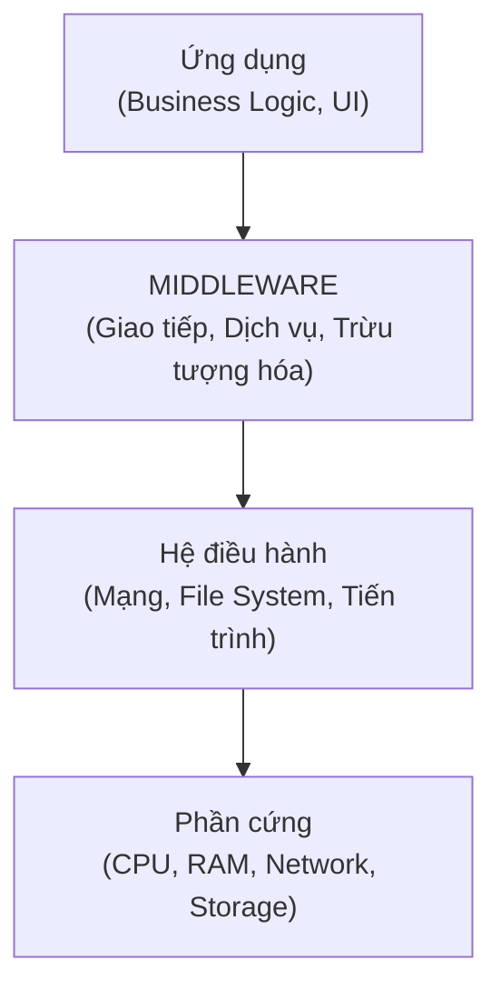
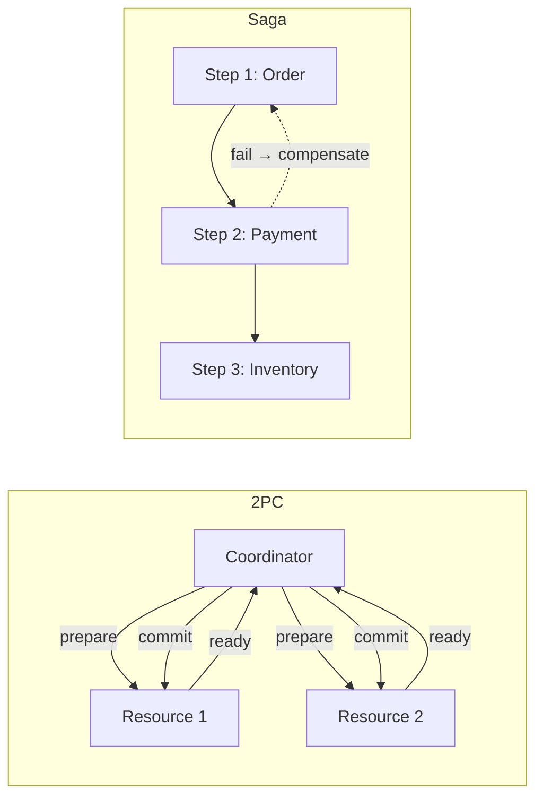
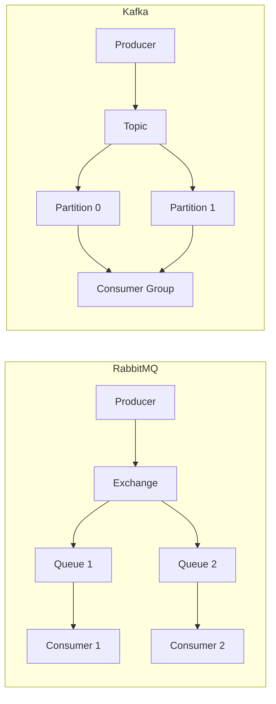
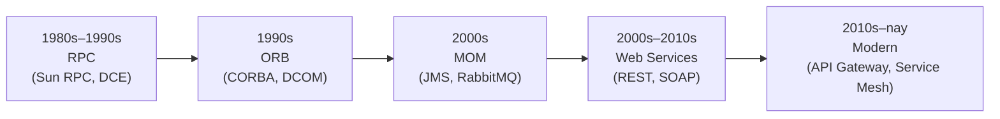

# Chương 3. Middleware

Trong kiến trúc tập trung, hai module gọi nhau qua lời gọi hàm cục bộ — nhanh, đơn giản, không cần quan tâm đến mạng. Khi chuyển sang phân tán, mọi cuộc giao tiếp đều phải vượt qua mạng: khác địa chỉ IP, khác hệ điều hành, có thể khác ngôn ngữ lập trình. **Middleware** — lớp phần mềm trung gian nằm giữa ứng dụng và hệ điều hành — ẩn đi sự phức tạp đó, cho phép nhà phát triển tập trung vào logic nghiệp vụ thay vì viết mã xử lý socket và serialize thủ công. Chương này trình bày khái niệm, vai trò và các loại middleware phổ biến trong hệ thống phân tán hiện đại.

---

## 3.1. Định nghĩa và vị trí trong kiến trúc

Tanenbaum và Van Steen [2] định nghĩa middleware là "lớp phần mềm nằm giữa hệ điều hành và các ứng dụng, cung cấp các dịch vụ chung cho các ứng dụng phân tán, ẩn đi sự phức tạp và sự khác biệt của các hệ thống." Pressman [1] nhấn mạnh chức năng giao tiếp: middleware cho phép các thành phần phân tán giao tiếp qua message passing, remote procedure call, và quản lý giao dịch.

Về mặt kiến trúc, middleware nằm ở vị trí **giữa** ứng dụng và hạ tầng:

**Figure 3.1.** Vị trí middleware trong ngăn xếp kiến trúc hệ thống phân tán.

Bốn đặc tính quan trọng của middleware: **Transparency** (ẩn đi sự phức tạp mạng, platform), **Reusability** (nhiều ứng dụng dùng chung), **Interoperability** (cho phép các ứng dụng trên platform khác nhau giao tiếp), và **Scalability** (hỗ trợ mở rộng quy mô).

**Giới hạn trừu tượng hóa:** middleware **không** triệt tiêu định lý CAP hay độ trễ vật lý — chỉ chuyển chúng thành **chính sách** có tên (timeout, retry, semantics giao tin). Khi lớp trung gian quá “thông minh” (ESB chứa logic nghiệp vụ, orchestration không trong suốt), hệ dễ thành **nút thắt** và khó hiểu khi sự cố — trái với triết lý *smart endpoints, dumb pipes* của microservices hiện đại [5], [6].

---

## 3.2. Năm vai trò chính

### 3.2.1. Trừu tượng hóa (Abstraction)

Không có middleware, ứng dụng A (Java, Linux) muốn gọi ứng dụng B (Python, Windows) phải tự xử lý IP, port, giao thức, serialization. Với middleware, ứng dụng chỉ cần gọi một API đơn giản — middleware lo phần còn lại. Chẳng hạn, gRPC client chỉ gọi `client.GetUser(request)` như gọi hàm cục bộ; phía dưới, gRPC runtime marshal tham số thành Protocol Buffer, gửi qua HTTP/2, nhận response và unmarshal kết quả.

### 3.2.2. Giao tiếp (Communication)

Middleware cung cấp ba mô hình giao tiếp chính:

- **Request-Response** (đồng bộ): client gửi request, chờ response. Phù hợp cho tra cứu, thao tác ngắn. Middleware: HTTP gateway, gRPC.
- **Message Passing** (bất đồng bộ): producer gửi message vào queue, consumer xử lý khi sẵn sàng. Phù hợp cho tác vụ dài, decoupling. Middleware: RabbitMQ, Amazon SQS.
- **Event-Driven** (pub/sub): producer phát event, nhiều consumer subscribe và xử lý đồng thời. Middleware: Kafka, AWS EventBridge.

Middleware cũng hỗ trợ **message transformation** (chuyển đổi JSON ↔ XML ↔ Protocol Buffer) và **routing** (định tuyến message theo type, content, header).

**Backpressure và hàng đợi có giới hạn:** khi producer nhanh hơn consumer, nếu queue **không giới hạn** (*unbounded*), bộ nhớ broker hoặc ứng dụng sẽ phình cho đến khi OOM — đây là lỗi kiến trúc chứ không chỉ lỗi cấu hình. Middleware tốt cho phép **áp đảo ngược** (*backpressure*): từ chối sớm, block có thời hạn, hoặc shed load; consumer group Kafka **pull** với offset cũng là một dạng điều tiết tốc độ [3]. Thiết kế cần hỏi: “Khi hệ quá tải, ta **mất** gì trước — độ trễ, một phần request, hay tính toàn vẹn?”

### 3.2.3. Service Discovery

Trong hệ thống phân tán, service có thể di chuyển (mới khởi tạo container với IP mới), scale (thêm instance) hoặc bị thay thế. **Service Discovery** giúp các thành phần tự động tìm thấy nhau mà không cần hard-code địa chỉ. Hai mô hình phổ biến:

- **Client-side discovery**: client truy vấn service registry (Consul, Eureka) để lấy danh sách instance, rồi tự chọn instance phù hợp.
- **Server-side discovery**: client gửi request tới load balancer; load balancer truy vấn registry và chuyển tiếp request.

Kubernetes tích hợp service discovery qua DNS nội bộ — khi Pod restart với IP mới, Kubernetes Service tự động cập nhật.

### 3.2.4. Quản lý giao dịch phân tán

Khi một giao dịch nghiệp vụ trải qua nhiều service (tạo đơn hàng → trừ tiền → giữ hàng trong kho), middleware hỗ trợ hai chiến lược:

- **Two-Phase Commit (2PC)**: Coordinator gửi lệnh *Prepare* cho tất cả resource; nếu tất cả sẵn sàng, gửi *Commit*; nếu bất kỳ resource nào từ chối, gửi *Abort*. Đảm bảo ACID nhưng chậm (nhiều round-trip) và coordinator là SPOF. Middleware: JTA/XA, Microsoft DTC. **Heuristic hazard** và **blocking** khi coordinator mất sau *prepare* là rủi ro vận hành thực tế — cần timeout, recovery procedure và thường **tránh** 2PC xuyên nhiều dịch vụ triển khai độc lập [3].
- **Saga Pattern**: chuỗi giao dịch cục bộ; nếu một bước thất bại, các bước trước được bù trừ (*compensating transaction*). Phù hợp cho microservices vì không cần coordinator tập trung. Middleware: event queue kết hợp orchestrator hoặc choreography. **Choreography** giảm điểm tập trung nhưng khó quan sát luồng; **orchestration** dễ truy vết nhưng cần tránh orchestrator trở thành “ESB mới” [6].

**Figure 3.2.** Hai chiến lược giao dịch phân tán: 2PC (trái) và Saga (phải).

### 3.2.5. Bảo mật

Middleware cung cấp ba dịch vụ bảo mật cốt lõi: **Authentication** (xác thực danh tính — OAuth 2.0, JWT), **Authorization** (phân quyền truy cập — RBAC), và **Encryption** (mã hóa truyền tải — TLS/mTLS). API Gateway thường đóng vai trò điểm thực thi bảo mật tập trung: kiểm tra token ở cổng vào, các service nội bộ giao tiếp qua mTLS (service mesh như Istio tự động hóa điều này).

---

## 3.3. Phân loại middleware

### 3.3.1. Message-Oriented Middleware (MOM)

MOM là middleware dựa trên truyền thông điệp bất đồng bộ: producer gửi message vào broker, consumer lấy message từ queue. Ba dạng chính:

| Dạng | Mô hình | Đặc điểm | Ví dụ |
|------|---------|----------|-------|
| Message Queue | Point-to-Point | Một message → một consumer | RabbitMQ, ActiveMQ, Amazon SQS |
| Pub/Sub | Publish-Subscribe | Một message → nhiều consumer | RabbitMQ fanout, Redis Pub/Sub |
| Event Streaming | Distributed log | Message lưu lại, có thể replay | Apache Kafka, Amazon Kinesis |

**RabbitMQ** — message broker phổ biến nhất cho hệ thống vừa và nhỏ. Kiến trúc gồm Exchange (nhận message, định tuyến) → Queue (lưu trữ) → Consumer (xử lý). Bốn loại exchange: **Direct** (routing key chính xác), **Topic** (pattern matching), **Fanout** (broadcast), **Headers** (theo header message).

**Apache Kafka** — nền tảng event streaming cho hệ thống lớn. Khác với queue truyền thống, Kafka lưu message trong **distributed log** có phân vùng (*partition*), cho phép consumer **replay** message từ bất kỳ thời điểm nào. Throughput: hàng triệu message/giây. Netflix xử lý hàng tỷ event/ngày qua Kafka.

**Phân vùng và thứ tự:** thứ tự nghiệp vụ chỉ **đảm bảo trong một partition** (theo key); nhiều partition tăng song song nhưng làm mỏng đảm bảo thứ tự toàn cục. **Consumer group** cân bằng lại (*rebalance*) khi thêm/bớt consumer — gây **pause** ngắn; thiết kế key partition sai có thể tạo **hot partition**. **Exactly-once** xử lý *thực sự* end-to-end là bài toán **tổ hợp**: thường dùng **at-least-once delivery** + **consumer idempotent** + giao dịch có giới hạn (ví dụ ghi offset cùng side-effect trong một transactional boundary được hỗ trợ) — broker **không** tự lo mọi tác động phụ ra bên ngoài log [3].

**Figure 3.3.** So sánh kiến trúc RabbitMQ (exchange → queue) và Kafka (topic → partition → consumer group).

### 3.3.2. Remote Procedure Call (RPC)

RPC cho phép gọi hàm từ xa như gọi hàm cục bộ: client gọi method → **client stub** marshal tham số → gửi qua mạng → **server stub** unmarshal → thực thi → trả kết quả ngược lại. Middleware ẩn hoàn toàn chi tiết mạng.

**gRPC** (Google RPC) là triển khai RPC hiện đại phổ biến nhất: dùng **Protocol Buffers** (nhị phân, nhỏ gọn), chạy trên **HTTP/2** (multiplexing, streaming), hỗ trợ đa ngôn ngữ. Hiệu năng cao hơn REST đáng kể (nhị phân vs. JSON văn bản), phù hợp cho giao tiếp nội bộ giữa microservice.

**Bảng 3.1.** So sánh RPC (gRPC) và REST.

| Khía cạnh | gRPC | REST (HTTP/JSON) |
|-----------|------|------------------|
| Giao thức | Binary (Protocol Buffers) | Text (JSON/XML) |
| Hiệu năng | Nhanh hơn (nhị phân, HTTP/2) | Chậm hơn (text, HTTP/1.1) |
| Type safety | Mạnh (compile-time) | Yếu (runtime) |
| Đọc được bằng mắt | Không | Có |
| Hỗ trợ browser | Hạn chế | Đầy đủ |
| Phù hợp | Giao tiếp nội bộ | API công khai |

### 3.3.3. Object Request Broker (ORB) — lịch sử

ORB quản lý distributed objects, cho phép gọi method trên object từ xa qua IDL (Interface Definition Language). **CORBA** là ORB phổ biến nhất trong thập niên 1990. Ngày nay, gRPC kế thừa ý tưởng ORB với cú pháp đơn giản hơn (Protocol Buffers thay IDL, HTTP/2 thay giao thức CORBA phức tạp). CORBA và DCOM **không còn được khuyến nghị** cho dự án mới.

### 3.3.4. Database Middleware

Kết nối ứng dụng với cơ sở dữ liệu qua lớp trừu tượng: **ODBC** (database-agnostic, đa ngôn ngữ), **JDBC** (chuẩn Java), **ORM** (ánh xạ đối tượng-quan hệ: Hibernate, Entity Framework, SQLAlchemy). ORM giúp nhà phát triển thao tác với đối tượng thay vì viết SQL trực tiếp; kết hợp **connection pooling** (HikariCP, pgBouncer) để tái sử dụng kết nối, giảm overhead mở/đóng kết nối từ ~160 ms xuống ~12 ms mỗi request.

### 3.3.5. API Gateway

API Gateway là middleware hiện đại đóng vai trò "cổng vào duy nhất" (*single entry point*) cho hệ thống microservices. Chức năng chính: **request routing** (chuyển tiếp request đến service phù hợp), **authentication/authorization** (kiểm tra token), **rate limiting** (giới hạn số request), **load balancing**, **response aggregation** (gộp response từ nhiều service), và **protocol translation** (REST ↔ gRPC).

Sản phẩm phổ biến: **Kong**, **AWS API Gateway**, **NGINX**, **Envoy** (thường dùng trong service mesh).

### 3.3.6. Service Mesh

Service mesh quản lý giao tiếp **service-to-service** thông qua proxy sidecar gắn bên cạnh mỗi service. Không cần thay đổi code ứng dụng — proxy tự động xử lý mTLS, load balancing, circuit breaker, retry, observability. Sản phẩm: **Istio**, **Linkerd**. Service mesh đặc biệt phù hợp khi số lượng service lớn (hàng trăm) và yêu cầu bảo mật service-to-service cao.

---

## 3.4. Lịch sử phát triển middleware

**Figure 3.4.** Năm giai đoạn phát triển middleware: từ RPC (1980s) đến Service Mesh (2010s).

---

## 3.5. Chọn middleware phù hợp

**Bảng 3.2.** Hướng dẫn chọn middleware theo tình huống.

| Tình huống | Middleware đề xuất | Lý do |
|------------|-------------------|-------|
| Giao tiếp nội bộ, hiệu năng cao | gRPC | Nhị phân, HTTP/2, type-safe |
| API công khai cho client bên ngoài | REST + API Gateway | Đọc được, hỗ trợ browser rộng |
| Xử lý bất đồng bộ, tách rời service | RabbitMQ | Queue đơn giản, routing linh hoạt |
| Event streaming quy mô lớn | Kafka | Throughput cao, replay, partition |
| Giao dịch phân tán truyền thống | JTA/XA (2PC) | ACID đảm bảo, nhưng chậm |
| Giao dịch phân tán microservices | Saga (qua event queue) | Không SPOF, eventual consistency |
| Bảo mật service-to-service tự động | Service Mesh (Istio) | mTLS, observability, zero-code |

---

## 3.6. Câu hỏi ôn tập

1. Định nghĩa middleware theo Tanenbaum [2] và theo Pressman [1]. Middleware giải quyết vấn đề gì mà không có nó thì nhà phát triển phải tự xử lý?
2. Nêu ba mô hình giao tiếp mà middleware hỗ trợ (Request-Response, Message Passing, Event-Driven). Cho ví dụ sử dụng mỗi mô hình.
3. So sánh 2PC và Saga pattern cho giao dịch phân tán. Khi nào chọn cái nào?
4. So sánh RabbitMQ và Kafka về kiến trúc, throughput và khả năng replay. Khi nào dùng RabbitMQ, khi nào dùng Kafka?
5. Giải thích vai trò của API Gateway trong kiến trúc microservices. Liệt kê ít nhất bốn chức năng chính.
6. Service Mesh khác API Gateway ở điểm nào? Khi nào cần cả hai?

---

*Figure 3.1–3.4 | Bảng 3.1–3.2 | Xem thêm: Phần III, Chương 7 (Broker), Chương 9 (EDA), Chương 12 (Microservices Patterns — Saga, Sidecar).*
