# Chương 4. Web Services

Web services cho phép các ứng dụng giao tiếp với nhau qua mạng bằng các giao thức và định dạng chuẩn mở — HTTP, XML, JSON — bất kể ngôn ngữ lập trình hay nền tảng. Nếu middleware là "lớp trung gian" giúp các thành phần phân tán nói chuyện với nhau, thì web services là **hình thức giao tiếp phổ biến nhất** trên tầng ứng dụng của middleware đó. Chương này trình bày bốn dạng web service chính — SOAP, REST, GraphQL và gRPC — cùng tiêu chí để lựa chọn phù hợp.

---

## 4.1. Khái niệm và đặc điểm

W3C định nghĩa web service là "một hệ thống phần mềm được thiết kế để hỗ trợ tương tác máy-máy qua mạng" [12]. Pressman [1] nhấn mạnh tính **truy cập qua web** bằng các giao thức chuẩn. Bốn đặc điểm cốt lõi:

1. **Platform independence** — hoạt động trên mọi hệ điều hành (Windows, Linux, macOS, mobile).
2. **Language independence** — service viết bằng Java có thể gọi từ client Python; mỗi đội tự chọn ngôn ngữ tối ưu cho công việc.
3. **Loosely coupled** — client chỉ phụ thuộc vào **contract** (interface) của service, không phụ thuộc vào implementation; đổi nội bộ service không ảnh hưởng client.
4. **Standards-based** — tuân theo các tiêu chuẩn mở của W3C, IETF, OASIS, đảm bảo interoperability và tránh vendor lock-in.

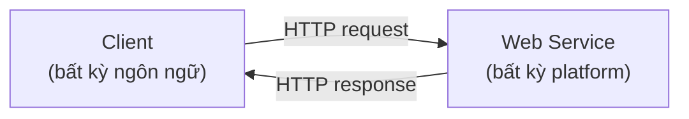
```mermaid
flowchart LR
  Client["Client\n(bất kỳ ngôn ngữ)"] -->|HTTP request| WS["Web Service\n(bất kỳ platform)"]
  WS -->|HTTP response| Client
```

**Figure 4.1.** Giao tiếp web service: client và service có thể khác ngôn ngữ, khác nền tảng.

---

## 4.2. SOAP

**SOAP** (*Simple Object Access Protocol*) là **giao thức message** dựa trên **XML**, chuẩn hóa bởi W3C [13] — không gắn cứng vào HTTP nhưng trong thực tế phần lớn triển khai dùng **HTTP POST** làm tầng chuyển tải. Mỗi message có **Envelope** bọc **Header** (tùy chọn, metadata) và **Body** (payload nghiệp vụ hoặc **Fault**). **Hợp đồng** thường mô tả bằng **WSDL** (*Web Services Description Language*) và kiểu dữ liệu bằng **XML Schema (XSD)**.

**Ưu điểm tổng quan:** kiểu chặt (XSD), tooling sinh **stub** từ WSDL, hệ tiêu chuẩn **WS-*** cho **bảo mật** (WS-Security), **địa chỉ hóa** (WS-Addressing), **tin cậy** / **giao dịch** trong hệ SOA doanh nghiệp; phù hợp **tài chính, y tế, chính phủ** — nơi cần kiểm chứng và tuân thủ.

**Nhược điểm tổng quan:** XML **verbose**, chi phí parse/serialize cao hơn JSON/Protobuf; cấu hình WS-* nặng; trình duyệt không “gọi SOAP” trực tiếp như REST; đội trẻ thường ưu REST/gRPC trừ khi có ràng buộc hợp đồng cũ.

Các tiểu mục dưới đây **song song** §4.3 REST, §4.4 GraphQL, §4.5 gRPC: stack, envelope/WSDL, luồng, lỗi, WS-*, vận hành.

### 4.2.1. Kiến trúc phân tầng (stack)

1. **Consumer** — ứng dụng hoặc **B2B**; thường dùng client sinh từ WSDL (Java JAX-WS / Jakarta XML WS, .NET WCF, v.v.).
2. **Transport** — gần như luôn **HTTPS**; có thể JMS, SMTP (ít gặp hiện nay).
3. **SOAP node** — engine parse envelope, xử lý header (bảo mật, định tuyến WS-Addressing), validate XSD, map tới operation.
4. **Tầng nghiệp vụ** — xử lý use case, giao dịch.
5. **Persistence / hệ thống khác** — DB, mainframe, MQ.

Trong **SOA** cổ điển, **ESB** (*Enterprise Service Bus*) đóng vai trò trung gian: định tuyến, transform, áp policy WS-*.

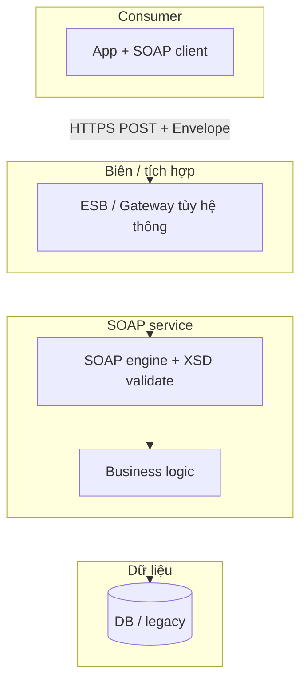
```mermaid
flowchart TB
  subgraph CL["Consumer"]
    APP[App + SOAP client]
  end
  subgraph EDGE["Biên / tích hợp"]
    ESB[ESB / Gateway tùy hệ thống]
  end
  subgraph SVC["SOAP service"]
    SOAP[SOAP engine + XSD validate]
    BL[Business logic]
  end
  subgraph DATA["Dữ liệu"]
    DB[(DB / legacy)]
  end
  APP -->|HTTPS POST + Envelope| ESB
  ESB --> SOAP --> BL --> DB
```

**Figure 4.19.** SOAP trong doanh nghiệp: consumer → (ESB) → SOAP engine → nghiệp vụ → dữ liệu.

### 4.2.2. Envelope, SOAP 1.1 và SOAP 1.2

**Envelope** là phần tử gốc; namespace thường gặp:

- **SOAP 1.1:** `http://schemas.xmlsoap.org/soap/envelope/`
- **SOAP 1.2:** `http://www.w3.org/2003/05/soap-envelope`

**Header:** entry tùy chọn — WS-Security token, correlation id, **WS-Addressing** (`MessageID`, `ReplyTo`, `Action`, `To`). Thuộc tính **`mustUnderstand="1"`** (1.1) / **`mustUnderstand="true"`** (1.2): nếu node không hiểu → **Fault** (không được bỏ qua im lặng).

**Body:** một block payload **document** hoặc **RPC** (ít dùng); nếu lỗi xử lý ứng dụng → thay/thêm **Fault** (1.1) hoặc **Fault** cấu trúc 1.2.

**MTOM** (*Message Transmission Optimization Mechanism*): gửi **binary** (ảnh, file) như **MIME multipart** + tham chiếu trong XML — tránh base64 phình toàn bộ message.

### 4.2.3. WSDL và hợp đồng (contract)

**WSDL** mô tả **trừu tượng** (message, operation) rồi **liên kết cụ thể** (binding, URL). Các phần chính (WSDL 1.1 — phổ biến trong tài liệu cũ):

| Phần | Vai trò |
|------|---------|
| **types** | Định nghĩa kiểu XML (thường tham chiếu **XSD**). |
| **message** | Tên và **parts** (phần của envelope body/header). |
| **portType** | Tập **operation** trừu tượng (input/output/fault). |
| **binding** | Ánh xạ portType sang **SOAP over HTTP** (style, use, transport URI). |
| **service** | **port** + địa chỉ endpoint (**SOAP address**). |

**Style / use:**

- **document/literal** — body chứa document XML đúng schema (phổ biến, thân thiện XSD).
- **rpc/literal** — wrapper theo tên operation (ít hơn).
- **rpc/encoded** (SOAP Encoding) — **tránh** dùng mới (khó interop).

**WSDL 2.0** dùng tên **`interface`** thay **portType**, **`endpoint`** thay **port** — ý tưởng tương đương.

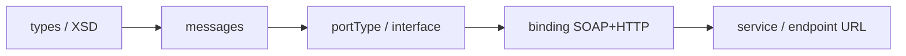
```mermaid
flowchart LR
  T[types / XSD] --> M[messages]
  M --> PT[portType / interface]
  PT --> B[binding SOAP+HTTP]
  B --> SV[service / endpoint URL]
```

**Figure 4.20.** Chuỗi hợp đồng WSDL: từ kiểu dữ liệu tới URL endpoint.

### 4.2.4. Vận chuyển HTTP và SOAPAction

Trên **HTTP**, request thường là **POST**; body = XML envelope. **SOAP 1.1** hay có header **`SOAPAction`** (URI chỉ ý định operation) — một số firewall/route dựa vào đó. **SOAP 1.2** có thể dùng **`action`** trong `Content-Type` (application/soap+xml) thay vì header riêng.

**HTTP response:** thường **200 OK** kể cả lỗi nghiệp vụ — chi tiết nằm trong **Fault** body (khác một số API REST dùng 4xx/5xx rõ); triển khai hiện đại đôi khi đồng bộ thêm mã HTTP — cần đọc tài liệu từng nền tảng.

### 4.2.5. Luồng request–response điển hình

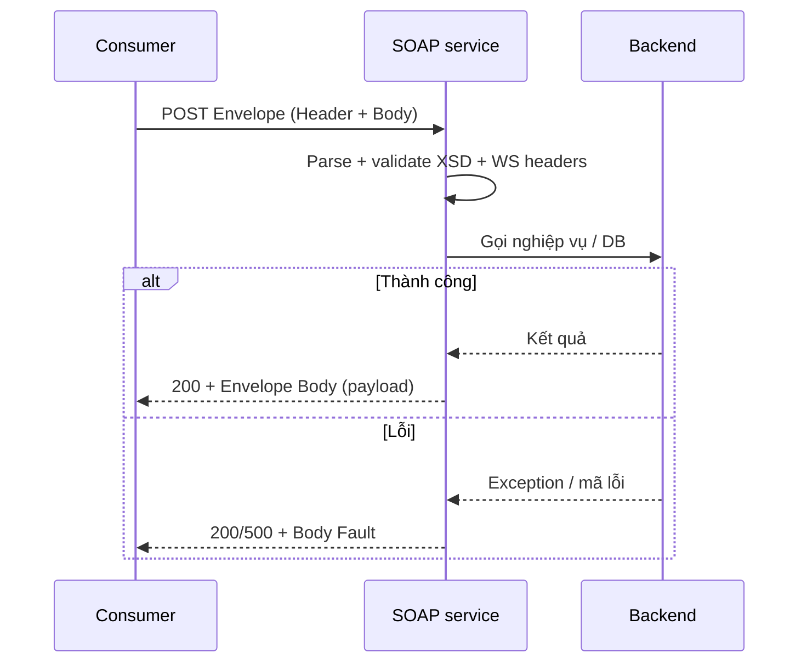
```mermaid
sequenceDiagram
  participant C as Consumer
  participant S as SOAP service
  participant D as Backend
  C->>S: POST Envelope (Header + Body)
  S->>S: Parse + validate XSD + WS headers
  S->>D: Gọi nghiệp vụ / DB
  alt Thành công
    D-->>S: Kết quả
    S-->>C: 200 + Envelope Body (payload)
  else Lỗi
    D-->>S: Exception / mã lỗi
    S-->>C: 200/500 + Body Fault
  end
```

**Figure 4.21.** Luồng SOAP: parse/validate → xử lý → response hoặc Fault.

**Ví dụ request (SOAP 1.1, body giản lược):**

```xml
<?xml version="1.0" encoding="UTF-8"?>
<soapenv:Envelope xmlns:soapenv="http://schemas.xmlsoap.org/soap/envelope/">
  <soapenv:Header/>
  <soapenv:Body>
    <GetUser xmlns="http://example.com/users">
      <userId>123</userId>
    </GetUser>
  </soapenv:Body>
</soapenv:Envelope>
```

**Ví dụ Fault (SOAP 1.1):**

```xml
<soapenv:Envelope xmlns:soapenv="http://schemas.xmlsoap.org/soap/envelope/">
  <soapenv:Body>
    <soapenv:Fault>
      <faultcode>soapenv:Server</faultcode>
      <faultstring>Không thể truy vấn người dùng</faultstring>
      <detail>
        <code>USER_DB_TIMEOUT</code>
      </detail>
    </soapenv:Fault>
  </soapenv:Body>
</soapenv:Envelope>
```

**SOAP 1.2 Fault** dùng các phần tử **`Code`** (Value + Subcode), **`Reason`**, **`Node`**, **`Role`**, **`Detail`** — cấu trúc chuẩn hóa hơn 1.1.

### 4.2.6. Mã Fault và phân loại lỗi

**SOAP 1.1** thường gặp: **`Client`** (sai message), **`Server`** (lỗi phía server), **`MustUnderstand`**, **`VersionMismatch`**. Chi tiết nghiệp vụ đặt trong **`detail`** (application-defined) để client phân biệt.

**Tương tác với WS-***: WS-Security có thể trả **Fault** chuyên biệt khi token sai hết hạn; WS-ReliableMessaging báo lỗi sequence — tất cả vẫn đi trong envelope XML.

### 4.2.7. Hệ tiêu chuẩn WS-* (tổng quan)

| Tiêu chuẩn (OASIS / W3C) | Ý nghĩa ngắn |
|--------------------------|--------------|
| **WS-Security** | Chữ ký XML, mã hóa, **UsernameToken**, **SAML** assertion trong header. |
| **WS-Addressing** | Địa chỉ hóa message: `To`, `Action`, `MessageID`, `ReplyTo` — tách khỏi transport. |
| **WS-Policy** | Mô tả yêu cầu bảo mật / reliable gắn WSDL. |
| **WS-ReliableMessaging** | Gửi bảo đảm thứ tự / không mất (ít triển khai mới so với message queue hiện đại). |
| **WS-Transaction / Coordination** | Giao dịch phân tán 2PC-style (phức tạp; nhiều hệ thống chuyển sang **Saga** / event). |

Không phải dự án nào cũng bật đủ; **stack WS-*** tăng chi phí vận hành và khóa vào sản phẩm middleware (IBM, Oracle, Microsoft, v.v.).

### 4.2.8. XSD, validation và interoperability

**XSD** định nghĩa phần tử, kiểu, `minOccurs`/`maxOccurs`, `choice`, `extension` — client và server **cùng schema** (hoặc tương thích phiên bản). Validator XML có thể chạy **trước** khi vào nghiệp vụ.

**Interop:** khác namespace, style document vs rpc, hoặc SOAP 1.1 vs 1.2 dễ gây lỗi — cần **profile** (ví dụ **WS-I Basic Profile**) khi tích hợp đa vendor.

### 4.2.9. Công cụ và vận hành

**SoapUI**, **Postman** (import WSDL), **Wireshark** / log HTTP để xem envelope. **Contract-first:** viết WSDL/XSD rồi sinh code; **code-first:** annotation sinh WSDL (tùy stack). **Quan sát:** log **MessageID** (WS-Addressing), không log mật khẩu/token đầy đủ; version WSDL (`?wsdl` hoặc URI versioned).

### 4.2.10. Best practices, anti-pattern và checklist

**Nên:** ưu tiên **document/literal** + XSD rõ; SOAP 1.2 nếu greenfield trong hệ W3C; MTOM cho binary; WS-Security khi policy yêu cầu; kiểm thử interop với consumer thật.

**Anti-pattern:** rpc/encoded; chia sẻ type mơ hồ không XSD; envelope khổng lồ không stream; bật WS-* không dùng tới; **200 OK** mọi thứ nhưng Fault không nhất quán khiến client khó xử lý.

**Checklist thực hành:** WSDL + XSD versioned; `mustUnderstand` chỉ cho header thật sự bắt buộc; TLS end-to-end; test Fault + timeout; giới hạn kích thước message / attachment; tài liệu hóa SOAPAction / Content-Type theo phiên bản SOAP.

---

## 4.3. REST

**REST** (*Representational State Transfer*) là **phong cách kiến trúc** do Roy Fielding đề xuất (luận án 2000) [11]: dùng **HTTP** làm giao thức, định danh **resource** bằng **URI**, và thao tác bằng **phương thức** chuẩn — không phải một chuẩn IETF đóng gói như SOAP hay một runtime như GraphQL.

**Sáu ràng buộc:** **Client–Server**, **Stateless** (mỗi request mang đủ ngữ cảnh; server không “nhớ” phiên như trạng thái server-side session cổ điển), **Cacheable**, **Uniform Interface** (URI + verb + representation nhất quán), **Layered System** (client không phân biệt trực tiếp tới server cuối hay qua proxy/gateway), **Code on Demand** (tùy chọn).

**Ưu điểm tổng quan:** đơn giản, JSON/XML đọc được, **cache theo URL** với `GET`, hệ sinh thái **OpenAPI**, phù hợp API công khai và tích hợp browser.

**Nhược điểm tổng quan:** **over-fetching** / **under-fetching** so với nhu cầu màn hình; không có “giao dịch phân tán” hay WS-* tích hợp sẵn — phải thiết kế **idempotency**, **bù giao dịch**, bảo mật ở tầng ứng dụng.

Các tiểu mục dưới đây **song song** cách trình bày **§4.4 GraphQL** và **§4.5 gRPC**: stack, luồng request–response, representation, lỗi, cache, bảo mật, vận hành.

### 4.3.1. Kiến trúc phân tầng (stack)

1. **Client** — ứng dụng, SPA, mobile, partner; gửi HTTP request (headers + body tùy method).
2. **DNS / CDN / load balancer** — phân phối, TLS kết thúc (termination), WAF.
3. **API gateway** (tùy hệ thống) — auth, rate limit, routing tới service.
4. **HTTP server + router** — ánh xạ `METHOD + path` → handler (controller).
5. **Tầng nghiệp vụ** — service, transaction boundary.
6. **Persistence / hệ thống khác** — DB, queue, gọi nội bộ REST/gRPC.

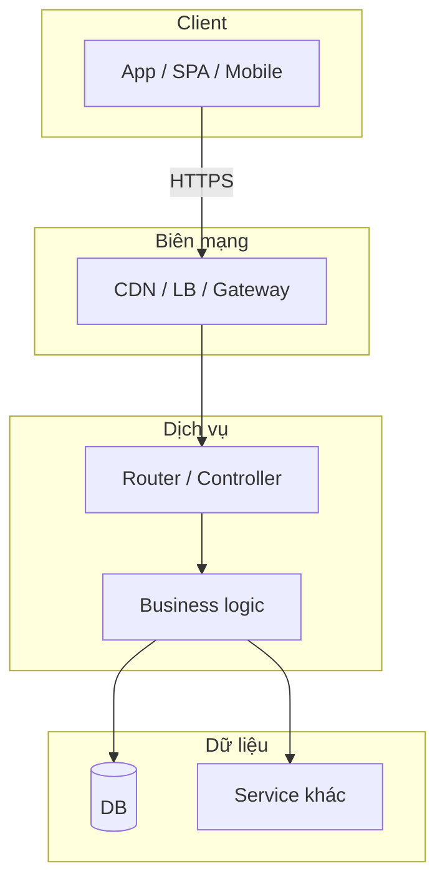
```mermaid
flowchart TB
  subgraph CL["Client"]
    APP[App / SPA / Mobile]
  end
  subgraph EDGE["Biên mạng"]
    LB[CDN / LB / Gateway]
  end
  subgraph SVC["Dịch vụ"]
    R[Router / Controller]
    BL[Business logic]
  end
  subgraph DATA["Dữ liệu"]
    DB[(DB)]
    EXT[Service khác]
  end
  APP -->|HTTPS| LB --> R --> BL
  BL --> DB
  BL --> EXT
```

**Figure 4.16.** REST: request đi qua biên mạng tới router/controller, nghiệp vụ, rồi persistence hoặc gọi ngoài.

### 4.3.2. Resource, URI và độ “RESTful” (Richardson)

- **Resource** được đặt tên bằng **danh từ**, thường **số nhiều**: `/users`, `/orders`. Một thực thể: `/users/123` hoặc `/users/{id}` — tránh động từ trong path kiểu `/getUser` (mùi **RPC trên HTTP**).
- **Quan hệ:** nhúng hoặc query — `/users/123/orders` (đơn giản) hoặc `/orders?userId=123` (tách khối); chọn thống nhất trong toàn API.

**Mức trưởng thành Richardson** (hay dùng trong giảng dạy): **Level 0** — một URL, một method; **Level 1** — nhiều resource; **Level 2** — đúng **HTTP verb** + **mã trạng thái**; **Level 3** — **HATEOAS** (liên kết trong representation dẫn bước tiếp theo). Nhiều API thực tế dừng ở **Level 2**; HATEOAS dùng khi client cần **khám phá** luồng động.

| Method | Ý nghĩa điển hình | An toàn (safe) | Lũy đẳng (idempotent) |
|--------|-------------------|----------------|------------------------|
| `GET` | Đọc representation | Có | Có |
| `HEAD` | Giống GET, không body | Có | Có |
| `POST` | Tạo mới / kích hoạt tác vụ | Không | Không (trừ thiết kế idempotent) |
| `PUT` | Thay thế toàn bộ resource | Không | Có |
| `PATCH` | Cập nhật một phần | Không | Có thể (tùy server) |
| `DELETE` | Xóa | Không | Có |

**Safe:** không được làm đổi trạng thái server theo ý nghĩa nghiệp vụ (vẫn có thể ghi log). **Idempotent:** gọi lặp với cùng input cho **cùng kết quả hiệu dụng** — quan trọng cho **retry** và proxy.

### 4.3.3. Luồng request–response

Một **transaction HTTP** điển hình: mở kết nối (thường **TLS**), gửi request line + headers (+ body), nhận status + headers + body. **GET** thường **không body**; **POST/PUT/PATCH** mang representation (JSON).

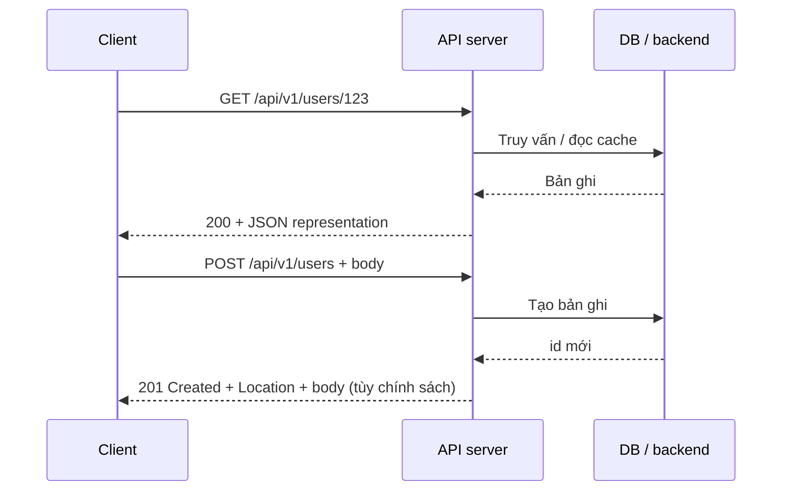
```mermaid
sequenceDiagram
  participant C as Client
  participant S as API server
  participant D as DB / backend
  C->>S: GET /api/v1/users/123
  S->>D: Truy vấn / đọc cache
  D-->>S: Bản ghi
  S-->>C: 200 + JSON representation
  C->>S: POST /api/v1/users + body
  S->>D: Tạo bản ghi
  D-->>S: id mới
  S-->>C: 201 Created + Location + body (tùy chính sách)
```

**Figure 4.17.** Luồng đọc (`GET` 200) và tạo (`POST` 201 + `Location`).

**Ví dụ thô (HTTP/1.1):**

```http
GET /api/v1/users/123 HTTP/1.1
Host: api.example.com
Accept: application/json

HTTP/1.1 200 OK
Content-Type: application/json

{
  "id": 123,
  "name": "Nguyen Van A",
  "email": "a@example.com"
}
```

### 4.3.4. Representation và thương lượng nội dung (content negotiation)

**Representation** là “bản sao trạng thái” resource tại một thời điểm — thường **JSON**; có thể XML, HAL, JSON-LD. Client gửi **`Accept`**, server trả **`Content-Type`**; nếu không hỗ trợ → **406 Not Acceptable** (ít gặp nếu API chỉ JSON).

**HATEOAS (Level 3):** trong JSON có thêm `_links` / `href` tới hành động kế tiếp — client ít hard-code URL. Phức tạp hơn cho client generator; nhiều đội dùng **OpenAPI** cố định path thay thế một phần HATEOAS.

### 4.3.5. Mã trạng thái và định dạng lỗi

Dùng **mã HTTP đúng ngữ nghĩa** giúp client, CDN và middleware xử lý thống nhất.

| Mã | Tình huống gợi ý |
|----|------------------|
| **200 OK** | GET/PUT/PATCH thành công có body |
| **201 Created** | POST tạo resource; nên có **`Location`** trỏ tới URI mới |
| **204 No Content** | Thành công, không body (xóa, cập nhật tùy chính sách) |
| **400 Bad Request** | Sai cú pháp JSON, thiếu field bắt buộc |
| **401 Unauthorized** | Chưa xác thực (thiếu/không hợp lệ token) |
| **403 Forbidden** | Đã xác thực nhưng không đủ quyền |
| **404 Not Found** | Resource không tồn tại (hoặc ẩn theo chính sách bảo mật) |
| **409 Conflict** | Xung đột trạng thái (version, unique constraint) |
| **422 Unprocessable Entity** | Đúng cú pháp nhưng vi phạm nghiệp vụ (phổ biến trong API thực tế) |
| **429 Too Many Requests** | Rate limit — nên kèm **`Retry-After`** |
| **500 Internal Server Error** | Lỗi server; không lộ stack trace cho client không tin cậy |

**RFC 7807** (*Problem Details for HTTP APIs*): media type **`application/problem+json`** — object có `type`, `title`, `status`, `detail`, `instance` để lỗi **thống nhất** giữa các endpoint (thay vì mỗi nơi một JSON lỗi khác nhau).

```json
{
  "type": "https://api.example.com/problems/validation",
  "title": "Validation failed",
  "status": 422,
  "detail": "email must be a valid address",
  "instance": "/requests/req-9f3a"
}
```

### 4.3.6. Cache và điều kiện (conditional requests)

**Ưu điểm lớn của REST + GET:** cache **theo URL** tại browser, CDN, reverse proxy.

- **`Cache-Control`:** `max-age`, `private` / `public`, `no-store` cho dữ liệu nhạy cảm.
- **`ETag`:** “fingerprint” representation; client gửi **`If-None-Match`** → server trả **304 Not Modified** (tiết kiệm băng thông) hoặc **200** body mới.
- **`Last-Modified` + `If-Modified-Since`:** tương tự, độ chính xác theo giây.

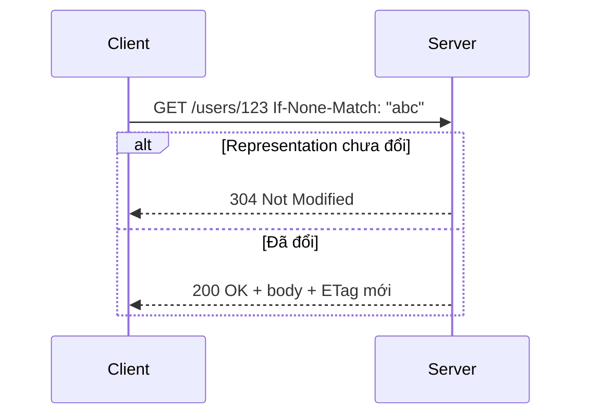
```mermaid
sequenceDiagram
  participant C as Client
  participant S as Server
  C->>S: GET /users/123 If-None-Match: "abc"
  alt Representation chưa đổi
    S-->>C: 304 Not Modified
  else Đã đổi
    S-->>C: 200 OK + body + ETag mới
  end
```

**Figure 4.18.** Conditional GET với ETag: tránh tải lại body khi không đổi.

**Lưu ý:** `POST` đổi dữ liệu nên **làm vô hiệu hóa** hoặc cập nhật cache liên quan (header hoặc chiến lược CDN); không cache nhầm response cá nhân như **public** chung URL.

### 4.3.7. Bảo mật, CORS và giới hạn tốc độ

- **TLS** bắt buộc trên mạng công cộng; **HSTS** trên domain API.
- **Xác thực:** Bearer **JWT**, **OAuth2** (opaque token qua introspection), hoặc **API key** — ưu tiên **header** (`Authorization`), tránh key trong query string (log/proxy lộ).
- **CORS:** browser chặn response cross-origin trừ khi server trả header `Access-Control-*`. Với request “không đơn giản” (JSON + custom header, v.v.), browser gửi **preflight `OPTIONS`** — API phải trả lời đúng method/header cho phép.
- **Rate limiting:** trả **429** + `Retry-After` hoặc header kiểu `X-RateLimit-*`; đồng bộ với gateway.

**An toàn khi retry:** thao tác **POST** thanh toán / đặt hàng phải **idempotent** phía server hoặc dùng **`Idempotency-Key`** (client gửi header UUID, server lưu kết quả lần đầu) — tránh trừ tiền hai lần khi timeout và gửi lại [1], [3].

### 4.3.8. Versioning, phân trang và lọc

- **Versioning:** **`/v1/users`** (rõ ràng, dễ route) so với header `Accept: application/vnd.example.v1+json` (URL “sạch” hơn nhưng kém nhìn log). **Breaking change** → tăng phiên bản hoặc path mới; không đổi ngầm hành vi `v1`.
- **Phân trang:** **`?page=2&limit=20`** (offset) đơn giản nhưng kém ổn định khi dữ liệu thay đổi; **`?cursor=...&limit=20`** (cursor / page token) ổn định hơn cho feed lớn.
- **Lọc / sắp xếp:** query params nhất quán — `?status=active&sort=created_at` — tránh overload một endpoint bằng quá nhiều nghĩa khác nhau.

### 4.3.9. OpenAPI, hợp đồng và quan sát

**OpenAPI** (Swagger): mô tả path, method, schema request/response, mã lỗi — sinh **client SDK**, **mock server**, kiểm thử contract. Quy trình **contract-first** hoặc **code-first** (annotation) tùy đội.

**Quan sát:** header **`X-Request-Id`** / **`traceparent`** xuyên suốt log; đo latency theo route; không log full PII/body production.

### 4.3.10. Best practices tóm tắt, anti-pattern và checklist

**Nên:** danh từ số nhiều; verb đúng ngữ nghĩa; mã HTTP nhất quán; `201` + `Location` khi tạo; lỗi có cấu trúc (problem+json); cache `GET` có chủ đích; versioning rõ.

**Anti-pattern:** path chứa động từ (`/createOrder`); mọi thứ **200** với `success: false` trong body; lộ **500** chi tiết nội bộ; thiếu pagination trên collection lớn; **public** cache cho response theo user.

**Checklist thực hành:** stateless + auth rõ; idempotency / `Idempotency-Key` cho POST nhạy cảm; TLS; CORS đúng preflight; rate limit; OpenAPI cập nhật khi đổi contract; conditional GET / CDN cho tài nguyên đọc nhiều.

---

## 4.4. GraphQL

**GraphQL** là **đặc tả** (spec) cho **ngôn ngữ truy vấn** và **runtime** thực thi truy vấn đó trên server — ban đầu do Facebook công bố (2015), nay do **GraphQL Foundation** quản lý. Khác REST (nhiều endpoint, cấu trúc response cố định theo resource), GraphQL thường có **một URL** (ví dụ `POST /graphql`); client gửi **chuỗi query** + **variables** (JSON) mô tả **cây trường** cần lấy; server trả **JSON** đúng hình dạng cây đó.

**Ưu điểm tổng quan:** giảm **over-fetching** (không lấy thừa trường) và **under-fetching** (một round-trip lấy đồ thị liên kết); **schema kiểu chặt** (SDL); **introspection** phục vụ công cụ (GraphiQL, codegen); phù hợp **mobile**, **dashboard**, **BFF** (Backend for Frontend).

**Nhược điểm tổng quan:** engine phía server phức tạp (**resolver**, tối ưu batch); **HTTP cache** theo URL khó áp dụng trực tiếp; rủi ro **query độc** (chi phí CPU/DB) nếu không giới hạn; **subscription** cần hạ tầng thêm (WebSocket, broker).

Các tiểu mục dưới đây tương đương cách trình bày **§4.5 gRPC**: kiến trúc, luồng thực thi, lỗi, bảo mật, cache, subscription và vận hành.

### 4.4.1. Kiến trúc phân tầng (stack)

1. **Client:** ứng dụng hoặc BFF gửi `query` / `mutation` / `subscription` (thường kèm `operationName`, `variables`).
2. **Transport:** gần như luôn **HTTP POST** với `Content-Type: application/json` (payload `{ "query": "...", "variables": { ... } }`); một số server hỗ trợ **GET** chỉ cho query ngắn (ít dùng production vì giới hạn URL).
3. **GraphQL engine:** **parser** → **validation** theo schema → **execution** — đi **theo cây** selection set, gọi **resolver** từng trường.
4. **Resolver layer:** hàm `(parent, args, context, info) => value` (hoặc tương đương) — ánh xạ trường schema sang DB, REST nội bộ, gRPC, v.v.
5. **Nguồn dữ liệu:** SQL, NoSQL, microservice — GraphQL **không** thay thế tầng lưu trữ; chỉ là **lớp truy cập** và **tổ chức hợp đồng** phía API.

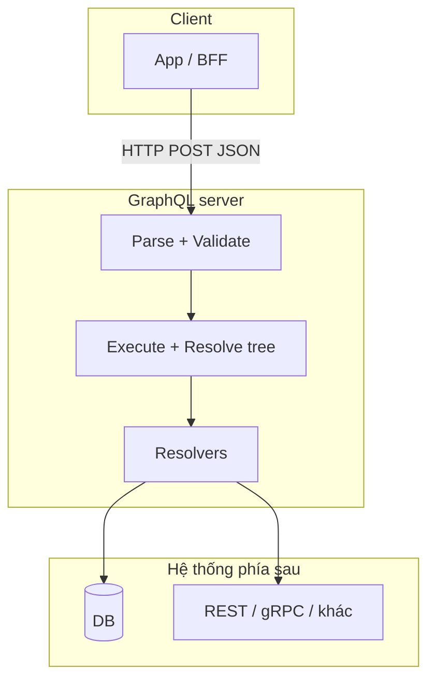
```mermaid
flowchart TB
  subgraph CL["Client"]
    APP[App / BFF]
  end
  subgraph GW["GraphQL server"]
    P[Parse + Validate]
    E[Execute + Resolve tree]
    R[Resolvers]
  end
  subgraph BE["Hệ thống phía sau"]
    DB[(DB)]
    API[REST / gRPC / khác]
  end
  APP -->|HTTP POST JSON| P --> E --> R
  R --> DB
  R --> API
```

**Figure 4.8.** Luồng tổng quát: client → engine GraphQL → resolver → nguồn dữ liệu.

**Khung HTTP/JSON:** body request thường là một object JSON gồm **`query`** (chuỗi document, bắt buộc), **`variables`** (object, tùy chọn — map giá trị cho `$tên` trong document), **`operationName`** (tùy chọn — khi một file có nhiều `query`/`mutation`/`subscription`, chỉ định operation nào chạy). Response chuẩn có **`data`** và/hoặc **`errors`**, có thể kèm **`extensions`**. **Lưu ý vận hành:** GraphQL spec không quy định cứng **mã HTTP**; nhiều triển khai trả **200** kể cả khi có `errors` (lỗi từng trường), dùng **400** cho lỗi cú pháp / validate toàn document, **401/403** cho xác thực — cần **thống nhất** trong tài liệu API và gateway để client xử lý đúng.

```json
{
  "query": "query Q($id: ID!) { user(id: $id) { name } }",
  "variables": { "id": "42" },
  "operationName": "Q"
}
```

Ví dụ **response** (thường vẫn **HTTP 200**) khi một nhánh resolver lỗi còn nhánh khác thành công: `user` trả được, trường `orders` trong schema kiểu **nullable** (`orders` có thể `null`) nên `data` vẫn tồn tại; mỗi phần tử `errors` có **`path`** chỉ vị trí lỗi trong cây (để client map vào UI). `locations` trỏ vị trí trong document (hữu ích cho GraphiQL).

```json
{
  "data": {
    "user": {
      "id": "42",
      "name": "Nguyễn A",
      "orders": null
    }
  },
  "errors": [
    {
      "message": "Timeout khi tải orders",
      "path": ["user", "orders"],
      "locations": [{ "line": 1, "column": 56 }],
      "extensions": { "code": "ORDER_SERVICE_TIMEOUT" }
    }
  ]
}
```

Nếu schema khai báo **`orders: [Order!]!`** (non-null) thì lỗi tại `orders` thường **lan lên** làm cả `user` hoặc `data.user` thành `null` theo quy tắc “bubble null” — hình dạng JSON đổi tùy engine; quan trọng là vẫn đọc song song **`errors[].path`**.

### 4.4.2. Schema, SDL và ba loại thao tác gốc

**Schema** định nghĩa **kiểu** (Object, Scalar, Enum, Input, Interface, Union) và **trường** có thể truy vấn. Viết bằng **SDL** (*Schema Definition Language*) — ví dụ:

- **`Query`:** chỉ đọc (theo quy ước không đổi dữ liệu).
- **`Mutation`:** thay đổi dữ liệu; thường trả về payload có `errors` + `data` từng phần nếu dùng partial success (tùy server).
- **`Subscription`:** luồng sự kiện theo thời gian — server **đẩy** cập nhật khi có sự kiện (cần WebSocket/SSE hoặc tương đương).

**Scalar chuẩn:** `Int`, `Float`, `String`, `Boolean`, `ID`. Có thể mở rộng scalar tùy chỉnh (URL, DateTime…) với parse/serialize thống nhất.

**Non-null:** `String!` — nếu resolver trả `null` → lỗi runtime tại trường đó (trừ khi toàn bộ operation fail theo chính sách).

Ví dụ SDL tối giản (hợp đồng phía server — resolver gắn vào từng trường khi triển khai):

```graphql
type Order {
  id: ID!
  total: Float
}
type User {
  id: ID!
  name: String!
  orders: [Order!]!
}
type Query {
  user(id: ID!): User
}
type Mutation {
  updateUser(id: ID!, name: String!): User
}
```

### 4.4.3. Luồng thực thi một operation (execution)

1. **Parse:** chuỗi query → AST; sai cú pháp → lỗi ngay.
2. **Validate:** mọi trường, đối số, fragment phải **khớp schema**; sai kiểu → không chạy resolver.
3. **Execute:** bắt đầu từ **root** (`Query`, `Mutation`, …); với mỗi trường trong selection, gọi **resolver** tương ứng; kết quả **ghép** thành cây JSON.
4. **Độ sâu:** truy vấn lồng `a { b { c } }` tạo **chuỗi resolver**; chi phí tổng = tổng chi phí từng tầng (dễ bùng nổ nếu không batch).
5. **Song song vs tuần tự (theo spec):** các trường **cùng một selection set** (cùng cấp trong cây) **có thể** được engine chạy **song song** — ảnh hưởng tới áp lực DB và cần giới hạn concurrency nếu cần. Ngược lại, nhiều **`mutation`** trong **cùng một document** phải được áp dụng **tuần tự** theo thứ tự xuất hiện — quan trọng khi thiết kế giao dịch và idempotency.

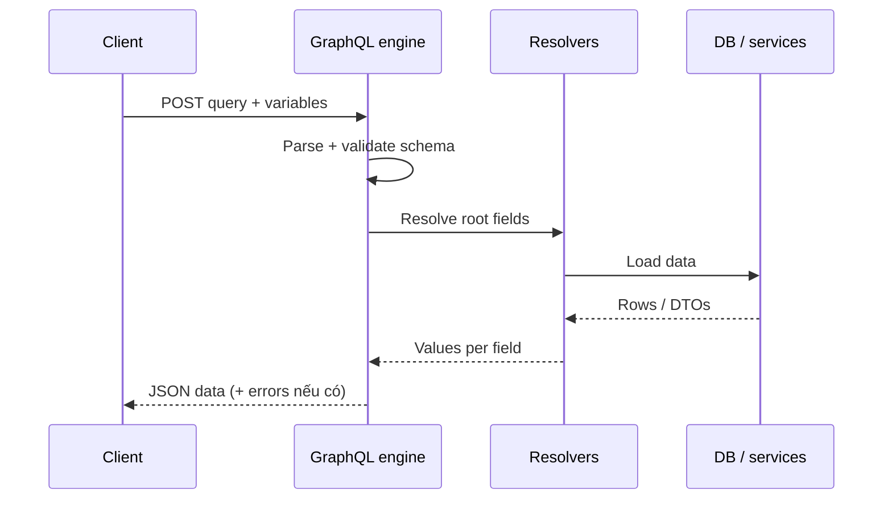
```mermaid
sequenceDiagram
  participant C as Client
  participant G as GraphQL engine
  participant R as Resolvers
  participant D as DB / services
  C->>G: POST query + variables
  G->>G: Parse + validate schema
  G->>R: Resolve root fields
  R->>D: Load data
  D-->>R: Rows / DTOs
  R-->>G: Values per field
  G-->>C: JSON data (+ errors nếu có)
```

**Figure 4.9.** Thực thi operation: parse → validate → resolve theo cây → JSON.

### 4.4.4. Resolver, context và N+1

Mỗi **trường** trên type có thể có resolver riêng; nếu không khai báo, engine dùng **default resolver** (đọc property cùng tên trên `parent`).

- **`parent`:** đối tượng cha sau khi resolve trường cha.
- **`args`:** đối số trong schema (`user(id: ID!)`).
- **`context`:** mỗi request một context — gắn **user đã xác thực**, **trace id**, **DataLoader registry** (tạo mới mỗi request để cache batch trong phạm vi request).
- **`info`:** AST node, đường dẫn trường — dùng cho tối ưu nâng cao.

**Vấn đề N+1:** query `users { orders { id } }` với 100 user — resolver `orders` naïve gọi DB **100 lần**. **DataLoader** (Facebook): trong một **tick** event loop, gom tất cả `userId` cần `orders` → **một** truy vấn `WHERE user_id IN (...)` (hoặc RPC batch). Cần implement **batch function** và **cache** trong request.

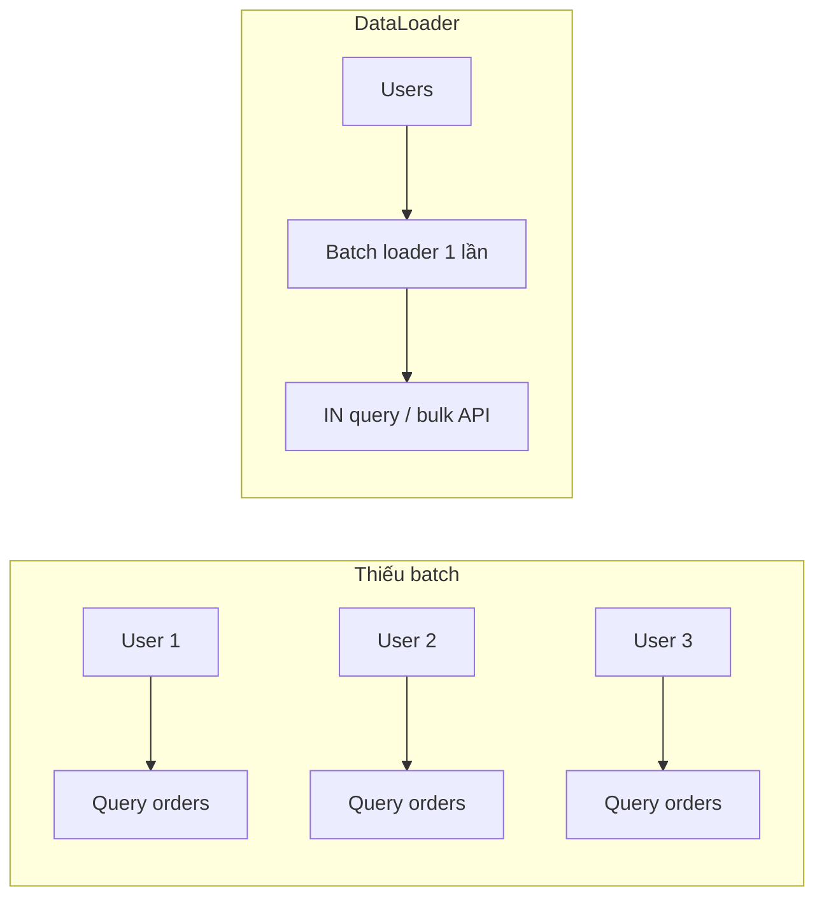
```mermaid
flowchart LR
  subgraph bad["Thiếu batch"]
    U1[User 1] --> Q1[Query orders]
    U2[User 2] --> Q2[Query orders]
    U3[User 3] --> Q3[Query orders]
  end
  subgraph good["DataLoader"]
    UX[Users] --> B[Batch loader 1 lần]
    B --> Q[IN query / bulk API]
  end
```

**Figure 4.10.** N+1 (nhiều truy vấn lặp) vs batch một lần qua DataLoader.

### 4.4.5. Biến, fragments và introspection

- **Variables:** `$id: ID!` trong query + `"variables": { "id": "123" }` — tránh nối chuỗi SQL-injection-style và cho phép **persisted query** (chỉ gửi hash).
- **Fragments:** tái sử dụng tập trường `fragment UserParts on User { id name }` — giảm trùng lặp; **fragment spread** vẫn chịu validate kiểu.
- **Introspection:** query đặc biệt `__schema`, `__type` — công cụ sinh client; **nên tắt trên production công khai** hoặc hạn chế IP để giảm lộ bề mặt API.

### 4.4.6. Lỗi, partial data và mở rộng

Theo spec, response thường có **`errors`** (mảng) và **`data`**:

- Một số trường lỗi → có thể vẫn có **`data` một phần** + `errors` chỉ rõ `path` tới trường lỗi.
- **`extensions`:** server thêm mã lỗi nội bộ, trace id (cẩn thận không lộ stack cho client không tin cậy).

**Mutation:** nên thiết kế **idempotent** khi cần (mutation key) và trả rõ **business error** trong payload hoặc union kết quả (`MutationResult = Success | Error`).

*(Ví dụ JSON request/response đầy đủ có `errors` + `path` nằm ở §4.4.1, ngay sau khung HTTP.)*

### 4.4.7. Bảo mật: độ sâu, độ phức tạp và phân quyền

- **Query depth limit:** giới hạn độ sâu lồng (ví dụ tối đa 10) — chống query sâu vô hạn.
- **Complexity / cost analysis:** mỗi trường gán “điểm chi phí”; tổng vượt ngưỡng → từ chối trước khi chạy resolver nặng.
- **Timeout:** giới hạn thời gian toàn operation.
- **Rate limit:** theo IP / token / chi phí query.
- **AuthZ từng trường:** trong resolver hoặc directive — user chỉ thấy trường được phép; **không** tin client “tự giới hạn” truy vấn.

### 4.4.8. Caching: client, CDN và HTTP

- **Normalized client cache (Apollo Client, Urql, …):** cache theo `__typename + id`, cập nhật khi mutation trả về id tương ứng — khác **cache GET theo URL** của REST.
- **Server-side:** khó dùng CDN cache toàn bộ `POST /graphql` vì body khác nhau; giải pháp: **GET + persisted queries**, **APQ** (Automatic Persisted Queries), hoặc tách **field có thể cache** sang REST/gRPC.
- **ETag / HTTP:** chỉ áp dụng hẹp (một số gateway hỗ trợ cache query cố định).

### 4.4.9. Subscription và real-time

Subscription có thể qua **WebSocket** hoặc **SSE** (*Server-Sent Events*). Luồng nghiệp vụ chung: client **đăng ký** một operation subscription → server giữ kênh → khi có sự kiện (DB trigger, message bus) **publish** payload về client.

**Kiến trúc scale-out:** cần **pub/sub** chung (Redis, Kafka, NATS) để nhiều instance GraphQL cùng nhận sự kiện; tránh trạng thái subscription chỉ nằm trên một pod.

#### WebSocket — giao thức graphql-ws

Gói **`graphql-ws`** (thegraphql.ws) là triển khai phổ biến hiện nay; khác **`subscriptions-transport-ws`** (legacy Apollo). Mỗi frame WebSocket là một JSON có ít nhất **`type`**; các operation đồng thời phân biệt bằng **`id`** (chuỗi do client gán).

| Hướng | `type` | Ý nghĩa |
|-------|--------|---------|
| C → S | `connection_init` | Mở phiên; `payload` tùy chọn (token, header metadata). |
| S → C | `connection_ack` | Chấp nhận phiên; sau bước này client mới gửi `subscribe`. |
| C ↔ S | `ping` / `pong` | Giữ sống kết nối, phát hiện đứt mạch (client hoặc server có thể gửi `ping`, bên kia trả `pong` — tùy cấu hình). |
| C → S | `subscribe` | Bắt đầu subscription: `id` + `payload` (document, `variables`, `operationName`). |
| S → C | `next` | Một “đợt” kết quả: `payload` thường giống body GraphQL HTTP (`{ "data": ... }`, có thể kèm `errors`). Có thể **nhiều** `next` cho cùng `id`. |
| S → C | `error` | Lỗi gắn với `id` (thường là mảng error objects). |
| C → S hoặc S → C | `complete` | Kết thúc stream của operation `id` — client hủy đăng ký hoặc server đóng (hết sự kiện / lỗi không hồi phục). |

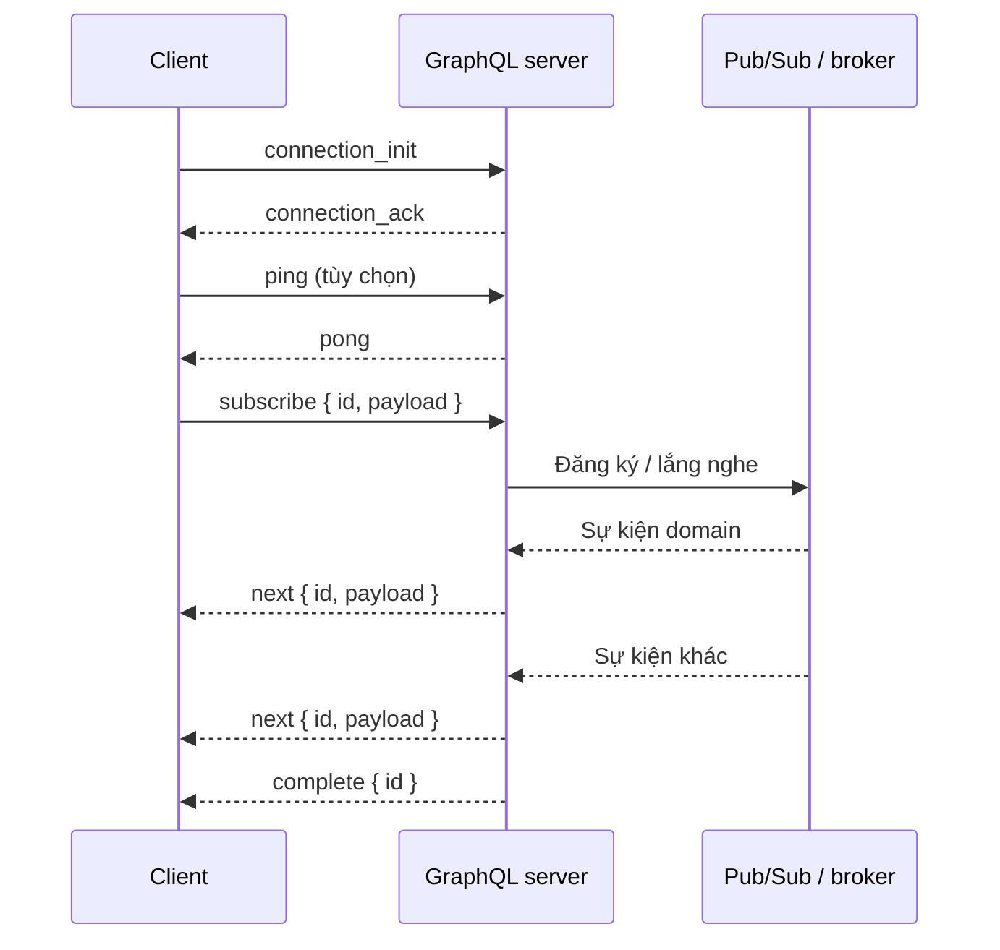
```mermaid
sequenceDiagram
  participant C as Client
  participant S as GraphQL server
  participant B as Pub/Sub / broker
  C->>S: connection_init
  S-->>C: connection_ack
  C->>S: ping (tùy chọn)
  S-->>C: pong
  C->>S: subscribe { id, payload }
  S->>B: Đăng ký / lắng nghe
  B-->>S: Sự kiện domain
  S-->>C: next { id, payload }
  B-->>S: Sự kiện khác
  S-->>C: next { id, payload }
  S-->>C: complete { id }
```

**Figure 4.11.** Chuỗi message graphql-ws: bắt tay → (ping/pong) → subscribe → nhiều `next` → `complete`.

#### SSE — một chiều trên HTTP

**SSE** dùng **một kết nối HTTP** (thường **GET** hoặc POST tùy server), header kiểu `Accept: text/event-stream`; server giữ kết nối và gửi **từng sự kiện** dạng chuỗi `data: ...\n\n`. Về **nghiệp vụ** giống WebSocket (một lần “đăng ký” rồi nhận nhiều payload), nhưng **chỉ server đẩy xuống** — không có khung `subscribe`/`next` riêng như graphql-ws; **ping/pong** không thuộc spec SSE (thường dùng **timeout / reconnect** phía client hoặc comment `retry:`).

```mermaid
sequenceDiagram
  participant C as Client
  participant S as GraphQL server
  C->>S: HTTP request (text/event-stream) + operation subscription
  S-->>C: 200 + stream mở
  loop Mỗi sự kiện
    S-->>C: data: {"data":{...}}
  end
  Note over C,S: Một chiều; đóng tab hoặc server kết thúc stream
```

**Figure 4.12.** Subscription qua SSE: một request HTTP, stream sự kiện liên tục (tương tự graphql-ws về luồng dữ liệu nhưng không hai chiều trên cùng kênh).

**Upload file:** thực tế thường dùng **GraphQL Multipart Request** (de-facto) — `multipart/form-data` kèm operations + map file; không nằm trong spec lõi nhưng cần biết khi thiết kế API có binary.

### 4.4.10. Federation, stitching và BFF

- **Schema stitching / federation:** gộp nhiều **subgraph** (microservice mỗi service giữ phần schema) thành **supergraph** — client một gateway; **Apollo Federation** là kiến trúc phổ biến (cần **router/gateway** và quy ước `@key`, `@requires`, `@external`).
- **BFF:** một lớp GraphQL **riêng cho từng client** (mobile vs web) gọi ngược REST/gRPC nội bộ — tránh ép mobile ăn API “chuẩn REST” không vừa màn hình.

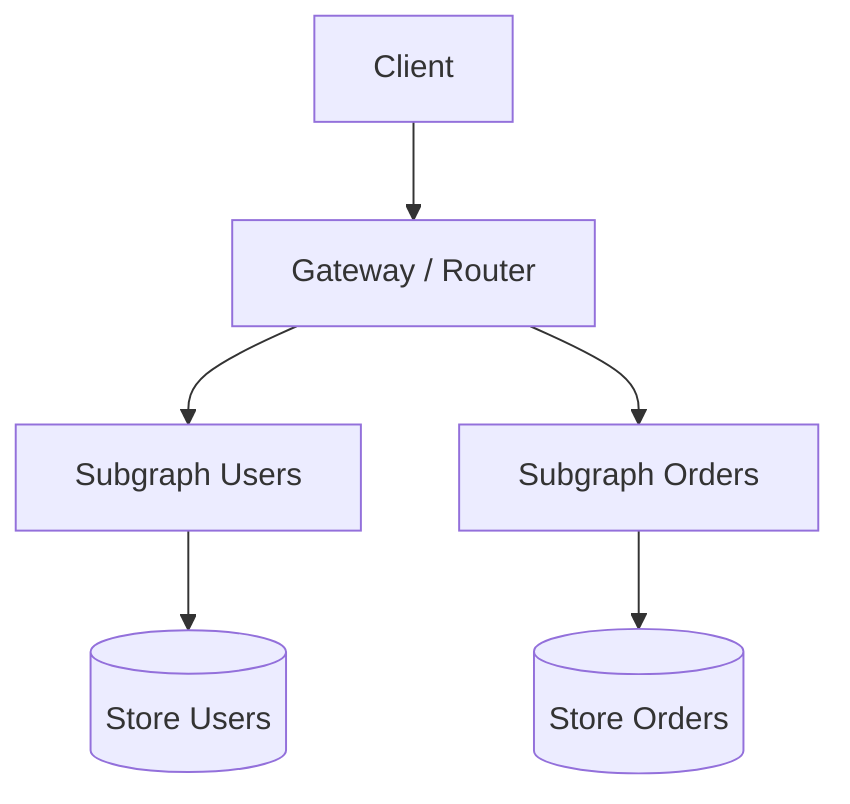
```mermaid
flowchart TB
  CL[Client] --> GW[Gateway / Router]
  GW --> U[Subgraph Users]
  GW --> O[Subgraph Orders]
  U --> DU[(Store Users)]
  O --> DO[(Store Orders)]
```

**Figure 4.13.** Federation: một truy vấn qua gateway có thể gọi nhiều subgraph rồi hợp nhất kết quả (router áp dụng `@key` / plan truy vấn).

### 4.4.11. Công cụ và codegen

**GraphiQL / Playground** — thử query tương tác. **ESLint GraphQL**, **graphql-codegen** — sinh TypeScript type từ schema. **Rover / Apollo Studio** — quản lý schema registry, kiểm tra breaking change (tương tự ý tưởng Buf với gRPC).

### 4.4.12. Khi nào dùng và anti-pattern

**Nên dùng khi:** nhiều client cần **hình dạng dữ liệu khác nhau**; cần **một round-trip** cho đồ thị; đội sẵn sàng đầu tư **resolver + giới hạn query**.

**Anti-pattern:** không giới hạn độ sâu/độ phức tạp; introspection mở public; resolver truy cập DB trực tiếp **không** batch; tin rằng GraphQL “tự cache HTTP”; mutation không rõ idempotent; federation không có governance (schema conflict).

```graphql
# Ví dụ query (đọc)
query UserWithOrders($uid: ID!) {
  user(id: $uid) {
    id
    name
    email
    orders(first: 5) {
      id
      total
    }
  }
}

# Ví dụ mutation
mutation RenameUser($id: ID!, $name: String!) {
  updateUser(id: $id, name: $name) {
    id
    name
  }
}

# Ví dụ subscription (chỉ minh họa — cần transport WebSocket/SSE)
subscription OnOrderCreated {
  orderCreated {
    id
    total
  }
}
```

**Checklist thực hành (tóm tắt):** depth + complexity + timeout; DataLoader hoặc batch tương đương; tắt/giới hạn introspection production; authn/authz trong context và resolver; **tài liệu hóa** quy ước HTTP status kèm `errors`; persisted queries nếu cần cache edge; subscription qua pub/sub khi scale ngang; upload file thì dùng multipart có kiểm tra kích thước/virus; theo dõi chi phí resolver (metrics theo field).

### 4.4.13. `@defer` và `@stream` (incremental delivery — nâng cao)

Đây là **mở rộng** (nhóm công việc *Incremental Delivery* trong cộng đồng GraphQL), không phải phần bắt buộc của spec lõi; từng **server + client** phải hỗ trợ cùng một **giao thức vận chuyển** (thường **HTTP multipart** hoặc tương đương: nhiều “phần” response nối tiếp).

- **`@defer`:** đánh dấu một **fragment hoặc nhánh trường** có thể trả **sau** phần đầu tiên. Client nhận **payload ban đầu** (nhánh deferred có thể vắng hoặc placeholder), rồi nhận thêm **patch incremental** khi nhánh đó resolve xong — giảm **TTFB** cho màn hình cần “khung” nhanh (header trang, skeleton).
- **`@stream`:** áp dụng cho trường **danh sách**; các phần tử (hoặc từng batch) có thể được đẩy **dần** thay vì chờ cả list — hữu ích list rất dài hoặc nguồn dữ liệu chậm.

**Hệ quả thiết kế:** client phải **merge** các phần incremental vào cây `data` (hoặc dùng thư viện đã hỗ trợ); **cache CDN / HTTP đơn giản** càng khó; cần **giới hạn độ phức tạp** tương tự query thường vì server vẫn chạy resolver cho từng phần.

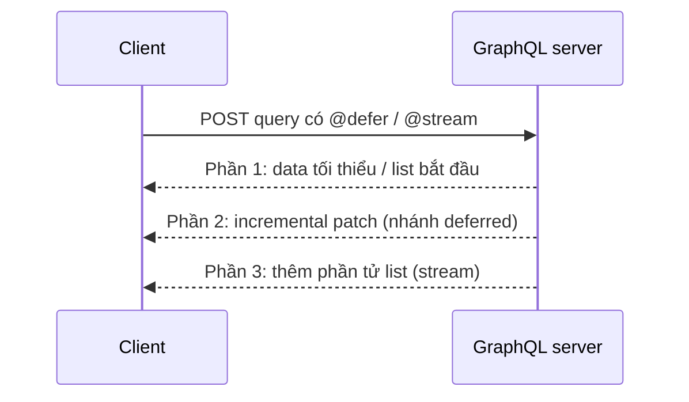
```mermaid
sequenceDiagram
  participant C as Client
  participant S as GraphQL server
  C->>S: POST query có @defer / @stream
  S-->>C: Phần 1: data tối thiểu / list bắt đầu
  S-->>C: Phần 2: incremental patch (nhánh deferred)
  S-->>C: Phần 3: thêm phần tử list (stream)
```

**Figure 4.14.** Ý tưởng incremental delivery: một request, nhiều phần response theo thời gian.

---

## 4.5. gRPC

**gRPC** là framework **RPC** (Remote Procedure Call) mã nguồn mở, ban đầu từ Google, dùng **Protocol Buffers** làm **IDL** (*interface definition language*) và **HTTP/2** làm tầng truyền tải. Khác REST “tài nguyên + HTTP verb”, gRPC mô hình hóa **lời gọi thủ tục** có tham số và kiểu trả về rõ ràng; hợp đồng nằm trong file `.proto`, trình biên dịch `protoc` (kèm plugin ngôn ngữ) sinh **stub** phía client và **skeleton** phía server — giảm lệch kiểu so với JSON “tự giải thích” bằng tài liệu ngoài.

**Ưu điểm tổng quan:** payload nhị phân nhỏ, **đa luồng** trên một kết nối TCP (HTTP/2), **streaming** bốn kiểu, kiểm tra kiểu mạnh lúc build, sinh code đồng bộ đa ngôn ngữ.

**Nhược điểm tổng quan:** không đọc payload bằng mắt; trình duyệt gốc không nói gRPC trực tiếp (cần **grpc-web** + proxy); đội phải quản lý phiên bản `.proto` và pipeline build.

Các tiểu mục dưới đây bóc tách **kiến trúc**, **luồng hoạt động** và **vận hành** — phần cần nắm khi thiết kế microservice nội bộ.

### 4.5.1. Kiến trúc phân tầng (stack)

Từ trên xuống dưới một lời gọi điển hình:

1. **Ứng dụng** — business logic gọi API sinh ra từ stub (ví dụ `blockingStub.getUser(req)`).
2. **gRPC API / Stubs** — lớp do `protoc` sinh; đóng gói serialize/deserialize.
3. **Runtime gRPC** — **channel** (kết nối logic tới endpoint), **interceptor** (logging, auth, metrics), **load balancing** phía client (tùy ngôn ngữ), **retry** (theo chính sách), **name resolution** (DNS, Kubernetes, Consul…).
4. **HTTP/2 framing** — nhiều RPC song song trên cùng connection; header nén (HPACK); flow control cấp stream.
5. **TLS** (khuyến nghị) — mã hóa; trong môi trường zero-trust thường dùng **mTLS** (client + server chứng chỉ).

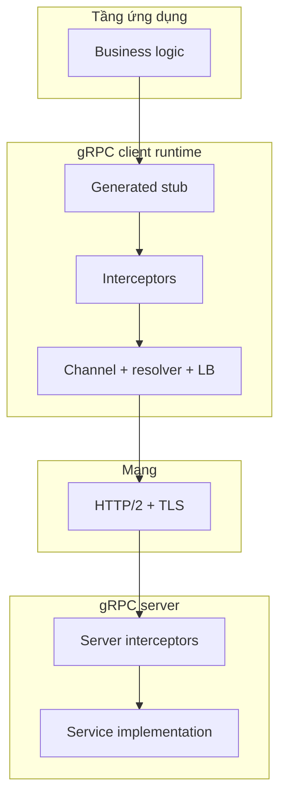
```mermaid
flowchart TB
  subgraph App["Tầng ứng dụng"]
    BL[Business logic]
  end
  subgraph GRPC["gRPC client runtime"]
    STUB[Generated stub]
    CH[Channel + resolver + LB]
    INT[Interceptors]
  end
  subgraph Wire["Mạng"]
    H2[HTTP/2 + TLS]
  end
  subgraph SRV["gRPC server"]
    SINT[Server interceptors]
    HD[Service implementation]
  end
  BL --> STUB --> INT --> CH --> H2
  H2 --> SINT --> HD
```

**Figure 4.4.** Kiến trúc tổng quát: ứng dụng → stub/runtime → HTTP/2 → server.

### 4.5.2. Hợp đồng: Protocol Buffers (`.proto`)

**Vai trò:** `.proto` là **nguồn sự thật** (single source of truth) cho tên dịch vụ, thủ tục, kiểu message và **số thứ tự trường** trên dây — độc lập ngôn ngữ lập trình.

- **Trường và số thứ tự:** **wire format** mã hóa theo **field number**, không theo tên biến trong code. **Không đổi số** trường đã phát hành; **không tái sử dụng** số đã dùng. Khi bỏ trường, khai báo `reserved` để tooling và người sau không “chiếm” lại số cũ — tránh client cũ gửi bytes mà server hiểu sai ngầm.
- **proto3:** scalar mặc định là zero value; phân biệt “không gửi” vs “gửi 0” bằng `optional` (khi toolchain hỗ trợ), `oneof`, hoặc **wrapper types** (`google.protobuf.StringValue`, …) / `google.protobuf.Timestamp` thay vì `int64` epoch nếu cần rõ nghĩa.
- **Kiểu thường dùng:** `string`, `bytes`, số có dấu/không, `enum` (luôn có giá trị 0), `repeated`, `map`, `oneof`, message lồng; `import` file chung để tái sử dụng message.
- **Service + `rpc`:** compiler sinh stub/skeleton; có biến thể **generic** (ví dụ gRPC-Golang generic API) nhưng hợp đồng vẫn từ `.proto`.
- **Phiên bản API:** `package` dạng `company.user.v1`; nên có repo **api** riêng, CI publish artifact `.proto` hoặc module generated — không copy tay giữa microservice.

**Tương thích:** client mới → server cũ: thêm trường mới (client gửi, server cũ bỏ qua unknown). Server mới → client cũ: trường mới không bắt buộc hoặc có default. **Đổi ý nghĩa** trường giữ nguyên số = breaking — phải nâng `v2`.

**Wire format (ý tưởng):** mỗi trường được mã hóa bằng **tag** (gồm **field number** và **wire type**) rồi đến **payload** — số nguyên nhỏ thường dùng **varint** (ít byte hơn cố định 8 byte); `string` / `bytes` / message lồng dùng kiểu **length-delimited**. Người đọc không cần nhớ từng bit nhưng cần biết: **đây là lý do Protobuf gọn hơn JSON text** và vì sao đổi số trường là thay đổi hợp đồng nhị phân.

### 4.5.3. gRPC trên HTTP/2: path, header và framing

Mỗi RPC dùng **một hoặc nhiều HTTP/2 stream** trên **kết nối TCP** (thường qua **TLS**).

- **`:method`:** luôn **`POST`** (kể cả thao tác “đọc”).
- **`:path`:** `/<fully.qualified.ServiceName>/<MethodName>` — ví dụ `/grpc.health.v1.Health/Check`. Tên dịch vụ = **package** (dấu chấm) + **tên service** trong `.proto`.
- **Content-Type:** `application/grpc` (thường `+proto`); edge có thể dùng transcoding sang JSON.
- **Metadata / trailer:** giống HTTP header; **trailer** mang **mã trạng thái gRPC** và message lỗi sau khi body xong.

**Framing message:** mỗi message Protobuf trong stream có tiền tố **5 byte**: **1 byte** cờ nén + **4 byte** độ dài (big-endian) + payload nhị phân. Streaming = **nhiều** khung liên tiếp trên cùng stream.

**Nén:** gzip/snappy theo từng message — đổi CPU lấy băng thông; tránh nén dữ liệu đã nén.

**HTTP/2:** multiplexing; HPACK; **flow control** stream + connection → **back-pressure**; phù hợp **east-west** trong DC; mobile vẫn dùng được nhưng cần deadline, giới hạn retry và kích thước.

### 4.5.4. Bốn kiểu RPC và ngữ nghĩa luồng

| Kiểu | Client gửi | Server trả | Ví dụ dùng |
|------|------------|------------|------------|
| **Unary** | 1 message | 1 message | CRUD đồng bộ, lệnh có kết quả một gói |
| **Server streaming** | 1 message | Nhiều message | Xuất dữ liệu lớn, đẩy log/sự kiện, “watch” |
| **Client streaming** | Nhiều message | 1 message | Upload theo chunk, gom batch phía client |
| **Bidirectional** | Stream | Stream | Relay, đồng bộ hai chiều, pipeline tương tác |

**Half-close:** một bên có thể **kết thúc gửi** (EOS) nhưng vẫn **nhận** — implementer streaming cần nắm để tránh **deadlock**. **Flow control** HTTP/2 giới hạn bộ đệm; consumer chậm → producer chậm theo (**back-pressure**).

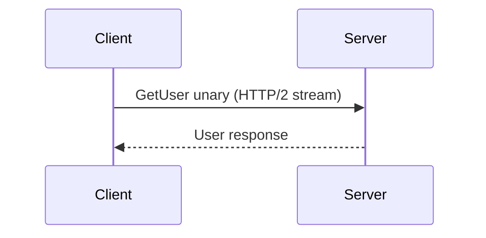
```mermaid
sequenceDiagram
  participant C as Client
  participant S as Server
  C->>S: GetUser unary (HTTP/2 stream)
  S-->>C: User response
```

**Figure 4.5.** Unary: một request — một response.

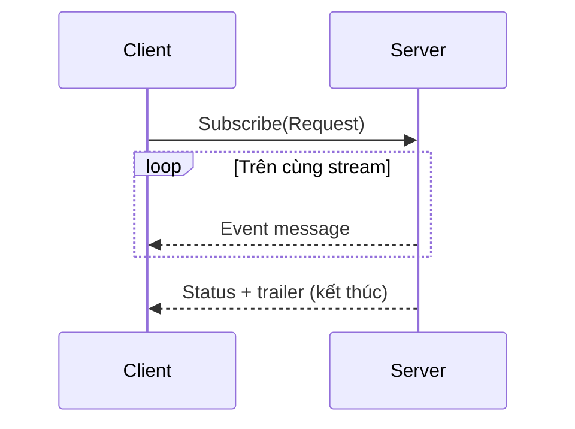
```mermaid
sequenceDiagram
  participant C as Client
  participant S as Server
  C->>S: Subscribe(Request)
  loop Trên cùng stream
    S-->>C: Event message
  end
  S-->>C: Status + trailer (kết thúc)
```

**Figure 4.6.** Server streaming: nhiều message nối tiếp trên một stream.

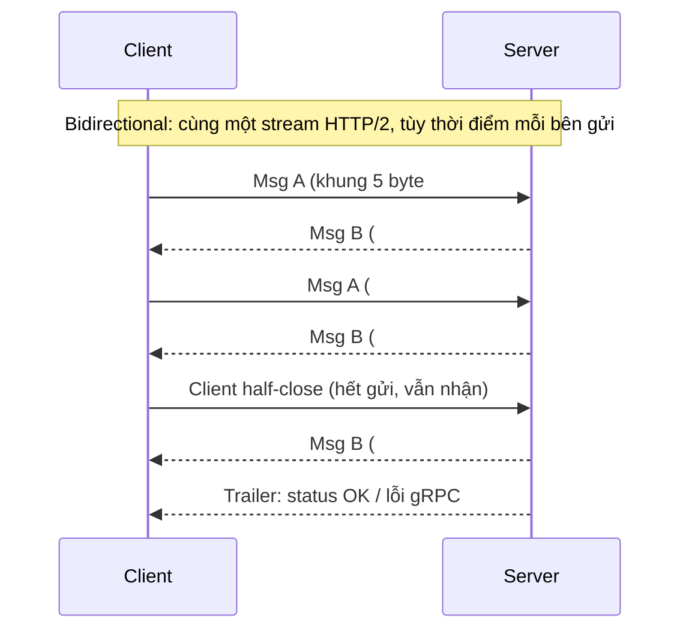
```mermaid
sequenceDiagram
  participant C as Client
  participant S as Server
  Note over C,S: Bidirectional: cùng một stream HTTP/2, tùy thời điểm mỗi bên gửi
  C->>S: Msg A (khung 5 byte #1)
  S-->>C: Msg B (#1)
  C->>S: Msg A (#2)
  S-->>C: Msg B (#2)
  C->>S: Client half-close (hết gửi, vẫn nhận)
  S-->>C: Msg B (#3)
  S-->>C: Trailer: status OK / lỗi gRPC
```

**Figure 4.15.** Bidirectional streaming: hai chiều xen kẽ trên một stream; **half-close** cho phép client ngừng gửi nhưng server vẫn đẩy message (tránh deadlock nếu cả hai chờ nhau).

### 4.5.5. Channel, stub, deadline, hủy và metadata

1. **Channel:** kết nối **lâu dài** tới `target` (DNS, IP, hoặc scheme đặc biệt); bên dưới có **subchannel** / pool tới nhiều backend sau **name resolution**.
2. **Stub:** gọi RPC qua channel; gắn **credentials** (TLS, token per-call).
3. **Bước gửi:** serialize message → khung 5 byte → **DATA** HTTP/2; **HEADER** chứa metadata (`grpc-timeout`, `authorization`, trace…).
4. **Server:** interceptor (auth, logging, trace) → handler ứng dụng → trả response + **trailer** status.

**Deadline:** đặt **trên mỗi RPC** hoặc context kế thừa; hết hạn → **`DEADLINE_EXCEEDED`** và **cancellation** có thể lan xuống server để dừng truy vấn/tính toán — giảm **cascade failure** khi không chờ vô hạn [5].

**Metadata:** chuẩn hóa key (auth, trace `traceparent`, tenant); đồng bộ **OpenTelemetry**; tránh log đầy đủ token/PII.

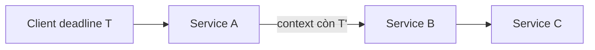
```mermaid
flowchart LR
  A[Client deadline T] --> B[Service A]
  B -->|context còn T'| C[Service B]
  C --> D[Service C]
```

**Figure 4.7.** Truyền **ngân sách thời gian** xuyên chuỗi gọi; không reset deadline vô hạn ở mỗi hop.

### 4.5.6. Interceptors (middleware RPC)

**Client / server interceptor** là chuỗi hàm bọc lời gọi: inject JWT, đo latency, retry có điều kiện, chuyển panic → `INTERNAL`, gắn span. **Thứ tự** interceptor quan trọng (auth trước/sau logging). Streaming interceptor phức tạp hơn unary (nhiều `onMessage`).

### 4.5.7. Name resolution, cân bằng tải, proxy và mesh

- **Resolver:** `dns:///…` hoặc plugin Kubernetes/Consul → danh sách backend; cập nhật khi pod scale.
- **Client-side LB:** round-robin, pick_first, v.v. — ít hop hơn LB tập trung nhưng client phải nhận cập nhật địa chỉ.
- **Sidecar (Envoy, Linkerd):** TLS, retry, outlier detection; ứng dụng gọi **localhost** → mesh ra cluster.
- **Retry:** ưu tiên với **`UNAVAILABLE`** và thủ tục **idempotent**; không retry vô hạn `INVALID_ARGUMENT` / ghi không lũy thừa.

### 4.5.8. Mô hình lỗi và mã trạng thái

| Mã | Gợi ý dùng |
|----|------------|
| `OK` | Thành công |
| `CANCELLED` | Client đóng / deadline |
| `UNKNOWN` | Lỗi chưa phân loại (hạn chế dùng) |
| `INVALID_ARGUMENT` | Tham số sai |
| `DEADLINE_EXCEEDED` | Hết thời gian |
| `NOT_FOUND` / `ALREADY_EXISTS` | Resource |
| `PERMISSION_DENIED` / `UNAUTHENTICATED` | Ủy quyền |
| `RESOURCE_EXHAUSTED` | Quota / rate limit |
| `UNAVAILABLE` | Lỗi tạm, có thể thử lại |
| `INTERNAL` | Lỗi server, không lộ chi tiết ra ngoài |

**Rich error:** `google.rpc.Status` + `repeated google.protobuf.Any details` (ví dụ `BadRequest` field violations) để client xử lý máy.

### 4.5.9. Bảo mật: TLS, mTLS, metadata

**TLS 1.2+** với **ALPN** (HTTP/2). **mTLS** cho service-to-service (zero trust); tích hợp **SPIFFE/SPIRE** hoặc CA nội bộ. Token **OAuth2/JWT** trong metadata; rotate key; không tin `user_id` từ client chưa qua xác thực.

### 4.5.10. grpc-web, gateway và transcoding

**grpc-web** + proxy (Envoy, grpcwebproxy), **CORS**; mode text/base64 cho HTTP/1.1. **gRPC-Gateway:** annotation `google.api.http` trong `.proto` → REST + OpenAPI. **Envoy gRPC-JSON transcoder** (filter): client gửi **JSON** qua HTTP, edge **chuyển** thành message Protobuf rồi gọi **gRPC** tới cluster nội bộ (và ngược lại khi trả response).

#### Ánh xạ JSON ↔ Protobuf (proto3 JSON mapping)

Gateway/transcoder không “đoán” tùy ý: chúng bám **quy ước ánh xạ JSON chính thức** của Protobuf (proto3) — cùng quy tắc với `google.protobuf.util.JsonFormat` (Java), `MessageToJson` (C++), v.v. Điểm cần nhớ khi thiết kế API REST phía ngoài và `.proto` nội bộ:

| Khía cạnh | Quy ước JSON |
|-----------|----------------|
| Tên trường | **lowerCamelCase** từ `snake_case` trong `.proto` (ví dụ `display_name` → `displayName`). |
| `message` | Một object JSON. |
| `repeated` | Mảng. |
| `map<K,V>` | Object JSON (key luôn là **chuỗi**). |
| `int32`, `bool`, `float`, … | Số / boolean / … theo JSON thông thường. |
| `int64`, `uint64`, `fixed64`, `sfixed64` | Trong JSON thường là **chuỗi số** để tránh mất chính xác trong JavaScript (`Number`). |
| `bytes` | **Base64** (chuỗi). |
| `enum` | Tên symbolic (chuỗi) hoặc số — tùy cấu hình; gateway thường chấp nhận cả hai khi parse. |
| `google.protobuf.Timestamp` | Chuỗi **RFC3339** (ví dụ `2025-03-23T10:00:00Z`). |
| `google.protobuf.Duration` | Chuỗi dạng `3.5s`, `1ns`, v.v. |
| Giá trị mặc định (scalar) | Khi **serialize** ra JSON, trường có giá trị default thường **bị bỏ qua** (omitted) — client REST không thấy key đó. |
| `oneof` / wrapper | Chỉ trường nhánh đang set mới xuất hiện; `StringValue` map sang object hoặc null tùy kiểu. |

**Ví dụ** (khớp `User` minh họa §4.5.14): request/response qua gateway có thể là:

```json
{
  "id": "1001",
  "name": "Nguyễn B",
  "email": "b@example.com"
}
```

Trong `.proto`, `id` là `int64` — trên dây gRPC vẫn là **Protobuf nhị phân**; chỉ lớp **gateway** (HTTP JSON) dùng dạng chuỗi cho `int64` theo mapping.

**Lưu ý tích hợp:** nếu client (JS) tự build JSON tay, phải dùng **camelCase** và **chuỗi cho int64**; sai mapping → `INVALID_ARGUMENT` hoặc parse lỗi tại transcoder. **gRPC-Gateway** ngoài body còn map **path / query** vào trường message qua option `google.api.http` — vẫn deserialize thành Protobuf trước khi vào handler.

### 4.5.11. Vận hành: health, reflection, metrics

**`grpc.health.v1`:** `Check` / `Watch` cho Kubernetes. **Reflection:** chỉ môi trường tin cậy (grpcurl/grpcui). **Metrics:** histogram theo method, rate theo status; **logging:** method, latency, trace id — không log full payload production.

### 4.5.12. Toolchain, Buf và quản trị phiên bản

**protoc** + plugin ngôn ngữ; CI sinh code. **Buf:** lint + **breaking change** so baseline; registry lưu `.proto`. Breaking → package **`v2`**, không sửa ngầm `v1`.

### 4.5.13. Hiệu năng, giới hạn và chống lạm dụng

Giới hạn **kích thước message** (mặc định vài MB — tùy runtime); file lớn → **chunk** streaming. Giới hạn **stream đồng thời** / **MAX_CONCURRENT_STREAMS**. **Keepalive** HTTP/2 — cấu hình sai có thể bị firewall cắt. **Rate limit** → `RESOURCE_EXHAUSTED` hoặc gateway.

### 4.5.14. Khi nào dùng, tổ hợp kiến trúc và anti-pattern

**Nên:** RPC nội bộ, đa ngôn ngữ, streaming, payload lặp. **Tổ hợp:** REST công khai + gRPC mesh nội bộ; GraphQL BFF gọi gRPC. **Anti-pattern:** không deadline; retry ghi không idempotent; reflection public; message khổng lồ unary; đổi nghĩa field giữ số; lộ `INTERNAL` chi tiết cho client.

```protobuf
// user.proto — ví dụ hợp đồng (v1)
syntax = "proto3";
package company.user.v1;

service UserService {
  rpc GetUser(GetUserRequest) returns (User);
  rpc ListUsers(ListUsersRequest) returns (stream User);
}

message GetUserRequest {
  int64 id = 1;
}

message ListUsersRequest {
  int32 page_size = 1;
  string page_token = 2;
}

message User {
  int64 id = 1;
  string name = 2;
  string email = 3;
}
```

**Best practices tóm tắt:** luôn có **deadline**; ưu tiên **TLS/mTLS** giữa service; version rõ trong `package`/tên service; giới hạn kích thước message và thời gian xử lý streaming; interceptor cho auth và observability; không retry mù quáng các thủ tục **không idempotent**.

---

## 4.6. So sánh và lựa chọn

**Bảng 4.1.** So sánh bốn dạng web service.

| Tiêu chí | SOAP | REST | GraphQL | gRPC |
|----------|------|------|---------|------|
| Giao thức / framing | XML/HTTP | JSON/HTTP | JSON + HTTP POST (thường); subscription: WS/SSE | Protobuf + khung 5 byte trên HTTP/2 |
| Mô hình API | Operation (SOAP) | Resource + verb | Cây truy vấn + schema SDL | RPC + `.proto` |
| Hiệu năng | Thấp | Trung bình | Phụ thuộc resolver / N+1 | Cao |
| Đọc được bằng mắt | Khó (XML dài) | Dễ (JSON) | Dễ (query + JSON) | Không (nhị phân) |
| Type safety | Mạnh (XSD) | Yếu | Mạnh (schema) | Rất mạnh (proto) |
| HTTP cache URL | Hạn chế | Thuận lợi (GET) | Khó (POST động) | Không (POST) |
| Browser support | Hạn chế | Đầy đủ | Đầy đủ | Hạn chế |
| Streaming | WS-* | Không native | Subscription (+ hạ tầng) | Có (4 kiểu) |
| Phù hợp | Enterprise, tài chính | API công khai, web | BFF, mobile, dashboard | Nội bộ microservices |

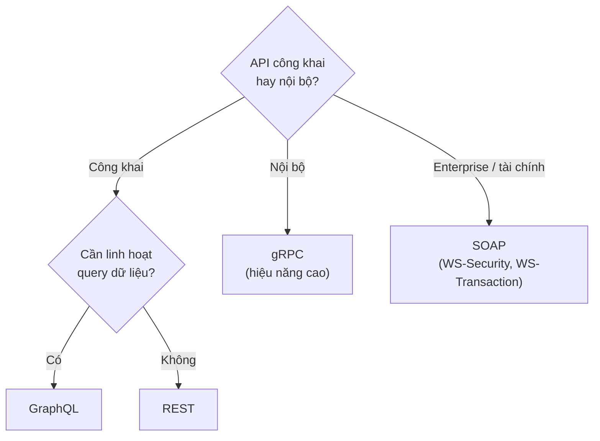
```mermaid
flowchart TB
  Q1{"API công khai\nhay nội bộ?"}
  Q1 -->|Công khai| Q2{"Cần linh hoạt\nquery dữ liệu?"}
  Q1 -->|Nội bộ| gRPC["gRPC\n(hiệu năng cao)"]
  Q2 -->|Có| GraphQL["GraphQL"]
  Q2 -->|Không| REST["REST"]
  Q1 -->|Enterprise / tài chính| SOAP["SOAP\n(WS-Security, WS-Transaction)"]
```

**Figure 4.2.** Sơ đồ quyết định chọn loại web service.

**Lưu ý thực tế:** nhiều hệ thống **kết hợp** nhiều dạng: REST cho API công khai, gRPC cho giao tiếp nội bộ giữa microservices, GraphQL cho BFF (Backend for Frontend) phục vụ mobile. Không cần chọn "một và chỉ một".

---

## 4.7. Lịch sử phát triển

```mermaid
flowchart LR
  S1["1998–2005\nSOAP/XML\n(Enterprise SOA)"] --> S2["2000–nay\nREST\n(Fielding, Web APIs)"]
  S2 --> S3["2015–nay\nGraphQL\n(Facebook)"]
  S2 --> S4["2015–nay\ngRPC\n(Google)"]
```

**Figure 4.3.** Dòng thời gian phát triển web services: SOAP (1998) → REST (2000) → GraphQL, gRPC (2015).

---

## 4.8. Câu hỏi ôn tập

1. Nêu bốn đặc điểm cốt lõi của web services. Tại sao "loosely coupled" quan trọng?
2. So sánh SOAP và REST về cấu trúc message, hiệu năng, và tình huống phù hợp.
3. GraphQL giải quyết vấn đề gì mà REST gặp phải? Nêu ưu và nhược điểm (gợi ý: over/under-fetching, resolver, cache).
4. Khi nào nên chọn gRPC thay vì REST cho giao tiếp giữa các microservice?
5. Thiết kế RESTful API cho hệ thống quản lý hồ sơ người dùng (CRUD): liệt kê các endpoint, HTTP method, và mã response.
6. Giải thích tại sao nhiều hệ thống thực tế **kết hợp** REST + gRPC + GraphQL thay vì chọn một.
7. Mô tả cấu trúc **khung tin 5 byte** của mỗi message gRPC trên stream HTTP/2. HTTP/2 **flow control** liên quan thế nào tới back-pressure?
8. Phân biệt mã **`DEADLINE_EXCEEDED`** và **`UNAVAILABLE`**. Trong trường hợp nào **retry** ở tầng client/mesh là hợp lý?
9. Vì sao gRPC dùng **`:method` POST** cho cả thao tác đọc dữ liệu? So sánh ngắn với idempotent **GET** của REST.
10. Mô tả các bước **parse → validate → execute** của GraphQL. `context` dùng để làm gì trong resolver?
11. **N+1** là gì? DataLoader giải quyết bằng cách nào? Nêu thêm hai cơ chế chống query độc (ngoài batch).
12. Vì sao **HTTP cache** theo URL khó áp dụng trực tiếp cho `POST /graphql`? Kể một giải pháp thay thế (persisted queries, client normalized cache, v.v.).
13. Vì sao nhiều server trả **HTTP 200** dù response có `errors`? Với **federation**, gateway xử lý thế nào khi một subgraph lỗi và subgraph khác vẫn trả dữ liệu?
14. Phân biệt **safe** và **idempotent** với `GET`, `POST`, `PUT`, `DELETE`. Khi nào nên trả **201** và header **`Location`**?
15. **ETag** và **`If-None-Match`** hoạt động thế nào? Lợi ích so với luôn trả **200** kèm body đầy đủ?
16. **CORS preflight** (`OPTIONS`) xảy ra khi nào? API cần cấu hình header nào tối thiểu?
17. Mô tả cấu trúc **SOAP Envelope** (Header, Body, Fault). **`mustUnderstand`** có tác dụng gì?
18. Liệt kê các phần chính của **WSDL 1.1** và sự khác biệt **document/literal** so với **rpc/encoded**.
19. **MTOM** dùng để làm gì? Kể hai tiêu chuẩn **WS-*** và vai trò tóm tắt của mỗi cái.

---

*Figure 4.1–4.21 | Bảng 4.1 | Xem thêm: Phần III, Chương 5 (Client-Server), Chương 7 (Broker), Chương 12 (Microservices Patterns).*
