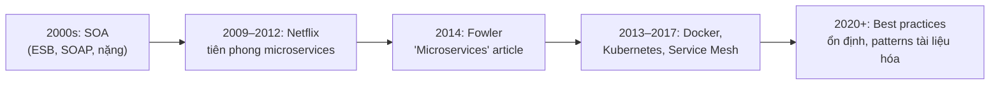
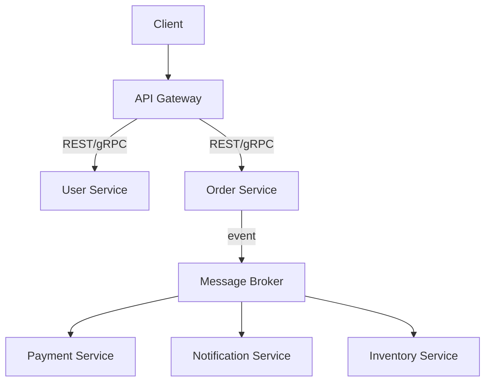
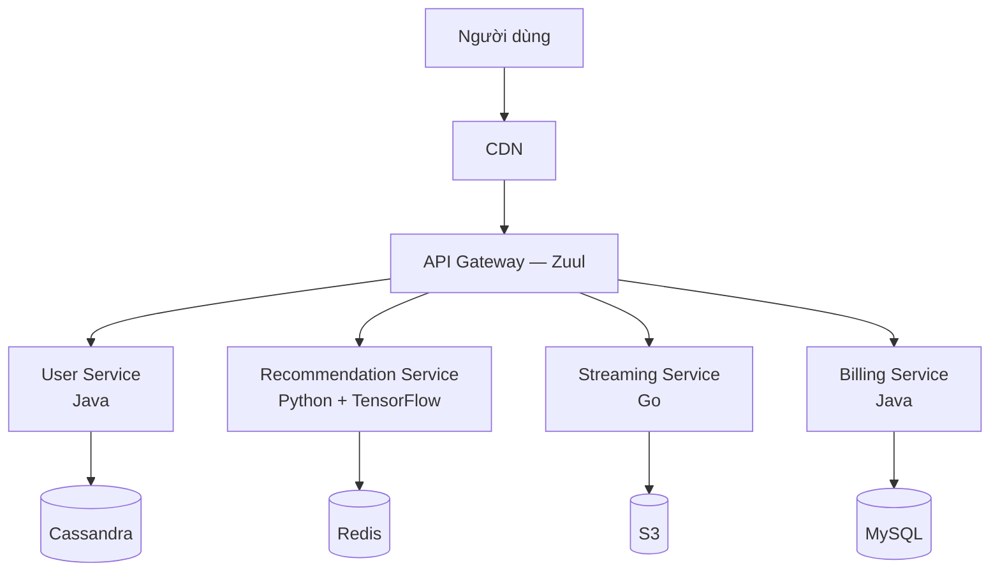

# Chương 5. Microservices

Microservices không phải là "điều mới mẻ tuyệt đối" — ý tưởng chia hệ thống thành các thành phần nhỏ, triển khai độc lập đã tồn tại từ thời SOA (Service-Oriented Architecture). Nhưng sự trưởng thành của container (Docker, 2013), orchestration (Kubernetes, 2014), và hạ tầng đám mây đã biến ý tưởng đó thành một phong cách kiến trúc (*architectural style*) được hàng nghìn tổ chức áp dụng — từ Netflix, Amazon, Uber đến các startup quy mô vừa. Chương này trình bày định nghĩa, nguyên lý, đặc điểm, các communication pattern, thách thức và best practices của microservices, đặt nền tảng cho phần mẫu chi tiết hơn trong sách Chương 3 (Chương 12 — Microservices Patterns).

---

## 5.1. Định nghĩa và nguồn gốc

### 5.1.1. Định nghĩa

**Microservices Architecture** là một phong cách kiến trúc trong đó ứng dụng được xây dựng như một tập hợp các **service nhỏ, độc lập**, mỗi service chịu trách nhiệm cho một **business capability** cụ thể, có thể được **triển khai độc lập** và giao tiếp qua **mạng** bằng các giao thức nhẹ [5].

Newman [5] viết: *"Microservices are independently deployable services modeled around a business domain."* Fowler bổ sung: mỗi service chạy trong **tiến trình riêng** (*own process*), giao tiếp bằng **cơ chế nhẹ** — thường là HTTP/REST hoặc message queue [16]. Richards và Ford [4] nhấn mạnh: các service có **coupling rất thấp** (*highly decoupled*) và được mô hình hóa quanh **miền nghiệp vụ** (*business domain*) thay vì chia theo tầng kỹ thuật.

### 5.1.2. Từ SOA đến Microservices

**Figure 5.1.** Lịch sử phát triển: từ SOA nặng nề đến microservices hiện đại.

SOA thập niên 2000 đã đề xuất chia ứng dụng thành service, nhưng bị **Enterprise Service Bus (ESB)** phức tạp hóa — logic nghiệp vụ dần "rò rỉ" vào ESB, tạo ra bottleneck tập trung. Microservices khắc phục bằng cách: (1) loại bỏ ESB tập trung, thay bằng "dumb pipes, smart endpoints"; (2) mỗi service sở hữu database riêng; (3) tận dụng container và CI/CD để triển khai nhanh.

**Cạm bẫy “microservice giả”:** **distributed monolith** — nhiều service triển khai riêng nhưng **deploy phải đồng bộ**, **schema DB dùng chung**, hoặc mọi thay đổi đều kéo theo họp liên đội — hưởng hết chi phí vận hành phân tán mà không được độc lập thật [5], [6]. Phát hiện sớm bằng metric: tần suất **coordinated release**, số lượng **breaking change** API chéo, và liệu team có thể **một mình** đưa service lên production trong một ngày.

---

## 5.2. Bảy nguyên lý cốt lõi

Newman [5] đúc kết bảy nguyên lý xuyên suốt thiết kế microservices:

1. **Mô hình hóa quanh miền nghiệp vụ** (*modeled around business domain*): service đại diện cho một business capability (Order, Payment, User), không chia theo tầng kỹ thuật (UI, Logic, Data). Domain-Driven Design (DDD) và **bounded context** giúp xác định ranh giới service.

2. **Triển khai độc lập** (*independent deployment*): deploy một service mà không cần phối hợp với các service khác, không cần "coordinated release". Netflix deploy hơn 1.000 lần/ngày nhờ nguyên lý này.

3. **Ẩn chi tiết triển khai** (*hide implementation details*): service chỉ lộ API, ẩn toàn bộ nội bộ — database, thư viện, cấu trúc code. **Database per service**: mỗi service sở hữu data store riêng, không chia sẻ database với service khác.

4. **Phi tập trung hóa mọi thứ** (*decentralize everything*): dữ liệu phi tập trung (mỗi service giữ data riêng), quản trị phi tập trung (mỗi đội tự quyết công nghệ), quyết định phi tập trung.

5. **Cô lập lỗi** (*isolate failure*): lỗi ở một service không lan sang service khác. Kỹ thuật: **Circuit Breaker** (ngắt kết nối khi service đích liên tục lỗi), **Bulkhead** (cách ly tài nguyên), **Graceful Degradation** (giảm chức năng thay vì sập hoàn toàn).

6. **Có khả năng quan sát cao** (*highly observable*): centralized logging (ELK Stack), distributed tracing (Jaeger, Zipkin, OpenTelemetry), metrics và monitoring (Prometheus, Grafana). Với hàng trăm service, không thể debug bằng cách "đọc log trên từng máy".

7. **Tự động hóa** (*automation*): CI/CD pipeline cho từng service, infrastructure as code, automated testing (unit, integration, contract, end-to-end).

---

## 5.3. Đặc điểm chính

### 5.3.1. Tính độc lập toàn diện

Mỗi microservice độc lập trên sáu khía cạnh:

| Khía cạnh | Ý nghĩa | Ví dụ |
|-----------|---------|-------|
| Development | Codebase riêng, repo riêng | User Service repo, Order Service repo |
| Deployment | Deploy bất kỳ lúc nào | Deploy User Service v2 không ảnh hưởng Order Service |
| Scaling | Scale riêng theo nhu cầu | Scale Payment Service 10x, User Service 2x |
| Technology | Chọn ngôn ngữ/framework tối ưu | User Service (Java), ML Service (Python) |
| Team | Mỗi đội sở hữu service | Payment team, Order team (Conway's Law) |
| Failure | Lỗi cô lập | Payment down → vẫn browse sản phẩm |

### 5.3.2. Technology Diversity (Polyglot)

Mỗi service có thể dùng ngôn ngữ, framework và database khác nhau — gọi là **polyglot programming** và **polyglot persistence**. Chẳng hạn, User Service dùng Java + PostgreSQL; Recommendation Service dùng Python + TensorFlow + Redis; Search Service dùng Go + Elasticsearch. Lợi ích: chọn công cụ tốt nhất cho từng bài toán. Rủi ro: tăng chi phí vận hành và đào tạo — cần cân nhắc kỹ trước khi áp dụng quá nhiều ngôn ngữ.

### 5.3.3. So sánh Monolithic vs. Microservices

**Bảng 5.1.** So sánh hai phong cách kiến trúc.

| Tiêu chí | Monolithic | Microservices |
|----------|-----------|---------------|
| Triển khai | Cả ứng dụng cùng lúc | Từng service độc lập |
| Mở rộng | Vertical (toàn bộ ứng dụng) | Horizontal (từng service) |
| Công nghệ | Một stack | Nhiều stack (polyglot) |
| Database | Một DB chung | Database per service |
| Chịu lỗi | Một lỗi → cả hệ dừng | Fault isolation |
| Phức tạp | Code đơn giản, vận hành đơn giản | Code phân tán, vận hành phức tạp |
| Phù hợp | MVP, đội nhỏ, nghiệp vụ đơn giản | Quy mô lớn, nhiều đội, yêu cầu HA |

---

## 5.4. Communication Patterns

### 5.4.1. Đồng bộ: REST và gRPC

Giao tiếp request-response trực tiếp giữa hai service. REST phù hợp cho API công khai; gRPC phù hợp cho nội bộ (xem Chương 4). Nhược điểm: tạo **runtime coupling** — service A phải chờ service B phản hồi; nếu B chậm hoặc sập, A bị ảnh hưởng.

### 5.4.2. Bất đồng bộ: Message Queue và Event Bus

Service gửi message/event vào broker (RabbitMQ, Kafka), service khác tiêu thụ khi sẵn sàng. Ưu điểm: **temporal decoupling** (producer không cần biết consumer có đang chạy không), tăng resilience. Nhược điểm: eventual consistency, khó debug hơn, cần xử lý message ordering.

### 5.4.3. Hybrid

Thực tế, hầu hết hệ thống microservices dùng **cả hai**: đồng bộ cho thao tác cần phản hồi tức thời (tra cứu giá, xác thực), bất đồng bộ cho thao tác nền (gửi email, xử lý thanh toán, cập nhật cache).

**Figure 5.2.** Kết hợp giao tiếp đồng bộ (API Gateway → Service) và bất đồng bộ (Event qua Message Broker).

---

## 5.5. Thách thức và cách giải quyết

### 5.5.1. Nhất quán dữ liệu

Mỗi service có database riêng → không thể dùng một transaction SQL truyền thống. Giải pháp: **Saga Pattern** (chuỗi giao dịch cục bộ + compensating transaction) và **Eventual Consistency** (chấp nhận dữ liệu tạm thời không đồng bộ, hội tụ sau).

**Hợp đồng và tiến hóa schema:** *database per service* kéo theo **phiên bản hóa API** và **consumer-driven contract** (Pact, v.v.): consumer xác định kỳ vọng; provider không được phá âm thầm. Với event, cần **schema registry** (Avro/Protobuf/JSON Schema) và chiến lược **tương thích ngược** (*backward compatible*) — thêm field tùy chọn thay vì đổi nghĩa field cũ [3], [5]. Ford *et al.* [6] mô tả các kiểu **tách / gộp dữ liệu** (*split*, *join*) như bài toán kiến trúc “phần cứng” khi đổi ranh giới — không chỉ là refactor mã.

### 5.5.2. Distributed tracing

Một request từ client có thể đi qua 5–10 service. Khi có lỗi, cần **tracing** xuyên suốt: mỗi request mang một **correlation ID** (hay trace ID); tất cả log và metrics đều gắn ID đó. Công cụ: OpenTelemetry, Jaeger, Zipkin.

### 5.5.3. Service discovery và load balancing

Service liên tục được tạo/hủy (auto-scaling, rolling update). Cần **service registry** (Consul, Eureka) hoặc **DNS nội bộ** (Kubernetes) để các service tự tìm nhau. Load balancing: client-side (Ribbon) hoặc server-side (NGINX, Envoy).

### 5.5.4. Quản lý cấu hình

Hàng trăm service, mỗi service có config riêng (database URL, API key, feature flag). Giải pháp: **centralized config** (Spring Cloud Config, HashiCorp Vault, Kubernetes ConfigMap/Secret).

### 5.5.5. Testing

Kiểm thử microservices khó hơn monolithic: cần **unit test** cho logic service, **contract test** (Pact) cho API contract giữa các service, **integration test** cho luồng end-to-end. Testing pyramid vẫn áp dụng nhưng lớp integration test trở nên quan trọng hơn.

---

## 5.6. Khi nào nên và không nên dùng microservices

**Nên dùng khi:**
- Hệ thống lớn, nhiều đội phát triển (>5 đội) cần độc lập.
- Yêu cầu mở rộng linh hoạt (từng phần hệ thống scale khác nhau).
- Yêu cầu triển khai liên tục (continuous deployment).
- Miền nghiệp vụ phức tạp, có thể chia thành bounded context rõ ràng.

**Không nên dùng khi:**
- MVP hoặc startup giai đoạn đầu — overhead vận hành quá lớn.
- Đội nhỏ (<5 người) — lợi ích triển khai độc lập không bù đắp chi phí phức tạp.
- Miền nghiệp vụ chưa rõ ràng — chia sai ranh giới service khó sửa hơn chia sai module.
- Hệ thống không cần scale từng phần riêng.

**Lưu ý:** nhiều tổ chức thành công áp dụng chiến lược **"monolith first"** — bắt đầu với kiến trúc monolithic, tách dần thành microservices khi hiểu rõ miền nghiệp vụ và khi nhu cầu mở rộng thực sự xuất hiện.

**Strangler fig và ranh giới:** khi tách, pattern **strangler** (proxy/API gateway điều hướng dần traffic sang service mới) giảm rủi ro *big bang* — liên hệ với kiến trúc tiến hóa trong sách Chương 1. Mỗi “dải” traffic chuyển sang microservice nên kèm **định nghĩa xong** (SLO, rollback, feature flag) thay vì chỉ cắt DNS [4], [10].

---

## 5.7. Ví dụ thực tế: Netflix

Netflix vận hành hơn **700 microservice**, xử lý hàng tỷ request/ngày. Một số dấu mốc kiến trúc:

- **2008:** Monolithic, database Oracle duy nhất. Sự cố database sập → toàn bộ dịch vụ dừng 3 ngày.
- **2009–2012:** Bắt đầu chuyển sang microservices trên AWS. Mỗi service có database riêng (Cassandra, MySQL, Redis).
- **2013–2016:** Hoàn thành migration. Phát triển các công cụ open-source: **Eureka** (service discovery), **Zuul** (API gateway), **Hystrix** (circuit breaker), **Ribbon** (client-side load balancing).
- **2020+:** >1.000 deploy/ngày. Auto-scaling từng service theo nhu cầu thực tế. Chaos engineering (Chaos Monkey) kiểm tra resilience hàng ngày.

**Figure 5.3.** Kiến trúc microservices của Netflix (đơn giản hóa): mỗi service có database riêng, polyglot, API Gateway (Zuul) là điểm vào duy nhất.

---

## 5.8. Câu hỏi ôn tập

1. Định nghĩa microservices theo Newman [5] và Fowler [16]. Hai điểm chung quan trọng nhất là gì?
2. Nêu bảy nguyên lý cốt lõi của microservices. Giải thích nguyên lý "database per service" và lý do tại sao nó quan trọng.
3. So sánh Monolithic và Microservices trên ít nhất năm tiêu chí. Khi nào monolithic vẫn là lựa chọn tốt?
4. Giải thích "Circuit Breaker" và "Graceful Degradation". Cho ví dụ trong hệ thống e-commerce.
5. Tại sao distributed tracing quan trọng trong microservices? Nêu ít nhất hai công cụ hỗ trợ.
6. Một startup 3 người muốn xây hệ thống bán hàng online. Bạn khuyên dùng microservices hay monolith? Giải thích.

---

*Figure 5.1–5.3 | Bảng 5.1 | Xem thêm: Phần III, Chương 12 (Microservices Patterns — Saga, Sidecar, Circuit Breaker).*
