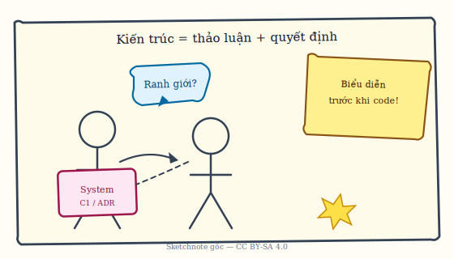

# Chương 1. Giới thiệu

Cuốn sách này được biên soạn trong bối cảnh môn học **ITEC2313 — Kiến trúc phần mềm**, dành cho chương trình đào tạo kỹ sư phần mềm và công nghệ thông tin. Nội dung tương ứng với Chương 3 của môn học — *Các mẫu kiến trúc phần mềm* — nhưng được mở rộng thành tài liệu độc lập, có thể dùng vừa làm giáo trình vừa làm sách tham khảo cho người làm nghề. Chương này giới thiệu **mục đích** sách, **mục tiêu** theo ba khía cạnh kiến thức – kỹ năng – thái độ, **vị trí** trong chương trình (Tuần 4–5; sau tổng quan và kiến trúc phân tán trong môn học; trước viết tài liệu kiến trúc), **cách dùng** sách (lý thuyết, case study, bài tập, thời lượng gợi ý) và **liên hệ** với các chương còn lại của môn học qua các mục dưới đây.

Mục đích cụ thể là giúp người đọc nắm vững các mẫu kiến trúc (architecture patterns) từ cơ bản đến hiện đại: không chỉ biết tên và sơ đồ, mà còn hiểu bối cảnh áp dụng, ưu nhược điểm và cách so sánh để lựa chọn phù hợp. Sách cung cấp case study, ví dụ code và bài tập kèm đáp án gợi ý để tự luyện tập và áp dụng vào dự án hoặc bài tập lớn.

---

## 1.1. Mục tiêu học tập

Phần này chi tiết hóa kết quả mong đợi theo ba khía cạnh: kiến thức, kỹ năng và thái độ.

Sau khi hoàn thành phần nội dung tương ứng với chương này trong chương trình môn học, người đọc cần đạt được các mục tiêu sau đây.

**Về kiến thức**, người đọc cần hiểu và trình bày được sáu mẫu kiến trúc phần mềm cơ bản (Layered, Master-Slave, Client-Server, P2P, Broker, MVC) và các mẫu nâng cao được bổ sung trong sách (Event-Driven, Pipe-and-Filter, Hexagonal, Clean Architecture, cùng các mẫu bổ trợ cho microservices như Saga, Sidecar, Circuit Breaker). Trên cơ sở đó, người đọc phải phân tích được ưu điểm và nhược điểm của từng mẫu, biết so sánh và đối chiếu để lựa chọn mẫu phù hợp với bài toán, đồng thời nhận biết được các mẫu kiến trúc trong các hệ thống thực tế (ví dụ web, ứng dụng doanh nghiệp, nền tảng phân tán).

**Về kỹ năng**, người đọc cần thiết kế được kiến trúc phần mềm sử dụng các mẫu phù hợp; vẽ được sơ đồ kiến trúc bằng UML hoặc các ký hiệu chuẩn như C4 hay component diagram; đánh giá và lựa chọn mẫu kiến trúc phù hợp với yêu cầu dự án; và áp dụng các mẫu này vào bài tập lớn hoặc dự án thực tế. Các kỹ năng này gắn chặt với phần thực hành và case study trong từng chương cũng như trong phần bài tập tổng hợp ở cuối sách.

**Về thái độ**, người đọc cần nhận thức rõ tầm quan trọng của việc lựa chọn mẫu kiến trúc phù hợp với ngữ cảnh thay vì áp dụng máy móc một mẫu “thời thượng”; phát triển tư duy phân tích và đánh giá trong thiết kế kiến trúc; và có thói quen tự học, nghiên cứu thêm các mẫu kiến trúc mới và các tài liệu tham khảo được gợi ý trong sách.

---

## 1.2. Vị trí trong chương trình môn học

Phần này đặt nội dung sách trong lịch tuần và mạch kiến thức của môn ITEC2313.

Trong khung chương trình môn học ITEC2313, nội dung tương ứng với cuốn sách này được bố trí vào **Tuần 4 và Tuần 5**, với thời lượng khoảng **12 giờ lý thuyết**. Đây là chương thứ ba của môn học, nên người đọc cần đã hoàn thành **Chương 1 (Tổng quan kiến trúc phần mềm)** và **Chương 2 (Kiến trúc phân tán)** để có nền tảng về khái niệm kiến trúc, các khung nhìn (views), và các đặc tính của hệ thống phân tán. Sau khi học xong chương này, người đọc sẽ chuyển sang **Chương 4 (Viết tài liệu kiến trúc phần mềm)**, nơi các mẫu kiến trúc đã học sẽ được sử dụng làm đối tượng để tài liệu hóa (sơ đồ, mô tả thành phần, ADR).

Việc nắm rõ vị trí này giúp người đọc thấy được mạch kiến thức: từ tổng quan và phân tán, sang các mẫu cụ thể, rồi đến cách ghi chép và truyền đạt kiến trúc cho các bên liên quan.

---

## 1.3. Mối quan hệ với các chương khác

Phần này liên kết nội dung sách với các chương lân cận trong chương trình.

Nội dung sách có mối liên hệ chặt chẽ với các chương còn lại của môn học.

**Liên kết với Chương 1 (Tổng quan kiến trúc phần mềm):** Các khái niệm về kiến trúc phần mềm, thành phần, kết nối, khung nhìn kiến trúc được Chương 1 giới thiệu sẽ được áp dụng cụ thể vào từng mẫu trong sách. Chẳng hạn, khi nói đến kiến trúc phân tầng hay MVC, người đọc sẽ nhận ra đó chính là cách “nhìn” hệ thống theo một phong cách kiến trúc (architectural style) đã được chuẩn hóa.

**Liên kết với Chương 2 (Kiến trúc phân tán):** Một số mẫu trong sách — Client-Server, P2P, Broker, Event-Driven — vốn là các dạng kiến trúc phân tán. Các nguyên lý về giao tiếp qua mạng, tính nhất quán (consistency), khả năng mở rộng (scalability) và chịu lỗi (fault tolerance) trong Chương 2 sẽ xuất hiện lại khi phân tích ưu nhược điểm của từng mẫu.

**Liên kết với Chương 4 (Viết tài liệu kiến trúc phần mềm):** Các mẫu kiến trúc trong sách chính là đối tượng mà Chương 4 hướng dẫn cách mô tả và tài liệu hóa: bằng sơ đồ (C4, UML), bằng các view khác nhau, và bằng Architecture Decision Records (ADR). Việc nắm vững từng mẫu giúp người đọc viết tài liệu kiến trúc chính xác và dễ hiểu hơn.

*Minh họa sketchnote — Kiến trúc là thảo luận và quyết định có cơ sở (kể cả trước khi đi sâu vào code).*

---

## 1.4. Cách sử dụng sách

Sách được tổ chức theo bốn phần chính (Nền tảng, Mẫu cơ bản, Mẫu hiện đại, Ra quyết định và tổng kết) và phần bài tập cùng phụ lục ở cuối. Để đạt hiệu quả cao nhất, người đọc nên kết hợp đọc lý thuyết, nghiên cứu case study và làm bài tập.

**Đọc lý thuyết:** Mỗi chương về một mẫu kiến trúc thường theo cấu trúc: Khái niệm và đặc điểm → Cấu trúc (sơ đồ, thành phần, luồng) → Ưu điểm → Nhược điểm và khi nào không nên dùng → Ứng dụng thực tế → Case study → Ví dụ code → Best practices → Câu hỏi ôn tập → Bài tập ngắn. Phần mở đầu có **gợi ý cách tự hỏi** khi đọc từng pattern; **Chương 2, §2.5** là phần đọc thêm học thuật (không bắt buộc). Nên đọc tuần tự để nắm mạch ý; với người đã quen mẫu nào đó có thể đọc nhanh phần đầu và tập trung vào phần so sánh, case study và bài tập.

**Case study:** Mỗi chương mẫu đều có ít nhất một case study (ví dụ hệ thống quản lý thư viện cho Layered, xử lý ảnh song song cho Master-Slave). Nên đọc kỹ phần này để thấy cách áp dụng mẫu trong bối cảnh cụ thể: yêu cầu nghiệp vụ, lựa chọn thành phần, luồng xử lý và đôi khi là đoạn code minh họa. Điều này giúp chuyển từ “biết định nghĩa” sang “biết vận dụng”.

**Bài tập:** Cuối mỗi chương có câu hỏi ôn tập và bài tập ngắn (vẽ sơ đồ, chọn mẫu, giải thích). Phần cuối sách có thêm bài tập tổng hợp (scenario, case study phân tích, project). Nên tự làm trước, sau đó mới tham khảo đáp án gợi ý trong file 99-DapAn.md. Làm bài tập giúp củng cố kiến thức và rèn kỹ năng ra quyết định kiến trúc.

**Thời lượng gợi ý:** Theo syllabus, 12 giờ lý thuyết tương ứng với nội dung chương này. Ngoài ra nên dành khoảng **15–20 giờ tự học** cho việc đọc kỹ từng chương, nghiên cứu case study, làm bài tập và nếu có thể thử triển khai một vài ví dụ code trong môi trường phát triển của mình.

---

*Chương tiếp theo giới thiệu tổng quan về mẫu kiến trúc phần mềm: định nghĩa, phân loại và tiêu chí lựa chọn — nền tảng để đi sâu vào từng mẫu ở các chương sau.*
