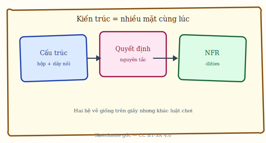
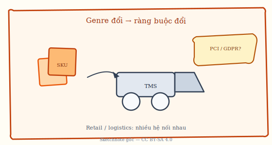
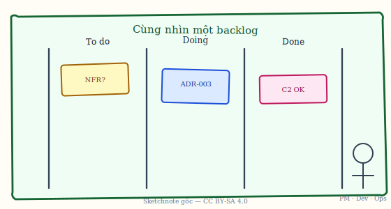

# Chương 2. Tổng quan về mẫu kiến trúc phần mềm

Chương này cung cấp nền tảng lý thuyết cho toàn bộ cuốn sách. Trước khi đi vào từng mẫu kiến trúc cụ thể, người đọc cần nắm rõ: mẫu kiến trúc là gì, nó khác với design pattern như thế nào, có thể phân loại ra sao, dựa trên những tiêu chí và quy trình nào để lựa chọn mẫu phù hợp, cùng “bản đồ” các pattern được trình bày trong sách và cách tham chiếu tài liệu gốc [1], [2], [3]. Chương cũng nêu ngắn gọn nguồn gốc ý tưởng pattern trong kiến trúc phần mềm. Có thể hình dung mẫu kiến trúc như **mẫu nhà** hay **công thức nấu ăn chuẩn**: không phải một công trình hay món cụ thể, mà là khung bố trí hoặc quy trình chung mà team nhận ra và áp dụng lại — ví dụ “nhiều client một dịch vụ” gợi Client-Server, “dữ liệu qua nhiều bước” gợi Pipe-and-Filter. Các mục sau làm rõ tập trung vs phân tán, phân loại theo mục đích và phong cách, tiêu chí lựa chọn, quy trình năm bước; mục 2.5 là phần đọc sâu tùy chọn.

---

## 2.1. Khái niệm mẫu kiến trúc (Architecture Pattern)

Phần này định nghĩa *architecture pattern*, phân biệt với *design pattern*, và nêu vai trò của mẫu trong thiết kế hệ thống.

### 2.1.1. Định nghĩa

**Mẫu kiến trúc (Architecture Pattern)** là một giải pháp tái sử dụng được cho một vấn đề phổ biến trong kiến trúc phần mềm. Mẫu kiến trúc không chỉ mô tả một kiểu kiến trúc cụ thể mà còn nêu rõ các thành phần chính của hệ thống, mối quan hệ giữa chúng và cách chúng tương tác với nhau. Nhờ đó, khi gặp một bài toán tương tự, kiến trúc sư và đội ngũ phát triển có thể áp dụng hoặc điều chỉnh mẫu thay vì phải “bịa” ra cấu trúc từ đầu.

Christopher Alexander, trong lĩnh vực kiến trúc xây dựng, từng nói: *"A pattern is a solution to a problem in a context"* — tức là một pattern luôn gắn với một vấn đề cụ thể trong một bối cảnh cụ thể. Câu này được cộng đồng phần mềm tiếp nhận và áp dụng cho cả design pattern lẫn architecture pattern [1], [2]. Trong phạm vi kiến trúc phần mềm, mẫu kiến trúc thường cung cấp bốn điều: **cấu trúc tổng thể** của hệ thống (ví dụ các lớp, các node, các luồng dữ liệu); **quy tắc tổ chức** các thành phần (ai gọi ai, ai phụ thuộc ai); **cách thức giao tiếp** giữa các thành phần (request-response, message, event); và **giải pháp đã được chứng minh** trong thực tế, giúp giảm rủi ro so với thiết kế hoàn toàn mới.

Ý tưởng pattern trong kiến trúc phần mềm bắt nguồn từ Christopher Alexander và được phát triển có hệ thống trong bộ sách *Pattern-Oriented Software Architecture* (POSA) của Buschmann và cộng sự [2], cũng như trong các tài liệu kinh điển như *Software Architecture in Practice* của Bass, Clements và Kazman [1]. Các tài liệu này không chỉ đặt tên cho các mẫu mà còn mô tả bối cảnh (context), vấn đề (problem) và giải pháp (solution), tạo thành một kho tri thức có thể tra cứu và áp dụng lại.

### 2.1.2. Phân biệt với Design Pattern

Một điểm dễ gây nhầm lẫn là sự khác nhau giữa **architecture pattern** và **design pattern**. Cả hai đều là “pattern” — đều là giải pháp tái sử dụng cho vấn đề trong một bối cảnh — nhưng phạm vi và mức độ ảnh hưởng khác nhau rõ rệt.

**Architecture pattern** áp dụng cho **toàn bộ hệ thống** hoặc một phần lớn của hệ thống (ví dụ toàn bộ backend, toàn bộ luồng xử lý). Nó quyết định *có những thành phần chính nào*, *chúng bố trí ra sao* và *giao tiếp với nhau thế nào*. Quyết định này thường do kiến trúc sư hoặc kỹ thuật viên cấp cao đưa ra và ảnh hưởng đến toàn bộ dự án. Ví dụ: Layered, MVC, Client-Server, Broker, Event-Driven.

**Design pattern** áp dụng ở mức **component hoặc module** — bên trong một lớp, một service, hoặc một nhóm class. Nó giải quyết các vấn đề như quản lý đối tượng (Singleton), đồng bộ trạng thái (Observer), tạo đối tượng (Factory), v.v. Quyết định sử dụng design pattern thường do developer đưa ra và ảnh hưởng chủ yếu đến cấu trúc code cục bộ. Ví dụ: Singleton, Observer, Factory, Strategy.

Hai loại pattern không loại trừ nhau mà bổ sung cho nhau. Chẳng hạn, trong một hệ thống dùng **kiến trúc phân tầng (Layered)**, lớp Presentation có thể đồng thời sử dụng các **design pattern** như Observer (để cập nhật giao diện khi dữ liệu thay đổi), Strategy (để chọn thuật toán hiển thị), và Factory (để tạo các component giao diện). Ở đây, architecture pattern quyết định *có những lớp nào và quan hệ giữa các lớp*; design pattern quyết định *cách tổ chức code bên trong* từng lớp. Bảng sau tóm tắt sự khác biệt:

| Tiêu chí | Architecture Pattern | Design Pattern |
|----------|---------------------|----------------|
| **Phạm vi** | Toàn bộ hệ thống | Component/Module |
| **Mức độ** | High-level | Low-level |
| **Ảnh hưởng** | Cấu trúc tổng thể | Cấu trúc cục bộ |
| **Ví dụ** | Layered, MVC, Client-Server | Singleton, Observer, Factory |
| **Quyết định** | Kiến trúc sư | Developer |

### 2.1.3. Vai trò của mẫu kiến trúc

Mẫu kiến trúc đóng vai trò quan trọng trong quá trình thiết kế và phát triển hệ thống.

Thứ nhất, chúng **cung cấp giải pháp đã được chứng minh**. Thay vì mỗi dự án phải thử nghiệm từ đầu, đội ngũ có thể dựa vào các mẫu đã được sử dụng rộng rãi trong ngành, qua đó giảm rủi ro thiết kế sai và tận dụng kinh nghiệm từ các dự án trước. Điều này không có nghĩa là copy y nguyên mà là lấy mẫu làm khung, rồi điều chỉnh theo bối cảnh cụ thể.

Thứ hai, mẫu kiến trúc **tạo ra ngôn ngữ chung cho team**. Khi mọi người cùng hiểu “hệ thống của chúng ta theo kiến trúc phân tầng” hoặc “phần này dùng Broker”, việc trao đổi và review trở nên nhanh hơn, ít hiểu lầm hơn. Tài liệu kiến trúc cũng ngắn gọn hơn vì có thể tham chiếu đến tên mẫu thay vì mô tả từng chi tiết.

Thứ ba, mẫu kiến trúc **tăng khả năng bảo trì và mở rộng**. Một khi hệ thống được tổ chức theo một mẫu rõ ràng (ví dụ tách biệt lớp trình bày, nghiệp vụ và dữ liệu), việc thay đổi một phần ít ảnh hưởng đến phần khác, và việc thêm tính năng mới có “chỗ” rõ ràng để đặt vào. Cấu trúc rõ ràng cũng giúp người mới tham gia dự án nắm bắt nhanh hơn.

Cuối cùng, mẫu kiến trúc **hỗ trợ quyết định kiến trúc**. Chúng cung cấp một bộ tiêu chí và kinh nghiệm thực tế để so sánh các phương án (ví dụ khi cân nhắc giữa Layered và Microservices), từ đó giúp team đưa ra quyết định có cơ sở thay vì dựa trên cảm tính hoặc xu hướng nhất thời.

---

## 2.2. Phân loại mẫu kiến trúc

Phần này nhóm pattern theo mức độ phân tán, mục đích, phong cách (styles) và “bản đồ” trong sách.

Các mẫu kiến trúc có thể được phân loại theo nhiều cách. Việc phân loại giúp người đọc đặt từng mẫu vào đúng “ngăn” trong đầu, dễ nhớ và dễ so sánh.

### 2.2.1. Phân loại theo mức độ phân tán

Một cách phân loại quan trọng là dựa trên việc các thành phần của hệ thống chạy tập trung trên một máy hay phân tán trên nhiều máy.

**Kiến trúc tập trung (monolithic)** là kiểu mà tất cả các thành phần chính chạy trong cùng một **process** (một chương trình đang chạy) hoặc một ứng dụng triển khai trên một server. Giao tiếp giữa các thành phần chủ yếu qua lời gọi hàm (function call) trong bộ nhớ — nhanh và đơn giản. *Monolithic* có nghĩa “một khối”: giống một toà nhà một khối, mọi phòng nằm trong cùng một công trình. Các mẫu điển hình là Layered và MVC: dù có nhiều lớp hay nhiều thành phần Model-View-Controller, chúng vẫn thường nằm trong một “cục” triển khai duy nhất.

**Kiến trúc phân tán (distributed)** là kiểu mà các thành phần chạy trên **nhiều máy** hoặc nhiều process khác nhau, giao tiếp qua mạng (TCP/IP, HTTP, message queue, RPC). Giống nhiều toà nhà hoặc nhiều chi nhánh trao đổi với nhau qua điện thoại hay hệ thống nội bộ. Client-Server, P2P, Broker, Event-Driven đều thuộc nhóm này. Ở đây, các vấn đề như độ trễ mạng (*latency*), lỗi phần cứng, nhất quán dữ liệu trở nên quan trọng và phải được xử lý rõ ràng trong thiết kế.

### 2.2.2. Phân loại theo mục đích

Có thể phân loại theo **mục đích chính** mà mẫu phục vụ.

**Nhóm xử lý dữ liệu** gồm các mẫu tập trung vào việc chia nhỏ và xử lý dữ liệu hoặc tác vụ: **Master-Slave** (phân phối công việc, xử lý song song), **Pipe-and-Filter** (xử lý dữ liệu theo pipeline, từng bước biến đổi).

**Nhóm giao tiếp** gồm các mẫu tập trung vào cách các thành phần trao đổi với nhau: **Client-Server** (giao tiếp request-response, có vai trò rõ ràng client/server), **P2P** (giao tiếp ngang hàng, không node trung tâm), **Broker** (giao tiếp qua trung gian, decoupling).

**Nhóm tổ chức** gồm các mẫu tập trung vào cách tổ chức code và thành phần bên trong một ứng dụng: **Layered** (tổ chức theo lớp chức năng), **MVC** (tổ chức theo Model-View-Controller), **Component-Based** (tổ chức theo component có giao diện rõ ràng).

### 2.2.3. Phân loại theo phong cách (Architectural Styles)

Theo cách phân loại trong giáo trình Software Engineering (Pressman) [3], các phong cách kiến trúc (architectural styles) có thể gồm: **Data-Centered** (Repository, Blackboard); **Data Flow** (Pipe-Filter, Batch sequential); **Call and Return** (Layered, Main program/subprogram); **Object-Oriented** (Component-based, OO); **Virtual Machine** (Rule-based, Interpreter). Các mẫu trong sách có thể ánh xạ vào các nhóm này để người đọc đối chiếu với tài liệu khác.

### 2.2.4. Bản đồ các pattern trong sách

Để có cái nhìn tổng quan, có thể đặt các pattern trong sách lên hai trục: mức độ **tập trung phân tán** và kiểu **data-flow call-and-return (hoặc event-based)**.

**Tập trung, call-and-return:** Layered, MVC — toàn bộ trong một ứng dụng, gọi lẫn nhau theo chiều từ trên xuống hoặc theo vòng Model-View-Controller.

**Phân tán, giao tiếp có trung tâm:** Client-Server, Broker — có vai trò rõ ràng (client/server) hoặc có thành phần trung gian (broker) điều phối.

**Phân tán, ngang hàng:** P2P — không node trung tâm, các peer trao đổi trực tiếp.

**Phân tán, xử lý song song:** Master-Slave — một node điều phối, nhiều node thực hiện và trả kết quả.

**Data-flow:** Pipe-and-Filter — dữ liệu chảy qua chuỗi bộ lọc.

**Event-based:** Event-Driven — giao tiếp qua sự kiện, producer/consumer tách biệt.

**Tổ chức theo port/adapter:** Hexagonal, Clean Architecture — domain ở trung tâm, giao tiếp với bên ngoài qua các cổng (port) và bộ chuyển đổi (adapter).

**Bổ trợ microservices:** Saga, Sidecar, Circuit Breaker — các mẫu giải quyết vấn đề giao dịch phân tán, cross-cutting và chịu lỗi trong bối cảnh microservices.

---

## 2.3. Tiêu chí lựa chọn mẫu kiến trúc

Phần này liên kết yêu cầu chức năng, phi chức năng, năng lực team và ràng buộc chi phí với việc chọn mẫu.

*Minh họa sketchnote — Kiến trúc thường gắn đồng thời nhiều mặt: cấu trúc (hộp và kết nối), quyết định (nguyên tắc, trade-off), và yêu cầu phi chức năng.*

Việc chọn mẫu kiến trúc phù hợp phụ thuộc vào nhiều yếu tố: yêu cầu chức năng, yêu cầu phi chức năng, độ phức tạp của hệ thống, kinh nghiệm của team, công nghệ sử dụng và ràng buộc về chi phí, thời gian.

**Yêu cầu chức năng** bao gồm loại ứng dụng (web, desktop, mobile, embedded), tính năng chính (CRUD — tạo/đọc/sửa/xóa dữ liệu; real-time — cập nhật theo thời gian thực; xử lý batch — xử lý hàng loạt), và lĩnh vực nghiệp vụ (e-commerce, ngân hàng, y tế, v.v.). Ví dụ: ứng dụng e-commerce truyền thống thường phù hợp với Layered hoặc MVC; hệ thống chat real-time có thể cần Client-Server với WebSocket hoặc P2P; bài toán xử lý dữ liệu lớn thường gợi ý Master-Slave hoặc Pipe-and-Filter.

*Minh họa sketchnote* — Khi thể loại / ngữ cảnh nghiệp vụ thay đổi (ví dụ logistics, SKU, tuân thủ), ràng buộc lên kiến trúc cũng thay đổi theo.

**Yêu cầu phi chức năng** như hiệu năng (*throughput* — số request xử lý được mỗi giây; *latency* — độ trễ phản hồi), khả năng mở rộng (horizontal/vertical scaling), tính sẵn sàng (uptime, fault tolerance), bảo mật (xác thực, phân quyền, mã hóa) và khả năng bảo trì (cấu trúc code, khả năng kiểm thử, tài liệu) ảnh hưởng trực tiếp đến việc có nên chọn mẫu phân tán, mẫu có điểm đơn lỗi (SPOF — Single Point of Failure; xem Glossary) hay không, và mức độ phức tạp chấp nhận được.

**Độ phức tạp và kinh nghiệm team** cũng cần được cân nhắc. Hệ thống đơn giản và team quen với ứng dụng web truyền thống có thể bắt đầu với Layered hoặc MVC. Hệ thống phức tạp hơn, cần scale và tách service, có thể hướng tới Broker hoặc Event-Driven; khi đó team cần có hoặc được đào tạo về vận hành message queue, distributed tracing, v.v.

**Công nghệ và chi phí** — ngôn ngữ lập trình, framework, hạ tầng (cloud hay on-premise), cơ sở dữ liệu — có thể thuận lợi hoặc hạn chế một số mẫu. Chi phí phát triển, chi phí vận hành và thời gian đưa sản phẩm ra thị trường cũng ảnh hưởng đến quyết định: không phải lúc nào cũng chọn mẫu “mạnh nhất” mà phải chọn mẫu phù hợp với nguồn lực và mục tiêu dự án.

---

## 2.4. Quy trình lựa chọn mẫu kiến trúc

Phần này đưa ra năm bước gợi ý từ phân tích yêu cầu đến tài liệu hóa quyết định (liên hệ ADR, Chương 13).

Một quy trình gợi ý khi lựa chọn mẫu kiến trúc gồm năm bước.

**Bước 1 — Phân tích yêu cầu:** Thu thập và làm rõ yêu cầu chức năng, yêu cầu phi chức năng và các ràng buộc (ngân sách, thời gian, công nghệ có sẵn, kỹ năng team). Không có bước này, việc chọn mẫu sẽ thiếu cơ sở.

**Bước 2 — Xác định tiêu chí ưu tiên:** Trong số các yêu cầu phi chức năng, cần xác định cái nào là ưu tiên cao nhất (ví dụ hiệu năng, khả năng mở rộng, bảo mật, chi phí). Điều này giúp khi so sánh các mẫu, ta biết nên đặt nặng tiêu chí nào.

**Bước 3 — Đánh giá các mẫu:** So sánh ưu nhược điểm của các mẫu phù hợp với bài toán (dựa vào bảng so sánh trong Chương 14), xem xét case study và kinh nghiệm thực tế. Có thể lập bảng ngắn: mỗi mẫu đáp ứng các tiêu chí ưu tiên đến mức nào.

**Bước 4 — Lựa chọn và validate:** Chọn một (hoặc kết hợp) mẫu phù hợp nhất, thống nhất với các bên liên quan (stakeholder), và nếu có thể thực hiện proof of concept nhỏ để kiểm chứng (ví dụ một luồng xử lý, một vài service).

*Minh họa sketchnote — PM, Dev, Ops (và các vai khác) cùng nhìn chung backlog / quyết định kiến trúc trên một “bảng” thống nhất.*

**Bước 5 — Tài liệu hóa quyết định:** Ghi lại lý do lựa chọn, các trade-off đã chấp nhận và các phương án đã xem xét nhưng không chọn. Cách làm này chính là nội dung của Architecture Decision Records (ADR) sẽ được trình bày ở Chương 13. Tài liệu hóa giúp team hiểu sau này và tránh tranh cãi lặp lại khi có thành viên mới hoặc khi dự án thay đổi.

---

## 2.5. Đọc sâu: pattern như quyết định kiến trúc (tham khảo nâng cao)

Phần này (tùy chọn) khung đọc theo quality attributes, POSA, styles, kịch bản NFR và ranh giới tin cậy — bổ trợ cách học từng pattern trong các chương sau.

Mục này dành cho người muốn **lý giải và so sánh** các mẫu bằng ngôn ngữ gần với sách chuyên ngành [1][2][3], không bắt buộc khi ôn thi nếu giảng viên không yêu cầu. Nội dung bổ trợ cho **phần mở đầu — Gợi ý cách học từng pattern**.

### 2.5.1. Kiến trúc như tập hợp các quyết định có ràng buộc

Theo quan điểm thực hành trong *Software Architecture in Practice* [1], kiến trúc không chỉ là “bức tranh tĩnh” mà là **chuỗi quyết định** ảnh hưởng tới khả năng đạt các **thuộc tính chất lượng** (quality attributes): hiệu năng, khả năng sửa đổi (*modifiability*), khả năng mở rộng, tính sẵn sàng, bảo mật, khả năng kiểm thử, v.v. Mỗi architecture pattern đề xuất một **cách phân rã** hệ thống (decomposition) — tức là cắt “ranh giới” giữa các phần — và mỗi ranh giới mang theo **chi phí giao tiếp** (latency, serialisation, vận hành) cùng **ràng buộc nhất quán**. Do đó, chọn pattern là chọn **bộ trade-off** chứ không chọn “đúng/sai” tuyệt đối.

### 2.5.2. Pattern theo POSA: ngữ cảnh, lực lượng, giải pháp, hệ quả

Bộ *Pattern-Oriented Software Architecture* (POSA) [2] mô tả pattern qua các thành phần như **tên**, **bối cảnh** (context), **lực** (*forces* — các mục tiêu xung đột nhau), **giải pháp** (solution) và **hệ quả** (consequences). Khi đọc Chương 3–12, có thể tự điền bảng tư duy sau cho từng mẫu:

| Thành phần | Câu hỏi gợi ý |
|------------|----------------|
| Context | Hệ tập trung hay phân tán? Đội ngũ và kỹ năng vận hành? |
| Problem / Forces | NFR nào “kéo” theo hướng này (ví dụ scale ngang vs đơn giản triển khai)? |
| Solution | Cấu trúc (hộp–mũi tên) và hành vi (luồng sync/async) chính là gì? |
| Consequences | Điểm đơn lỗi? Độ phức tạp vận hành? Khóa công nghệ? |

Cách đọc này giúp pattern trở thành **đối tượng phân tích** có thể so sánh trong Chương 14 thay vì danh sách tên riêng lẻ.

### 2.5.3. Phong cách kiến trúc (architectural styles) và biểu đồ hành vi

Trong tài liệu tổng quan về thiết kế phần mềm [3], các **phong cách** (styles) — ví dụ luồng dữ liệu, gọi–trả về, hướng sự kiện — mô tả **họ** các hệ thống có cùng “hình dạng” tổ chức giao tiếp. Architecture pattern trong sách này thường là **instanciation** của một hay vài style: Pipe-and-Filter thuộc *data flow*; Layered và nhiều biến thể *call-and-return*; Event-Driven thuộc *implicit invocation / event-based*. Để tránh nhầm lẫn, cần bổ sung cho sơ đồ cấu trúc một **biểu đồ hành vi** (sequence, luồng message) — vì hai pattern có sơ đồ hộp giống nhau vẫn có thể khác hẳn về thời gian và lỗi runtime.

### 2.5.4. Kịch bản thuộc tính chất lượng (quality attribute scenarios)

Để tránh tranh luận mơ hồ (“pattern X nhanh hơn pattern Y”), nên diễn đạt yêu cầu phi chức năng thành **kịch bản có thể kiểm chứng** [1]: *kích thích* → *đối tượng* → *phản ứng* → *thước đo*. Ví dụ: “Khi số session đồng thời tăng gấp đôi trong 5 phút, hệ thống vẫn giữ p95 latency dưới 500 ms với tỷ lệ lỗi dưới 0,1%.” Khi so sánh hai pattern, ta so sánh **khả năng đạt cùng một kịch bản** dưới cùng giả định tải và hạ tầng — đây là cầu nối giữa Chương 2, Chương 14 và các ADR ở Chương 13.

### 2.5.5. Ranh giới tin cậy (trust boundaries) và điểm đơn lỗi

Ở mức kiến trúc, mỗi lần gọi qua process/mạch khác process là một **ranh giới tin cậy**: xác thực, phân quyền, logging, hợp đồng API/event thường phải được nghĩ rõ ở đó. Các mẫu có **điểm điều phối tập trung** (Master, Server trong một số cấu hình, Broker) mang lại đơn giản quản trị nhưng tạo **SPOF** nếu không thiết kế dự phòng. Ngược lại, P2P hay một số topo EDA giảm SPOF logic nhưng tăng chi phối **bảo mật, quản trị schema và quan sát được** (*observability*). Khung này giúp đọc thống nhất các mục ưu/nhược trong từng chương.

---

*Chương tiếp theo đi vào mẫu kiến trúc đầu tiên: Kiến trúc phân tầng (Layered Architecture) — mẫu phổ biến nhất trong ứng dụng web và doanh nghiệp.*
