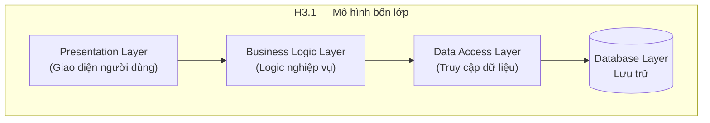
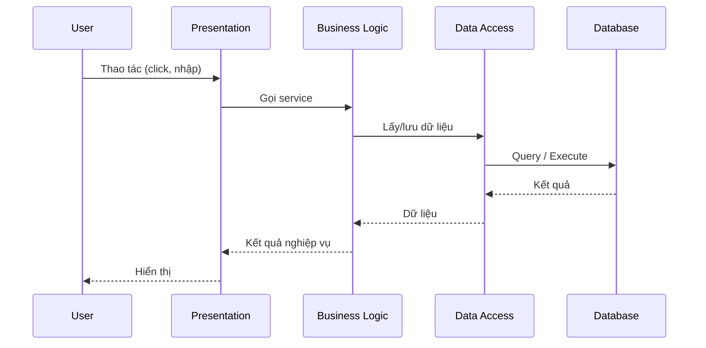
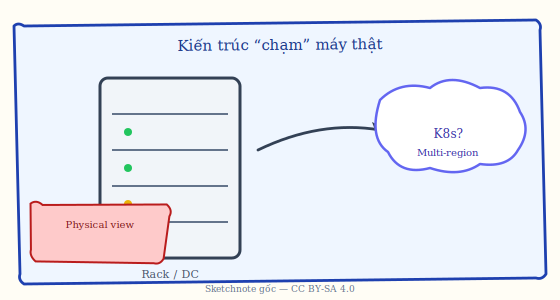

# Chương 3. Kiến trúc phân tầng (Layered Architecture)

Kiến trúc phân tầng (Layered Architecture) là một trong những mẫu kiến trúc phổ biến nhất trong phát triển phần mềm, đặc biệt trong ứng dụng web và hệ thống doanh nghiệp. Mẫu này tổ chức hệ thống thành các lớp (layers) xếp chồng lên nhau: mỗi lớp cung cấp dịch vụ cho lớp bên trên và sử dụng dịch vụ của lớp bên dưới. Nhờ đó, trách nhiệm được tách bạch rõ ràng, bảo trì và mở rộng dễ hơn, và người mới có thể nắm cấu trúc nhanh. Chương này trình bày khái niệm, cấu trúc bốn lớp, bốn nguyên tắc (Separation of Concerns, Abstraction, Dependency Rule, Closed Layer), phân biệt *layer* (logic) và *tier* (triển khai), strict/relaxed layering, bảng B3.1 khi review, ưu nhược điểm, so sánh ngắn với N-Tier và Clean Architecture, case study (ví dụ thư viện) và ví dụ code. Có thể hình dung phân tầng như một toà nhà: tầng trên chỉ dùng dịch vụ của tầng ngay bên dưới (ví dụ lễ tân → nghiệp vụ → lưu trữ), không “nhảy cóc”; trong phần mềm, bốn lớp thường gặp là Presentation, Business Logic, Data Access và Database. Layered thường là mẫu đầu tiên khi làm CRUD hay web doanh nghiệp; nó không thay thế Client-Server (Chương 5), Event-Driven (Chương 9) hay Hexagonal/Clean (Chương 11) — nhiều hệ thống vẫn phân tầng bên trong từng service đồng thời giao tiếp qua REST hoặc message broker.

---

## 3.1. Khái niệm và đặc điểm

Phần này định nghĩa kiến trúc phân tầng, phân biệt *layer* và *tier*, và nêu bốn nguyên tắc vận hành của mẫu.

### 3.1.1. Định nghĩa

**Kiến trúc phân tầng (Layered Architecture)** là mẫu kiến trúc trong đó hệ thống được tổ chức thành các lớp (layers) xếp chồng lên nhau. Mỗi lớp có một tập trách nhiệm rõ ràng: nó cung cấp dịch vụ cho lớp nằm ngay phía trên và chỉ sử dụng dịch vụ của lớp nằm ngay phía dưới. Giao tiếp giữa các lớp thường diễn ra qua các giao diện (interfaces) hoặc API nội bộ, sao cho lớp trên không cần biết chi tiết triển khai của lớp dưới — chỉ cần biết lớp dưới cung cấp những gì.

Có bốn đặc điểm chính cần nhớ. Thứ nhất, **mỗi lớp có trách nhiệm riêng biệt**: chẳng hạn lớp trình bày chỉ lo giao diện, lớp nghiệp vụ chỉ lo logic nghiệp vụ, lớp truy cập dữ liệu chỉ lo thao tác với cơ sở dữ liệu. Thứ hai, **giao tiếp chỉ diễn ra giữa các lớp liền kề**: lớp trên gọi lớp dưới, không “nhảy cóc” xuống nhiều tầng trong một lần gọi (nếu cần thì phải đi qua các lớp trung gian). Thứ ba, **lớp trên không biết chi tiết của lớp dưới**: nó phụ thuộc vào abstraction (giao diện, contract — "hợp đồng" lớp dưới cung cấp gì), không phụ thuộc vào implementation (cách triển khai cụ thể). Thứ tư, **tách biệt rõ concerns** (mối quan tâm): mỗi lớp tập trung vào một việc, giúp giảm coupling (sự ràng buộc lẫn nhau) và tăng khả năng thay đổi độc lập.

**Lớp (layer) khác tầng vật lý (tier) như thế nào?** Trong sách giáo khoa, hai từ này hay bị dùng lẫn. **Layer** là **cách chia code / trách nhiệm trong thiết kế** (logical): cùng một process vẫn có thể có đủ Presentation → Business → Data Access. **Tier** thường gợi ý **chia trên nhiều máy hoặc mạng** (physical/deployment): ví dụ máy chủ web chỉ chạy giao diện, máy khác chạy API, máy khác chạy database — đó là **3-tier**. Một ứng dụng có thể có **4 layer** nhưng triển khai **2 tier** (toàn bộ backend + DB trên cùng datacenter, chỉ tách client trình duyệt).

**Strict vs relaxed layering:** Mô hình “đóng lớp” (strict) cấm Presentation gọi thẳng Data Access. Trên thực tế, một số team cho phép **relaxed layering** trong giới hạn (ví dụ báo cáo chỉ đọc: Presentation → Repository với DTO chỉ đọc) để giảm lớp trung gian — nhưng dễ **phá vỡ** ranh giới nếu không có quy ước và review chặt. Người mới nên nắm vững bản strict trước, rồi mới thảo luận ngoại lệ trong team hoặc với người hướng dẫn.

### 3.1.2. Nguyên tắc hoạt động

Để kiến trúc phân tầng phát huy hiệu quả, cần tuân thủ bốn nguyên tắc sau.

**Separation of Concerns (Tách biệt mối quan tâm):** Mỗi lớp chỉ xử lý một loại công việc. Lớp trình bày không chứa logic nghiệp vụ phức tạp; lớp nghiệp vụ không chứa câu lệnh SQL hay chi tiết kết nối cơ sở dữ liệu. Khi cần sửa đổi giao diện, ta chỉ cần sửa lớp trình bày mà không đụng đến lớp nghiệp vụ hay lớp dữ liệu.

**Abstraction (Trừu tượng hóa):** Lớp trên chỉ biết *giao diện* của lớp dưới — những phương thức có thể gọi và ý nghĩa của chúng — chứ không biết lớp dưới được triển khai bằng công nghệ gì, lưu trữ ở đâu. Điều này cho phép thay thế implementation (ví dụ đổi từ MySQL sang PostgreSQL) mà không ảnh hưởng lớp trên, miễn là giao diện giữ nguyên.

**Dependency Rule (Quy tắc phụ thuộc):** Chiều phụ thuộc chỉ đi từ trên xuống dưới. Lớp trên phụ thuộc vào lớp dưới; lớp dưới không được phụ thuộc vào lớp trên. Nếu lớp dưới cần thông tin từ lớp trên (ví dụ user đang đăng nhập), thông tin đó phải được truyền xuống qua tham số hoặc ngữ cảnh, chứ không phải bằng cách lớp dữ liệu gọi ngược lên lớp trình bày. Quy tắc này tránh phụ thuộc vòng tròn và giữ cho kiến trúc ổn định.

**Closed Layer (Lớp đóng với phía trên):** Mỗi lớp “đóng” với lớp trên — tức là lớp trên không thể bỏ qua và gọi trực tiếp lớp xa hơn bên dưới. Đồng thời lớp “mở” với lớp dưới — nó có thể gọi bất kỳ dịch vụ nào mà lớp dưới cung cấp. Cách hiểu đơn giản: request từ người dùng đi từ trên xuống dưới lần lượt qua từng lớp; response đi ngược lại từ dưới lên trên. Không có đường tắt.

**Ví dụ — vi phạm từng nguyên tắc (để tránh khi code):**

| Nguyên tắc | Ví dụ sai (thường gặp) | Hệ quả |
|------------|-------------------------|--------|
| Separation of Concerns | Trong file React có cả `fetch` API + công thức tính VAT + `if` phân quyền phức tạp | Sửa giao diện dễ làm hỏng nghiệp vụ; khó test |
| Abstraction | Business gọi `JdbcTemplate` hoặc gõ chuỗi SQL trực tiếp | Đổi DB hoặc đổi ORM phải sửa khắp service |
| Dependency Rule | Module persistence import class từ package `ui` để lấy “theme màu” | Phụ thuộc vòng, khó build/tách module |
| Closed Layer | Controller Spring inject `BookRepository` và gọi `findAll()` thẳng, bỏ qua `BookService` | Logic “ai được xem sách gì” nằm nhầm chỗ hoặc bị nhân đôi ở nhiều controller |

**Ví dụ đúng (ngắn):** Controller chỉ nhận HTTP, gọi `OrderService.placeOrder(dto)`; `OrderService` kiểm tra tồn kho, tính giá, gọi `OrderRepository.save`; Repository chỉ lo ánh xạ entity ↔ bảng SQL. Thay PostgreSQL bằng MySQL: sửa chủ yếu cấu hình + vài câu dialect, không đụng controller.

---

## 3.2. Cấu trúc

### 3.2.1. Mô hình bốn lớp cơ bản (H3.1)

Mô hình phổ biến nhất của kiến trúc phân tầng gồm **bốn lớp** từ trên xuống dưới: Presentation, Business Logic, Data Access và Database. Sơ đồ dưới đây minh họa cấu trúc này.

*Hình H3.1 — Cấu trúc bốn lớp (sơ đồ chuẩn, Mermaid). Có thể xem dạng render trên GitHub/GitBook/MkDocs.*



*Luồng request/response (sequence chuẩn):*



```
┌─────────────────────────────────────┐
│ Presentation Layer │ ← Giao diện người dùng
├─────────────────────────────────────┤
│ Business Logic Layer │ ← Logic nghiệp vụ
├─────────────────────────────────────┤
│ Data Access Layer │ ← Truy cập dữ liệu
├─────────────────────────────────────┤
│ Database Layer │ ← Lưu trữ
└─────────────────────────────────────┘
```

**Presentation Layer (Lớp trình bày)** là nơi người dùng tương tác. Nó hiển thị dữ liệu, nhận thao tác từ người dùng (click, nhập liệu), thực hiện kiểm tra đầu vào cơ bản (format, bắt buộc) và định dạng dữ liệu để hiển thị. Toàn bộ logic nghiệp vụ phức tạp không nên nằm ở đây; lớp này chỉ gọi sang Business Logic Layer khi cần xử lý. Công nghệ thường dùng: với web là HTML, CSS, JavaScript và các framework như React, Vue; với desktop là WPF, Swing, Qt; với mobile là UIKit, Android Views hoặc React Native.

**Business Logic Layer (Lớp logic nghiệp vụ)** là trái tim của ứng dụng. Nó chứa các quy tắc nghiệp vụ (business rules), validation phức tạp, và quy trình xử lý (orchestration). Ví dụ: kiểm tra số dư trước khi cho phép rút tiền, tính phí quá hạn khi trả sách muộn, áp dụng giảm giá theo chính sách khuyến mãi. Lớp này không biết dữ liệu được lưu ở đâu hay giao diện hiển thị thế nào; nó chỉ biết gọi xuống Data Access Layer để lấy hoặc lưu dữ liệu. Trong các dự án Java thường dùng Spring Service, EJB; với .NET là các class nghiệp vụ; với Python là Django Services hoặc Flask Blueprints.

**Data Access Layer (Lớp truy cập dữ liệu)** đảm nhiệm mọi thao tác với nguồn dữ liệu: đọc, ghi, cập nhật, xóa (CRUD), tối ưu truy vấn và quản lý giao dịch (transaction). Lớp này che giấu chi tiết cơ sở dữ liệu (SQL, driver, connection pool) khỏi Business Logic. Business Logic gọi các phương thức kiểu “lấy user theo id”, “lưu đơn hàng” chứ không gọi trực tiếp câu lệnh SQL. Công nghệ điển hình: ORM như Hibernate, Entity Framework, SQLAlchemy; hoặc các Repository wrap JDBC/ADO.NET.

**Database Layer (Lớp cơ sở dữ liệu)** chính là hệ quản trị cơ sở dữ liệu: MySQL, PostgreSQL, SQL Server, MongoDB, v.v. Nó đảm bảo tính toàn vẹn dữ liệu (ACID khi cần), lập chỉ mục, sao lưu và phục hồi. Trong nhiều tài liệu, “layer” này được coi là hạ tầng bên ngoài ứng dụng; ứng dụng chỉ tương tác với nó thông qua Data Access Layer.

**DTO, entity và “vật thể” qua ranh giới:** Thực tế hay có các kiểu dữ liệu khác nhau: **entity** (ánh xạ gần với bảng DB), **DTO** (Data Transfer Object — gói dữ liệu để trả về API hoặc truyền giữa lớp), **view model** (cho giao diện). Không bắt buộc mỗi lớp một kiểu, nhưng **không nên** lộ entity chứa lazy proxy ORM thẳng ra JSON cho client — dễ lỗi serialize và lộ chi tiết nội bộ. Ví dụ: `Book` entity có quan hệ `List<BorrowRecord>`; API chỉ cần `{ "title", "available" }` → map sang `BookResponseDto` ở lớp Presentation hoặc mapper riêng.

### 3.2.2. Bảng tra cứu: lớp nào được / không được làm gì (B3.1)

*Bảng B3.1 — Ranh giới trách nhiệm (gợi ý cho bài tập và code review).*

| Lớp | **Nên làm** | **Không nên** (hoặc hạn chế mạnh) | Ví dụ hành động cụ thể |
|-----|-------------|-----------------------------------|-------------------------|
| Presentation | Hiển thị, điều hướng, validate format (email đúng dạng, trường bắt buộc), gọi API/service nghiệp vụ | Không nhúng SQL; không tự quyết “được mượn hay không” nếu đó là luật thư viện | Nút “Mượn” → `POST /borrows` với `memberId`, `bookId` |
| Business Logic | Quy tắc nghiệp vụ, tính toán phí, giao dịch (transaction boundary), orchestrate nhiều repository | Không render HTML; không mở kết nối DB trực tiếp nếu đã có DAL | “Độc giả đang nợ tiền thì không cho mượn thêm” |
| Data Access | CRUD, query, mapping ORM, tối ưu chỉ mục ở mức truy vấn | Không quyết định “giá bán” hay “điểm sàn”; không gọi ngược lên UI | `findActiveBorrowsByMember(memberId)` |
| Database | Lưu trữ, ràng buộc toàn vẹn (FK, CHECK), backup | (Không phải code ứng dụng) — ứng dụng không “lẫn” business rule vào stored procedure quá dày nếu team muốn test nghiệp vụ ở app | Trigger log thay đổi — dùng có chừng mực |

**Ghi chú:** Ranh giới **Business vs Data Access** hay bị mờ khi team nhét SQL vào service “cho nhanh”. Một cách phân biệt: *câu hỏi “tại sao nghiệp vụ lại như vậy?”* → Business; *câu hỏi “dữ liệu lấy/ghi thế nào cho đúng bảng?”* → Data Access.

### 3.2.3. Biến thể và so sánh nhanh

**N-Tier Architecture** là mở rộng của mô hình ba tầng (3-tier) thành nhiều tầng hơn, ví dụ: Presentation → Application → Service → Business → Data Access → Database. Mỗi tầng có thể triển khai trên một nhóm server riêng (web server, application server, database server). Cách làm này phù hợp khi quy mô lớn và cần tách biệt rõ từng khối chức năng.

**Ví dụ 3-tier quen thuộc:** (1) Trình duyệt / app mobile — (2) Máy chủ chạy API (gộp Presentation server-side + Business + DAL trong một runtime hoặc chia nhỏ hơn) — (3) Máy chủ database. **Lợi ích:** scale DB riêng, bảo mật (DB không public Internet). **Chi phí:** thêm độ trễ mạng giữa tier, cần quản lý phiên bản API, auth giữa các tầng.

**Ví dụ 2-tier (client–DB):** Ứng dụng desktop nội bộ kết nối thẳng SQL Server qua ODBC. Vẫn có thể **tổ chức code** theo layer trong client, nhưng **không** có “máy API” ở giữa — rủi ro: mỗi máy client cần quyền DB, khó kiểm soát tập trung.

*Minh họa sketchnote — Phân tầng logic gắn với triển khai vật lý: nhiều tầng có thể ánh xạ lên nhiều máy chủ / vùng mạng khác nhau.*



**Clean Architecture / Onion Architecture** có thể xem là một dạng “phân tầng” nhưng với domain (nghiệp vụ cốt lõi) ở trung tâm, còn các lớp bên ngoài là use cases, giao diện và framework. Chi tiết sẽ được trình bày ở Chương 11. Điểm khác biệt chính so với Layered truyền thống là chiều phụ thuộc: mọi thứ đều hướng vào trong (dependency inversion), domain không phụ thuộc vào database hay giao diện.

**Bảng so sánh tóm tắt (ôn tập):**

| Tiêu chí | Layered “kinh điển” (4 lớp) | N-Tier (triển khai) | Clean / Hexagonal |
|----------|-----------------------------|----------------------|-------------------|
| Trọng tâm thiết kế | Tách theo *kỹ thuật* (UI / logic / DB) | Tách theo *vị trí chạy* (máy nào) | Tách theo *domain* + ports/adapters |
| Chiều phụ thuộc mặc định | Trên → dưới | Phụ thuộc triển khai | Vào trong (domain không phụ thuộc framework) |
| Điểm mạnh | Dễ dạy, dễ onboard | Scale từng khối vật lý | Test domain, đổi công nghệ vỏ ngoài |
| Rủi ro | “Smart UI” hoặc anemic service | Phức tạp vận hành | Đường cong học cao hơn cho người mới |

---

## 3.3. Ưu điểm

Kiến trúc phân tầng mang lại **sự tách biệt rõ ràng** giữa giao diện, logic nghiệp vụ và dữ liệu. Khi thay đổi giao diện (ví dụ chuyển từ web sang mobile), ta chỉ cần thay hoặc bổ sung Presentation Layer mà không phải viết lại Business Logic hay Data Access. Tương tự, khi đổi cơ sở dữ liệu, ta chỉ cần thay implementation của Data Access Layer. Điều này làm giảm coupling và **tăng khả năng bảo trì**.

**Ví dụ cụ thể — bảo trì:** Ứng dụng đặt phòng khách sạn dùng Layered. Khách sạn đổi chính sách: “hủy miễn phí trong 24h”. Sửa chủ yếu trong **BookingService** (Business) và có thể thêm cột `cancelled_at` qua migration + **BookingRepository** (DAL). Giao diện chỉ cần thêm nút “Hủy” gọi API đã có contract ổn định — không phải đọc lại toàn bộ file giao diện tìm chỗ nhét `if`.

**Khả năng kiểm thử** cũng được cải thiện. Mỗi lớp có thể được test độc lập bằng cách **mock** (giả lập) lớp phía dưới. Ví dụ để test Business Logic, ta không cần thật sự kết nối database — chỉ cần một “mock” của Repository trả về dữ liệu giả. Unit test và integration test theo từng lớp trở nên dễ viết và dễ chạy.

**Ví dụ cụ thể — test:** `PricingService.applyDiscount(cart)` cần giả lập `ProductRepository` trả về hai sản phẩm giá cố định. Test kiểm tra: giỏ hàng 500k + mã giảm 10% → 450k. Không cần Docker, không cần seed DB — chạy nhanh trên máy cục bộ (không bắt buộc container hay DB đầy đủ).

**Tái sử dụng** là một ưu điểm khác. Cùng một Business Logic Layer có thể được gọi từ nhiều kênh: web, mobile app, API cho bên thứ ba, hoặc job xử lý batch. Chỉ cần thêm hoặc điều chỉnh lớp Presentation tương ứng; logic nghiệp vụ dùng chung.

**Ví dụ cụ thể — đa kênh:** Module `InvoiceService` tính hóa đơn theo luật VAT. Kênh (1) nhân viên bấm trên web nội bộ, (2) hệ thống kế toán gọi REST lúc 2h sáng, (3) mobile cho sales — cùng gọi một service. Tránh copy-paste công thức vào 3 nơi (lỗi kinh điển khi sửa thuế chỉ sửa được 2/3 chỗ).

**Phân công nhóm (onboarding):** Junior có thể sửa template giao diện trong phạm vi Presentation; senior review Business khi đụng transaction và rule nhạy cảm. Ranh giới lớp trùng với ranh giới **“ai được merge PR loại nào”** nếu team quy ước rõ.

Cuối cùng, kiến trúc phân tầng **dễ tiếp cận** với người mới và phù hợp với dự án quy mô nhỏ đến vừa. Hầu hết framework web (Spring MVC, Django, Rails) đều gợi ý hoặc mặc định cấu trúc tương tự, nên tài liệu và ví dụ rất nhiều.

---

## 3.4. Nhược điểm và khi nào không nên dùng

Bên cạnh ưu điểm, kiến trúc phân tầng có một số **nhược điểm** cần lưu ý.

**Hiệu năng:** Mỗi request phải đi qua nhiều lớp (Presentation → Business → Data Access → Database và ngược lại). Mỗi bước chuyển lớp thường kèm theo chuyển đổi dữ liệu, gọi hàm qua interface, đôi khi copy hoặc serialize. Với bài toán cần latency rất thấp hoặc throughput rất cao, việc “đi qua nhiều tầng” có thể trở thành nút thắt. Khi đó người ta thường cân nhắc giảm số lớp hoặc chọn kiến trúc cho phép xử lý gần nguồn dữ liệu hơn (ví dụ CQRS, cache tại edge).

**Độ phức tạp không cần thiết:** Với ứng dụng rất đơn giản (ví dụ một form nhập liệu lưu vào một bảng), việc tách đủ bốn lớp có thể bị coi là over-engineering (kỹ thuật thừa). Tuy vậy trong thực tế, ngay cả ứng dụng nhỏ cũng thường lớn dần; việc có sẵn cấu trúc phân tầng rõ ràng giúp mở rộng sau này. Cần cân nhắc theo từng dự án.

**Ràng buộc giữa các lớp:** Nếu không tuân thủ dependency rule hoặc để logic “rò rỉ” giữa các lớp (ví dụ Presentation gọi trực tiếp Repository), có thể phát sinh tight coupling (ràng buộc chặt giữa các lớp) và khó thay đổi. Cần kỷ luật thiết kế và code review để tránh.

**Khả năng mở rộng theo chiều ngang:** Trong mô hình monolithic (một khối — toàn bộ ứng dụng trong một process) phân tầng điển hình, toàn bộ ứng dụng chạy trong một process. Để scale (mở rộng), ta thường phải nhân bản cả ứng dụng (nhiều instance phía sau load balancer — thiết bị phân phối tải). Không thể “chỉ scale” riêng một lớp mà không scale các lớp khác. Với hệ thống cần scale từng phần độc lập (ví dụ chỉ tăng số instance xử lý nghiệp vụ), người ta thường chuyển dần sang kiến trúc microservices hoặc ít nhất tách service.

**Khi nào không nên dùng:** Kiến trúc phân tầng không phù hợp khi yêu cầu hiệu năng cực cao (hàng triệu request/giây, latency dưới vài millisecond), khi cần scale từng thành phần độc lập mạnh mẽ, khi hệ thống real-time đòi hỏi luồng xử lý rất ngắn, hoặc khi dự án đã xác định đi theo hướng microservices và muốn mỗi service nhỏ, độc lập từ đầu.

**Ví dụ — “Layered nhưng vẫn chậm”:** Báo cáo tổng hợp 5 năm dữ liệu: request đi Presentation → Service → Repository → SQL aggregate nặng. Mỗi lớp chỉ “chuyển tiếp” object lớn. Khi đó bottleneck là **DB và kích thước dữ liệu**, không phải tên pattern — nhưng đôi khi cần **bỏ bớt lớp trung gian** cho luồng đọc (CQRS/read model), hoặc tiền tính toán (materialized view), hoặc cache.

**Ví dụ — domain cực phức tạp:** Hệ thống tín dụng với hàng trăm quy tắc phụ thuộc nhau. Nếu toàn bộ nằm trong một `LoanService` 3000 dòng, “có lớp Business” về hình thức nhưng **không còn cohesion**. Khi đó cần **chia module nghiệp vụ** (theo subdomain), hoặc xem xét DDD/Clean (Chương 11) — Layered là khung, không thay thế thiết kế miền.

**Technical debt hay gặp:** Team bỏ qua layer “vì deadline” → sau 1 năm controller gọi 15 repository, không ai dám refactor. **Cách phòng:** rule lint/architecture test (ví dụ cấm import Repository trong package controller), hoặc checklist review.

---

## 3.5. Ứng dụng thực tế

Kiến trúc phân tầng được dùng rộng rãi trong **hệ thống quản lý doanh nghiệp (ERP)** như SAP, Oracle ERP: lớp trình bày là portal web hoặc ứng dụng mobile, lớp nghiệp vụ xử lý đơn hàng, kho, tài chính, lớp truy cập dữ liệu và cơ sở dữ liệu (Oracle, SAP HANA) nằm phía dưới.

Trong **ứng dụng web truyền thống** — e-commerce, CMS, trang nội bộ — ta thường thấy stack kiểu HTML/CSS/JavaScript (hoặc SPA) → backend PHP/Java/Python (Business + Data Access) → MySQL/PostgreSQL. Backend có thể được tổ chức rõ ràng theo từng lớp với ORM (Hibernate, Django ORM).

**Ứng dụng ngân hàng, bảo hiểm** cũng thường dùng kiến trúc phân tầng: giao diện web hoặc desktop, lớp nghiệp vụ xử lý giao dịch và tính toán rủi ro, lớp truy cập dữ liệu và cơ sở dữ liệu SQL Server, DB2, v.v. Tính tách biệt giữa các lớp giúp đáp ứng yêu cầu bảo mật và kiểm toán.

**Thêm ví dụ dễ liên hệ:**

- **LMS / đăng ký học phần:** Presentation (form chọn môn) → Business (kiểm tra tín chỉ tối đa, trùng lịch, điều kiện tiên quyết) → DAL (ghi bảng `enrollment`) → DB.
- **Ứng dụng đặt phòng lab / thiết bị:** Giống thư viện nhưng thêm rule “một thiết bị chỉ một người tại một slot” — rule nằm Business, không nhét vào SQL `CHECK` phức tạp quá mức nếu team muốn đọc rule trong code app.
- **API nội bộ (JSON):** “Presentation” có thể là lớp controller REST (không có HTML) — vẫn đóng vai **nhận request / trả response**, còn JSON schema và auth middleware là ranh giới trước Business.
- **Game / app không CRUD:** Vẫn có thể tách: vòng lặp render + input (Presentation), simulation/rules (Business), save/load (DAL) — chỉ khác là “Presentation” không phải web form.

---

## 3.6. Case study: Hệ thống quản lý thư viện

Để minh họa cách áp dụng kiến trúc phân tầng vào một bài toán cụ thể, ta xét **hệ thống quản lý thư viện** với các yêu cầu sau: quản lý sách, độc giả, và quy trình mượn/trả sách; tính phí quá hạn; báo cáo thống kê; hỗ trợ cả giao diện web và ứng dụng mobile.

**Phân bổ theo từng lớp:** Lớp Presentation gồm giao diện web (ví dụ React) và ứng dụng mobile (React Native) — cả hai đều gọi chung API hoặc service. Lớp Business Logic gồm các service như BookService, MemberService, BorrowService, ReportService: BookService quản lý danh mục sách, MemberService quản lý thông tin độc giả và trạng thái mượn sách, BorrowService thực hiện nghiệp vụ mượn/trả (kiểm tra điều kiện mượn, tạo phiếu mượn, cập nhật trạng thái sách), ReportService tổng hợp báo cáo. Lớp Data Access gồm các repository (BookRepository, MemberRepository, BorrowRepository) thao tác với cơ sở dữ liệu. Cơ sở dữ liệu có thể là PostgreSQL hoặc MySQL.

**Luồng mượn sách:** Người dùng nhấn “Mượn sách” trên giao diện → Presentation gọi BorrowService.borrowBook(memberId, bookId) → BorrowService kiểm tra độc giả (còn quyền mượn không, đã mượn bao nhiêu cuốn), kiểm tra sách (còn tồn kho không), áp dụng quy tắc (ví dụ tối đa 5 cuốn, thời hạn 14 ngày) → tạo bản ghi mượn và cập nhật trạng thái sách → gọi BorrowRepository và BookRepository để lưu → trả kết quả lên Presentation để hiển thị thông báo.

**Luồng trả sách và phí quá hạn (bổ sung):** Người dùng nhấn “Trả sách” → Presentation gọi `BorrowService.returnBook(borrowRecordId)` → Service tải bản ghi mượn (qua `BorrowRepository`), so sánh `dueDate` với ngày trả: nếu trễ, gọi **policy** trong Business (ví dụ 5.000đ/ngày, tối đa 50.000đ) để tính `lateFee` → cập nhật trạng thái phiếu (đã trả), đánh dấu sách `available = true` → lưu transaction (có thể ghi thêm bảng `payments` nếu thu phí). **Presentation** chỉ hiển thị “Trễ 3 ngày, phí 15.000đ” — không tự nhân 5.000 × 3 trong JSX/React để “cho nhanh”, vì ngày mai thư viện đổi biểu phí thì dễ sửa nhầm chỗ.

**Xử lý lỗi nghiệp vụ (ví dụ):** `MemberNotFoundException`, `BookNotAvailableException` nên được **Business** ném ra khi rule vi phạm; Presentation (hoặc global exception handler trong API) map sang HTTP 404/409 hoặc thông báo tiếng Việt. Như vậy cùng một rule được dùng cho web và mobile.

**Nếu bỏ Layered (so sánh nhanh):** Nếu viết một file PHP duy nhất: HTML + SQL + `if` mượn trong cùng trang — demo nhanh được nhưng khi thêm app mobile phải **copy** logic hoặc refactor lớn. Layered trả giá bằng nhiều file/class hơn lúc đầu, đổi lại **chỗ đứng rõ** cho từng thay đổi sau này.

### Ví dụ code (minh họa lớp Business)

Đoạn code dưới đây minh họa lớp Business Logic (BorrowService) trong Java/Spring: nhận memberId và bookId, kiểm tra nghiệp vụ (độc giả tồn tại, chưa vượt giới hạn mượn, sách tồn tại và còn sẵn), tạo bản ghi mượn và cập nhật trạng thái sách, rồi lưu qua repository. Toàn bộ trong một transaction (@Transactional) để đảm bảo nhất quán.

```java
@Service
public class BorrowService {
 @Autowired private BookRepository bookRepository;
 @Autowired private MemberRepository memberRepository;
 @Autowired private BorrowRepository borrowRepository;

 @Transactional
 public BorrowRecord borrowBook(Long memberId, Long bookId) {
 Member member = memberRepository.findById(memberId).orElseThrow(() -> new MemberNotFoundException());
 if (member.getBorrowedBooks().size() >= 5) throw new BorrowLimitExceededException();
 Book book = bookRepository.findById(bookId).orElseThrow(() -> new BookNotFoundException());
 if (!book.isAvailable()) throw new BookNotAvailableException();
 BorrowRecord record = new BorrowRecord();
 record.setMember(member); record.setBook(book);
 record.setBorrowDate(LocalDate.now()); record.setDueDate(LocalDate.now().plusDays(14));
 book.setAvailable(false);
 return borrowRepository.save(record);
 }
}
```

---

## 3.7. Best practices

Khi áp dụng kiến trúc phân tầng, nên tuân thủ **nguyên tắc thiết kế** sau: tách biệt chặt giữa các lớp (strict layer separation), lớp trên phụ thuộc abstraction chứ không phụ thuộc implementation (Dependency Inversion), mỗi lớp một trách nhiệm (Single Responsibility), và mở để mở rộng nhưng đóng với sửa đổi không cần thiết (Open/Closed).

**Checklist trước khi merge (gợi ý cho nhóm nhỏ):**

1. File trong package `controller` / `views` có import trực tiếp `*Repository` hoặc `EntityManager` không?
2. Câu SQL (hoặc HQL/JPQL dài) có nằm trong service nghiệp vụ không — có nên kéo xuống repository/query object?
3. DTO trả ra API có lộ **cấu trúc bảng DB** (tên cột nội bộ) không — có nên tách response model?
4. Một use case mới có **chỉ** thêm method service + repository, hay phải sửa chùm file không liên quan? (nếu sửa chùm → coupling đang tăng)

**Anti-patterns cần tránh:** Bỏ qua lớp (skipping layers) — ví dụ Presentation gọi trực tiếp Repository; lớp quá “béo” (fat layers) — một lớp làm quá nhiều việc; phụ thuộc vòng tròn (circular dependencies) giữa các lớp; và mô hình domain “nghèo” (anemic domain model) — toàn bộ logic nghiệp vụ nằm trong service thay vì trong đối tượng domain.

**Ví dụ anemic domain:** Class `Book` chỉ có getter/setter; mọi rule “sách có available không” nằm trong `BookService`. Vẫn chạy được, nhưng khó đọc OOP. Cải thiện từng bước: `book.canBorrow()` trong entity, service chỉ điều phối — không nhất thiết nhảy thẳng sang DDD đầy đủ ngay Chương 3.

**God Service:** `LibraryService` có 80 method — dấu hiệu cần **chia theo aggregate** (Borrow, Catalog, Member) hoặc module.

**So sánh nhanh với MVC:** Kiến trúc phân tầng tổ chức theo *chức năng* (trình bày, nghiệp vụ, dữ liệu). MVC tổ chức phần giao diện thành Model-View-Controller; thường MVC nằm *trong* lớp Presentation hoặc kết hợp với một lớp nghiệp vụ phía dưới. Chi tiết MVC được trình bày ở Chương 8.

**Kết hợp thực tế:** Rất nhiều dự án là **Layered + MVC**: ví dụ Django có `views.py` (controller + presentation hợp nhất một phần) + `models.py` + template; Spring có `@RestController` + `@Service` + `JpaRepository`. Điểm chung cần giữ: **rule nghiệp vụ không nằm lẫn trong template HTML**.

---

## 3.8. Câu hỏi ôn tập

1. Định nghĩa kiến trúc phân tầng và nêu bốn nguyên tắc hoạt động (Separation of Concerns, Abstraction, Dependency Rule, Closed Layer).
2. Trình bày trách nhiệm từng lớp trong mô hình bốn lớp (Presentation, Business Logic, Data Access, Database).
3. Tại sao kiến trúc phân tầng dễ kiểm thử? Cho ví dụ cách mock lớp dữ liệu khi test lớp nghiệp vụ.
4. Khi nào không nên dùng kiến trúc phân tầng?
5. So sánh ngắn gọn Layered với N-Tier và với Clean Architecture (Onion).
6. **Phân biệt** layer (logical) và tier (physical). Cho một ví dụ: ứng dụng có 4 layer nhưng chỉ 2 tier.
7. Nêu một **vi phạm** Closed Layer thường gặp trong dự án nhỏ hoặc codebase thiếu kỷ luật lớp và cách sửa.

---

## 3.9. Bài tập ngắn

**BT3.1.** Vẽ sơ đồ kiến trúc phân tầng cho ứng dụng đặt vé xe buýt trực tuyến (giao diện web), nêu rõ thành phần chính của mỗi lớp (tên service/repository, trách nhiệm ngắn gọn).

**BT3.2.** Một dự án yêu cầu xử lý hàng triệu request mỗi giây với latency dưới 10 ms. Giải thích tại sao kiến trúc phân tầng monolithic có thể không phù hợp và gợi ý hướng thay thế (ví dụ tách service, cache, CQRS).

**BT3.3.** Với case study thư viện, viết (giả mã hoặc pseudocode) **một** phương thức `returnBook` ở lớp Business: nêu rõ chỗ gọi repository, chỗ tính phí quá hạn, và **không** được tính phí trong Presentation.

**BT3.4.** Điền vào bảng B3.1 một hàng mới cho lớp **Presentation** trong ứng dụng **chỉ có REST API (JSON, không có HTML)** — “Presentation” ở đây đóng vai trò gì?

---

*Hình: H3.1 — Mô hình bốn lớp; sketchnote triển khai vật lý (mục 3.2.3). Bảng: B3.1 — Ranh giới trách nhiệm từng lớp (§3.2.2). Ví dụ code: `BorrowService` (§3.6). Xem thêm: Chương 2 (phân loại), Chương 5 (Client-Server khi tách tier), Chương 8 (MVC), Chương 11 (Clean Architecture).*
