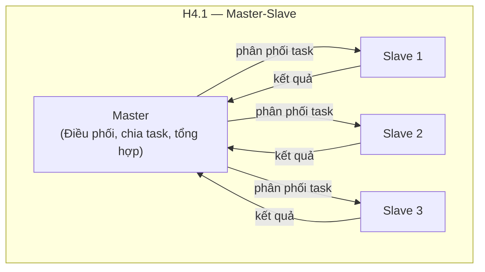
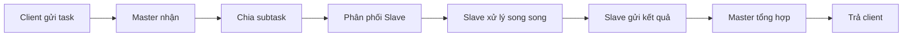

# Chương 4. Kiến trúc Master-Slave

Kiến trúc Master-Slave là mẫu kiến trúc trong đó một node chính — gọi là **Master** — đóng vai trò điều phối, còn nhiều node khác — gọi là **Slave** — thực hiện công việc thực sự. Master nhận tác vụ từ phía client, chia nhỏ thành các subtask, phân phối cho các Slave, thu thập kết quả và tổng hợp lại trước khi trả về. Các Slave làm việc song song, nhờ đó tổng thời gian xử lý có thể giảm đáng kể so với xử lý tuần tự trên một máy. Mẫu này xuất hiện trong nhiều hệ thống thực tế: từ replication cơ sở dữ liệu (MySQL Master-Slave), đến xử lý dữ liệu phân tán (Hadoop MapReduce), load balancing (load balancer và các web server), và xử lý ảnh hay dữ liệu lớn. Chương này trình bày khái niệm, cấu trúc, bốn bước luồng (phân phối → song song → tổng hợp → xử lý lỗi), ưu nhược điểm (kể cả **SPOF** tại Master), ứng dụng, case study xử lý ảnh song song và khi nên hay không nên dùng mẫu. Có thể hình dung như một điều phối viên và nhiều worker: điều phối viên giao việc song song rồi gom kết quả — nhưng nếu điều phối viên hỏng, cả chuỗi dễ đứng; trong phần mềm, MySQL replication, MapReduce hay load balancer đều mang tư tưởng tương tự.

---

## 4.1. Khái niệm và đặc điểm

Phần này định nghĩa Master và Slave, mô tả bốn bước luồng hoạt động và các đặc điểm giao tiếp.

### 4.1.1. Định nghĩa

**Kiến trúc Master-Slave** là mẫu kiến trúc trong đó có **một node chính (Master)** đóng vai trò điều phối và **nhiều node phụ (Slave)** đóng vai trò thực thi. Master phân phối công việc cho các Slave; các Slave thực hiện công việc được giao và trả kết quả về Master. Master sau đó tổng hợp kết quả (nếu cần) và trả về cho client hoặc lưu trữ. Giao tiếp mang tính **một chiều** theo nghĩa luồng điều khiển: Master gửi lệnh hoặc dữ liệu xuống Slave (command), Slave gửi kết quả hoặc trạng thái lên Master (result). Toàn bộ hệ thống được **kiểm soát tập trung** bởi Master: chỉ Master mới quyết định ai làm gì, khi nào làm và cách tổng hợp kết quả.

Các đặc điểm chính có thể tóm tắt như sau. **Master** chịu trách nhiệm: nhận và phân tích tác vụ từ client; chia tác vụ thành các subtask; phân phối subtask cho từng Slave; theo dõi trạng thái Slave (ai đang bận, ai đã xong); thu thập kết quả; tổng hợp (merge, aggregate) nếu cần; xử lý lỗi (retry, gán lại cho Slave khác) và trả kết quả cuối cùng cho client. **Slave** chịu trách nhiệm: nhận subtask từ Master; thực hiện xử lý (tính toán, truy vấn, biến đổi dữ liệu, v.v.); trả kết quả về Master; và có thể báo cáo trạng thái (heartbeat, health) để Master biết Slave còn sống và sẵn sàng nhận việc. **One-way communication** ở đây có nghĩa là luồng “ai bảo ai làm gì” rõ ràng: Master ra lệnh, Slave báo cáo; Slave không ra lệnh cho Slave khác (trừ khi thiết kế đặc biệt). **Centralized control** có nghĩa là mọi quyết định phân công và tổng hợp đều do Master đảm nhiệm, giúp đơn giản hóa logic nhưng cũng tạo ra một điểm tập trung — nếu Master hỏng, toàn bộ hệ thống có thể dừng hoạt động (Single Point of Failure, sẽ nói ở mục nhược điểm).

### 4.1.2. Nguyên tắc hoạt động

Luồng hoạt động của kiến trúc Master-Slave có thể mô tả bằng bốn bước logic chính.

**Task Distribution (Phân phối tác vụ):** Master nhận một tác vụ lớn từ client (ví dụ xử lý một file ảnh cỡ 4K, hoặc một truy vấn cần quét nhiều partition). Master phân tích và chia tác vụ này thành nhiều subtask nhỏ hơn, mỗi subtask có thể được giao cho một Slave xử lý độc lập. Việc chia nhỏ phải đảm bảo các subtask càng độc lập càng tốt để có thể chạy song song mà ít phải đồng bộ giữa các Slave.

**Parallel Processing (Xử lý song song):** Master gửi các subtask đến các Slave (theo vòng round-robin, theo tải, hoặc theo chuyên môn của Slave). Các Slave nhận subtask và xử lý đồng thời. Nhờ đó, thay vì một máy xử lý tuần tự 100 đơn vị công việc trong 100 đơn vị thời gian, ta có thể có 10 Slave xử lý song song, mỗi Slave 10 đơn vị, tổng thời gian lý thuyết chỉ còn khoảng 10 đơn vị (speedup gần tuyến tính khi subtask cân bằng).

**Result Aggregation (Tổng hợp kết quả):** Khi các Slave hoàn thành, chúng gửi kết quả về Master. Master thu thập tất cả kết quả và thực hiện bước tổng hợp: ghép các phần ảnh đã xử lý lại thành một ảnh, gộp các kết quả MapReduce thành kết quả cuối, hoặc đơn giản là tập hợp danh sách kết quả. Tùy bài toán, bước tổng hợp có thể đơn giản (chỉ cần collect) hoặc phức tạp (sắp xếp, merge, tính toán thêm).

**Fault Handling (Xử lý lỗi):** Nếu một Slave báo lỗi hoặc quá thời gian (timeout), Master có thể gán lại subtask đó cho Slave khác (retry), hoặc tiếp tục với các Slave còn lại và đánh dấu phần kết quả thiếu (degraded result). Master cũng có thể theo dõi health của Slave để không gửi tác vụ cho Slave đang down. Chiến lược xử lý lỗi cần được thiết kế rõ ràng để hệ thống vừa chịu lỗi được vừa không phức tạp quá mức.

---

## 4.2. Cấu trúc

### 4.2.1. Sơ đồ tổng quan (H4.1)

Sơ đồ dưới đây minh họa kiến trúc Master-Slave: một Master ở trên, nhiều Slave (Worker) ở dưới, kết quả được thu thập về Master.

*Hình H4.1 — Cấu trúc và luồng Master-Slave (Mermaid).*



*Luồng bảy bước (flow chuẩn):*



```
 ┌─────────────┐
 │ Master │
 │ (Coordinator)│
 └──────┬───────┘
 │
 ┌──────────────────┼──────────────────┐
 │ │ │
 ┌────▼────┐ ┌────▼────┐ ┌────▼────┐
 │ Slave 1 │ │ Slave 2 │ │ Slave 3 │
 │ (Worker)│ │ (Worker)│ │ (Worker)│
 └────┬────┘ └────┬────┘ └────┬────┘
 │ │ │
 └──────────────────┼──────────────────┘
 │
 ┌──────▼───────┐
 │ Results │
 └──────────────┘
```

### 4.2.2. Luồng hoạt động

Luồng xử lý một tác vụ từ đầu đến cuối có thể mô tả thành bảy bước: (1) Master nhận task từ client; (2) Master phân tích và chia task thành các subtask; (3) Master gửi từng subtask (hoặc batch subtask) đến các Slave; (4) Các Slave xử lý song song; (5) Các Slave gửi kết quả về Master; (6) Master tổng hợp tất cả kết quả; (7) Master trả kết quả cuối cùng cho client (hoặc lưu trữ, kích hoạt bước tiếp theo). Trong thực tế, bước 3–5 có thể lặp nhiều đợt nếu số subtask lớn hơn số Slave và Master phải điều phối theo đợt (batch).

### 4.2.3. Các thành phần

**Master Node** chịu trách nhiệm: nhận và phân tích task; chia task thành subtask; phân phối subtask cho Slaves (có thể qua hàng đợi, RPC hoặc message queue); quản lý trạng thái Slaves (available, busy, failed); tổng hợp kết quả; xử lý lỗi và retry; và trả kết quả cho client. Master có thể được thiết kế stateless (mỗi task độc lập) hoặc stateful (theo dõi tiến trình từng task). Stateless giúp dễ scale và phục hồi Master nhưng đòi hỏi lưu trạng thái task ở nơi khác (database, queue) nếu cần.

**Slave Nodes** chịu trách nhiệm: nhận subtask từ Master (qua pull hoặc push); thực hiện xử lý (tính toán, I/O, gọi service khác); trả kết quả về Master; và thường là báo cáo trạng thái định kỳ (heartbeat) hoặc phản hồi health check. Slave lý tưởng là stateless: không lưu trạng thái giữa các subtask, để có thể thay thế bằng Slave khác bất kỳ lúc nào và dễ scale bằng cách thêm Slave mới.

**Communication Channel** là kênh giao tiếp giữa Master và Slaves. Có thể dùng giao thức mạng trực tiếp (TCP/IP, HTTP, gRPC, Thrift) khi Master và Slave gọi nhau đồng bộ; hoặc dùng **message queue** (RabbitMQ, Kafka, AWS SQS) khi muốn tách biệt thời gian (async), giảm tải cho Master và cho phép Slaves pull task. Message queue còn giúp đệm tác vụ khi Slave tạm thời chậm hoặc down, và dễ scale số lượng Slave bằng cách thêm consumer.

---

## 4.3. Ưu điểm

**Parallel Processing (Xử lý song song):** Ưu điểm nổi bật nhất của Master-Slave là tận dụng nhiều Slave để xử lý đồng thời, từ đó giảm đáng kể thời gian hoàn thành so với xử lý tuần tự. Ví dụ: 100 tác vụ, mỗi tác vụ 1 giây, nếu xử lý tuần tự cần 100 giây; với 10 Slave phân bổ đều, thời gian lý thuyết còn khoảng 10 giây — speedup gần 10 lần. Trong thực tế, speedup phụ thuộc vào độ cân bằng tải và overhead phân phối/tổng hợp.

**Scalability (Khả năng mở rộng):** Để tăng công suất xử lý, ta thường chỉ cần thêm Slave (và đảm bảo Master có thể phân phối đủ nhanh). Logic Master — cách chia task và tổng hợp — thường không phải thay đổi khi thêm Slave. Scaling theo chiều ngang (horizontal scaling) bằng cách thêm Slave là đặc trưng của mẫu này.

**Fault Tolerance (Chịu lỗi):** Khi một Slave lỗi hoặc chậm, Master có thể gán lại subtask cho Slave khác (retry), hoặc bỏ qua và tiếp tục với kết quả từ các Slave còn lại (nếu bài toán cho phép). Điều này giúp hệ thống không “dừng cứng” vì lỗi một vài node, miễn là còn đủ Slave hoạt động. Cần lưu ý: bản thân Master lại là điểm đơn lỗi (SPOF), sẽ nói ở mục nhược điểm.

**Load Distribution (Phân tán tải):** Tải được phân đều cho nhiều Slave thay vì dồn vào một máy. Master có thể áp dụng chiến lược gán tác vụ theo tải (load-based) hoặc theo round-robin để tránh một Slave bị quá tải trong khi Slave khác rảnh.

**Specialization (Chuyên môn hóa):** Trong một số thiết kế, Slaves có thể được chuyên biệt cho từng loại tác vụ (ví dụ Slave A chỉ xử lý resize ảnh, Slave B chỉ xử lý filter). Master khi đó gửi subtask đến đúng Slave phù hợp, giúp tối ưu hóa tài nguyên và thời gian xử lý.

---

## 4.4. Nhược điểm và khi nào không nên dùng

**Single Point of Failure (Điểm đơn lỗi):** Master là nút then chốt: nếu Master hỏng hoặc mất kết nối, toàn bộ hệ thống không thể nhận tác vụ mới hoặc tổng hợp kết quả. Do đó Master thường cần được bảo vệ bằng cơ chế **high availability**: replication Master (Master chính + Master dự phòng) và cơ chế bầu chọn (election) khi Master chính chết, hoặc dùng hàng đợi bền vững (persistent queue) để task không mất khi Master restart.

**Complexity (Độ phức tạp):** So với chạy một chương trình tuần tự trên một máy, kiến trúc Master-Slave phức tạp hơn nhiều: cần quản lý phân phối tác vụ, thu thập kết quả, xử lý timeout và lỗi, quản lý trạng thái Slave, và có thể cần hàng đợi, service discovery, monitoring. Chi phí thiết kế và vận hành tăng lên.

**Network Overhead:** Giao tiếp giữa Master và Slaves qua mạng tốn băng thông và thêm độ trễ. Với tác vụ rất nhỏ, overhead phân phối và thu kết quả có thể lớn hơn lợi ích song song. Cần đảm bảo kích thước subtask và tần suất giao tiếp hợp lý.

**Data Consistency:** Khi nhiều Slave cùng đọc/ghi dữ liệu, vấn đề nhất quán (consistency) và điều kiện đua (race condition) nảy sinh. Cần cơ chế đồng bộ, khóa hoặc mô hình dữ liệu phù hợp (ví dụ mỗi Slave chỉ xử lý partition riêng, không ghi chồng lên nhau).

**Overhead cho tác vụ nhỏ:** Với tác vụ rất nhỏ hoặc số lượng tác vụ ít, chi phí chia task, gửi qua mạng và tổng hợp có thể làm chậm hơn so với xử lý trực tiếp trên một máy. Master-Slave phát huy lợi thế khi khối lượng công việc đủ lớn và có thể chia thành nhiều subtask độc lập.

**Khi nào không nên dùng:** Không nên áp dụng Master-Slave khi tác vụ quá nhỏ (overhead lớn hơn lợi ích); khi tác vụ phụ thuộc chặt chẽ lẫn nhau (khó chia song song); khi không có đủ tài nguyên (ít máy, ít process); hoặc khi yêu cầu real-time rất chặt (độ trễ mạng và điều phối có thể không chấp nhận được). Trong những trường hợp đó, kiến trúc đơn giản hơn (một process, hoặc pipeline tuần tự) có thể phù hợp hơn.

---

## 4.5. Ứng dụng thực tế

**Database Replication:** Trong **MySQL Master-Slave Replication**, một node Master nhận mọi ghi (write), còn các node Slave nhận bản sao dữ liệu từ Master và phục vụ đọc (read). Ở đây “tác vụ” là việc phục vụ truy vấn: đọc được phân tán cho nhiều Slave, ghi tập trung ở Master. Lợi ích: tăng khả năng đọc (read scaling), sao lưu và phục hồi, phân bố địa lý.

**Distributed Computing:** **Hadoop MapReduce** dùng mô hình tương tự: JobTracker (Master) nhận job, chia thành các task Map và Reduce, phân phối cho các TaskTracker (Slave). Map phase xử lý song song từng phần dữ liệu; Shuffle và Reduce phase tổng hợp kết quả. Đây là ví dụ điển hình của Master-Slave cho xử lý dữ liệu lớn.

**Load Balancing:** **Load Balancer** đóng vai trò điều phối (gần với Master): nhận request từ client và chuyển tiếp đến một trong các **Web Server** (đóng vai trò Slave phục vụ request). Load balancer có thể dùng round-robin, least connections, hoặc theo health check. Mặc dù mỗi request thường do một server xử lý trọn vẹn (không chia nhỏ request), mô hình điều phối “một trung tâm – nhiều worker” vẫn giống Master-Slave.

**Image Processing:** Xử lý ảnh lớn (4K, 8K) có thể chia ảnh thành các vùng (chunks), gửi mỗi vùng cho một Worker để resize, filter hoặc nén, sau đó Master ghép lại thành ảnh hoàn chỉnh. Case study bên dưới minh họa chi tiết hơn.

**Data Mining:** Dataset lớn được chia thành nhiều partition; mỗi Slave phân tích một partition (ví dụ đếm, thống kê, train mô hình cục bộ); Master tổng hợp kết quả (tổng hợp thống kê, ensemble model). Mô hình này phổ biến trong các framework phân tán như Spark (với Driver và Executors).

---

## 4.6. Case study: Hệ thống xử lý ảnh song song

**Yêu cầu:** Hệ thống cần xử lý ảnh độ phân giải cao (4K, 8K); áp dụng nhiều thao tác (resize, filter, nén); thời gian xử lý phải nhanh; và cần scale theo số lượng ảnh cần xử lý (nhiều ảnh thì có thể tăng số Worker).

**Kiến trúc:** Một **Image Processing Master** nhận ảnh đầu vào, chia ảnh thành các chunk (ví dụ theo từng dải chiều cao), gửi mỗi chunk kèm danh sách thao tác (resize, filter, compress) đến các **Worker** (Slave). Mỗi Worker xử lý chunk nhận được và trả về kết quả (chunk đã xử lý). Master nhận tất cả chunk, ghép theo thứ tự ban đầu và xuất ảnh cuối cùng. Sơ đồ luồng: Master (receive → split → distribute) → Workers (process chunks in parallel) → Master (merge → output).

**Triển khai gợi ý:** Master có thể là một service (Python, Java, v.v.) với logic split image (chia theo chiều cao hoặc theo grid), gửi task qua message queue (RabbitMQ, Redis Queue) hoặc RPC. Workers subscribe queue hoặc nhận RPC, xử lý chunk (dùng thư viện ảnh như PIL, ImageMagick, OpenCV), và gửi kết quả về. Master merge các chunk (đảm bảo đúng thứ tự) và lưu file. Code mẫu chi tiết (Python với class ImageProcessingMaster và ImageProcessingWorker) có trong bài giảng nguồn §4.6.3; ở đây chỉ nêu ý tưởng để người đọc tự triển khai hoặc tham khảo thêm.

---

## 4.7. Best practices

**Thiết kế Master:** Nên thiết kế Master **stateless** nếu có thể (mỗi task độc lập, trạng thái lưu ở queue hoặc database) để dễ phục hồi và scale. Các thao tác phân phối nên **idempotent** khi có thể (gửi lại cùng subtask không gây hại) để retry an toàn. Master nên **health check** Slaves định kỳ và không gửi task cho Slave không phản hồi. Dùng **task queue** (hàng đợi tác vụ) giúp tách biệt việc nhận task và việc Slaves lấy task, dễ scale và chịu lỗi hơn.

**Thiết kế Slave:** Slaves nên **stateless** để có thể thay thế và scale ngang. **Error handling** rõ ràng: báo lỗi về Master thay vì “chết im”; có thể dùng dead-letter queue cho task lỗi. **Heartbeat** hoặc periodic status giúp Master biết Slave còn sống và có thể gán thêm task.

**Communication:** Ưu tiên **async** (message queue) khi tải cao hoặc cần tách biệt Master/Slave về thời gian. **Retry** với backoff cho lỗi tạm thời; **timeout** cho từng subtask để tránh Slave treo kéo dài.

**Fault Tolerance:** **Master replication** hoặc **Master election** để tránh SPOF. **Slave redundancy:** nhiều Slave hơn mức tối thiểu để khi một số lỗi vẫn còn đủ xử lý. **Checkpointing** (lưu tiến trình) cho task rất dài để khi Master/Slave restart có thể tiếp tục từ checkpoint.

---

## 4.8. Câu hỏi ôn tập

1. Định nghĩa kiến trúc Master-Slave và nêu luồng bảy bước từ khi Master nhận task đến khi trả kết quả cho client.
2. Tại sao Master được coi là Single Point of Failure? Nêu ít nhất hai giải pháp giảm thiểu.
3. So sánh ngắn gọn Master-Slave với kiến trúc phân tầng (Layered): tập trung vs phân tán, vai trò điều phối.
4. Khi nào không nên dùng Master-Slave?
5. Giải thích ngắn gọn cách MySQL Replication sử dụng mô hình Master-Slave (ai đọc, ai ghi, lợi ích).

---

## 4.9. Bài tập ngắn

**BT4.1.** Vẽ sơ đồ kiến trúc Master-Slave cho hệ thống render video: một job là một video, được chia thành nhiều segment theo thời gian; mỗi segment do một Worker render; Master tổng hợp các file segment thành video hoàn chỉnh. Nêu rõ thành phần Master và Slave, luồng dữ liệu.

**BT4.2.** Trong hệ thống BT4.1, đề xuất cách tránh Single Point of Failure cho Master (ví dụ: dự phòng Master, dùng queue bền vững, election). Trình bày ngắn gọn ý tưởng và trade-off.

---

*Hình: H4.1 — Sơ đồ Master-Slave. Xem thêm: Chương 2 (phân loại), Chương 7 (Broker — message queue). Glossary: SPOF, Scalability.*
