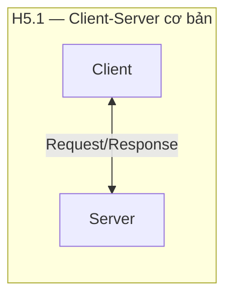
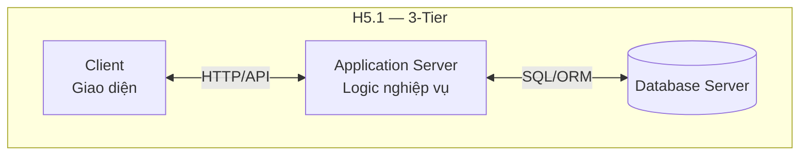
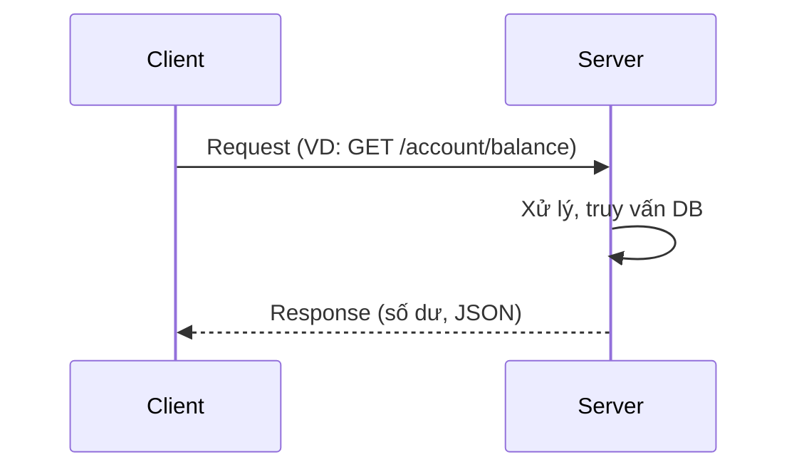
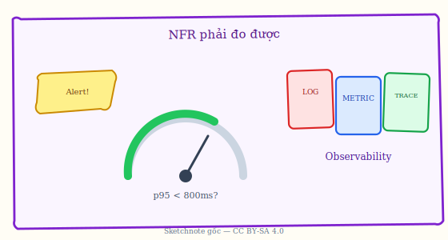

# Chương 5. Kiến trúc Client-Server

Hệ thống chia thành **Client** (bên yêu cầu dịch vụ) và **Server** (bên cung cấp dịch vụ). Hai bên giao tiếp theo kiểu **request-response** (gửi yêu cầu → nhận phản hồi); việc quản lý dữ liệu và nghiệp vụ tập trung ở Server. Chương này so sánh **2-tier, 3-tier và N-tier**, phân tích ưu nhược và khi không nên dùng, case study (ví dụ ngân hàng trực tuyến), sơ đồ, cùng thực hành HTTPS, xác thực, load balancing và caching. Có thể hình dung như **nhà hàng**: khách đặt món, bếp xử lý và trả món — nguyên liệu và công thức nằm ở bếp; trình duyệt/app là Client, máy chủ nghiệp vụ là Server.

---

## 5.1. Khái niệm và đặc điểm

Phần này định nghĩa Client, Server và chu kỳ request-response.

### 5.1.1. Định nghĩa

**Kiến trúc Client-Server** là mẫu kiến trúc trong đó hệ thống được chia thành hai vai trò rõ ràng.

- **Client (máy khách)** là thành phần **khởi tạo yêu cầu**: hiển thị giao diện cho người dùng, nhận thao tác (click, nhập liệu), gửi yêu cầu lên Server qua mạng, và hiển thị kết quả khi nhận được phản hồi. Client thường không lưu trữ dữ liệu nghiệp vụ chính; nó chỉ “hỏi” Server khi cần.

- **Server (máy chủ)** là thành phần **cung cấp dịch vụ**: nhận yêu cầu từ Client, thực hiện logic nghiệp vụ (kiểm tra, tính toán, cập nhật dữ liệu), truy cập cơ sở dữ liệu nếu cần, và gửi phản hồi về Client. Dữ liệu và quy tắc nghiệp vụ tập trung ở Server, nên dễ bảo mật và đồng bộ.

**Request-Response** nghĩa là mỗi tương tác gồm một chu kỳ: Client gửi request → Server xử lý → Server gửi response → Client nhận và hiển thị. **Centralized** (tập trung) nghĩa là quản lý dữ liệu và nghiệp vụ tập trung tại Server; nhiều Client có thể kết nối tới cùng một Server.

### 5.1.2. Nguyên tắc hoạt động

Luồng điển hình: (1) **Client initiates** — Client khởi tạo (ví dụ người dùng nhấn “Xem số dư”); (2) **Server processes** — Server nhận request, kiểm tra quyền, thực hiện logic, đọc/ghi dữ liệu; (3) **Server responds** — Server gửi kết quả (số dư, thông báo lỗi, v.v.) về Client; (4) **Client displays** — Client hiển thị kết quả cho người dùng.

---

## 5.2. Cấu trúc (H5.1)

*Hình H5.1 — Client-Server: mô hình cơ bản và 3-tier (Mermaid).*

*Luồng request-response chuẩn:*

### 5.2.1. Mô hình cơ bản

Mô hình đơn giản nhất: **Client (giao diện)** **Request/Response qua mạng** **Server (nghiệp vụ + dữ liệu)**. Client có thể là ứng dụng web (trình duyệt), app mobile, hoặc ứng dụng desktop; Server là một hoặc nhiều chương trình chạy trên máy chủ, kết nối với cơ sở dữ liệu.

### 5.2.2. 2-Tier (Hai tầng)

**2-Tier** chia thành hai “tầng” triển khai: **Client** (vừa giao diện vừa chứa một phần logic) và **Server** (cơ sở dữ liệu và logic còn lại). Ví dụ: ứng dụng desktop cài trên máy từng nhân viên (Client) kết nối trực tiếp tới một máy chủ cơ sở dữ liệu (Server). Ưu điểm là đơn giản; nhược điểm là logic và dữ liệu nằm rải rác, khó cập nhật đồng loạt khi đổi quy tắc.

### 5.2.3. 3-Tier (Ba tầng)

**3-Tier** tách rõ ba tầng: **Client** (chỉ giao diện) **Application Server** (máy chủ ứng dụng — chứa toàn bộ logic nghiệp vụ) **Database Server** (máy chủ cơ sở dữ liệu). Client chỉ gửi request và hiển thị; mọi xử lý và truy cập dữ liệu diễn ra ở Application Server và Database Server. Cách này phù hợp ứng dụng web: trình duyệt = Client, backend (Java/Python/Node...) = Application Server, MySQL/PostgreSQL = Database Server. Dễ bảo trì và mở rộng hơn 2-tier.

### 5.2.4. N-Tier (N tầng)

**N-Tier** mở rộng thành nhiều tầng hơn, ví dụ: Web Server → Application Server → Business Service → Data Access → Database. Mỗi tầng có thể chạy trên nhóm máy riêng, phù hợp hệ thống lớn cần tách biệt rõ từng khối chức năng.

---

## 5.3. Ưu điểm

- **Quản lý tập trung (Centralized management):** Dữ liệu và quy tắc nghiệp vụ ở một nơi (Server), dễ bảo trì, backup và áp dụng chính sách chung.

- **Bảo mật (Security):** Dữ liệu nhạy cảm nằm trên Server; xác thực (auth) và phân quyền có thể tập trung tại Server. Client chỉ nhận dữ liệu Server cho phép.

- **Khả năng mở rộng (Scalability):** Có thể tăng sức chịu tải bằng cách thêm Server hoặc dùng **load balancer** (thiết bị phân phối tải) chia request cho nhiều Server.

- **Bảo trì (Maintainability):** Cập nhật logic hoặc dữ liệu ở Server thì mọi Client dùng chung Server đó đều nhận thay đổi; không cần cập nhật từng máy Client (đặc biệt với web: chỉ cần cập nhật backend).

- **Chia sẻ tài nguyên (Resource sharing):** Nhiều Client dùng chung tài nguyên (database, tính toán) trên Server.

*Minh họa sketchnote — Yêu cầu phi chức năng (hiệu năng, độ tin cậy…) nên được gắn với chỉ số đo được (SLO) khi thiết kế Client-Server ở quy mô production.*

---

## 5.4. Nhược điểm và khi nào không nên dùng

- **Server quá tải (Server overload):** Mọi request đều đi qua Server; khi số Client tăng mạnh, Server có thể trở thành nút thắt. Cần thiết kế scale (nhiều instance, cache, load balancer).

- **Phụ thuộc mạng (Network dependency):** Client và Server giao tiếp qua mạng; mạng chậm hoặc lỗi thì trải nghiệm kém. Ứng dụng offline thuần túy không phù hợp mô hình Client-Server thuần.

- **Điểm đơn lỗi (SPOF — Single Point of Failure):** Nếu Server hỏng, toàn bộ Client không dùng được dịch vụ. Cần thiết kế high availability (nhiều Server, failover). Xem Glossary: SPOF.

- **Chi phí:** Vận hành Server (phần cứng, điện, bảo trì) và có thể chi phí bản quyền phần mềm máy chủ.

**Khi nào không nên dùng Client-Server thuần:** (1) Ứng dụng **offline** hoặc cần hoạt động không phụ thuộc mạng; (2) **Real-time collaboration** kiểu nhiều người chỉnh sửa cùng lúc (có thể cần mô hình P2P hoặc đồng bộ phức tạp hơn); (3) Bài toán cố ý **phân tán, không có trung tâm** (ví dụ P2P, blockchain); (4) Yêu cầu **decentralized** (phi tập trung) về mặt tổ chức hoặc kỹ thuật.

---

## 5.5. Ứng dụng thực tế

- **Web:** Trình duyệt (Client) → Web/Application Server → Database. Ví dụ: trang tin tức, trang bán hàng, nội bộ công ty.

- **Email:** Ứng dụng mail (Client) gửi/nhận qua SMTP/IMAP tới mail server (Server).

- **Cơ sở dữ liệu:** Ứng dụng (Client) kết nối tới database server (MySQL, PostgreSQL...) để truy vấn và cập nhật.

- **Chia sẻ file:** FTP, SMB — client tải lên/tải xuống file qua server.

- **Game online:** Game client (máy người chơi) kết nối tới game server (xử lý logic, đồng bộ trạng thái).

---

## 5.6. Case study: Ngân hàng trực tuyến

**Yêu cầu:** Bảo mật cao, giao dịch theo thời gian thực (real-time), nhiều user đồng thời, có audit trail (vết kiểm toán).

**Kiến trúc:** Client (Web/Mobile app) gửi request qua **HTTPS** (mã hóa) tới Application Server (xác thực — Auth, giao dịch — Transaction, tài khoản — Account) → Database lưu trữ. Mỗi thao tác quan trọng (đăng nhập, chuyển tiền) đều đi qua Server để kiểm tra và ghi log.

**Luồng chuyển tiền (đơn giản hóa):** (1) Người dùng đăng nhập → Client gửi username/password → Server xác thực và trả **JWT** (token dùng cho các request sau; xem Glossary); (2) Người dùng nhập số tiền chuyển và tài khoản đích → Client gửi **POST /transfer** kèm JWT và dữ liệu; (3) Server kiểm tra JWT, validate số dư, trừ tiền tài khoản nguồn, cộng tiền tài khoản đích, ghi log → trả response thành công/lỗi; (4) Client hiển thị thông báo. Code minh họa thường gồm Spring Controller (nhận request) và TransactionService (logic nghiệp vụ) — có thể tham khảo nguồn §5.6.4.

---

## 5.7. Best practices

- **Server:** Thiết kế **stateless** (không lưu trạng thái phiên trên Server khi có thể; dùng token như JWT); dùng **RESTful API** (chuẩn URL, HTTP method) rõ ràng; xử lý lỗi và ghi log đầy đủ.

- **Client:** Ưu tiên **thin client** (ít logic, chủ yếu hiển thị và gửi request); dùng **caching** (lưu tạm dữ liệu ít đổi) để giảm request; nếu cần có thể hỗ trợ offline (đồng bộ sau).

- **Bảo mật:** Dùng **HTTPS**; xác thực (auth) và phân quyền (authorization) ở Server; kiểm tra đầu vào (input validation) để tránh lỗ hổng.

- **Hiệu năng:** **Load balancing** (phân tải nhiều Server); **caching** (Redis, CDN); **connection pooling** (dùng lại kết nối); **async** (xử lý bất đồng bộ) khi phù hợp.

---

## 5.8. Câu hỏi ôn tập

1. So sánh 2-tier và 3-tier.
2. Ưu và nhược điểm của Client-Server so với P2P?
3. Khi nào không nên dùng Client-Server?
4. Vai trò của HTTPS trong case study ngân hàng?
5. Nêu các bước luồng chuyển tiền (từ đăng nhập đến nhận response).

---

## 5.9. Bài tập ngắn

**BT5.1.** Vẽ kiến trúc 3-tier cho ứng dụng đặt phòng khách sạn (Web): nêu rõ Client, Application Server, Database và luồng request khi khách đặt phòng.

**BT5.2.** Giải thích tại sao hệ thống chat real-time có thể cần bổ sung mô hình khác (ví dụ WebSocket, event) ngoài request-response thuần.

---
*H5.1. Xem thêm: Chương 6 (P2P), Chương 7 (Broker). Glossary: Request-Response, 2-Tier, 3-Tier, SPOF, JWT.*
