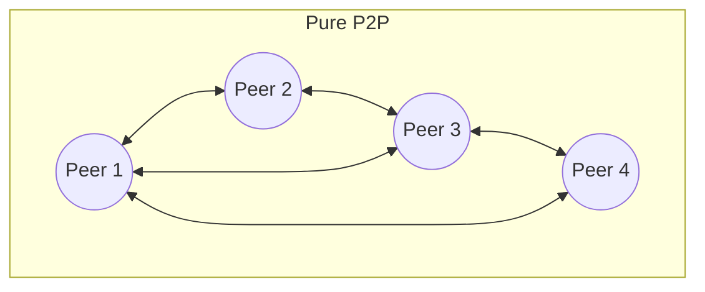
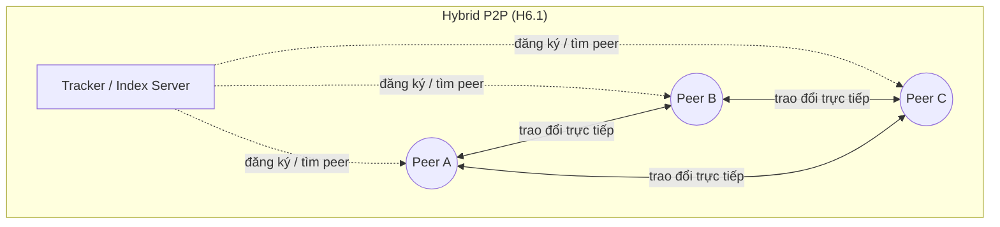
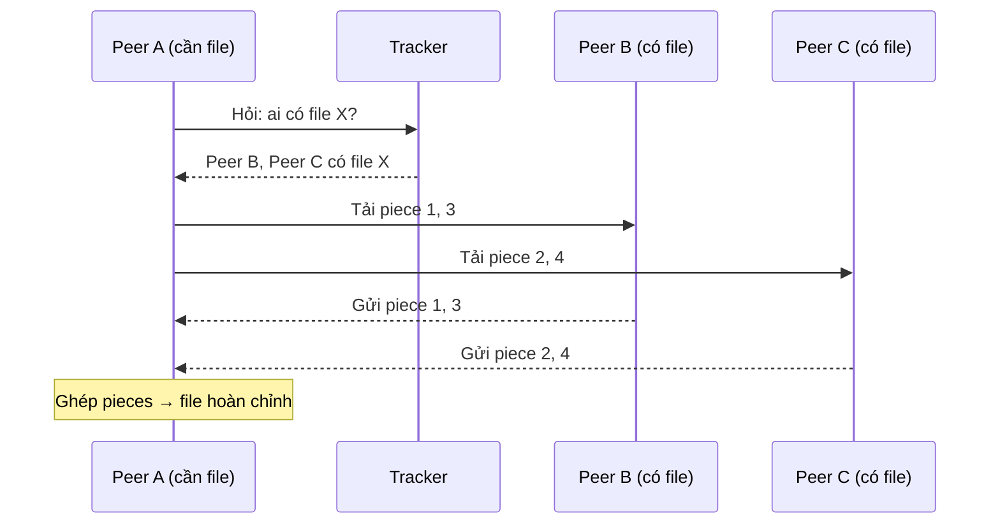
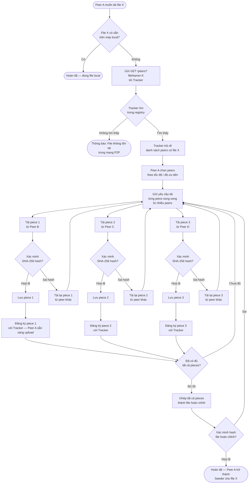
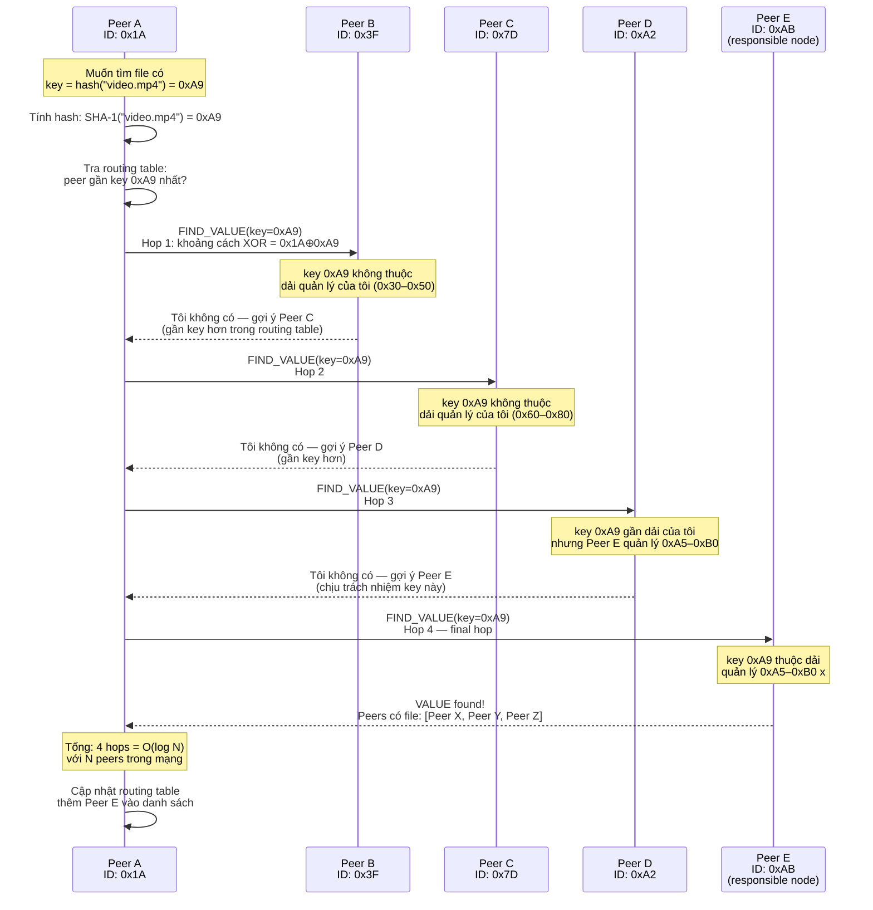

# Chương 6. Kiến trúc Peer-to-Peer (P2P)

Trong các mẫu kiến trúc đã xét (Layered, Master-Slave, Client-Server), luôn có sự phân biệt rõ ràng giữa "bên phục vụ" và "bên sử dụng". Kiến trúc **Peer-to-Peer (P2P)** phá vỡ sự phân biệt đó: mỗi node trong mạng — gọi là **peer** — có vai trò **ngang nhau**, vừa là client (yêu cầu dịch vụ) vừa là server (cung cấp dịch vụ). Không có node trung tâm bắt buộc; các peer tự tổ chức, giao tiếp trực tiếp và chia sẻ tài nguyên với nhau. Nhờ đó, hệ thống P2P có khả năng mở rộng tự nhiên (thêm peer = thêm tài nguyên) và chịu lỗi tốt (một vài peer tắt không làm cả mạng dừng). Tuy nhiên, P2P cũng đặt ra nhiều thách thức về bảo mật, chất lượng dịch vụ và quản lý. Chương này trình bày khái niệm, biến thể (Pure, Hybrid, Structured/DHT, Unstructured), ưu nhược, khi không nên dùng (SLA chặt, kiểm soát tập trung), ứng dụng (BitTorrent, blockchain, CDN P2P), case study chia sẻ file và code minh họa. Có thể hình dung như **chợ trời** hoặc nhóm chia sẻ ngang hàng: không ông chủ bắt buộc; file lớn tới nhiều người nhờ mỗi peer vừa tải vừa seed — khác Client-Server nơi một server phải phục vụ mọi bản sao.

---

## 6.1. Khái niệm và đặc điểm

Phần này định nghĩa peer, bốn bước luồng điển hình và các đặc điểm phi tập trung.

### 6.1.1. Định nghĩa

**Kiến trúc Peer-to-Peer (P2P)** là mẫu kiến trúc mạng phân tán trong đó các node tham gia — gọi là **peer** — có vai trò **đối xứng** (symmetric): mỗi peer vừa yêu cầu tài nguyên (đóng vai client) vừa cung cấp tài nguyên (đóng vai server). Các peer **giao tiếp trực tiếp** với nhau mà không bắt buộc phải đi qua một server trung tâm. Mạng P2P có tính **tự tổ chức** (self-organizing): khi peer mới tham gia hoặc peer cũ rời đi, mạng tự điều chỉnh mà không cần quản trị viên can thiệp thủ công.

Có bốn đặc điểm chính. Thứ nhất, **phi tập trung (decentralization)**: không có node trung tâm duy nhất kiểm soát toàn bộ mạng; quyền kiểm soát được phân bổ cho tất cả peer. Thứ hai, **đối xứng vai trò (symmetry)**: mỗi peer có cùng khả năng và trách nhiệm; không phân biệt "máy chủ" và "máy khách" cố định. Thứ ba, **tự tổ chức (self-organizing)**: mạng tự cấu hình khi có thay đổi; peer mới tham gia tự tìm và kết nối với các peer khác. Thứ tư, **chia sẻ tài nguyên trực tiếp**: tài nguyên (file, băng thông, sức tính toán) được chia sẻ trực tiếp giữa các peer, không qua trung gian bắt buộc.

### 6.1.2. Nguyên tắc hoạt động

Luồng hoạt động của một mạng P2P có thể mô tả qua bốn bước chính.

**Peer Discovery (Tìm peer):** Khi một peer mới muốn tham gia mạng, nó cần biết ít nhất một peer đã tồn tại để kết nối. Cách tìm có thể là: danh sách peer ban đầu (bootstrap nodes), server đăng ký (tracker trong BitTorrent), hoặc cơ chế broadcast/multicast trên mạng cục bộ. Sau khi kết nối với một peer, nó có thể hỏi peer đó để biết thêm các peer khác.

**Direct Communication (Giao tiếp trực tiếp):** Sau khi biết nhau, các peer giao tiếp trực tiếp — gửi/nhận dữ liệu, yêu cầu tài nguyên — mà không cần đi qua server trung tâm. Giao tiếp có thể qua TCP/IP, UDP hoặc các giao thức chuyên biệt.

**Resource Sharing (Chia sẻ tài nguyên):** Mỗi peer đóng góp tài nguyên vào mạng: file, băng thông, CPU, dung lượng lưu trữ. Khi peer A cần một file, nó hỏi các peer khác; peer B có file đó sẽ gửi trực tiếp cho A. Nếu nhiều peer có cùng file, A có thể tải đồng thời từ nhiều nguồn (parallel download), tăng tốc đáng kể.

**Redundancy (Dư thừa/Nhân bản):** Dữ liệu phổ biến tự động tồn tại ở nhiều peer. Điều này giúp mạng chịu lỗi: khi một số peer rời đi, dữ liệu vẫn còn ở các peer khác. Tuy nhiên cũng dẫn đến thách thức về nhất quán (consistency) — khi dữ liệu bị sửa, các bản sao có thể không cập nhật đồng thời.

---

## 6.2. Các biến thể

### 6.2.1. Pure P2P

Trong **Pure P2P**, không có bất kỳ server trung tâm nào. Mọi chức năng — tìm kiếm, lưu trữ, giao tiếp — đều do các peer đảm nhiệm. Ví dụ: Gnutella (phiên bản đầu) — khi tìm file, peer gửi query cho tất cả peer láng giềng, mỗi peer lại chuyển tiếp cho láng giềng của mình (flooding). Ưu điểm: không SPOF; nhược điểm: tìm kiếm chậm, tốn băng thông do flooding.

### 6.2.2. Hybrid P2P

**Hybrid P2P** kết hợp một server trung tâm nhẹ (tracker, index server) với giao tiếp P2P. Server chỉ giúp **tìm peer** (peer discovery) và **đăng ký tài nguyên** (indexing); dữ liệu thực tế vẫn trao đổi trực tiếp giữa các peer. Ví dụ: BitTorrent dùng tracker để biết peer nào đang có file nào, nhưng việc tải file diễn ra trực tiếp giữa các peer. Napster (thời kỳ đầu) dùng server trung tâm để tìm kiếm nhạc, nhưng tải nhạc P2P.

### 6.2.3. Structured P2P (DHT)

**Structured P2P** tổ chức các peer theo một cấu trúc xác định, thường dùng **DHT (Distributed Hash Table — Bảng băm phân tán)**. Mỗi tài nguyên được gán một key (hash); mỗi peer chịu trách nhiệm cho một dải key. Khi cần tìm tài nguyên, peer tính hash và "nhảy" qua vài peer trung gian (O(log N) bước) để đến peer lưu tài nguyên đó. Ví dụ: Chord, Kademlia (dùng trong BitTorrent DHT, IPFS). Ưu điểm: tìm kiếm hiệu quả, có bảo đảm tìm được nếu tài nguyên tồn tại. Nhược điểm: phức tạp hơn unstructured, cần duy trì cấu trúc khi peer join/leave.

### 6.2.4. Unstructured P2P

**Unstructured P2P** không có cấu trúc cố định; peer kết nối tùy ý. Tìm kiếm bằng flooding, random walk hoặc dùng super peer (peer mạnh hơn đóng vai trò index cục bộ). Ví dụ: Gnutella, Freenet. Ưu điểm: đơn giản, linh hoạt; nhược điểm: tìm kiếm không hiệu quả khi mạng lớn.

---

## 6.3. Cấu trúc (H6.1)

*Hình H6.1 — P2P: Pure và Hybrid (Mermaid).*





*Luồng chia sẻ file (Hybrid P2P):*



*Flowchart chi tiết — Quy trình chia sẻ file P2P hoàn chỉnh:*



*Sequence diagram chi tiết — DHT Lookup (Structured P2P):*



---

## 6.4. Ưu điểm

**Phi tập trung (Decentralization):** Không có SPOF — không một máy nào "chết" làm cả hệ thống dừng. Trong Pure P2P, kể cả khi phần lớn peer tắt, các peer còn lại vẫn có thể giao tiếp. Điều này cũng khiến mạng P2P khó bị kiểm duyệt hoặc ngắt bởi một bên duy nhất.

**Khả năng mở rộng (Scalability):** Đây là ưu điểm nổi bật nhất. Trong Client-Server, thêm client = thêm tải cho server; trong P2P, **thêm peer = thêm tài nguyên**. Mỗi peer mới không chỉ yêu cầu mà còn đóng góp băng thông, lưu trữ và sức tính toán. BitTorrent minh họa điều này rõ ràng: file càng phổ biến (nhiều peer có) thì tải càng nhanh, ngược hẳn với Client-Server nơi file phổ biến gây quá tải server.

**Chịu lỗi (Fault Tolerance):** Dữ liệu tồn tại ở nhiều peer (redundancy tự nhiên). Khi một số peer lỗi hoặc rời mạng, các peer khác vẫn có thể cung cấp dữ liệu. Mạng tự tổ chức lại mà không cần can thiệp thủ công.

**Tiết kiệm chi phí (Cost Effective):** Không cần đầu tư server trung tâm mạnh và đắt đỏ. Tài nguyên được đóng góp bởi chính người dùng cuối. Với các tổ chức phi lợi nhuận hoặc cộng đồng, đây là lợi thế lớn.

**Tận dụng tài nguyên (Resource Utilization):** P2P tận dụng tài nguyên nhàn rỗi của các máy tham gia — dung lượng ổ cứng chưa dùng, băng thông dư, CPU rảnh — thay vì để lãng phí. Ví dụ: Folding@home dùng CPU/GPU rảnh của hàng triệu máy để mô phỏng protein.

---

## 6.5. Nhược điểm và khi nào không nên dùng

**Bảo mật (Security):** Vì không có trung tâm kiểm soát, peer có thể độc hại: gửi dữ liệu giả (**data poisoning**), phát tán malware qua file chia sẻ, hoặc nghe lén giao tiếp. Cần mã hóa, chữ ký số và hệ thống xác minh (hash verification) để giảm thiểu rủi ro.

**Chất lượng dịch vụ (Quality Control):** Không có **SLA** (thỏa thuận mức dịch vụ) chặt chẽ. Tốc độ tải phụ thuộc vào peer đang online và sẵn sàng chia sẻ — nếu ít peer có file, tải chậm hoặc không tải được. Không đảm bảo uptime hay thời gian phản hồi.

**Phát hiện tài nguyên (Discovery):** Tìm kiếm tài nguyên trong mạng P2P lớn là thách thức. Flooding (gửi query cho mọi peer) không hiệu quả, tốn băng thông. DHT giải quyết bằng cấu trúc, nhưng phức tạp hơn. Super peer (peer mạnh đóng vai index) là giải pháp trung gian.

**Nhất quán dữ liệu (Data Consistency):** Khi nhiều bản sao tồn tại trên nhiều peer, việc cập nhật đồng bộ gần như không khả thi ngay lập tức. Mô hình thường là **eventual consistency** — nhất quán sau một thời gian, không đảm bảo tức thì.

**Vấn đề pháp lý:** Chia sẻ nội dung có bản quyền qua P2P gây tranh cãi pháp lý và đã dẫn đến nhiều vụ kiện (Napster, LimeWire).

**NAT Traversal:** Nhiều peer nằm sau firewall hoặc NAT, khiến việc kết nối trực tiếp khó khăn. Cần kỹ thuật **STUN/TURN** (giao thức giúp peer sau NAT giao tiếp) hoặc relay server để vượt qua.

**Khi nào không nên dùng P2P:** (1) Cần **kiểm soát tập trung** — dữ liệu phải được quản lý, kiểm duyệt chặt (ví dụ hệ thống nội bộ doanh nghiệp, hệ thống y tế); (2) Cần **SLA chặt** — đảm bảo thời gian phản hồi, uptime, throughput (ví dụ giao dịch tài chính); (3) **Bảo mật cao** — dữ liệu nhạy cảm không thể phát tán ra các peer không tin cậy; (4) **Kiểm duyệt nội dung** — cần kiểm tra tính hợp lệ trước khi phân phối.

---

## 6.6. Ứng dụng thực tế

**Chia sẻ file — BitTorrent:** Đây là ứng dụng P2P phổ biến nhất. Một file được chia thành nhiều **piece** (mảnh); các peer tải piece từ nhiều nguồn đồng thời. Cơ chế **tit-for-tat** (ưu tiên chia sẻ cho peer cũng đang chia sẻ lại) khuyến khích đóng góp và hạn chế **free-riding** (chỉ tải mà không upload). Tracker (hoặc DHT) giúp peer tìm nhau. **IPFS (InterPlanetary File System)** là hệ thống P2P mới hơn, dùng **content-addressing** (mỗi file có hash riêng, không cần biết file ở đâu — chỉ cần biết hash) và DHT.

**Blockchain — Bitcoin:** Mạng Bitcoin là mạng P2P thuần túy: các node (full node, light node, miner) giao tiếp ngang hàng; không server trung tâm. Mỗi full node lưu toàn bộ blockchain. Giao dịch được phát broadcast qua mạng peer; miner xác nhận giao dịch bằng Proof of Work (PoW) và thêm vào blockchain.

**CDN P2P:** WebTorrent cho phép tải nội dung theo kiểu P2P ngay trong trình duyệt. Một số CDN sử dụng P2P để giảm tải cho origin server: người xem video A có thể chia sẻ dữ liệu đã buffer cho người xem khác gần đó.

**Giao tiếp:** Skype ban đầu sử dụng kiến trúc P2P (super node) cho gọi điện; WebRTC cho phép video call P2P trực tiếp qua trình duyệt mà không cần server trung gian cho media.

**Tính toán phân tán:** SETI@home (phân tích tín hiệu vô tuyến tìm trí tuệ ngoài Trái Đất), Folding@home (mô phỏng protein) — hàng triệu máy tình nguyện đóng góp CPU/GPU rảnh.

---

## 6.7. Case study: Hệ thống chia sẻ file P2P

**Yêu cầu:** Xây dựng hệ thống chia sẻ file lớn (hàng trăm MB đến vài GB) giữa nhiều người dùng. Không muốn dùng server trung tâm lưu file (tốn chi phí, nút thắt). Tải nhanh nhờ nhiều nguồn đồng thời. Hệ thống phải chịu lỗi — một số peer offline không ảnh hưởng.

**Kiến trúc (mô phỏng BitTorrent đơn giản):** Một **tracker** (lightweight server) giúp peer tìm nhau — lưu danh sách peer đang có file nào. File được chia thành nhiều **piece** (ví dụ mỗi piece 256 KB). Mỗi piece có **hash** để xác minh tính toàn vẹn. Khi peer A muốn tải file X, nó hỏi tracker → nhận danh sách peer đang có file X → kết nối đến nhiều peer → tải piece từ nhiều nguồn → xác minh hash từng piece → khi có đủ piece, ghép thành file hoàn chỉnh. Trong lúc tải, peer A cũng chia sẻ các piece đã có cho peer khác (upload song song). Chiến lược chọn piece: **rarest-first** — ưu tiên tải piece hiếm nhất (ít peer có) để tăng khả năng sống sót của piece đó trong mạng.

**Luồng chi tiết:** (1) Peer A gửi request "Tôi muốn file X" tới Tracker. (2) Tracker trả về danh sách: Peer B có piece 1,2,3; Peer C có piece 2,3,4. (3) Peer A kết nối Peer B, tải piece 1; kết nối Peer C, tải piece 4. (4) Peer A tải piece 2 từ Peer B hoặc C (chọn peer nhanh hơn). (5) Sau khi có piece 1, Peer A thông báo tracker và sẵn sàng upload piece 1 cho peer khác. (6) Peer A ghép piece 1,2,3,4 → file hoàn chỉnh.

### Ví dụ code (Java Spring Boot — Tracker và Peer đơn giản)

Đoạn code dưới đây minh họa ý tưởng tracker và peer ở mức đơn giản bằng Java Spring Boot. Tracker là một REST API lưu danh sách peer cho mỗi file. Peer đăng ký file mình có và hỏi tracker để biết peer khác.

**Model — DTO cho request/response:**

```java
// RegisterRequest.java
public class RegisterRequest {
 private String fileName;
 private String peerAddress;
 private int peerPort;

 public RegisterRequest() {}

 public RegisterRequest(String fileName, String peerAddress, int peerPort) {
 this.fileName = fileName;
 this.peerAddress = peerAddress;
 this.peerPort = peerPort;
 }

 public String getFileName() { return fileName; }
 public void setFileName(String fileName) { this.fileName = fileName; }
 public String getPeerAddress() { return peerAddress; }
 public void setPeerAddress(String peerAddress) { this.peerAddress = peerAddress; }
 public int getPeerPort() { return peerPort; }
 public void setPeerPort(int peerPort) { this.peerPort = peerPort; }
}
```

```java
// PeerInfo.java
public class PeerInfo {
 private String address;
 private int port;

 public PeerInfo() {}

 public PeerInfo(String address, int port) {
 this.address = address;
 this.port = port;
 }

 public String getAddress() { return address; }
 public void setAddress(String address) { this.address = address; }
 public int getPort() { return port; }
 public void setPort(int port) { this.port = port; }

 @Override
 public boolean equals(Object o) {
 if (this == o) return true;
 if (!(o instanceof PeerInfo)) return false;
 PeerInfo that = (PeerInfo) o;
 return port == that.port && address.equals(that.address);
 }

 @Override
 public int hashCode() {
 return address.hashCode() * 31 + port;
 }
}
```

**TrackerService — Logic quản lý registry:**

```java
// TrackerService.java
import org.springframework.stereotype.Service;
import java.util.*;
import java.util.concurrent.ConcurrentHashMap;

@Service
public class TrackerService {

 // Registry: fileName -> danh sách peer đang có file đó
 private final Map<String, Set<PeerInfo>> registry = new ConcurrentHashMap<>();

 public void registerFile(String fileName, PeerInfo peer) {
 registry.computeIfAbsent(fileName, k -> ConcurrentHashMap.newKeySet())
 .add(peer);
 }

 public List<PeerInfo> getPeers(String fileName) {
 Set<PeerInfo> peers = registry.get(fileName);
 if (peers == null || peers.isEmpty()) {
 return Collections.emptyList();
 }
 return new ArrayList<>(peers);
 }

 public void removePeer(String fileName, PeerInfo peer) {
 Set<PeerInfo> peers = registry.get(fileName);
 if (peers != null) {
 peers.remove(peer);
 }
 }

 public Map<String, Integer> getStats() {
 Map<String, Integer> stats = new HashMap<>();
 registry.forEach((file, peers) -> stats.put(file, peers.size()));
 return stats;
 }
}
```

**TrackerController — REST endpoint cho Tracker:**

```java
// TrackerController.java
import org.springframework.http.ResponseEntity;
import org.springframework.web.bind.annotation.*;
import java.util.List;
import java.util.Map;

@RestController
@RequestMapping("/api/tracker")
public class TrackerController {

 private final TrackerService trackerService;

 public TrackerController(TrackerService trackerService) {
 this.trackerService = trackerService;
 }

 @PostMapping("/register")
 public ResponseEntity<Map<String, String>> registerFile(
 @RequestBody RegisterRequest request) {
 PeerInfo peer = new PeerInfo(request.getPeerAddress(), request.getPeerPort());
 trackerService.registerFile(request.getFileName(), peer);
 return ResponseEntity.ok(Map.of(
 "status", "ok",
 "message", "Peer registered for file: " + request.getFileName()
 ));
 }

 @GetMapping("/peers")
 public ResponseEntity<Map<String, Object>> getPeers(
 @RequestParam String fileName) {
 List<PeerInfo> peers = trackerService.getPeers(fileName);
 return ResponseEntity.ok(Map.of(
 "fileName", fileName,
 "peers", peers,
 "count", peers.size()
 ));
 }

 @GetMapping("/stats")
 public ResponseEntity<Map<String, Integer>> getStats() {
 return ResponseEntity.ok(trackerService.getStats());
 }
}
```

**PeerClient — Peer đăng ký file và hỏi tracker:**

```java
// PeerClient.java
import org.springframework.boot.CommandLineRunner;
import org.springframework.stereotype.Component;
import org.springframework.web.client.RestTemplate;
import org.springframework.http.*;
import java.util.List;
import java.util.Map;

@Component
public class PeerClient implements CommandLineRunner {

 private final RestTemplate restTemplate = new RestTemplate();
 private final String trackerUrl = "http://localhost:8080/api/tracker";

 public void registerFile(String fileName, String myAddress, int myPort) {
 RegisterRequest request = new RegisterRequest(fileName, myAddress, myPort);
 ResponseEntity<Map> response = restTemplate.postForEntity(
 trackerUrl + "/register", request, Map.class);
 System.out.println("Register result: " + response.getBody());
 }

 @SuppressWarnings("unchecked")
 public List<Map<String, Object>> getPeersForFile(String fileName) {
 ResponseEntity<Map> response = restTemplate.getForEntity(
 trackerUrl + "/peers?fileName=" + fileName, Map.class);
 Map<String, Object> body = response.getBody();
 return (List<Map<String, Object>>) body.get("peers");
 }

 public void downloadFromPeer(String peerAddress, int peerPort, String fileName) {
 String peerUrl = "http://" + peerAddress + ":" + peerPort
 + "/api/files/" + fileName;
 ResponseEntity<byte[]> response = restTemplate.getForEntity(
 peerUrl, byte[].class);
 System.out.println("Downloaded " + fileName + " from "
 + peerAddress + ":" + peerPort
 + " (" + response.getBody().length + " bytes)");
 }

 @Override
 public void run(String... args) {
 registerFile("document.pdf", "localhost", 8081);
 registerFile("video.mp4", "localhost", 8081);

 List<Map<String, Object>> peers = getPeersForFile("document.pdf");
 System.out.println("Peers for document.pdf: " + peers);

 for (Map<String, Object> peer : peers) {
 String addr = (String) peer.get("address");
 int port = (int) peer.get("port");
 downloadFromPeer(addr, port, "document.pdf");
 }
 }
}
```

---

## 6.8. Best practices

**Bảo mật:** Mã hóa giao tiếp giữa các peer (TLS); dùng **chữ ký số** hoặc **hash verification** để xác minh tính toàn vẹn dữ liệu (ví dụ mỗi piece có SHA-256 hash, peer kiểm tra sau khi tải). Xây dựng **reputation system** (hệ thống uy tín) để đánh giá peer đáng tin — peer có lịch sử chia sẻ tốt được ưu tiên; peer gửi dữ liệu sai bị giảm uy tín hoặc loại bỏ.

**Discovery:** Dùng **DHT** hoặc **super peer** cho mạng lớn thay vì flooding. DHT đảm bảo tìm kiếm trong O(log N) bước. Super peer là peer mạnh (bandwidth lớn, uptime cao) đóng vai index cục bộ cho nhóm peer nhỏ.

**NAT Traversal:** Triển khai **STUN** (Session Traversal Utilities for NAT) để peer tự phát hiện IP công khai; **TURN** (Traversal Using Relays around NAT) làm relay khi STUN không đủ; hoặc dùng **hole punching** (kỹ thuật "đục lỗ" NAT).

**Khuyến khích đóng góp:** Áp dụng cơ chế **tit-for-tat** (BitTorrent): ưu tiên upload cho peer cũng đang upload; hạn chế free-rider. Hoặc dùng token/credit system.

**Pháp lý:** Đảm bảo tuân thủ luật bản quyền; cân nhắc content filtering nếu cần.

---

## 6.9. Câu hỏi ôn tập

1. Phân biệt Pure P2P và Hybrid P2P. Nêu ví dụ hệ thống thực tế cho mỗi loại.
2. DHT (Distributed Hash Table) dùng để làm gì? Tại sao nó hiệu quả hơn flooding cho tìm kiếm?
3. So sánh ưu và nhược điểm của P2P với Client-Server cho bài toán chia sẻ file lớn.
4. BitTorrent dùng cơ chế gì để tránh free-riding? Giải thích ngắn gọn.
5. Khi nào không nên dùng P2P? Nêu ít nhất ba tình huống cụ thể.

---

## 6.10. Bài tập ngắn

**BT6.1.** Vẽ sơ đồ kiến trúc Hybrid P2P cho ứng dụng chia sẻ tài liệu nội bộ giữa nhiều người dùng (có index server giúp tìm kiếm). Nêu rõ: vai trò index server, vai trò peer, luồng khi người dùng A muốn tải tài liệu mà người dùng B đang lưu.

**BT6.2.** So sánh ngắn P2P vs Client-Server cho bài toán streaming video: về bandwidth, chi phí server, kiểm soát chất lượng và bảo mật. Lập bảng so sánh theo bốn tiêu chí trên.

---

*Hình: H6.1 — Sơ đồ Pure và Hybrid P2P. Xem thêm: Chương 5 (Client-Server), Chương 7 (Broker). Glossary: P2P, SPOF, DHT, SLA, Eventual Consistency, NAT Traversal.*
