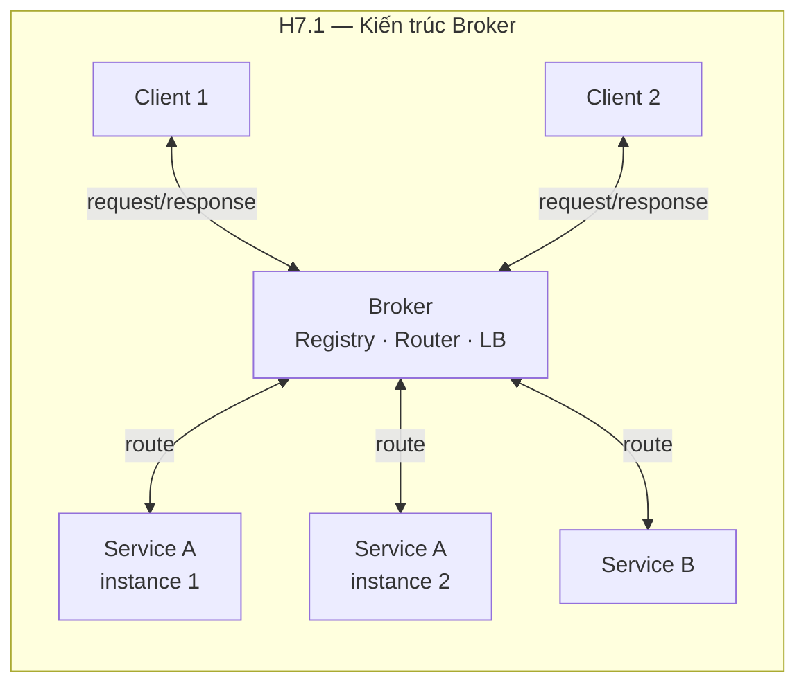
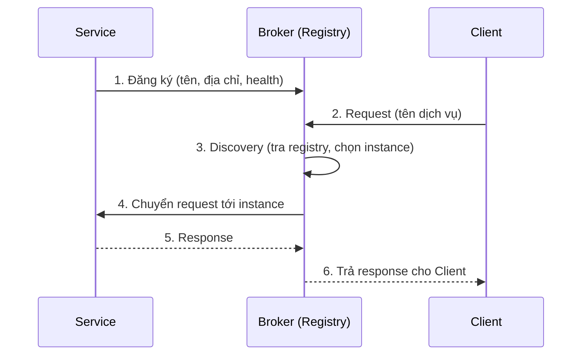
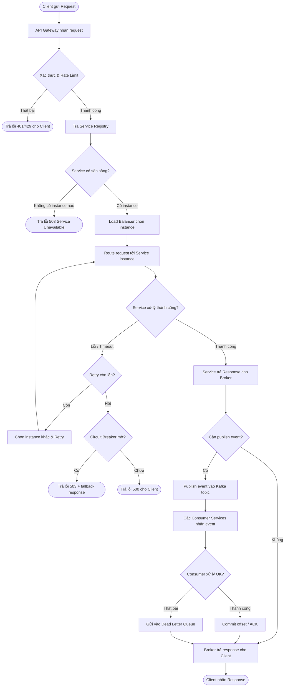
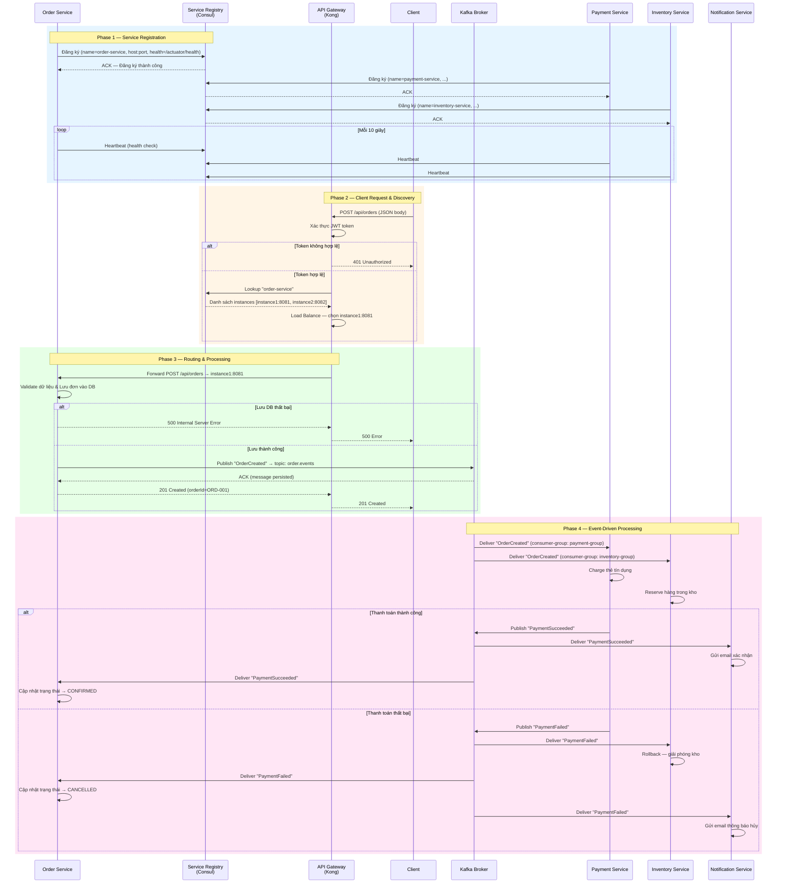

# Chương 7. Kiến trúc Broker

Trong các kiến trúc phân tán như Client-Server, client cần biết chính xác địa chỉ (IP, port) của server để gửi request. Điều này tạo ra sự **ràng buộc chặt** (tight coupling) giữa hai bên: khi server đổi địa chỉ, thêm instance mới, hoặc thay đổi giao thức, client phải được cập nhật tương ứng. Kiến trúc **Broker** giải quyết vấn đề này bằng cách đưa vào một **thành phần trung gian** đóng vai trò điều phối: các component gửi và nhận thông qua Broker mà **không giao tiếp trực tiếp** với nhau và **không cần biết vị trí** của đối tác. Broker quản lý sổ đăng ký dịch vụ (registry), định tuyến (routing) và có thể phân tải (load balancing), tạo nên sự linh hoạt lớn cho hệ thống phân tán. Chương này trình bày khái niệm, các loại Broker (message broker, API Gateway, service mesh, ORB), ưu nhược (decoupling, location transparency; overhead, SPOF), ứng dụng microservices và case study với message broker. Có thể hình dung như **bưu điện**: người gửi không cần biết địa chỉ chi tiết của người nhận — bưu điện tra sổ, định tuyến và có thể phân tải; nhưng thêm một hop nên có độ trễ và cần HA cho chính Broker.

---

## 7.1. Khái niệm và đặc điểm

Phần này định nghĩa Broker, registry và luồng đăng ký — khám phá — gọi dịch vụ.

### 7.1.1. Định nghĩa

**Kiến trúc Broker** là mẫu kiến trúc trong đó một **thành phần trung gian (Broker)** đóng vai trò điều phối giao tiếp giữa các component phân tán. Broker nhận request hoặc message từ bên gọi (Client/Producer), **định tuyến** (routing) tới service hoặc consumer đích, và trả response hoặc chuyển tiếp kết quả. Nhờ Broker, hai bên giao tiếp không cần biết nhau trực tiếp — chúng chỉ cần biết Broker.

Có bốn đặc điểm chính. Thứ nhất, **Decoupling (Tách ràng buộc):** Client và Server/Service không phụ thuộc trực tiếp vào nhau về vị trí, giao thức hay vòng đời. Thay đổi một bên (đổi địa chỉ, đổi công nghệ, thêm instance) không yêu cầu sửa bên kia. Thứ hai, **Location Transparency (Trong suốt vị trí):** Client không cần biết Server chạy ở đâu (IP nào, port nào, máy nào, datacenter nào). Client chỉ gọi "dịch vụ Order", Broker tự tìm instance đang chạy. Thứ ba, **Service Registry (Sổ đăng ký):** Broker duy trì một danh sách các service đã đăng ký, kèm thông tin sức khỏe (health), để biết service nào sẵn sàng nhận request. Thứ tư, **Dynamic Discovery:** Service có thể đăng ký hoặc hủy đăng ký tại runtime — khi service khởi động, nó tự đăng ký với Broker; khi dừng, nó hủy đăng ký hoặc Broker phát hiện qua health check.

### 7.1.2. Nguyên tắc hoạt động

Luồng hoạt động của kiến trúc Broker gồm bốn bước.

**Service Registration (Đăng ký dịch vụ):** Khi một service khởi động, nó gửi thông tin đăng ký tới Broker: tên dịch vụ, địa chỉ (host:port), phiên bản, metadata. Broker lưu vào registry. Từ đây Broker biết service đó tồn tại và sẵn sàng nhận request. Service cũng gửi heartbeat định kỳ để Broker biết nó còn sống.

**Service Discovery (Khám phá dịch vụ):** Khi Client cần gọi một dịch vụ, nó gửi request tới Broker kèm tên dịch vụ (ví dụ "OrderService"). Broker tra registry, tìm tất cả instance đang chạy của dịch vụ đó, và chọn một instance phù hợp (theo load balancing: round-robin, least connections, weighted).

**Message Routing (Định tuyến):** Broker chuyển request tới instance đã chọn. Với Message Broker (RabbitMQ, Kafka), Broker lưu message vào queue/topic; consumer pull từ queue. Với API Gateway, Broker forward HTTP request tới backend service.

**Response Handling (Xử lý phản hồi):** Sau khi service xử lý xong, response được gửi lại qua Broker (hoặc trực tiếp về Client tùy cấu hình). Client nhận kết quả mà không cần biết service nào đã xử lý.

---

## 7.2. Cấu trúc (H7.1)

*Hình H7.1 — Broker: Client và Service giao tiếp qua trung gian (Mermaid).*



*Minh họa sketchnote — Sơ đồ kiến trúc (Mermaid, PlantUML, v.v.) nên sống cùng mã nguồn: review qua Git, gắn với ADR/tài liệu (xem thêm **Chương 13**, sau §13.4).*


*Luồng chuẩn: Registration → Discovery → Routing → Response.*



*Hình H7.2 — Flowchart chi tiết: Giao tiếp Microservices qua Broker (từng bước với decision points).*



*Hình H7.3 — Sequence diagram chi tiết: Registration, Discovery, Routing với Error Handling.*



### 7.2.1. Các thành phần

**Broker** là thành phần trung tâm, gồm nhiều module chức năng: **Registry** (sổ đăng ký service — lưu tên, địa chỉ, health); **Router** (logic định tuyến — chọn service/instance phù hợp dựa trên tên, version, header); **Load Balancer** (phân tải — round-robin, least connections, weighted); và tùy chọn thêm **Protocol Translation** (chuyển đổi giao thức — ví dụ HTTP sang gRPC), **Monitoring** (ghi log, metrics), **Auth** (xác thực, phân quyền).

**Client** là bên gửi request. Client chỉ biết địa chỉ Broker và tên dịch vụ muốn gọi; không cần biết chi tiết triển khai hay vị trí của service.

**Server / Service** là bên cung cấp dịch vụ. Service đăng ký với Broker khi khởi động, nhận request từ Broker, xử lý và trả response.

**Bridge** (tùy chọn) dùng để kết nối nhiều Broker với nhau (federation), phục vụ hệ thống đa datacenter hoặc đa tổ chức.

### 7.2.2. Các loại Broker thực tế

**Message Broker** — RabbitMQ, Kafka, AWS SQS: lưu và chuyển tiếp message giữa producer và consumer. Hỗ trợ **queue** (point-to-point: mỗi message chỉ một consumer nhận) và **pub/sub** (publish-subscribe: nhiều consumer cùng nhận). RabbitMQ mạnh về routing phức tạp, acknowledgement; Kafka mạnh về throughput cao, replay event, event streaming.

**API Gateway** — Kong, AWS API Gateway, Nginx Plus: nhận HTTP/HTTPS request từ client, thực hiện auth, rate limiting, request transformation, rồi route tới backend service. Phù hợp làm điểm vào (entry point) cho hệ thống microservices.

**Service Mesh** — Istio, Linkerd: mỗi service có một **sidecar proxy** (Envoy) chạy cạnh; proxy đảm nhiệm routing, retry, circuit breaker, TLS, observability. Điều khiển lưu lượng mà developer không cần sửa code ứng dụng. Chi tiết Sidecar xem Chương 12.

**ORB (Object Request Broker)** — CORBA, Java RMI: cho phép gọi phương thức trên đối tượng ở máy khác (remote method invocation) qua Broker trung gian. Phổ biến trong thập niên 1990–2000; nay ít dùng, thay bằng REST/gRPC.

---

## 7.3. Ưu điểm

**Decoupling (Tách ràng buộc):** Client và Service không gọi trực tiếp nhau; thay đổi địa chỉ, thêm instance, đổi ngôn ngữ lập trình một bên không đòi hỏi sửa bên kia. Điều này đặc biệt quan trọng trong microservices nơi có hàng chục, hàng trăm service, mỗi service có thể được triển khai lại độc lập.

**Location Transparency:** Client chỉ cần biết "tên" dịch vụ, không cần biết IP hay port. Service có thể di chuyển giữa các máy, datacenter mà client không bị ảnh hưởng. Trong môi trường container (Docker, Kubernetes), container thường được tạo/xóa liên tục, IP thay đổi — Broker giúp client luôn tìm được service.

**Flexibility (Linh hoạt):** Thêm hoặc bớt instance dễ dàng — chỉ cần đăng ký/hủy đăng ký với Broker. Versioning dịch vụ: có thể chạy song song v1 và v2 của cùng service, Broker route request theo version.

**Interoperability (Tương tác đa nền tảng):** Nhiều ngôn ngữ, giao thức có thể giao tiếp qua Broker (protocol translation). Ví dụ: service A viết Java gửi message vào RabbitMQ; service B viết Python nhận message từ cùng queue.

**Load Balancing, Failover, Health Check:** Broker phân tải request giữa các instance; không gửi request tới instance đang lỗi (health check fail); tự chuyển sang instance khác khi một instance down.

---

## 7.4. Nhược điểm và khi nào không nên dùng

**Performance Overhead:** Thêm một "bước nhảy" (hop) qua Broker, kèm serialization/deserialization message. **Latency** tăng so với gọi trực tiếp. Với Message Broker (RabbitMQ, Kafka), có thêm chi phí lưu message vào disk, replication. Cần cân nhắc overhead có chấp nhận được trong bài toán cụ thể.

**SPOF (Single Point of Failure):** Broker hỏng thì giao tiếp qua nó dừng. Giải pháp: thiết kế **HA (High Availability)** cho Broker — chạy cluster nhiều node (ví dụ RabbitMQ cluster 3 node, Kafka cluster 3+ broker), failover tự động, dữ liệu replicated.

**Complexity (Độ phức tạp vận hành):** Cần cài đặt, cấu hình, monitoring Broker. Cần hiểu queue, topic, partition, consumer group (Kafka) hoặc exchange, binding (RabbitMQ). Team cần kỹ năng vận hành.

**Debugging khó hơn:** Một request đi qua nhiều thành phần (Client → Broker → Service → Broker → Client); khi lỗi xảy ra, cần **correlation ID** (mã theo dõi xuyên suốt một request) và **distributed tracing** (Jaeger, Zipkin) để truy vết.

**Khi nào không nên dùng Broker:** (1) Yêu cầu **latency rất thấp** (microsecond) — overhead Broker không chấp nhận được; (2) Hệ thống **rất nhỏ, đơn giản** — hai ba service gọi nhau trực tiếp đủ rồi, thêm Broker là over-engineering; (3) **Không cần dynamic discovery** — tất cả service cố định, ít thay đổi.

---

## 7.5. Ứng dụng thực tế

**RabbitMQ** dùng nhiều cho: task queue (gửi task xử lý nền — email, report), async communication giữa microservices, fan-out notification (gửi cho nhiều consumer). RabbitMQ hỗ trợ routing phức tạp (exchange → routing key → queue) và xác nhận message (acknowledgement).

**Apache Kafka** dùng cho: event streaming (luồng sự kiện liên tục), log aggregation (gom log từ nhiều service), event sourcing (lưu chuỗi event làm source of truth), real-time analytics. Kafka có throughput rất cao (hàng triệu msg/s), lưu message bền vững (retention) và cho phép replay (đọc lại event cũ).

**API Gateway** (Kong, AWS API Gateway, Nginx Plus) dùng làm entry point cho microservices: auth, rate limiting, request routing, logging, caching, SSL termination. Client chỉ biết một URL (gateway); gateway route tới đúng service.

**Consul / Eureka** (service discovery): service đăng ký khi khởi động; Consul/Eureka cung cấp API cho client hoặc gateway tra cứu "service X đang chạy ở đâu?". Kết hợp health check để loại bỏ instance lỗi.

---

## 7.6. Case study: Hệ thống đặt hàng Microservices với Message Broker

**Yêu cầu:** Hệ thống e-commerce gồm nhiều service: Order Service (tạo và quản lý đơn hàng), Payment Service (thanh toán), Inventory Service (quản lý kho), Notification Service (gửi email/SMS). Cần async communication: khi đơn hàng tạo xong, các service khác tự xử lý phần việc của mình mà Order Service không cần chờ. Cần decouple — thêm service mới (ví dụ Analytics) không phải sửa code Order Service.

**Kiến trúc:** Các service đăng ký với **Service Registry** (Consul). Client gửi request qua **API Gateway** (Kong) → Gateway route tới Order Service. Order Service tạo đơn, sau đó publish event "OrderCreated" vào **Kafka** (topic: `order.events`). Payment Service, Inventory Service, Notification Service subscribe topic này, nhận event và xử lý phần mình. Nếu thanh toán thất bại, Payment Service publish event "PaymentFailed" → Order Service nhận và cập nhật trạng thái đơn.

**Luồng chi tiết:** (1) Client → API Gateway → Order Service: tạo đơn hàng. (2) Order Service lưu đơn vào DB, publish `OrderCreated` event vào Kafka. (3) Payment Service nhận event → charge card → publish `PaymentSucceeded` hoặc `PaymentFailed`. (4) Inventory Service nhận `OrderCreated` → reserve kho. (5) Notification Service nhận `PaymentSucceeded` → gửi email xác nhận. (6) Nếu `PaymentFailed`: Inventory Service nhận event → release kho; Order Service nhận event → cập nhật trạng thái đơn thành "Cancelled".

### Ví dụ code (Java Spring Boot — Kafka Producer/Consumer)

**Cấu hình Kafka trong `application.yml`:**

```yaml
spring:
 kafka:
 bootstrap-servers: localhost:9092
 producer:
 key-serializer: org.apache.kafka.common.serialization.StringSerializer
 value-serializer: org.springframework.kafka.support.serializer.JsonSerializer
 consumer:
 key-deserializer: org.apache.kafka.common.serialization.StringDeserializer
 value-deserializer: org.springframework.kafka.support.serializer.JsonDeserializer
 properties:
 spring.json.trusted.packages: "*"
 auto-offset-reset: earliest

app:
 kafka:
 topic: order.events
```

**Event DTO — `OrderEvent.java`:**

```java
public class OrderEvent {
 private String event;
 private String orderId;
 private String customer;
 private List<OrderItem> items;

 public OrderEvent() {}

 public OrderEvent(String event, String orderId, String customer, List<OrderItem> items) {
 this.event = event;
 this.orderId = orderId;
 this.customer = customer;
 this.items = items;
 }

 // getters & setters
 public String getEvent() { return event; }
 public void setEvent(String event) { this.event = event; }
 public String getOrderId() { return orderId; }
 public void setOrderId(String orderId) { this.orderId = orderId; }
 public String getCustomer() { return customer; }
 public void setCustomer(String customer) { this.customer = customer; }
 public List<OrderItem> getItems() { return items; }
 public void setItems(List<OrderItem> items) { this.items = items; }
}

public class OrderItem {
 private String sku;
 private int qty;

 public OrderItem() {}
 public OrderItem(String sku, int qty) { this.sku = sku; this.qty = qty; }

 public String getSku() { return sku; }
 public void setSku(String sku) { this.sku = sku; }
 public int getQty() { return qty; }
 public void setQty(int qty) { this.qty = qty; }
}
```

**OrderController — `OrderController.java`:**

```java
@RestController
@RequestMapping("/api/orders")
public class OrderController {

 private final OrderService orderService;

 public OrderController(OrderService orderService) {
 this.orderService = orderService;
 }

 @PostMapping
 public ResponseEntity<Map<String, String>> createOrder(@RequestBody CreateOrderRequest request) {
 String orderId = orderService.createOrder(request.getCustomer(), request.getItems());
 return ResponseEntity.status(HttpStatus.CREATED)
 .body(Map.of("orderId", orderId, "status", "CREATED"));
 }
}

public class CreateOrderRequest {
 private String customer;
 private List<OrderItem> items;

 public String getCustomer() { return customer; }
 public void setCustomer(String customer) { this.customer = customer; }
 public List<OrderItem> getItems() { return items; }
 public void setItems(List<OrderItem> items) { this.items = items; }
}
```

**OrderService — `OrderService.java` (Kafka Producer):**

```java
@Service
public class OrderService {

 private static final Logger log = LoggerFactory.getLogger(OrderService.class);

 private final KafkaTemplate<String, OrderEvent> kafkaTemplate;

 @Value("${app.kafka.topic}")
 private String topic;

 public OrderService(KafkaTemplate<String, OrderEvent> kafkaTemplate) {
 this.kafkaTemplate = kafkaTemplate;
 }

 public String createOrder(String customer, List<OrderItem> items) {
 String orderId = "ORD-" + UUID.randomUUID().toString().substring(0, 8).toUpperCase();

 // Lưu order vào DB (giả lập)
 log.info("Order {} created for customer {}", orderId, customer);

 // Publish event OrderCreated vào Kafka
 OrderEvent event = new OrderEvent("OrderCreated", orderId, customer, items);
 kafkaTemplate.send(topic, orderId, event)
 .whenComplete((result, ex) -> {
 if (ex != null) {
 log.error("Failed to publish OrderCreated for {}: {}", orderId, ex.getMessage());
 } else {
 log.info("Event OrderCreated published for order {} — partition={}, offset={}",
 orderId,
 result.getRecordMetadata().partition(),
 result.getRecordMetadata().offset());
 }
 });

 return orderId;
 }

 @KafkaListener(topics = "${app.kafka.topic}", groupId = "order-group",
 containerFactory = "kafkaListenerContainerFactory")
 public void handlePaymentResult(OrderEvent event) {
 if ("PaymentFailed".equals(event.getEvent())) {
 log.warn("Payment failed for order {} — updating status to CANCELLED", event.getOrderId());
 // Cập nhật trạng thái đơn thành CANCELLED trong DB
 } else if ("PaymentSucceeded".equals(event.getEvent())) {
 log.info("Payment succeeded for order {} — updating status to CONFIRMED", event.getOrderId());
 // Cập nhật trạng thái đơn thành CONFIRMED trong DB
 }
 }
}
```

**PaymentEventConsumer — `PaymentEventConsumer.java` (Kafka Consumer):**

```java
@Service
public class PaymentEventConsumer {

 private static final Logger log = LoggerFactory.getLogger(PaymentEventConsumer.class);

 private final KafkaTemplate<String, OrderEvent> kafkaTemplate;

 @Value("${app.kafka.topic}")
 private String topic;

 public PaymentEventConsumer(KafkaTemplate<String, OrderEvent> kafkaTemplate) {
 this.kafkaTemplate = kafkaTemplate;
 }

 @KafkaListener(topics = "${app.kafka.topic}", groupId = "payment-group")
 public void onOrderEvent(OrderEvent event) {
 if (!"OrderCreated".equals(event.getEvent())) {
 return;
 }

 String orderId = event.getOrderId();
 log.info("Payment Service — processing payment for order {}", orderId);

 // Giả lập thanh toán
 boolean success = processPayment(orderId);
 String resultEvent = success ? "PaymentSucceeded" : "PaymentFailed";

 OrderEvent paymentEvent = new OrderEvent(resultEvent, orderId, null, null);
 kafkaTemplate.send(topic, orderId, paymentEvent);

 log.info("Event {} published for order {}", resultEvent, orderId);
 }

 private boolean processPayment(String orderId) {
 // Giả lập: thanh toán luôn thành công
 return true;
 }
}
```

**Kafka Configuration — `KafkaConfig.java`:**

```java
@Configuration
public class KafkaConfig {

 @Bean
 public NewTopic orderEventsTopic() {
 return TopicBuilder.name("order.events")
 .partitions(3)
 .replicas(1)
 .build();
 }

 @Bean
 public ConcurrentKafkaListenerContainerFactory<String, OrderEvent> kafkaListenerContainerFactory(
 ConsumerFactory<String, OrderEvent> consumerFactory) {
 ConcurrentKafkaListenerContainerFactory<String, OrderEvent> factory =
 new ConcurrentKafkaListenerContainerFactory<>();
 factory.setConsumerFactory(consumerFactory);
 factory.setConcurrency(3);
 return factory;
 }
}
```

---

## 7.7. Best practices

**Broker HA (High Availability):** Chạy Broker theo cluster (ví dụ RabbitMQ cluster 3 node với mirrored queue; Kafka cluster 3+ broker với replication factor ≥ 2). Thiết lập failover tự động: khi một node Broker chết, các node còn lại tiếp tục phục vụ.

**Distributed Tracing:** Dùng Jaeger hoặc Zipkin để truy vết request xuyên nhiều service. Mỗi request được gắn **correlation ID** (ví dụ UUID); tất cả service ghi log kèm correlation ID để khi debug có thể lọc theo ID và thấy toàn bộ luồng.

**Circuit Breaker:** Khi service downstream lỗi, Broker hoặc client nên dùng circuit breaker (Chương 12) để ngắt sớm, tránh chờ timeout kéo dài. Kết hợp retry với backoff.

**API Versioning:** Khi thay đổi API, dùng versioning (v1, v2) để client cũ vẫn hoạt động. Broker/Gateway có thể route request theo version header.

**Message Idempotency:** Consumer nên xử lý message **idempotent** — nhận cùng message hai lần cho kết quả giống nhau — vì trong hệ thống phân tán, message có thể được gửi lại (retry).

---

## 7.8. Câu hỏi ôn tập

1. Broker khác gì Client-Server thuần về cách giao tiếp? Client trong Broker có biết trực tiếp địa chỉ Service không?
2. Nêu ít nhất bốn loại Broker (Message Broker, API Gateway, Service Mesh, ORB) và cho ví dụ công nghệ cho mỗi loại.
3. Tại sao Broker có thể là SPOF? Nêu ít nhất hai giải pháp để giảm thiểu.
4. So sánh RabbitMQ và Kafka về use case phù hợp (task queue vs event streaming).
5. Service Discovery dùng khi nào? Lợi ích so với cấu hình tĩnh (hardcode địa chỉ)?

---

## 7.9. Bài tập ngắn

**BT7.1.** Vẽ sơ đồ kiến trúc hệ thống đặt hàng: Client → API Gateway → Order Service, Payment Service (cả hai đăng ký với Service Registry). Nêu rõ luồng khi khách đặt hàng thành công và khi thanh toán thất bại.

**BT7.2.** Chọn Message Broker (RabbitMQ hoặc Kafka) cho luồng "đơn hàng đã thanh toán → gửi email xác nhận + cập nhật kho + ghi log analytics". Giải thích lý do lựa chọn dựa trên: số consumer, cần replay không, thứ tự message có quan trọng không.

---

*Hình: H7.1 — Sơ đồ Broker. Xem thêm: Chương 5 (Client-Server), Chương 6 (P2P), Chương 9 (EDA), Chương 12 (Circuit Breaker, Sidecar). Glossary: Broker, SPOF, Request-Response, Decoupling, Location Transparency.*
