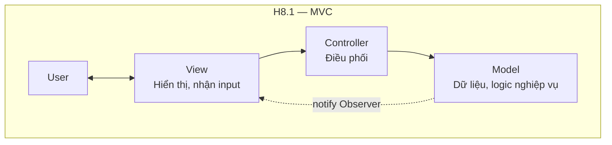
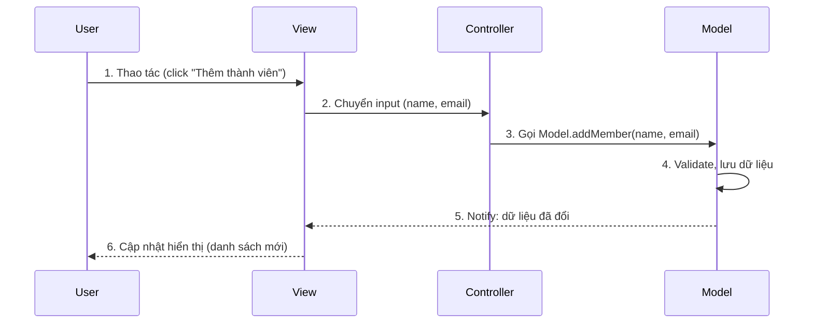
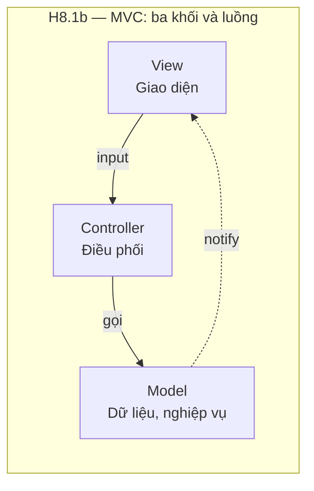
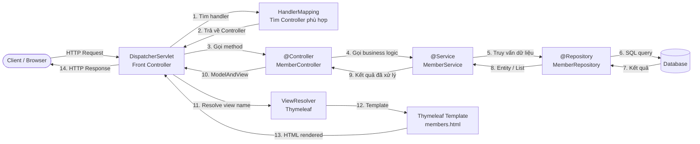
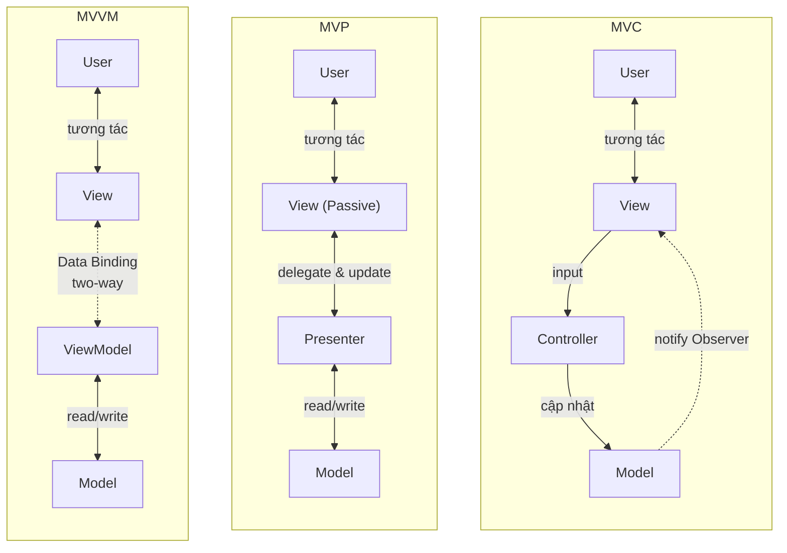

# Chương 8. Kiến trúc MVC (Model-View-Controller)

MVC là một trong những mẫu kiến trúc lâu đời nhất và phổ biến nhất trong phát triển phần mềm, đặc biệt trong ứng dụng có giao diện người dùng (GUI). Ứng dụng được tách thành ba thành phần: **Model** (dữ liệu và logic nghiệp vụ), **View** (giao diện hiển thị) và **Controller** (nhận thao tác người dùng và điều phối). Việc tách biệt này giúp thay đổi giao diện mà không đụng logic nghiệp vụ, test từng phần riêng biệt, và hỗ trợ nhiều giao diện (web, mobile, CLI) dùng chung logic. Mẫu MVC ra đời từ Smalltalk-80 (Trygve Reenskaug, cuối thập niên 1970) và đã trở thành nền tảng cho hầu hết framework web hiện đại. Chương này trình bày khái niệm, luồng User → View → Controller → Model → View, so sánh với Layered và với MVP/MVVM, ưu nhược (separation of concerns, testability; fat controller, độ phức tạp app nhỏ), ứng dụng thực tế và case study kèm code. Có thể hình dung như **phòng triển lãm**: Model là bộ sưu tập và quy tắc; View là gian trưng bày; Controller điều phối yêu cầu của khách tới Model và chọn View phù hợp.

---

## 8.1. Khái niệm và đặc điểm

Phần này định nghĩa Model, View, Controller và luồng hoạt động cơ bản.

### 8.1.1. Định nghĩa

**MVC (Model-View-Controller)** là mẫu kiến trúc tách ứng dụng thành ba thành phần chính, mỗi thành phần có trách nhiệm riêng biệt.

**Model** quản lý **dữ liệu** và **logic nghiệp vụ** của ứng dụng. Model chứa business rules, validation phức tạp, truy xuất và cập nhật dữ liệu. Khi dữ liệu thay đổi, Model **thông báo** (notify) cho View qua cơ chế **Observer** (pattern quan sát — View "đăng ký" nhận thông báo từ Model; khi Model đổi, nó gọi tất cả View đã đăng ký). Model không biết View hiển thị thế nào; nó chỉ lo "dữ liệu là gì" và "quy tắc là gì".

**View** là **giao diện người dùng** — chịu trách nhiệm hiển thị dữ liệu từ Model và nhận thao tác (input) từ người dùng. View chỉ lo render (vẽ giao diện); khi người dùng click, nhập liệu, View chuyển thao tác đó sang Controller để xử lý. View không chứa logic nghiệp vụ phức tạp. Khi nhận thông báo từ Model (dữ liệu đã thay đổi), View tự cập nhật hiển thị.

**Controller** là **bộ điều phối** — nhận input từ View (ví dụ user click nút "Lưu"), quyết định gọi phương thức nào trên Model (ví dụ `model.save(data)`), và có thể chọn View nào để hiển thị kết quả (ví dụ chuyển từ form sang trang danh sách). Controller không chứa business logic (đó là việc của Model) cũng không lo hiển thị (đó là việc của View); nó chỉ "điều phối" giữa hai bên.

### 8.1.2. Nguyên tắc hoạt động

Luồng hoạt động của MVC diễn ra như sau:

**Bước 1 — User tác động View:** Người dùng thao tác trên giao diện — click button, nhập text, chọn dropdown.

**Bước 2 — View chuyển input cho Controller:** View không tự xử lý logic mà chuyển thao tác (event, request) tới Controller tương ứng.

**Bước 3 — Controller gọi Model:** Controller phân tích input, gọi phương thức phù hợp trên Model — đọc dữ liệu, cập nhật dữ liệu, kiểm tra nghiệp vụ.

**Bước 4 — Model xử lý và notify View:** Model thực hiện logic nghiệp vụ, cập nhật dữ liệu nội bộ, rồi thông báo (notify) tất cả View đã đăng ký rằng dữ liệu đã thay đổi.

**Bước 5 — View cập nhật hiển thị:** View nhận thông báo, lấy dữ liệu mới từ Model và render lại giao diện cho người dùng.

Trong thực tế ứng dụng web, luồng thường đơn giản hơn: User request → Controller nhận → Controller gọi Model → Controller chọn View và truyền dữ liệu → View render HTML → trả về User. Observer pattern ít dùng trong web truyền thống (stateless request-response) nhưng phổ biến trong desktop và SPA (Single Page Application).

---

## 8.2. Cấu trúc (H8.1)

*Hình H8.1 — MVC: Model, View, Controller và luồng (Mermaid).*



*Luồng chuẩn (sequence diagram):*



*Cùng mạch ý với hai sơ đồ trên — chỉ tập trung ba thành phần (không vẽ User): View chuyển input cho Controller, Controller gọi Model; khi dữ liệu đổi, Model thông báo View cập nhật hiển thị (Observer).*



*Hình H8.2 — Luồng xử lý request trong Spring Boot MVC (DispatcherServlet → Controller → Service → Repository → View):*



*Hình H8.3 — So sánh MVC vs MVP vs MVVM:*



---

## 8.3. Ưu điểm

**Separation of Concerns (Tách biệt mối quan tâm):** Model, View, Controller có trách nhiệm rõ ràng. Sửa giao diện (View) không ảnh hưởng logic nghiệp vụ (Model). Thay đổi business rule (Model) không cần sửa cách hiển thị. Điều này giảm coupling và giúp code dễ đọc, dễ bảo trì.

**Reusability (Tái sử dụng):** Cùng một Model có thể phục vụ nhiều View khác nhau. Ví dụ: Model "Member" lưu thông tin thành viên (tên, liên hệ, điểm nội bộ) có thể được hiển thị dưới dạng bảng (TableView), form chỉnh sửa (FormView), hoặc báo cáo PDF. Khi thêm một View mới (ví dụ mobile app), Model không thay đổi.

**Testability (Khả năng kiểm thử):** Model có thể test độc lập mà không cần View hay Controller — chỉ cần gọi phương thức Model và kiểm tra kết quả. Controller có thể test bằng cách mock Model và View. View có thể test bằng UI testing tools.

**Maintainability (Khả năng bảo trì):** Cấu trúc rõ ràng giúp dễ hiểu, dễ onboard (thành viên mới nhanh chóng biết code ở đâu). Hầu hết framework web (Spring MVC, Django, Rails) đều tổ chức theo MVC hoặc biến thể, nên tài liệu và cộng đồng hỗ trợ rất lớn.

**Multiple Views (Hỗ trợ đa giao diện):** Dễ dàng phát triển nhiều giao diện (web, mobile, API, desktop) cùng dùng chung Model và business logic.

---

## 8.4. Nhược điểm và khi nào không nên dùng

**Complexity cho ứng dụng nhỏ:** Với ứng dụng rất đơn giản (một màn hình hiển thị một danh sách, không có logic phức tạp), việc tách đủ ba thành phần M-V-C có thể bị coi là over-engineering. Tuy nhiên, ứng dụng nhỏ thường lớn dần; nên cân nhắc dùng MVC "nhẹ" từ đầu.

**Tight Coupling View-Controller:** Trong nhiều implementation, View biết Controller (để gửi input) và Controller biết View (để chọn View hiển thị), tạo thành coupling hai chiều. Điều này dẫn đến khó thay đổi View mà không sửa Controller và ngược lại. Các biến thể **MVP** và **MVVM** ra đời để giảm coupling này.

**Controller "béo" (Fat Controller):** Nếu không kỷ luật, developer dễ đặt quá nhiều logic vào Controller (validation, business rules, formatting) khiến Controller phình to, khó test và bảo trì. Quy tắc: giữ Controller mỏng, đẩy logic nghiệp vụ vào Model.

**Khi nào không nên dùng MVC thuần:** (1) Ứng dụng rất đơn giản, một vài trang tĩnh; (2) Cần **data binding** mạnh — tự động đồng bộ View khi dữ liệu đổi mà không cần code thủ công — khi đó ưu tiên **MVVM** (WPF, Angular, Vue, SwiftUI); (3) Ứng dụng real-time phức tạp cần reactive pattern (RxJS, Flux/Redux) thay vì MVC truyền thống.

---

## 8.5. Biến thể

### 8.5.1. MVP (Model-View-Presenter)

Trong **MVP**, View là **passive** (thụ động) — chỉ hiển thị và chuyển mọi thao tác cho **Presenter**. Presenter điều khiển toàn bộ: nhận input từ View, gọi Model, lấy dữ liệu rồi chủ động cập nhật View (thay vì Model notify View trực tiếp). View không biết Model; Presenter là trung gian duy nhất. Lợi ích: View đơn giản hơn, dễ test Presenter bằng mock View. Phổ biến trong Android (trước Architecture Components).

### 8.5.2. MVVM (Model-View-ViewModel)

Trong **MVVM**, **ViewModel** thay thế Controller. ViewModel expose dữ liệu dưới dạng các thuộc tính (properties) có thể **data binding** (ràng buộc dữ liệu) với View. Khi dữ liệu trong ViewModel đổi, View tự động cập nhật; khi user nhập liệu trên View, ViewModel tự động nhận. ViewModel không biết View cụ thể (không tham chiếu View). Phổ biến trong WPF (.NET), Angular, Vue.js, SwiftUI. Lợi ích: giảm coupling, giảm boilerplate code cho cập nhật UI.

### 8.5.3. Web MVC

Trong web, MVC thường được áp dụng ở phía **server**: Controller nhận HTTP request → gọi Model → chọn template View → render HTML → trả về client. **Rails** gọi là MVC (Model-Controller-View). **Django** gọi là MTV (Model-Template-View, trong đó "View" của Django thực chất là Controller). **Spring MVC** theo đúng tên M-V-C.

| Biến thể | View vai trò | Trung gian | Data binding | Phù hợp |
|----------|-------------|-----------|-------------|---------|
| MVC | Active (notify từ Model) | Controller | Không | Web server-side |
| MVP | Passive (Presenter update) | Presenter | Không | Android, desktop |
| MVVM | Reactive (binding tự động) | ViewModel | Có | WPF, Angular, Vue |

---

## 8.6. Ứng dụng thực tế

*Minh họa sketchnote — Luồng nghiệp vụ điển hình (catalog → thanh toán → kho → giao hàng) minh họa cách MVC/Layered thường được áp dụng trong ứng dụng web phức tạp.*


**Ruby on Rails:** Framework web MVC nổi tiếng — Model (ActiveRecord), View (ERB templates), Controller (ActionController). Convention over configuration: Rails quy ước tên file, thư mục theo chuẩn MVC.

**Django (Python):** Dùng biến thể MTV — Model (Django ORM), Template (HTML templates), View (xử lý request, tương đương Controller). Phổ biến trong ứng dụng web Python.

**Spring MVC (Java):** Model (Service + Repository), View (Thymeleaf, JSP), Controller (@Controller, @RestController). Phổ biến trong enterprise Java.

**iOS:** Apple khuyến khích MVC cho ứng dụng iOS (UIViewController là Controller, UIView là View, data model là Model). Tuy nhiên, ViewController thường bị "béo" (Massive View Controller) nên nhiều team chuyển sang MVVM hoặc VIPER.

**Android:** Trước đây dùng MVC/MVP, nay chuyển sang MVVM với Android Architecture Components (ViewModel, LiveData, Data Binding).

---

## 8.7. Case study: Ứng dụng quản lý thành viên (Web)

**Yêu cầu:** Ứng dụng web quản lý thông tin thành viên (ví dụ thành viên câu lạc bộ hoặc nhóm dự án): hiển thị danh sách, thêm bản ghi mới, sửa thông tin, xóa. Cần tách biệt rõ ràng giao diện, logic và dữ liệu để sau này có thể thêm API cho mobile app mà không sửa lại logic.

**Kiến trúc MVC:** **Model** (Member) — chứa dữ liệu thành viên (id, name, email, score) và business rules (ví dụ điểm nội bộ từ 0 đến 100, email phải unique). **View** — trang HTML hiển thị danh sách (table), form thêm/sửa, thông báo lỗi. **Controller** — nhận HTTP request (GET /members, POST /members, PUT /members/:id, DELETE /members/:id), gọi Model xử lý, chọn View trả về.

**Luồng thêm thành viên:** (1) User điền form (name, email, score) trên trang web → click "Thêm". (2) View gửi POST /members kèm dữ liệu form tới Controller. (3) Controller nhận request, validate input cơ bản (format), rồi gọi Model: `Member.create(name, email, score)`. (4) Model validate nghiệp vụ (email unique? score hợp lệ?), lưu vào database. (5) Controller nhận kết quả: nếu thành công → redirect về trang danh sách (View hiển thị danh sách mới kèm thông báo "Thêm thành công"); nếu lỗi → render lại form với thông báo lỗi.

### Ví dụ code (Java Spring Boot MVC)

**1. Model — Entity `Member` (JPA + Validation):**

```java
// src/main/java/com/example/membermvc/model/Member.java
package com.example.membermvc.model;

import jakarta.persistence.*;
import jakarta.validation.constraints.*;

@Entity
@Table(name = "members")
public class Member {

 @Id
 @GeneratedValue(strategy = GenerationType.IDENTITY)
 private Long id;

 @NotBlank(message = "Tên không được để trống")
 @Size(min = 2, max = 100, message = "Tên phải từ 2 đến 100 ký tự")
 private String name;

 @NotBlank(message = "Email không được để trống")
 @Email(message = "Email không hợp lệ")
 @Column(unique = true)
 private String email;

 @NotNull(message = "Điểm không được để trống")
 @DecimalMin(value = "0.0", message = "Điểm phải >= 0")
 @DecimalMax(value = "100.0", message = "Điểm phải <= 100")
 private Double score;

 public Member() {}

 public Member(String name, String email, Double score) {
 this.name = name;
 this.email = email;
 this.score = score;
 }

 public Long getId() { return id; }
 public void setId(Long id) { this.id = id; }

 public String getName() { return name; }
 public void setName(String name) { this.name = name; }

 public String getEmail() { return email; }
 public void setEmail(String email) { this.email = email; }

 public Double getScore() { return score; }
 public void setScore(Double score) { this.score = score; }
}
```

**2. Repository — Spring Data JPA:**

```java
// src/main/java/com/example/membermvc/repository/MemberRepository.java
package com.example.membermvc.repository;

import com.example.membermvc.model.Member;
import org.springframework.data.jpa.repository.JpaRepository;
import org.springframework.stereotype.Repository;

@Repository
public interface MemberRepository extends JpaRepository<Member, Long> {
 boolean existsByEmail(String email);
}
```

**3. Service — Logic nghiệp vụ:**

```java
// src/main/java/com/example/membermvc/service/MemberService.java
package com.example.membermvc.service;

import com.example.membermvc.model.Member;
import com.example.membermvc.repository.MemberRepository;
import org.springframework.stereotype.Service;

import java.util.List;

@Service
public class MemberService {

 private final MemberRepository memberRepository;

 public MemberService(MemberRepository memberRepository) {
 this.memberRepository = memberRepository;
 }

 public List<Member> getAllMembers() {
 return memberRepository.findAll();
 }

 public Member addMember(Member member) {
 if (memberRepository.existsByEmail(member.getEmail())) {
 throw new IllegalArgumentException("Email đã tồn tại: " + member.getEmail());
 }
 if (member.getScore() < 0 || member.getScore() > 100) {
 throw new IllegalArgumentException("Điểm phải từ 0 đến 100");
 }
 return memberRepository.save(member);
 }

 public void deleteMember(Long id) {
 if (!memberRepository.existsById(id)) {
 throw new IllegalArgumentException("Không tìm thấy thành viên với ID: " + id);
 }
 memberRepository.deleteById(id);
 }
}
```

**4. Controller — Điều phối request:**

```java
// src/main/java/com/example/membermvc/controller/MemberController.java
package com.example.membermvc.controller;

import com.example.membermvc.model.Member;
import com.example.membermvc.service.MemberService;
import jakarta.validation.Valid;
import org.springframework.stereotype.Controller;
import org.springframework.ui.Model;
import org.springframework.validation.BindingResult;
import org.springframework.web.bind.annotation.*;
import org.springframework.web.servlet.mvc.support.RedirectAttributes;

@Controller
@RequestMapping("/members")
public class MemberController {

 private final MemberService memberService;

 public MemberController(MemberService memberService) {
 this.memberService = memberService;
 }

 @GetMapping
 public String listMembers(Model model) {
 model.addAttribute("members", memberService.getAllMembers());
 model.addAttribute("newMember", new Member());
 return "members";
 }

 @PostMapping
 public String addMember(@Valid @ModelAttribute("newMember") Member member,
 BindingResult bindingResult,
 RedirectAttributes redirectAttributes,
 Model model) {
 if (bindingResult.hasErrors()) {
 model.addAttribute("members", memberService.getAllMembers());
 return "members";
 }
 try {
 memberService.addMember(member);
 redirectAttributes.addFlashAttribute("successMessage", "Thêm thành viên thành công!");
 } catch (IllegalArgumentException e) {
 redirectAttributes.addFlashAttribute("errorMessage", "Lỗi: " + e.getMessage());
 }
 return "redirect:/members";
 }

 @PostMapping("/{id}/delete")
 public String deleteMember(@PathVariable Long id, RedirectAttributes redirectAttributes) {
 try {
 memberService.deleteMember(id);
 redirectAttributes.addFlashAttribute("successMessage", "Đã xóa thành viên.");
 } catch (IllegalArgumentException e) {
 redirectAttributes.addFlashAttribute("errorMessage", "Lỗi: " + e.getMessage());
 }
 return "redirect:/members";
 }
}
```

**5. View — Thymeleaf template (members.html):**

```html
<!-- src/main/resources/templates/members.html -->
<!DOCTYPE html>
<html xmlns:th="http://www.thymeleaf.org">
<head>
 <title>Quản lý thành viên</title>
</head>
<body>
 <h1>Danh sách thành viên</h1>

 <div th:if="${successMessage}" style="color: green;" th:text="${successMessage}"></div>
 <div th:if="${errorMessage}" style="color: red;" th:text="${errorMessage}"></div>

 <table border="1">
 <tr><th>ID</th><th>Tên</th><th>Email</th><th>Điểm</th><th>Hành động</th></tr>
 <tr th:each="m : ${members}">
 <td th:text="${m.id}"></td>
 <td th:text="${m.name}"></td>
 <td th:text="${m.email}"></td>
 <td th:text="${m.score}"></td>
 <td>
 <form th:action="@{/members/{id}/delete(id=${m.id})}" method="post">
 <button type="submit">Xóa</button>
 </form>
 </td>
 </tr>
 </table>

 <h2>Thêm thành viên</h2>
 <form th:action="@{/members}" th:object="${newMember}" method="post">
 <label>Tên: <input type="text" th:field="*{name}"/></label>
 <span th:if="${#fields.hasErrors('name')}" th:errors="*{name}" style="color:red"></span><br/>

 <label>Email: <input type="email" th:field="*{email}"/></label>
 <span th:if="${#fields.hasErrors('email')}" th:errors="*{email}" style="color:red"></span><br/>

 <label>Điểm: <input type="number" step="0.1" th:field="*{score}"/></label>
 <span th:if="${#fields.hasErrors('score')}" th:errors="*{score}" style="color:red"></span><br/>

 <button type="submit">Thêm</button>
 </form>
</body>
</html>
```

Trong ví dụ trên: `Member` entity là **Model** (dữ liệu, JPA mapping, validation annotations); `MemberRepository` cung cấp tầng truy xuất dữ liệu (Spring Data JPA tự sinh SQL); `MemberService` chứa **logic nghiệp vụ** (validate email unique, kiểm tra khoảng điểm); `MemberController` là **Controller** — "mỏng", chỉ nhận request, gọi Service và chọn View; template Thymeleaf `members.html` là **View**. Controller "mỏng" — chỉ gọi Service và chọn View; logic nghiệp vụ (validate email unique, khoảng điểm) nằm trong Service, tuân thủ nguyên tắc tách biệt MVC.

---

## 8.8. Best practices

**Business logic trong Model, không trong Controller:** Controller chỉ nhận input, gọi Model và chọn View. Validation nghiệp vụ, tính toán, business rules phải nằm trong Model. Tránh Controller "béo" (fat controller).

**View chỉ hiển thị:** View không chứa logic nghiệp vụ, không truy cập database trực tiếp, không gọi API bên ngoài. View chỉ nhận dữ liệu đã sẵn sàng từ Controller/Model và render.

**Controller mỏng (Thin Controller):** Mỗi action trong Controller chỉ vài dòng: nhận input → gọi Model → chọn View. Nếu Controller dài hơn 20 dòng, cần xem lại có logic nào nên chuyển vào Model.

**Observer/Event cho đồng bộ Model-View:** Trong ứng dụng desktop hoặc SPA, dùng Observer pattern hoặc event bus để View tự cập nhật khi Model thay đổi, tránh code imperative "gọi View.update() thủ công ở mọi nơi".

**Đặt tên rõ ràng:** Tuân theo convention của framework (ví dụ Rails: model `User`, controller `UsersController`, view `users/index.html.erb`). Giúp team nhanh chóng tìm code.

---

## 8.9. Câu hỏi ôn tập

1. Nêu trách nhiệm cụ thể của Model, View và Controller. Cho ví dụ thao tác "Xóa sản phẩm" — mỗi thành phần làm gì?
2. So sánh MVC và Layered Architecture: phạm vi áp dụng (UI vs toàn hệ thống), cách tổ chức, khi nào dùng cái nào?
3. MVP khác MVC thế nào về vai trò View và cách Model-View giao tiếp?
4. MVVM phù hợp khi nào? Tại sao data binding là lợi thế chính?
5. Trong Rails, "View" nằm ở đâu trong luồng HTTP request? Trong Django, thành phần nào tương đương Controller?

---

## 8.10. Bài tập ngắn

**BT8.1.** Vẽ sơ đồ MVC cho màn hình "Sửa thông tin user" (form hiển thị thông tin hiện tại + nút Submit). Nêu rõ: User tác động View thế nào, Controller làm gì, Model xử lý gì, View cập nhật thế nào khi thành công/lỗi.

**BT8.2.** Cho một màn hình hiển thị danh sách đơn hàng và cho phép filter theo trạng thái (Pending, Paid, Shipped). Chỉ rõ Model chứa gì, View hiển thị gì, Controller xử lý gì khi user đổi filter. Nêu dữ liệu truyền giữa các thành phần.

---

*Hình: H8.1 — Sơ đồ MVC (có User); H8.1b — ba khối và luồng notify. Xem thêm: Chương 3 (Layered), Chương 11 (Hexagonal/Clean). Glossary: MVC, Design Pattern, Observer.*
