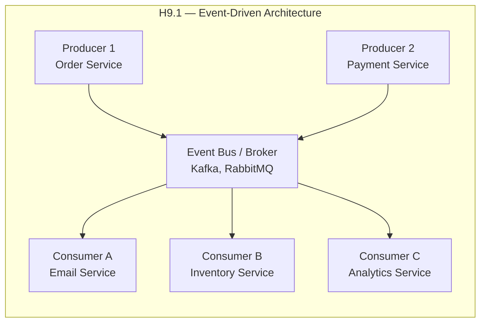
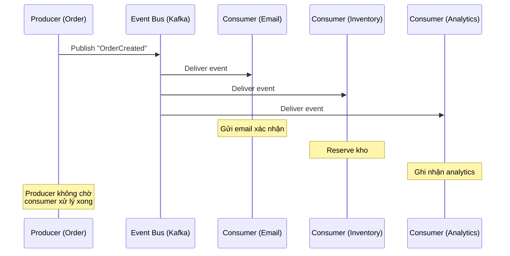
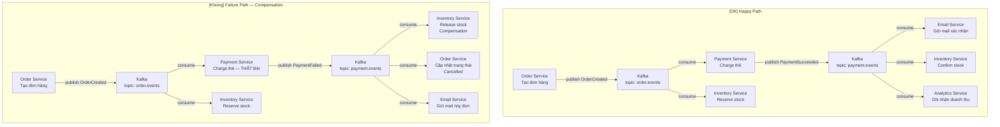
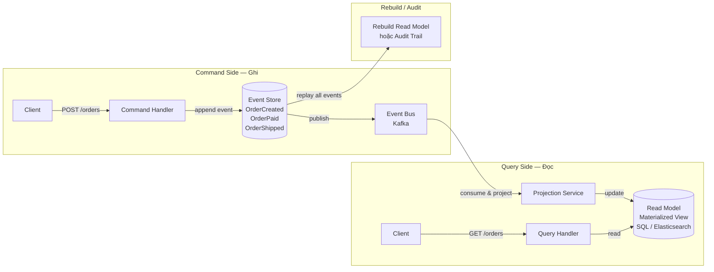

# Chương 9. Kiến trúc Event-Driven (EDA)

Trong các mẫu kiến trúc đã xét ở Part II, giao tiếp giữa các thành phần chủ yếu theo kiểu **request-response** đồng bộ: client gửi yêu cầu, chờ server xử lý và trả kết quả. Kiến trúc **Event-Driven (Hướng sự kiện)** đi theo hướng khác: các thành phần giao tiếp qua **sự kiện (events)** — một component **phát (publish)** sự kiện khi có điều gì đó xảy ra, các component khác **đăng ký nhận (subscribe)** và **phản ứng** với sự kiện đó. Giao tiếp là **bất đồng bộ (asynchronous)** và **loosely coupled** (ít ràng buộc) — producer không biết và không quan tâm có bao nhiêu consumer, consumer không biết producer là ai. Nhờ đó, hệ thống dễ mở rộng, dễ thêm tính năng mới mà không sửa code cũ, và phù hợp với xử lý real-time, microservices và IoT. Chương này trình bày khái niệm, luồng Producer → Event Bus → Consumers, các kiểu event (notification, event-carried state transfer, event sourcing, CQRS), ưu nhược (scale, real-time; eventual consistency, gỡ lỗi), case study và chọn bus (Kafka, RabbitMQ). Có thể hình dung như **bảng tin + đăng ký**: ai quan tâm loại sự kiện nào thì tự xử lý bất đồng bộ — thêm consumer mới ít đụng code phát, nhưng trạng thái giữa các bên có thể chỉ nhất quán sau một lúc.

---

## 9.1. Khái niệm và đặc điểm

Phần này định nghĩa EDA, Producer/Bus/Consumer và các đặc điểm async — loosely coupled.

### 9.1.1. Định nghĩa

**Event-Driven Architecture (EDA)** là mẫu kiến trúc trong đó các thành phần giao tiếp chủ yếu qua **events** — các bản ghi mô tả "điều gì vừa xảy ra" (ví dụ "OrderCreated", "PaymentSucceeded", "UserRegistered"). Ba thành phần chính: **Event Producer** (bên phát event), **Event Bus / Message Broker** (kênh truyền event — Kafka, RabbitMQ), và **Event Consumer** (bên nhận và xử lý event).

Có bốn đặc điểm chính. Thứ nhất, **Asynchronous (Bất đồng bộ):** Producer publish event và tiếp tục công việc ngay, không chờ Consumer xử lý xong. Điều này giúp tăng throughput và giảm latency cảm nhận. Thứ hai, **Loosely Coupled:** Producer và Consumer không biết nhau trực tiếp; chúng chỉ biết Event Bus. Thêm hoặc bớt Consumer không ảnh hưởng Producer. Thứ ba, **Real-time:** Event được xử lý gần thời điểm phát sinh, cho phép phản ứng nhanh (streaming, notifications, dashboards). Thứ tư, **Scalable:** Producer và Consumer scale độc lập; thêm instance Consumer để xử lý nhiều event hơn; Event Bus (Kafka) có thể partition để phân tải.

### 9.1.2. Lịch sử ngắn

Ý tưởng event-driven bắt nguồn từ cơ chế **ngắt (interrupt)** trong hệ điều hành — CPU phản ứng khi có tín hiệu I/O, không phải liên tục hỏi (polling). Từ đó phát triển thành xử lý sự kiện giao diện (GUI event handling — button click, mouse move). Trong enterprise: JMS (Java Message Service), MSMQ (Microsoft) hỗ trợ messaging. Gần đây: Apache Kafka, AWS Kinesis, Google Pub/Sub cho phép event streaming ở quy mô lớn. Kết hợp với Event Sourcing, CQRS và Reactive programming, EDA trở thành kiến trúc chủ đạo cho hệ thống real-time và microservices.

---

## 9.2. Cấu trúc (H9.1)

*Hình H9.1 — Event-Driven: Producer, Event Bus, Consumers (Mermaid).*



*Luồng event chuẩn (sequence diagram):*



### 9.2.1. Các thành phần

**Event Producers** là các thành phần phát sinh event: UI (user action), API endpoint (request tạo đơn), Timer (cron job định kỳ), IoT sensor, v.v. Producer không cần biết ai sẽ nhận event; nó chỉ publish event vào Event Bus kèm dữ liệu cần thiết.

**Event Bus / Message Broker** là kênh truyền event: **Kafka** (event streaming, partitioned log, replay), **RabbitMQ** (message queue, routing phức tạp), **AWS SNS/SQS** (managed), **Redis Streams**. Event Bus lưu event (ít nhất tạm thời) và đảm bảo mỗi Consumer nhận được event.

**Event Consumers** là các thành phần subscribe (đăng ký nhận) event và xử lý: Email Service, Inventory Service, Analytics Service, Notification Service. Mỗi Consumer xử lý độc lập; nếu một Consumer chậm hoặc lỗi, không ảnh hưởng Consumer khác.

### 9.2.2. Các loại event

**Event Notification:** Event chỉ thông báo "có điều gì đó xảy ra" kèm ID tối thiểu (ví dụ `{event: "OrderCreated", order_id: 123}`). Consumer cần thêm thông tin thì phải gọi API để lấy.

**Event-Carried State Transfer:** Event mang theo **toàn bộ dữ liệu** cần thiết (ví dụ `{event: "OrderCreated", order_id: 123, customer: "A", items: [...], total: 500000}`). Consumer không cần gọi lại — giảm coupling, tăng tốc, nhưng event lớn hơn.

**Event Sourcing:** Thay vì lưu trạng thái hiện tại (state), hệ thống lưu **chuỗi events** làm nguồn chân lý (source of truth). State được tái tạo bằng cách replay tất cả events từ đầu. Lợi ích: audit trail hoàn chỉnh, có thể quay lại bất kỳ thời điểm nào. Nhược: phức tạp, event store cần hiệu năng tốt.

**CQRS (Command Query Responsibility Segregation):** Tách riêng luồng **ghi (Command)** và luồng **đọc (Query)**. Ghi thông qua events (Event Sourcing); đọc từ một read model được tối ưu riêng (ví dụ view materialized từ events). Phù hợp khi đọc và ghi có yêu cầu rất khác nhau (ví dụ ghi cần consistency, đọc cần tốc độ cao).

---

## 9.3. Ưu điểm

**Loose Coupling:** Producer và Consumer không phụ thuộc trực tiếp; thêm Consumer mới (ví dụ SMS Service) chỉ cần subscribe event, không sửa Producer. Đây là lợi thế rất lớn trong microservices nơi có nhiều team phát triển độc lập.

**Scalability:** Scale producer và consumer **độc lập**. Nếu Email Service chậm, thêm instance Email Service, không ảnh hưởng Order Service. Kafka hỗ trợ partition: một topic có nhiều partition, mỗi partition do một consumer trong consumer group xử lý — scale ngang dễ dàng.

**Asynchronous:** Producer không bị chặn bởi tốc độ Consumer. Tạo đơn hàng mất 50ms; gửi email mất 2s — nhưng user không phải chờ 2s vì email xử lý async.

**Real-time:** Event được xử lý gần thời điểm phát (streaming). Dashboard real-time, notifications tức thì, fraud detection gần tức thì — đều dựa trên EDA.

**Extensibility:** Thêm use case mới (ví dụ "khi đơn thanh toán, gửi thêm push notification") chỉ cần thêm Consumer subscribe, không sửa luồng cũ, không deploy lại Producer. Đây là nguyên lý **Open/Closed** trong thực tế.

---

## 9.4. Nhược điểm và khi nào không nên dùng

**Complexity (Độ phức tạp):** Thiết kế event schema (cấu trúc event), versioning (khi event thay đổi), monitoring, dead-letter queue (nơi lưu event xử lý lỗi) phức tạp hơn nhiều so với request-response đơn giản.

**Debugging khó hơn:** Một thao tác user có thể sinh ra chuỗi event đi qua nhiều Consumer; khi lỗi xảy ra, cần **correlation ID** (mã theo dõi xuyên suốt một luồng) và **distributed tracing** (Jaeger, Zipkin) để truy vết. Không có một "stack trace" duy nhất.

**Eventual Consistency:** Dữ liệu có thể chưa nhất quán ngay lập tức. Khi Order Service tạo đơn và Inventory Service chưa kịp reserve kho, có một khoảng thời gian dữ liệu không đồng bộ. Nếu bài toán yêu cầu **strong consistency** tức thì (ví dụ chuyển tiền giữa hai tài khoản phải nhất quán ngay), EDA thuần không phù hợp.

**Event Schema Evolution:** Khi cấu trúc event thay đổi (thêm field, đổi kiểu), cần chiến lược versioning: Consumer cũ phải xử lý được event mới và ngược lại. Thường dùng schema registry (Confluent Schema Registry) và backward/forward compatibility.

**Ordering (Thứ tự):** Trong một số bài toán, thứ tự event quan trọng (ví dụ "tạo đơn" phải trước "thanh toán"). Kafka đảm bảo thứ tự trong cùng partition; cần thiết kế partition key phù hợp (ví dụ order_id).

**Khi nào không nên dùng EDA:** (1) Cần **strong consistency ngay lập tức** cho mọi thao tác; (2) Hệ thống **rất đơn giản** — vài service gọi nhau đồng bộ là đủ; (3) Team **chưa quen** EDA — cần đầu tư thời gian học; (4) **Latency budget rất thấp** cho toàn luồng (mỗi hop qua Event Bus thêm vài ms).

---

## 9.5. Ứng dụng thực tế

**E-commerce:** Khi đơn hàng được tạo, phát event `OrderCreated` → Payment Service charge, Inventory Service reserve, Email Service xác nhận, Analytics Service ghi nhận. Mọi thao tác diễn ra đồng thời, không tuần tự.

**Real-time systems:** Trading platform (nhận lệnh mua/bán → event → matching engine → event → notification); Gaming (player action → event → game state update → broadcast).

**IoT (Internet of Things):** Hàng triệu sensor gửi dữ liệu (temperature, humidity) → event stream → processing (alert nếu quá ngưỡng, aggregate, store).

**Microservices:** EDA là cách phổ biến nhất để các microservice giao tiếp async — tránh distributed call chains dài (Service A gọi B gọi C gọi D đồng bộ).

**Công nghệ chính:** Kafka (event streaming, replay, high throughput), RabbitMQ (task queue, routing), AWS SNS/SQS (managed, serverless), EventStore (event sourcing), Axon Framework (Java CQRS/ES), Kafka Streams / Apache Flink (stream processing).

---

## 9.6. Case study: Hệ thống e-commerce Event-Driven

**Yêu cầu:** Hệ thống bán hàng online xử lý hàng nghìn đơn/giờ. Khi đơn hàng tạo xong, nhiều việc cần xảy ra: thanh toán, cập nhật kho, gửi email, ghi analytics. Không muốn Order Service phải gọi tuần tự từng service (chậm, brittle — một service lỗi kéo cả luồng chết). Cần thêm tính năng mới (ví dụ loyalty points, fraud detection) mà không sửa Order Service.

**Kiến trúc:** Order Service → publish `OrderCreated` event vào Kafka (topic `order.events`) → các Consumer subscribe:
- **Payment Service:** nhận `OrderCreated` → charge card → publish `PaymentSucceeded` hoặc `PaymentFailed`.
- **Inventory Service:** nhận `OrderCreated` → reserve stock. Nhận `PaymentFailed` → release stock.
- **Email Service:** nhận `PaymentSucceeded` → gửi email xác nhận.
- **Analytics Service:** nhận mọi event → ghi nhận thống kê.
- **Fraud Detection Service** (thêm sau): subscribe `OrderCreated` → kiểm tra pattern bất thường → nếu nghi ngờ → publish `FraudAlert`.

**Luồng thành công:** OrderCreated → Payment charge → PaymentSucceeded → Email gửi mail, Inventory confirm, Analytics ghi nhận.

**Luồng thất bại:** OrderCreated → Payment charge → PaymentFailed → Inventory release stock, Order Service cập nhật trạng thái "Cancelled", Email gửi mail hủy.

### Luồng event chi tiết (happy path + failure path)



### Event Sourcing + CQRS



### Ví dụ code (Java Spring Boot — Kafka Producer/Consumer)

**OrderEvent — record chứa dữ liệu event:**

```java
public record OrderEvent(
 String eventType,
 String correlationId,
 String orderId,
 String customer,
 java.util.List<OrderItem> items,
 long total
) {
 public record OrderItem(String sku, int qty) {}
}
```

**OrderEventPublisher — Service publish event vào Kafka:**

```java
@Service
public class OrderEventPublisher {

 private final KafkaTemplate<String, OrderEvent> kafkaTemplate;

 public OrderEventPublisher(KafkaTemplate<String, OrderEvent> kafkaTemplate) {
 this.kafkaTemplate = kafkaTemplate;
 }

 public void publishOrderCreated(String orderId, String customer,
 List<OrderEvent.OrderItem> items, long total) {
 OrderEvent event = new OrderEvent(
 "OrderCreated",
 UUID.randomUUID().toString(),
 orderId,
 customer,
 items,
 total
 );
 kafkaTemplate.send("order.events", orderId, event);
 log.info("Published OrderCreated for {} [correlationId={}]",
 orderId, event.correlationId());
 }
}
```

**EmailEventConsumer — Consumer lắng nghe event thanh toán:**

```java
@Component
public class EmailEventConsumer {

 @KafkaListener(topics = "payment.events", groupId = "email-service")
 public void handlePaymentEvent(OrderEvent event) {
 String cid = event.correlationId();
 switch (event.eventType()) {
 case "PaymentSucceeded" ->
 log.info("[{}] Sending confirmation email for order {}",
 cid, event.orderId());
 case "PaymentFailed" ->
 log.info("[{}] Sending cancellation email for order {}",
 cid, event.orderId());
 }
 }
}
```

**InventoryEventConsumer — Consumer cập nhật kho:**

```java
@Component
public class InventoryEventConsumer {

 @KafkaListener(topics = "order.events", groupId = "inventory-service")
 public void handleOrderEvent(OrderEvent event) {
 if ("OrderCreated".equals(event.eventType())) {
 log.info("[{}] Reserving stock for order {}",
 event.correlationId(), event.orderId());
 }
 }

 @KafkaListener(topics = "payment.events", groupId = "inventory-service")
 public void handlePaymentEvent(OrderEvent event) {
 switch (event.eventType()) {
 case "PaymentSucceeded" ->
 log.info("[{}] Confirming stock for order {}",
 event.correlationId(), event.orderId());
 case "PaymentFailed" ->
 log.info("[{}] Releasing stock for order {} (compensation)",
 event.correlationId(), event.orderId());
 }
 }
}
```

**application.yml — Cấu hình Kafka cho Spring Boot:**

```yaml
spring:
 kafka:
 bootstrap-servers: localhost:9092
 producer:
 key-serializer: org.apache.kafka.common.serialization.StringSerializer
 value-serializer: org.springframework.kafka.support.serializer.JsonSerializer
 consumer:
 auto-offset-reset: earliest
 key-deserializer: org.apache.kafka.common.serialization.StringDeserializer
 value-deserializer: org.springframework.kafka.support.serializer.JsonDeserializer
 properties:
 spring.json.trusted.packages: "com.example.events"
```

---

## 9.7. Best practices

**Correlation ID:** Gắn một UUID duy nhất cho mỗi luồng nghiệp vụ (ví dụ khi tạo đơn hàng). Mọi event và log liên quan đều kèm correlation ID. Khi debug, lọc log theo ID để thấy toàn bộ luồng xuyên nhiều service.

**Distributed Tracing:** Dùng Jaeger hoặc Zipkin để trực quan hóa luồng event qua các service. Mỗi service tạo span trong trace, liên kết qua trace ID.

**Event Versioning:** Dùng schema registry (Confluent Schema Registry) để quản lý phiên bản event. Đảm bảo backward compatibility: Consumer cũ phải đọc được event mới (bỏ qua field mới); forward compatibility: Consumer mới đọc được event cũ (dùng default cho field thiếu).

**Idempotent Consumers:** Consumer phải xử lý cùng event nhiều lần mà kết quả không đổi (idempotent). Vì event có thể được gửi lại (retry, at-least-once delivery). Cách làm: lưu event ID đã xử lý, kiểm tra trước khi xử lý.

**Dead-Letter Queue (DLQ):** Event xử lý lỗi sau nhiều lần retry được chuyển vào DLQ. Team monitor DLQ, phân tích lỗi và xử lý thủ công hoặc sửa code rồi replay.

---

## 9.8. Câu hỏi ôn tập

1. So sánh Event-Driven với Request-Response (Client-Server/Broker): coupling, tốc độ, consistency.
2. Event Sourcing là gì? Lợi ích và nhược điểm chính? CQRS dùng khi nào?
3. Tại sao EDA khó debug? Nêu ít nhất hai giải pháp (correlation ID, distributed tracing).
4. Khi nào không nên dùng EDA? Cho ví dụ bài toán cần strong consistency.
5. Nêu ít nhất ba use case phù hợp với EDA và giải thích tại sao.

---

## 9.9. Bài tập ngắn

**BT9.1.** Vẽ sơ đồ luồng event cho "Đơn hàng đã thanh toán" → Email Service gửi email + Inventory Service cập nhật kho + Analytics Service ghi nhận. Nêu rõ: event name, producer, consumers, Event Bus.

**BT9.2.** Chọn Kafka hoặc RabbitMQ cho hai bài toán: (a) Task queue xử lý ảnh — mỗi task chỉ cần một worker nhận (one-shot); (b) Event stream replay — cần đọc lại event cũ cho analytics. Giải thích lý do lựa chọn.

---

*Hình: H9.1 — Sơ đồ Event-Driven. Xem thêm: Chương 7 (Broker), Chương 12 (Saga, Circuit Breaker). Glossary: Event-Driven, Eventual Consistency, CQRS, Event Sourcing, Correlation ID.*
