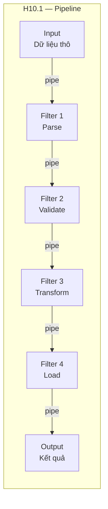
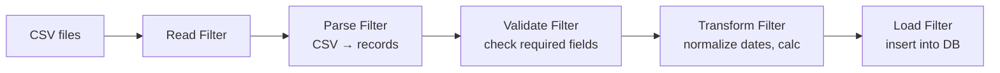
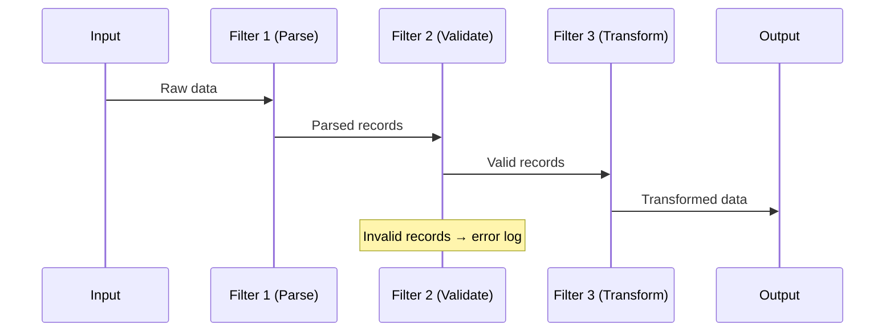
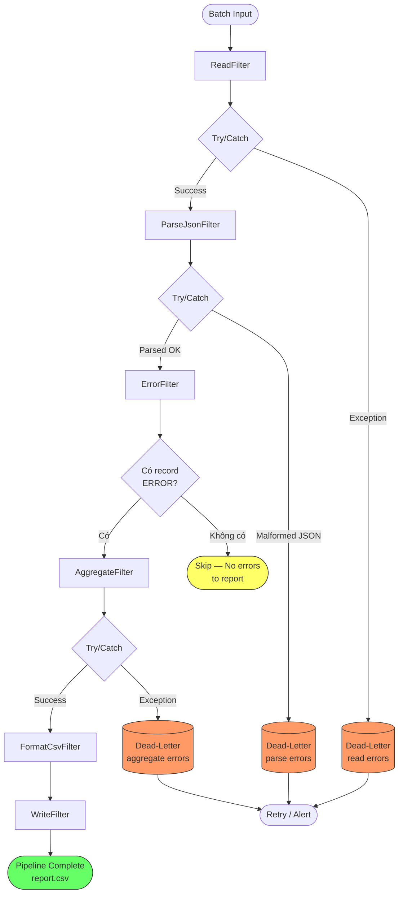

# Chương 10. Kiến trúc Pipe-and-Filter

Trong nhiều bài toán, dữ liệu cần đi qua một chuỗi các bước xử lý tuần tự: đọc → lọc → biến đổi → tổng hợp → lưu. Kiến trúc **Pipe-and-Filter** tổ chức hệ thống theo đúng mô hình này: dữ liệu **chảy qua** một chuỗi các bước xử lý gọi là **filters** (bộ lọc), nối với nhau bởi **pipes** (ống dẫn). Mỗi filter **độc lập**, chỉ biết đọc input và ghi output theo một giao diện chuẩn; không biết filter trước hay sau nó là gì. Nhờ đó, các filter có thể **tái sử dụng** (compose) thành nhiều pipeline khác nhau, và pipeline có thể thay đổi linh hoạt bằng cách thêm/bớt/đổi thứ tự filter. Nguồn gốc của mẫu này là **Unix pipes** — triết lý "Do one thing and do it well" (làm một việc và làm tốt). Chương này trình bày khái niệm, cấu trúc, ưu nhược (tái sử dụng, song song pipeline; overhead, xử lý lỗi), khi không nên dùng (tương tác, vòng phản hồi), ứng dụng ETL/compiler/stream và code mẫu. Có thể hình dung như **dây chuyền** hoặc `grep|sort|uniq` trên Unix: mỗi bước một việc, nối bằng pipe.

---

## 10.1. Khái niệm và đặc điểm

Phần này định nghĩa filter, pipe và luồng dữ liệu giữa các bước.

### 10.1.1. Định nghĩa

**Kiến trúc Pipe-and-Filter** là mẫu kiến trúc xử lý dữ liệu theo luồng (data flow), trong đó dữ liệu được biến đổi qua một chuỗi các **filter** nối bởi **pipe**.

**Filter** là một đơn vị xử lý độc lập: nó đọc dữ liệu từ input, thực hiện một phép biến đổi (transform), và ghi kết quả ra output. Mỗi filter chỉ biết input/output của mình, không biết filter trước/sau là gì. Filter nên **stateless** (không lưu trạng thái giữa các lần gọi) để dễ tái sử dụng và test.

**Pipe** là kênh kết nối output của filter này với input của filter tiếp theo. Pipe có thể là: stream (byte stream như Unix pipe), buffer trong bộ nhớ, message queue giữa hai process, hoặc file trung gian.

Có năm đặc điểm chính. Thứ nhất, **Sequential Processing (Xử lý tuần tự):** dữ liệu đi qua từng filter lần lượt từ đầu đến cuối pipeline. Thứ hai, **Independent Filters:** mỗi filter hoạt động độc lập; chỉ cần input đúng format là chạy được, không quan tâm ngữ cảnh. Thứ ba, **Data Transformation:** mỗi filter biến đổi dữ liệu: parse, filter, map, aggregate, format. Thứ tư, **Composable:** có thể ghép nhiều filter thành pipeline mới dễ dàng — giống xếp LEGO. Thứ năm, **Standard Interface:** mọi filter nên có cùng giao diện (ví dụ `process(input) → output`) để có thể lắp ráp tự do.

### 10.1.2. Cấu trúc tổng quan

Pipeline cơ bản: `Input → [Filter 1] → pipe → [Filter 2] → pipe → … → [Filter N] → Output`.

Có thể mở rộng thành **fan-out** (một filter gửi output cho nhiều filter song song) hoặc **fan-in** (nhiều filter gửi output vào một filter tổng hợp), nhưng cấu trúc phổ biến nhất là tuyến tính.

---

## 10.2. Cấu trúc (H10.1)

*Hình H10.1 — Pipe-and-Filter: pipeline tuyến tính (Mermaid).*



*Ví dụ pipeline ETL (data flow):*



*Luồng xử lý (sequence diagram):*



*Hình H10.2 — Pipeline execution với error handling: try/catch mỗi filter, dead-letter cho bản ghi lỗi.*



*Hình H10.3 — Parallel pipeline processing: nhiều batch ở các giai đoạn khác nhau đồng thời.*

```mermaid
flowchart LR
 subgraph T1[" t = 1"]
 B1_F1["Batch 1 → ReadFilter"]
 end

 subgraph T2[" t = 2"]
 B1_F2["Batch 1 → ParseJsonFilter"]
 B2_F1["Batch 2 → ReadFilter"]
 end

 subgraph T3[" t = 3"]
 B1_F3["Batch 1 → ErrorFilter"]
 B2_F2["Batch 2 → ParseJsonFilter"]
 B3_F1["Batch 3 → ReadFilter"]
 end

 subgraph T4[" t = 4"]
 B1_F4["Batch 1 → AggregateFilter"]
 B2_F3["Batch 2 → ErrorFilter"]
 B3_F2["Batch 3 → ParseJsonFilter"]
 end

 subgraph T5[" t = 5"]
 B1_F5["Batch 1 → FormatCsv [OK]"]
 B2_F4["Batch 2 → AggregateFilter"]
 B3_F3["Batch 3 → ErrorFilter"]
 end

 T1 --> T2 --> T3 --> T4 --> T5

 style B1_F1 fill:#4af,stroke:#333,color:#fff
 style B1_F2 fill:#4af,stroke:#333,color:#fff
 style B1_F3 fill:#4af,stroke:#333,color:#fff
 style B1_F4 fill:#4af,stroke:#333,color:#fff
 style B1_F5 fill:#4af,stroke:#333,color:#fff
 style B2_F1 fill:#fa4,stroke:#333,color:#fff
 style B2_F2 fill:#fa4,stroke:#333,color:#fff
 style B2_F3 fill:#fa4,stroke:#333,color:#fff
 style B2_F4 fill:#fa4,stroke:#333,color:#fff
 style B3_F1 fill:#a4f,stroke:#333,color:#fff
 style B3_F2 fill:#a4f,stroke:#333,color:#fff
 style B3_F3 fill:#a4f,stroke:#333,color:#fff
```



---

## 10.3. Ưu điểm

**Reusability (Tái sử dụng):** Các filter có thể ghép thành nhiều pipeline khác nhau. Ví dụ: `ParseCSV` filter dùng trong pipeline import dữ liệu khách hàng, cũng dùng trong pipeline import sản phẩm — chỉ khác filter Transform và Load phía sau.

**Flexibility (Linh hoạt):** Thêm, bớt, đổi thứ tự filter để tạo pipeline mới mà không sửa code từng filter. Muốn thêm bước "encrypt trước khi lưu"? Chỉ cần chèn EncryptFilter trước LoadFilter.

**Pipeline Parallelism (Song song pipeline):** Khi xử lý nhiều "mẻ" dữ liệu, các mẻ có thể ở các giai đoạn khác nhau đồng thời: Filter 1 xử lý mẻ 3, trong khi Filter 2 xử lý mẻ 2, Filter 3 xử lý mẻ 1. Tương tự pipeline trong CPU. Điều này tăng throughput tổng thể.

**Understandability (Dễ hiểu):** Luồng dữ liệu rõ ràng, tuyến tính, dễ đọc và theo dõi. Mỗi filter có một trách nhiệm duy nhất (Single Responsibility).

**Testability:** Mỗi filter test độc lập: cho input → kiểm output. Không cần setup phức tạp vì filter stateless và không phụ thuộc filter khác.

---

## 10.4. Nhược điểm và khi nào không nên dùng

**Performance Overhead:** Mỗi bước transform có chi phí: serialization/deserialization giữa filter (nếu filter chạy ở process khác), copy dữ liệu qua pipe, format conversion. Với dữ liệu nhỏ hoặc ít bước, overhead không đáng kể; với pipeline dài và dữ liệu lớn, cần tối ưu (batch processing, streaming thay vì copy toàn bộ).

**Không phù hợp ứng dụng tương tác (Interactive):** Pipeline thường chạy một chiều từ đầu đến cuối; không phù hợp ứng dụng cần người dùng nhập liệu từng bước và nhận phản hồi ngay (form wizard, chat). Ở đó cần MVC hoặc event-driven.

**Shared State khó:** Nếu nhiều filter cần dùng chung trạng thái (ví dụ cùng truy cập một bảng lookup), phải truyền qua pipe hoặc dùng external store, phức tạp hơn. Pipe-and-Filter hoạt động tốt nhất khi mỗi filter xử lý dữ liệu "tự chứa" (self-contained).

**Error Handling xuyên pipeline:** Khi một filter lỗi (parse fail, validation reject), cần chiến lược rõ ràng: (a) **Dừng pipeline** — dữ liệu lỗi không đi tiếp; (b) **Pass-through** — ghi log lỗi, bỏ qua bản ghi lỗi, tiếp tục với bản ghi hợp lệ; (c) **Dead-letter** — chuyển bản ghi lỗi vào nơi riêng để xử lý sau. Thiết kế error handling cần cân nhắc kỹ.

**Control Flow phức tạp:** Nếu bài toán có nhiều rẽ nhánh (if-else phức tạp), điều kiện lồng nhau, feedback loop (kết quả bước sau quay lại ảnh hưởng bước trước), thì pipeline tuyến tính không phù hợp. Cần kiến trúc khác (event-driven, state machine).

**Khi nào không nên dùng:** (1) Ứng dụng **tương tác** (form wizard, chat); (2) Cần **feedback loop** (kết quả bước sau ảnh hưởng bước trước trong cùng một lần chạy); (3) **Control flow rất phức tạp** (rẽ nhánh nhiều, điều kiện lồng); (4) Dữ liệu **quá nhỏ** — overhead pipeline lớn hơn lợi ích.

---

## 10.5. Ứng dụng thực tế

**Unix Pipes:** `cat access.log | grep "ERROR" | cut -d' ' -f1,4 | sort | uniq -c | sort -rn` — đếm số lỗi theo IP, sắp xếp giảm dần. Mỗi lệnh là một filter; `|` là pipe.

**Compiler (Trình biên dịch):** Lexer (phân tích từ vựng) → Parser (phân tích cú pháp) → Semantic Analyzer (phân tích ngữ nghĩa) → Optimizer (tối ưu) → Code Generator (sinh mã). Mỗi giai đoạn là filter; output giai đoạn này là input giai đoạn sau.

**ETL (Extract-Transform-Load):** Extract dữ liệu từ nhiều nguồn (DB, API, file) → Clean (xóa trùng, chuẩn hóa) → Transform (tính toán, enrich) → Validate → Load vào data warehouse. Đây là use case phổ biến nhất của Pipe-and-Filter trong doanh nghiệp.

**Image/Video Processing:** Read → Resize → Apply Filter (blur, sharpen) → Compress → Write. Mỗi bước là filter xử lý từng frame/ảnh.

**Stream Processing:** Kafka Streams: `stream.filter(predicate).mapValues(fn).groupByKey().count()` — pipeline xử lý stream dữ liệu real-time, mỗi operator là một filter.

---

## 10.6. Case study: Log Processing Pipeline

**Yêu cầu:** Hệ thống có hàng triệu dòng log mỗi ngày từ nhiều service. Cần: extract log lỗi (ERROR), phân tích theo service, tổng hợp số lỗi, xuất báo cáo CSV. Pipeline phải dễ thay đổi (thêm bước, đổi format output) và xử lý file lớn hiệu quả.

**Kiến trúc Pipeline:** `Read (đọc file) → Parse (phân tích JSON) → Filter (chỉ giữ ERROR) → Aggregate (nhóm theo service, đếm) → Format (CSV) → Write (ghi file báo cáo)`.

**Luồng chi tiết:** (1) ReadFilter đọc file log từng dòng. (2) ParseFilter parse mỗi dòng từ JSON thành record có timestamp, level, service, message. (3) ErrorFilter lọc: chỉ giữ record có level == "ERROR". (4) AggregateFilter nhóm theo service, đếm số lỗi mỗi service. (5) FormatFilter chuyển kết quả thành dòng CSV (service, count). (6) WriteFilter ghi ra file report.csv.

### Ví dụ code (Java Spring Boot — Pipeline framework đơn giản)

**Filter interface — giao diện chung cho mọi filter:**

```java
package com.example.pipeline.filter;

@FunctionalInterface
public interface Filter<I, O> {
 O process(I input);
}
```

**LogRecord — Java Record lưu thông tin một dòng log:**

```java
package com.example.pipeline.model;

public record LogRecord(
 String timestamp,
 String level,
 String service,
 String message
) {}
```

**ServiceErrorCount — Java Record lưu kết quả tổng hợp:**

```java
package com.example.pipeline.model;

public record ServiceErrorCount(
 String service,
 long errorCount
) {}
```

**ReadFilter — đọc file log, trả về danh sách dòng:**

```java
package com.example.pipeline.filter;

import java.io.IOException;
import java.nio.file.Files;
import java.nio.file.Path;
import java.util.List;

public class ReadFilter implements Filter<Path, List<String>> {

 @Override
 public List<String> process(Path filePath) {
 try {
 return Files.readAllLines(filePath);
 } catch (IOException e) {
 throw new PipelineException("ReadFilter failed: " + filePath, e);
 }
 }
}
```

**ParseJsonFilter — parse mỗi dòng JSON thành LogRecord, bỏ qua dòng lỗi:**

```java
package com.example.pipeline.filter;

import com.example.pipeline.model.LogRecord;
import com.fasterxml.jackson.databind.JsonNode;
import com.fasterxml.jackson.databind.ObjectMapper;
import java.util.List;
import java.util.Objects;

public class ParseJsonFilter implements Filter<List<String>, List<LogRecord>> {

 private static final ObjectMapper mapper = new ObjectMapper();

 @Override
 public List<LogRecord> process(List<String> lines) {
 return lines.stream()
 .map(this::safeParse)
 .filter(Objects::nonNull)
 .toList();
 }

 private LogRecord safeParse(String line) {
 try {
 JsonNode node = mapper.readTree(line.trim());
 return new LogRecord(
 node.path("timestamp").asText(),
 node.path("level").asText(),
 node.path("service").asText(),
 node.path("message").asText()
 );
 } catch (Exception e) {
 return null; // skip malformed lines
 }
 }
}
```

**ErrorFilter — chỉ giữ lại record có level == "ERROR":**

```java
package com.example.pipeline.filter;

import com.example.pipeline.model.LogRecord;
import java.util.List;

public class ErrorFilter implements Filter<List<LogRecord>, List<LogRecord>> {

 @Override
 public List<LogRecord> process(List<LogRecord> records) {
 return records.stream()
 .filter(r -> "ERROR".equalsIgnoreCase(r.level()))
 .toList();
 }
}
```

**AggregateFilter — nhóm theo service, đếm số lỗi:**

```java
package com.example.pipeline.filter;

import com.example.pipeline.model.LogRecord;
import com.example.pipeline.model.ServiceErrorCount;
import java.util.List;
import java.util.stream.Collectors;

public class AggregateFilter implements Filter<List<LogRecord>, List<ServiceErrorCount>> {

 @Override
 public List<ServiceErrorCount> process(List<LogRecord> records) {
 return records.stream()
 .collect(Collectors.groupingBy(LogRecord::service, Collectors.counting()))
 .entrySet().stream()
 .map(e -> new ServiceErrorCount(e.getKey(), e.getValue()))
 .sorted((a, b) -> a.service().compareTo(b.service()))
 .toList();
 }
}
```

**FormatCsvFilter — chuyển kết quả tổng hợp thành nội dung CSV:**

```java
package com.example.pipeline.filter;

import com.example.pipeline.model.ServiceErrorCount;
import java.util.List;
import java.util.stream.Collectors;
import java.util.stream.Stream;

public class FormatCsvFilter implements Filter<List<ServiceErrorCount>, String> {

 @Override
 public String process(List<ServiceErrorCount> counts) {
 String header = "service,error_count";
 String rows = counts.stream()
 .map(c -> c.service() + "," + c.errorCount())
 .collect(Collectors.joining("\n"));
 return header + "\n" + rows;
 }
}
```

**WriteFilter — ghi nội dung CSV ra file:**

```java
package com.example.pipeline.filter;

import java.io.IOException;
import java.nio.file.Files;
import java.nio.file.Path;

public class WriteFilter implements Filter<String, String> {

 private final Path outputPath;

 public WriteFilter(Path outputPath) {
 this.outputPath = outputPath;
 }

 @Override
 public String process(String content) {
 try {
 Files.writeString(outputPath, content);
 return "Report written to " + outputPath;
 } catch (IOException e) {
 throw new PipelineException("WriteFilter failed: " + outputPath, e);
 }
 }
}
```

**PipelineException — exception chung cho pipeline:**

```java
package com.example.pipeline.filter;

public class PipelineException extends RuntimeException {
 public PipelineException(String message, Throwable cause) {
 super(message, cause);
 }
}
```

**Pipeline — lớp ghép nối chuỗi filter bằng danh sách:**

```java
package com.example.pipeline;

import com.example.pipeline.filter.Filter;
import java.util.ArrayList;
import java.util.List;

public class Pipeline {

 private final List<Filter<?, ?>> filters = new ArrayList<>();

 @SuppressWarnings("unchecked")
 public <I, O> Pipeline addFilter(Filter<I, O> filter) {
 filters.add(filter);
 return this;
 }

 @SuppressWarnings("unchecked")
 public <I, O> O execute(I input) {
 Object data = input;
 for (Filter filter : filters) {
 data = filter.process(data);
 }
 return (O) data;
 }
}
```

**PipelineRunner — Spring Boot @Component chạy pipeline khi ứng dụng khởi động:**

```java
package com.example.pipeline;

import com.example.pipeline.filter.*;
import org.slf4j.Logger;
import org.slf4j.LoggerFactory;
import org.springframework.boot.CommandLineRunner;
import org.springframework.stereotype.Component;
import java.nio.file.Path;

@Component
public class PipelineRunner implements CommandLineRunner {

 private static final Logger log = LoggerFactory.getLogger(PipelineRunner.class);

 @Override
 public void run(String... args) {
 Pipeline pipeline = new Pipeline()
 .addFilter(new ReadFilter())
 .addFilter(new ParseJsonFilter())
 .addFilter(new ErrorFilter())
 .addFilter(new AggregateFilter())
 .addFilter(new FormatCsvFilter())
 .addFilter(new WriteFilter(Path.of("error_report.csv")));

 String result = pipeline.execute(Path.of("app.log"));
 log.info(result);
 }
}
```

Trong ví dụ trên, mỗi filter implement interface chung `Filter<I, O>` với method `process(I input) → O output`, có thể thêm/bớt/đổi thứ tự. Muốn thêm bước "lọc theo ngày"? Chỉ cần tạo `DateRangeFilter implements Filter<List<LogRecord>, List<LogRecord>>` và chèn vào pipeline sau `ParseJsonFilter`.

---

## 10.7. Best practices

**Single Responsibility per Filter:** Mỗi filter chỉ làm một việc. Tránh filter "béo" vừa parse vừa validate vừa transform — tách thành nhiều filter nhỏ.

**Stateless Filter:** Filter không nên lưu trạng thái giữa các lần gọi (ngoại trừ AggregateFilter cần tích lũy — trường hợp đặc biệt). Stateless giúp filter dễ test, dễ tái sử dụng, dễ chạy song song.

**Standard Interface:** Mọi filter nên implement cùng giao diện (ví dụ `Filter<I, O>` với method `process(I) → O`). Điều này cho phép Pipeline class lắp ráp filter tự động.

**Error Handling:** Dùng wrapper pattern: `SafeFilter` bọc filter thật, bắt exception và xử lý (log lỗi, bỏ qua bản ghi lỗi, chuyển vào dead-letter). Tránh để một bản ghi lỗi "giết" cả pipeline.

**Batch Processing:** Với dữ liệu lớn, xử lý theo batch (chunk) thay vì load toàn bộ vào bộ nhớ. Mỗi filter xử lý một batch, truyền batch cho filter tiếp.

---

## 10.8. Câu hỏi ôn tập

1. So sánh Pipe-and-Filter với Layered Architecture: data flow vs layer calls, tính chất filter vs tính chất layer.
2. Tại sao filter nên stateless? Trường hợp nào filter cần state (AggregateFilter)?
3. Viết lệnh Unix pipeline cho bài toán "đếm số dòng lỗi theo tên file trong thư mục logs/".
4. Khi nào không nên dùng Pipe-and-Filter? Cho ví dụ bài toán không phù hợp.
5. ETL pipeline thường gồm những bước nào? Nêu ít nhất 5 filter điển hình.

---

## 10.9. Bài tập ngắn

**BT10.1.** Thiết kế pipeline xử lý file CSV đơn hàng: đọc file → validate cột (kiểm tra cột bắt buộc: order_id, customer, amount) → chuẩn hóa ngày tháng (DD/MM/YYYY → YYYY-MM-DD) → filter theo điều kiện (amount > 100000) → ghi file JSON. Liệt kê tên và trách nhiệm từng filter.

**BT10.2.** Giải thích tại sao compiler thường dùng kiến trúc Pipe-and-Filter. Nêu tên từng "filter" trong compiler (Lexer, Parser, ...) và input/output của mỗi filter.

---

*Hình: H10.1 — Sơ đồ Pipe-and-Filter pipeline. Xem thêm: Chương 3 (Layered), Chương 9 (stream processing với Kafka Streams). Glossary: Pipe-and-Filter, ETL.*
