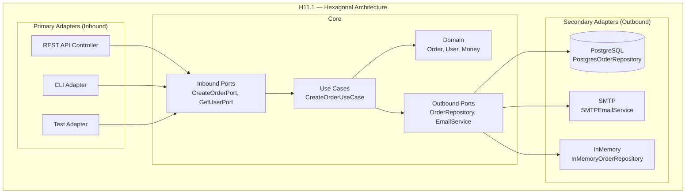
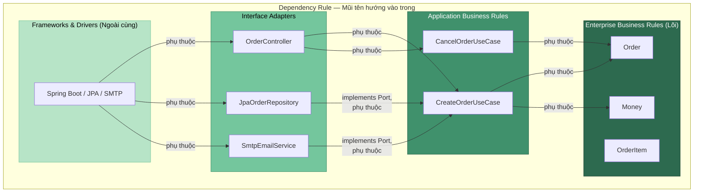

# Chương 11. Các mẫu kiến trúc nâng cao: Hexagonal & Clean Architecture

Kiến trúc phân tầng (Layered) truyền thống tổ chức code theo hướng "từ trên xuống": Presentation → Business → Data Access → Database. Cách này hoạt động tốt, nhưng có một vấn đề tiềm ẩn: lớp nghiệp vụ (Business Logic) phụ thuộc vào lớp truy cập dữ liệu (Data Access), mà lớp này lại phụ thuộc trực tiếp vào database cụ thể. Khi muốn đổi database, đổi framework, hoặc test nghiệp vụ mà không cần database thật, ta gặp khó khăn vì **domain bị ràng buộc vào infrastructure**.

**Hexagonal Architecture** (Ports and Adapters) và **Clean Architecture** giải quyết vấn đề này bằng cách đặt **logic nghiệp vụ (domain)** ở **trung tâm**, không phụ thuộc vào bất kỳ công nghệ bên ngoài nào (database, web framework, API bên thứ ba). Mọi giao tiếp với thế giới bên ngoài đều đi qua **Ports** (giao diện/interface) và **Adapters** (triển khai cụ thể). Nhờ đó, domain có thể test thuần túy (không cần DB, không cần HTTP server), và việc thay đổi công nghệ chỉ cần thay adapter mà không đụng lõi nghiệp vụ. Chương này trình bày Dependency Rule, port inbound/outbound, adapter primary/secondary, so sánh với Layered và MVC, thiết kế kèm code và liên hệ DDD (Entities, Use Cases, Repositories). Có thể hình dung như **tòa nhà có lõi cố định và nhiều cổng**: domain là quy tắc thuần; port là hợp đồng; adapter là cách nối Postgres, REST hay CLI — đổi adapter không đổi lõi.

---

## 11.1. Hexagonal Architecture (Ports and Adapters)

Phần này trình bày nguồn gốc Hexagonal, lõi domain/use case, ports và adapters.

### 11.1.1. Nguồn gốc và triết lý

Hexagonal Architecture được đề xuất bởi **Alistair Cockburn** vào đầu những năm 2000. Tên gọi "lục giác" (hexagonal) xuất phát từ sơ đồ minh họa hình lục giác, nhưng ý nghĩa chính là: ứng dụng có **nhiều cổng** (ports) ở các cạnh, mỗi cổng kết nối với thế giới bên ngoài qua một **adapter**. Triết lý cốt lõi: **logic nghiệp vụ bên trong không phụ thuộc bất kỳ thứ gì bên ngoài** — database, UI, messaging, file system đều là "bên ngoài".

### 11.1.2. Cấu trúc (H11.1)

**Core (Bên trong)** gồm hai phần:
- **Domain:** Entities (thực thể nghiệp vụ — Order, User, Product), Value Objects (đối tượng giá trị — Money, Address), Aggregates (tập hợp thực thể — Order + OrderItems), Domain Services (dịch vụ nghiệp vụ thuần túy — tính phí, xác minh quy tắc).
- **Use Cases (Application Logic):** Các ca sử dụng — `CreateOrderUseCase`, `CancelOrderUseCase`, `GetUserProfileUseCase`. Use Case orchestrate domain logic: nhận input từ port, gọi domain, gọi outbound port để lưu/gửi, trả kết quả.

**Ports (Giao diện):**
- **Inbound Ports (Driving):** Interface định nghĩa cách bên ngoài **gọi vào** Core. Ví dụ: `CreateOrderPort` có method `createOrder(customerId, items)`. Bên ngoài (REST API, CLI, test) gọi qua port này.
- **Outbound Ports (Driven):** Interface định nghĩa cách Core **gọi ra** bên ngoài. Ví dụ: `OrderRepository` có method `save(order)`, `findById(id)`; `EmailService` có method `sendConfirmation(order)`. Core chỉ biết interface, không biết implementation.

**Adapters (Triển khai):**
- **Primary Adapters (Inbound):** Triển khai gọi vào Core qua Inbound Port. Ví dụ: REST Controller nhận HTTP request, chuyển thành lời gọi `CreateOrderPort.createOrder(...)`. CLI adapter nhận input từ terminal. Test adapter gọi trực tiếp.
- **Secondary Adapters (Outbound):** Triển khai Outbound Port. Ví dụ: `PostgresOrderRepository` implements `OrderRepository` — kết nối PostgreSQL, thực thi SQL. `SMTPEmailService` implements `EmailService` — gửi email qua SMTP. `InMemoryOrderRepository` — adapter giả dùng trong test.

*Hình H11.1 — Hexagonal Architecture: Core, Ports, Adapters (Mermaid).*



*Hình H11.2 — Luồng request chi tiết qua các tầng Hexagonal (REST → Controller → UseCase → Domain → Port → Adapter → DB).*

```mermaid
flowchart LR
 Client([HTTP Client<br/>Browser / Postman])
 subgraph PrimaryAdapter["Primary Adapter"]
 Controller["OrderController<br/>@RestController"]
 end
 subgraph ApplicationLayer["Application Layer"]
 UseCase["CreateOrderUseCase<br/>@Service"]
 end
 subgraph DomainLayer["Domain Layer (Pure Java)"]
 Entity["Order.calculateTotal()<br/>Money, OrderItem"]
 end
 subgraph OutboundPorts["Outbound Ports (Interfaces)"]
 RepoPort["OrderRepository"]
 EmailPort["EmailService"]
 end
 subgraph SecondaryAdapters["Secondary Adapters"]
 JpaAdapter["JpaOrderRepository<br/>@Repository"]
 SmtpAdapter["SmtpEmailService<br/>@Component"]
 end
 subgraph Infra["Infrastructure"]
 DB[(PostgreSQL)]
 MailServer[SMTP Server]
 end

 Client -- "POST /api/orders<br/>JSON body" --> Controller
 Controller -- "Gọi execute()" --> UseCase
 UseCase -- "Tạo Order,<br/>calculateTotal()" --> Entity
 Entity -- "Trả Order<br/>đã validate" --> UseCase
 UseCase -- "save(order)" --> RepoPort
 UseCase -- "sendConfirmation(order)" --> EmailPort
 RepoPort -- "implements" -.-> JpaAdapter
 EmailPort -- "implements" -.-> SmtpAdapter
 JpaAdapter -- "INSERT INTO orders" --> DB
 SmtpAdapter -- "Gửi email SMTP" --> MailServer
 Controller -- "HTTP 201<br/>OrderResponse JSON" --> Client
```

*Hình H11.3 — Dependency Rule: mọi phụ thuộc hướng vào trong (Outer → Inner).*



### 11.1.3. So sánh với Layered

Trong **Layered** truyền thống: Business Layer phụ thuộc Data Access Layer; Data Access Layer phụ thuộc Database. Chiều phụ thuộc: từ trên xuống dưới. Khi đổi database, phải sửa Data Access Layer, và nếu interface Data Access thay đổi, có thể ảnh hưởng Business Layer.

Trong **Hexagonal**: Core (domain + use case) phụ thuộc **Port** (interface). Adapter phụ thuộc Port và Core. **Chiều phụ thuộc hướng vào trong**: adapter phụ thuộc core, core không phụ thuộc adapter. Đổi database chỉ cần đổi adapter, interface (port) giữ nguyên, core không đổi.

### 11.1.4. Ví dụ code (Java Spring Boot)

**Domain Layer — Entity, Value Object (Pure Java, không phụ thuộc Spring)**

```java
// === DOMAIN — Value Object: Money ===
package com.example.order.domain;

import java.math.BigDecimal;
import java.util.Objects;

public class Money {
 private final BigDecimal amount;
 private final String currency;

 public Money(BigDecimal amount, String currency) {
 if (amount == null || amount.compareTo(BigDecimal.ZERO) < 0) {
 throw new IllegalArgumentException("Amount must not be negative");
 }
 this.amount = amount;
 this.currency = currency;
 }

 public Money add(Money other) {
 if (!this.currency.equals(other.currency)) {
 throw new IllegalArgumentException("Cannot add different currencies");
 }
 return new Money(this.amount.add(other.amount), this.currency);
 }

 public Money multiply(int quantity) {
 return new Money(this.amount.multiply(BigDecimal.valueOf(quantity)), this.currency);
 }

 public boolean isPositive() {
 return this.amount.compareTo(BigDecimal.ZERO) > 0;
 }

 public BigDecimal getAmount() { return amount; }
 public String getCurrency() { return currency; }

 @Override
 public boolean equals(Object o) {
 if (this == o) return true;
 if (!(o instanceof Money money)) return false;
 return amount.compareTo(money.amount) == 0
 && Objects.equals(currency, money.currency);
 }

 @Override
 public int hashCode() {
 return Objects.hash(amount.stripTrailingZeros(), currency);
 }
}
```

```java
// === DOMAIN — Entity: OrderItem ===
package com.example.order.domain;

public class OrderItem {
 private final String productId;
 private final int quantity;
 private final Money price;

 public OrderItem(String productId, int quantity, Money price) {
 if (quantity <= 0) {
 throw new IllegalArgumentException("Quantity must be positive");
 }
 this.productId = productId;
 this.quantity = quantity;
 this.price = price;
 }

 public Money subtotal() {
 return price.multiply(quantity);
 }

 public String getProductId() { return productId; }
 public int getQuantity() { return quantity; }
 public Money getPrice() { return price; }
}
```

```java
// === DOMAIN — Entity: Order (Aggregate Root) ===
package com.example.order.domain;

import java.util.List;
import java.util.UUID;

public class Order {
 private final String id;
 private final String customerId;
 private final List<OrderItem> items;
 private Money total;

 public Order(String customerId, List<OrderItem> items) {
 this.id = UUID.randomUUID().toString();
 this.customerId = customerId;
 this.items = List.copyOf(items);
 this.calculateTotal();
 }

 public Order(String id, String customerId, List<OrderItem> items, Money total) {
 this.id = id;
 this.customerId = customerId;
 this.items = List.copyOf(items);
 this.total = total;
 }

 public void calculateTotal() {
 Money sum = new Money(java.math.BigDecimal.ZERO, "VND");
 for (OrderItem item : items) {
 sum = sum.add(item.subtotal());
 }
 if (!sum.isPositive()) {
 throw new IllegalStateException("Order total must be positive");
 }
 this.total = sum;
 }

 public String getId() { return id; }
 public String getCustomerId() { return customerId; }
 public List<OrderItem> getItems() { return items; }
 public Money getTotal() { return total; }
}
```

**Outbound Ports — Plain Java Interfaces (không annotation Spring)**

```java
// === OUTBOUND PORT: OrderRepository ===
package com.example.order.application.port.out;

import com.example.order.domain.Order;
import java.util.Optional;

public interface OrderRepository {
 void save(Order order);
 Optional<Order> findById(String orderId);
}
```

```java
// === OUTBOUND PORT: EmailService ===
package com.example.order.application.port.out;

import com.example.order.domain.Order;

public interface EmailService {
 void sendConfirmation(Order order);
}
```

**Use Case — Application Logic (Constructor Injection)**

```java
// === USE CASE: CreateOrderUseCase ===
package com.example.order.application.usecase;

import com.example.order.application.port.out.EmailService;
import com.example.order.application.port.out.OrderRepository;
import com.example.order.domain.Order;
import com.example.order.domain.OrderItem;
import org.springframework.stereotype.Service;
import java.util.List;

@Service
public class CreateOrderUseCase {

 private final OrderRepository orderRepository;
 private final EmailService emailService;

 // Constructor Injection — Spring tự inject các bean implement interfaces
 public CreateOrderUseCase(OrderRepository orderRepository,
 EmailService emailService) {
 this.orderRepository = orderRepository;
 this.emailService = emailService;
 }

 public Order execute(String customerId, List<OrderItem> items) {
 Order order = new Order(customerId, items); // Domain tự validate
 orderRepository.save(order); // Gọi outbound port
 emailService.sendConfirmation(order); // Gọi outbound port
 return order;
 }
}
```

**Secondary Adapters — Triển khai Outbound Ports**

```java
// === SECONDARY ADAPTER: JpaOrderRepository ===
package com.example.order.infrastructure.persistence;

import com.example.order.application.port.out.OrderRepository;
import com.example.order.domain.Order;
import org.springframework.data.jpa.repository.JpaRepository;
import org.springframework.stereotype.Repository;
import java.util.Optional;

// JPA Entity riêng cho persistence (tách khỏi domain entity)
@jakarta.persistence.Entity
@jakarta.persistence.Table(name = "orders")
class OrderJpaEntity {
 @jakarta.persistence.Id
 private String id;
 private String customerId;
 private java.math.BigDecimal totalAmount;
 private String totalCurrency;

 // constructors, getters, setters
 protected OrderJpaEntity() {}

 OrderJpaEntity(String id, String customerId,
 java.math.BigDecimal totalAmount, String totalCurrency) {
 this.id = id;
 this.customerId = customerId;
 this.totalAmount = totalAmount;
 this.totalCurrency = totalCurrency;
 }

 String getId() { return id; }
 String getCustomerId() { return customerId; }
 java.math.BigDecimal getTotalAmount() { return totalAmount; }
 String getTotalCurrency() { return totalCurrency; }
}

// Spring Data JPA interface
interface SpringDataOrderRepository extends JpaRepository<OrderJpaEntity, String> {}

// Adapter: implements domain port, delegates to Spring Data
@Repository
class JpaOrderRepository implements OrderRepository {

 private final SpringDataOrderRepository jpaRepo;

 JpaOrderRepository(SpringDataOrderRepository jpaRepo) {
 this.jpaRepo = jpaRepo;
 }

 @Override
 public void save(Order order) {
 OrderJpaEntity entity = new OrderJpaEntity(
 order.getId(),
 order.getCustomerId(),
 order.getTotal().getAmount(),
 order.getTotal().getCurrency()
 );
 jpaRepo.save(entity);
 }

 @Override
 public Optional<Order> findById(String orderId) {
 return jpaRepo.findById(orderId).map(e ->
 new Order(
 e.getId(),
 e.getCustomerId(),
 java.util.List.of(),
 new com.example.order.domain.Money(e.getTotalAmount(), e.getTotalCurrency())
 )
 );
 }
}
```

```java
// === SECONDARY ADAPTER: SmtpEmailService ===
package com.example.order.infrastructure.email;

import com.example.order.application.port.out.EmailService;
import com.example.order.domain.Order;
import org.springframework.mail.SimpleMailMessage;
import org.springframework.mail.javamail.JavaMailSender;
import org.springframework.stereotype.Component;

@Component
public class SmtpEmailService implements EmailService {

 private final JavaMailSender mailSender;

 public SmtpEmailService(JavaMailSender mailSender) {
 this.mailSender = mailSender;
 }

 @Override
 public void sendConfirmation(Order order) {
 SimpleMailMessage message = new SimpleMailMessage();
 message.setTo(order.getCustomerId() + "@example.com");
 message.setSubject("Order Confirmation: " + order.getId());
 message.setText("Your order total: " + order.getTotal().getAmount()
 + " " + order.getTotal().getCurrency());
 mailSender.send(message);
 }
}
```

**InMemoryOrderRepository — Adapter giả dùng trong Test**

```java
// === TEST ADAPTER: InMemoryOrderRepository ===
package com.example.order.infrastructure.persistence;

import com.example.order.application.port.out.OrderRepository;
import com.example.order.domain.Order;
import java.util.HashMap;
import java.util.Map;
import java.util.Optional;

public class InMemoryOrderRepository implements OrderRepository {

 private final Map<String, Order> store = new HashMap<>();

 @Override
 public void save(Order order) {
 store.put(order.getId(), order);
 }

 @Override
 public Optional<Order> findById(String orderId) {
 return Optional.ofNullable(store.get(orderId));
 }
}
```

**Primary Adapter — REST Controller gọi Use Case**

```java
// === PRIMARY ADAPTER: OrderController ===
package com.example.order.adapter.in.web;

import com.example.order.application.usecase.CreateOrderUseCase;
import com.example.order.domain.Money;
import com.example.order.domain.Order;
import com.example.order.domain.OrderItem;
import org.springframework.http.HttpStatus;
import org.springframework.http.ResponseEntity;
import org.springframework.web.bind.annotation.*;
import java.math.BigDecimal;
import java.util.List;

@RestController
@RequestMapping("/api/orders")
public class OrderController {

 private final CreateOrderUseCase createOrderUseCase;

 // Constructor Injection
 public OrderController(CreateOrderUseCase createOrderUseCase) {
 this.createOrderUseCase = createOrderUseCase;
 }

 @PostMapping
 public ResponseEntity<OrderResponse> createOrder(@RequestBody CreateOrderRequest request) {
 List<OrderItem> items = request.items().stream()
 .map(i -> new OrderItem(i.productId(), i.quantity(),
 new Money(i.price(), "VND")))
 .toList();

 Order order = createOrderUseCase.execute(request.customerId(), items);

 OrderResponse response = new OrderResponse(
 order.getId(), order.getCustomerId(),
 order.getTotal().getAmount(), order.getTotal().getCurrency()
 );
 return ResponseEntity.status(HttpStatus.CREATED).body(response);
 }

 // DTO records
 record CreateOrderRequest(String customerId, List<ItemRequest> items) {}
 record ItemRequest(String productId, int quantity, BigDecimal price) {}
 record OrderResponse(String orderId, String customerId,
 BigDecimal totalAmount, String currency) {}
}
```

**Test — Sử dụng InMemoryOrderRepository (không cần database)**

```java
// === TEST: CreateOrderUseCaseTest ===
package com.example.order.application.usecase;

import com.example.order.application.port.out.EmailService;
import com.example.order.domain.Money;
import com.example.order.domain.Order;
import com.example.order.domain.OrderItem;
import com.example.order.infrastructure.persistence.InMemoryOrderRepository;
import org.junit.jupiter.api.Test;
import java.math.BigDecimal;
import java.util.List;

import static org.junit.jupiter.api.Assertions.*;

class CreateOrderUseCaseTest {

 @Test
 void shouldCreateOrderAndPersist() {
 // Arrange — dùng adapter giả, không cần DB thật
 InMemoryOrderRepository repo = new InMemoryOrderRepository();
 EmailService fakeEmail = order ->
 System.out.println("Fake email sent for order: " + order.getId());

 CreateOrderUseCase useCase = new CreateOrderUseCase(repo, fakeEmail);

 List<OrderItem> items = List.of(
 new OrderItem("BOOK-1", 2, new Money(new BigDecimal("150000"), "VND")),
 new OrderItem("PEN-1", 5, new Money(new BigDecimal("10000"), "VND"))
 );

 // Act
 Order order = useCase.execute("CUST-A", items);

 // Assert
 assertNotNull(order.getId());
 assertEquals(new BigDecimal("350000"), order.getTotal().getAmount());
 assertTrue(repo.findById(order.getId()).isPresent());
 }
}
```

Trong ví dụ trên: `Order`, `OrderItem`, `Money` là **Domain** (pure Java, không phụ thuộc Spring); `OrderRepository`, `EmailService` là **Outbound Ports** (plain Java interfaces); `CreateOrderUseCase` là **Use Case** (`@Service`) chỉ phụ thuộc ports qua constructor injection; `JpaOrderRepository` (`@Repository`) và `SmtpEmailService` (`@Component`) là **Secondary Adapters**; `OrderController` (`@RestController`) là **Primary Adapter**; `InMemoryOrderRepository` là adapter giả dùng trong test. Khi production, Spring Boot tự inject `JpaOrderRepository` và `SmtpEmailService` — domain và use case không đổi.

---

## 11.2. Clean Architecture (Uncle Bob)

Phần này trình bày Dependency Rule, các vòng tròn đồng tâm và đối chiếu ngắn với Hexagonal.

### 11.2.1. Nguyên tắc

**Clean Architecture** được Robert C. Martin (Uncle Bob) đề xuất, dựa trên cùng triết lý với Hexagonal nhưng trình bày dưới dạng **vòng tròn đồng tâm** (concentric circles). Nguyên tắc then chốt: **Dependency Rule** — mọi phụ thuộc (dependency) chỉ hướng **vào trong**: lớp ngoài phụ thuộc lớp trong; lớp trong (domain/entities) **không phụ thuộc** lớp ngoài (database, UI, framework). Nếu lớp trong cần gọi lớp ngoài (ví dụ lưu dữ liệu), nó khai báo interface (port) và lớp ngoài implement interface đó (adapter) — **Dependency Inversion**.

### 11.2.2. Các vòng tròn

Từ trong ra ngoài:

**Enterprise Business Rules (Entities):** Các thực thể và quy tắc nghiệp vụ cốt lõi, **độc lập** với mọi thứ bên ngoài. Ví dụ: `Order` entity biết "tổng tiền phải > 0", "không chấp nhận số lượng âm". Entities không phụ thuộc framework, database hay UI.

**Application Business Rules (Use Cases):** Các ca sử dụng — orchestrate entities để thực hiện một chức năng cụ thể. Ví dụ: `CreateOrderUseCase` tạo Order, tính tổng, gọi repository, gửi email. Use Cases phụ thuộc Entities (lớp trong) và khai báo interface cho lớp ngoài.

**Interface Adapters:** Controllers, Presenters, Gateways — chuyển đổi dữ liệu giữa format bên ngoài (HTTP request, SQL result) và format bên trong (domain objects). Ví dụ: Controller nhận JSON, chuyển thành parameter cho Use Case; Presenter chuyển domain result thành JSON response.

**Frameworks & Drivers:** Lớp ngoài cùng — web framework (Spring, Django, Express), database driver (JDBC, SQLAlchemy), UI framework, external APIs. Code ở đây chỉ là "keo" kết nối framework với Interface Adapters.

### 11.2.3. So sánh Hexagonal vs Clean

| Tiêu chí | Hexagonal | Clean |
|----------|-----------|-------|
| Hình ảnh | Lục giác với Ports/Adapters | Vòng tròn đồng tâm |
| Thuật ngữ | Ports (Inbound/Outbound), Adapters (Primary/Secondary) | Entities, Use Cases, Adapters, Frameworks |
| Dependency | Adapter → Port → Core (hướng vào trong) | Outer → Inner (Dependency Rule) |
| Mục tiêu | Domain không phụ thuộc infrastructure | Domain không phụ thuộc framework/DB/UI |
| Tác giả | Alistair Cockburn | Robert C. Martin |

Cả hai có cùng **mục tiêu và triết lý**; chỉ khác cách trình bày và thuật ngữ. Trong thực tế, team thường kết hợp cả hai: dùng thuật ngữ Ports/Adapters (Hexagonal) và nguyên tắc Dependency Rule (Clean).

---

## 11.3. DDD trong kiến trúc

Phần này tóm tắt các khái niệm DDD thường gắn với lõi domain trong Hexagonal/Clean.

**Domain-Driven Design (DDD)** cung cấp các khái niệm "tactical" giúp tổ chức domain bên trong Hexagonal/Clean:

**Entities:** Đối tượng có identity (ví dụ Order có order_id); so sánh bằng ID chứ không bằng giá trị.

**Value Objects:** Đối tượng không có identity, so sánh bằng giá trị (ví dụ Money(100, "VND") == Money(100, "VND")).

**Aggregates:** Tập hợp Entities và VOs được quản lý như một đơn vị (ví dụ Order là aggregate root, chứa OrderItems).

**Domain Services:** Logic nghiệp vụ không thuộc về một entity nào cụ thể (ví dụ PricingService tính giá dựa trên nhiều yếu tố).

**Repositories (Ports):** Interface truy cập aggregate (ví dụ `OrderRepository.save(order)`, `findById(id)`). Trong Hexagonal, Repository là Outbound Port; triển khai cụ thể là Secondary Adapter.

---

## 11.4. Ưu điểm

**Testability:** Mock adapters (InMemoryRepository, FakeEmailService) để test domain và use case mà **không cần database thật, không cần HTTP server**. Unit test chạy nhanh (milliseconds) và ổn định.

**Technology Independence:** Đổi database (MySQL → PostgreSQL → MongoDB), đổi web framework (Spring → Quarkus), đổi message broker — chỉ đổi adapter, domain code giữ nguyên.

**Domain-Centric:** Nghiệp vụ rõ ràng ở trung tâm, không bị "chôn" trong framework code. Developer mới dễ hiểu business logic vì nó tách biệt khỏi infrastructure.

**Long-term Maintainability:** Ứng dụng sống 5-10 năm có thể thay đổi công nghệ (framework, database) mà domain layer ổn định. Investment vào domain code được bảo vệ.

---

## 11.5. Nhược điểm và khi nào dùng

**Complexity:** Nhiều interface, nhiều class, nhiều layer hơn Layered đơn giản. Với ứng dụng CRUD đơn giản, đây là over-engineering.

**Learning Curve:** Team cần hiểu Dependency Inversion, Ports/Adapters, DDD concepts. Cần thời gian onboard.

**Boilerplate:** Nhiều interface + implementation + mapping giữa layers. Có thể giảm bằng code generation hoặc convention.

**Khi nào dùng:** (1) Logic nghiệp vụ **phức tạp** (nhiều rules, nhiều use case); (2) **Nhiều kênh giao tiếp** (Web, API, CLI, mobile); (3) Ứng dụng **sống lâu**, dự kiến thay đổi công nghệ; (4) **Testability** là ưu tiên cao; (5) Team đã quen DDD hoặc sẵn sàng học.

**Khi nào không nên dùng:** Ứng dụng CRUD đơn giản, ít logic nghiệp vụ; prototype cần ship nhanh; team nhỏ chưa quen kiến trúc phức tạp.

---

## 11.6. Bảng so sánh (B11.1)

| Tiêu chí | Layered | Hexagonal | Clean | MVC |
|----------|---------|-----------|-------|-----|
| Testability | Trung bình | Rất tốt | Rất tốt | Tốt |
| Domain Focus | Mixed | Cao | Cao | Thấp |
| Tech Independence | Coupled | Independent | Independent | Limited |
| Complexity | Đơn giản | Trung bình | Phức tạp | Đơn giản |
| Phù hợp | CRUD, web truyền thống | Domain phức tạp, multi-channel | Enterprise, long-term | Web UI, SPA |
| Learning Curve | Thấp | Trung bình | Cao | Thấp |

---

## 11.7. Câu hỏi ôn tập

1. Phân biệt Inbound Port và Outbound Port trong Hexagonal. Cho ví dụ cụ thể.
2. Giải thích Dependency Rule trong Clean Architecture. Tại sao lớp trong không được phụ thuộc lớp ngoài?
3. So sánh Hexagonal và Layered: chiều phụ thuộc, khả năng test, khả năng đổi database.
4. Khi nào chọn Hexagonal thay vì Layered? Khi nào Layered đủ dùng?
5. Vai trò của Adapter trong Hexagonal là gì? Cho ví dụ Primary Adapter và Secondary Adapter.

---

## 11.8. Bài tập ngắn

**BT11.1.** Vẽ sơ đồ Hexagonal cho module "Đăng ký user": xác định 1 Inbound Port (RegisterUserPort), 2 Outbound Ports (UserRepository, EmailService), Primary Adapter (REST API), Secondary Adapters (PostgresUserRepository, SMTPEmailService). Nêu luồng khi user đăng ký thành công.

**BT11.2.** Viết interface (port) cho `OrderRepository` (save, findById, findByCustomerId) và một adapter giả `InMemoryOrderRepository` (dùng dict/list trong bộ nhớ) để test Use Case mà không cần database. Code Python hoặc Java.

---

*Hình: H11.1 — Sơ đồ Hexagonal Architecture. H11.2 — Luồng request qua các tầng. H11.3 — Dependency Rule. Bảng: B11.1 — So sánh Layered, Hexagonal, Clean, MVC. Xem thêm: Chương 3 (Layered), Chương 8 (MVC). Glossary: Hexagonal, Clean Architecture, Port (Hexagonal), Dependency Inversion.*
