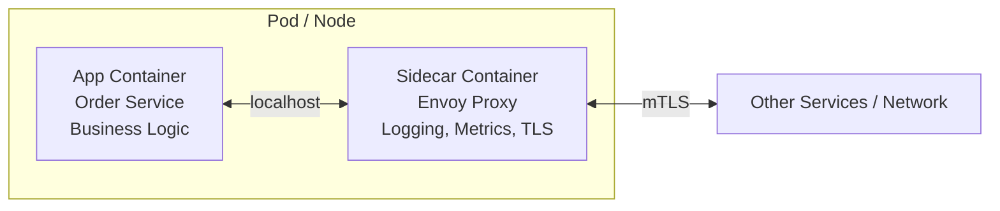
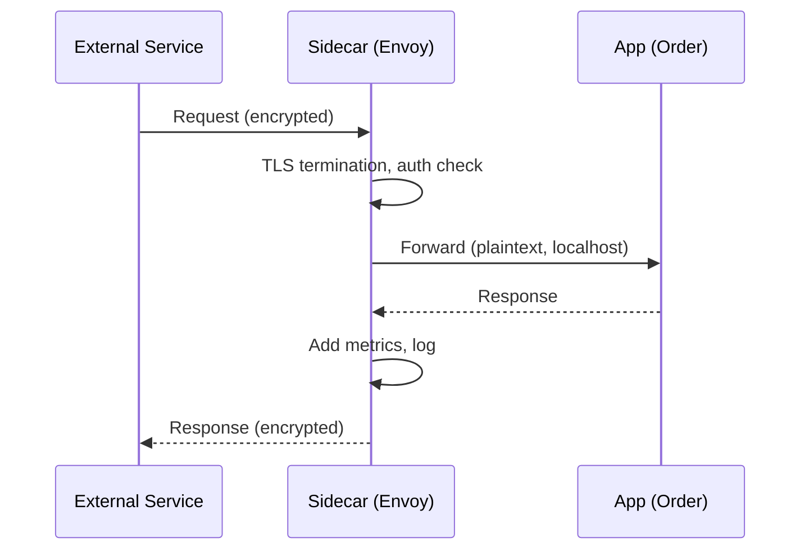
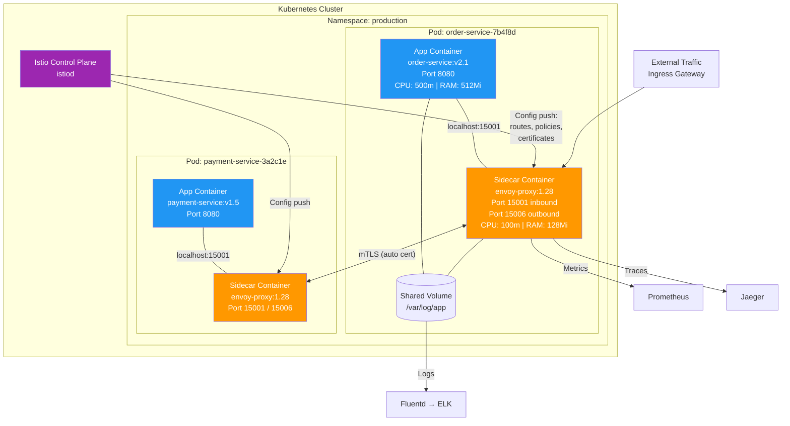
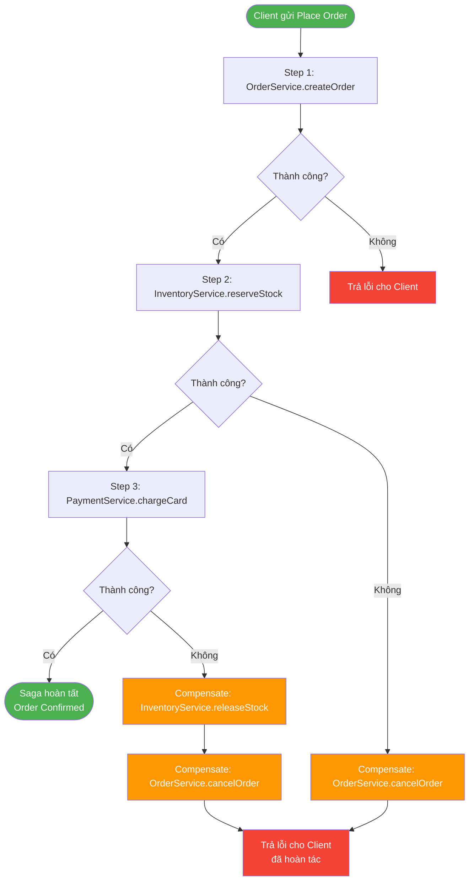
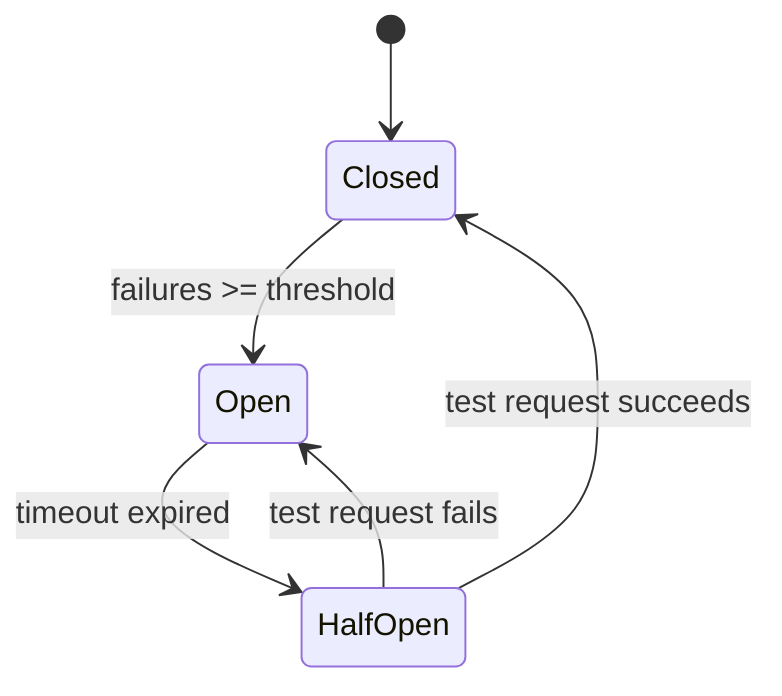
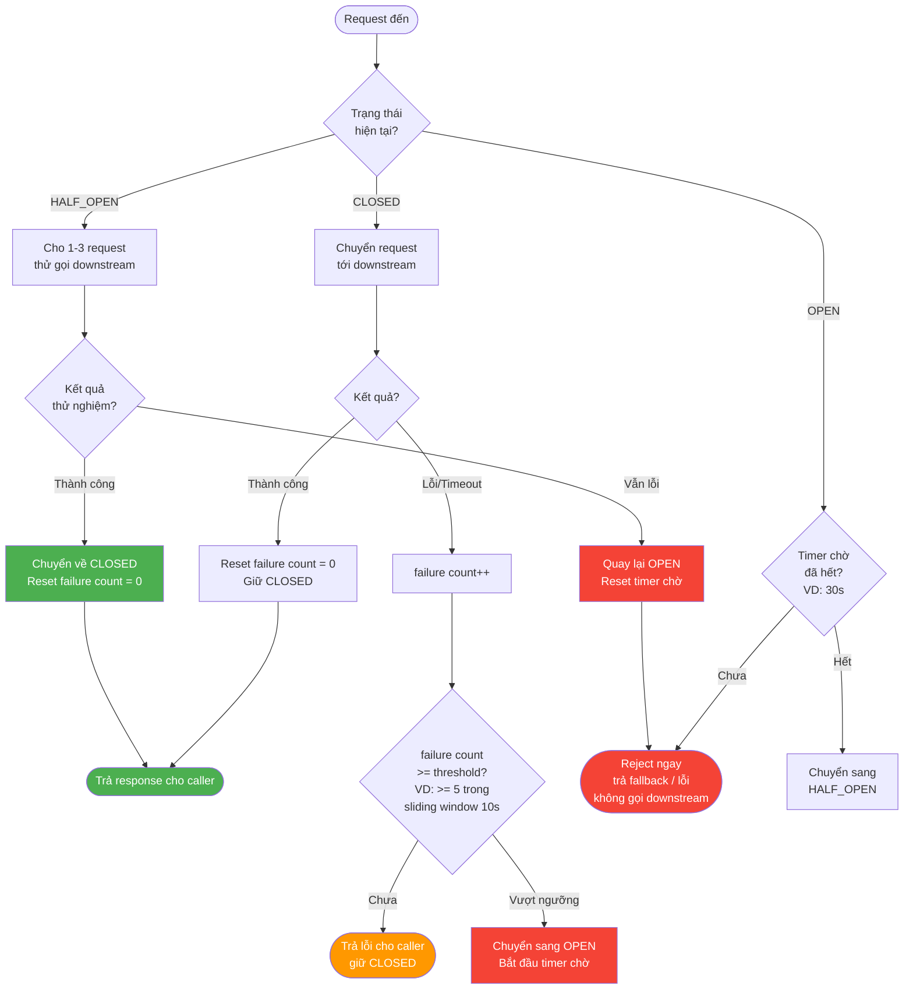

# Chương 12. Các mẫu bổ trợ Microservices

Khi chuyển từ kiến trúc monolith sang **microservices** — hệ thống gồm nhiều service nhỏ, độc lập, mỗi service có database riêng và triển khai riêng — một loạt vấn đề mới phát sinh mà các mẫu kiến trúc cơ bản chưa giải quyết trực tiếp. Ba nhóm vấn đề chính là: (1) **Cross-cutting concerns** — logging, monitoring, bảo mật, proxy mạng cần thống nhất giữa các service nhưng không muốn nhúng vào code nghiệp vụ của từng service; (2) **Giao dịch phân tán** — khi một nghiệp vụ (ví dụ đặt hàng) trải qua nhiều service, không thể dùng transaction cơ sở dữ liệu truyền thống vì mỗi service có DB riêng; (3) **Chịu lỗi** — khi một service downstream (ví dụ Payment) lỗi hoặc chậm, cần tránh lỗi lan truyền (cascading failure) làm sập cả hệ thống. Ba mẫu **Sidecar**, **Saga** và **Circuit Breaker** giải quyết lần lượt ba nhóm vấn đề trên. Chương này trình bày chi tiết từng mẫu, ví dụ thực tế và code minh họa. **Sidecar** gợi ý hình ảnh process/container phụ chạy cạnh app (proxy, log, metrics cùng pod). **Saga** gợi ý chuỗi bước đa service với **compensating transaction** khi một bước thất bại. **Circuit Breaker** gợi ý cầu dao: khi downstream lỗi liên tục thì **ngắt** tạm, fail fast, rồi thử lại (half-open).

---

## 12.1. Sidecar Pattern

Phần này định nghĩa Sidecar và cách tách cross-cutting ra khỏi container ứng dụng chính.

### 12.1.1. Khái niệm

**Sidecar Pattern** tách các tính năng **cross-cutting** (logging, monitoring, security, network proxy, tracing, TLS termination) ra khỏi ứng dụng chính, đặt vào một **process hoặc container riêng** chạy **cạnh** (bên cạnh, cùng machine/pod) ứng dụng. Ứng dụng chính chỉ lo business logic; sidecar đảm nhiệm mọi thứ "xung quanh". Hai container chia sẻ network namespace (cùng IP, localhost) và có thể chia sẻ volume (filesystem).

### 12.1.2. Cấu trúc (H12.1)

*Hình H12.1 — Sidecar: App Container và Sidecar Container cùng pod.*





### 12.1.3. Sơ đồ triển khai Sidecar trên Kubernetes (H12.5)

*Hình H12.5 — Sidecar deployment: Kubernetes Pod chứa App Container và Envoy Sidecar.*



### 12.1.4. Ví dụ thực tế

**Istio Service Mesh:** Trong Kubernetes với Istio, mỗi pod tự động được inject một **Envoy proxy** container (sidecar). Mọi traffic vào/ra ứng dụng đi qua Envoy. Envoy thực hiện: **mTLS** (mã hóa giao tiếp giữa services), **retry/timeout** (cấu hình tập trung, không cần code trong app), **circuit breaker** (ngắt mạch khi service downstream lỗi), **distributed tracing** (Jaeger/Zipkin integration), **metrics** (Prometheus). Developer không cần thêm library nào vào code app — tất cả do sidecar xử lý.

**Logging Sidecar:** Một container chạy Fluentd hoặc Filebeat bên cạnh app container, đọc log từ shared volume và gửi tới Elasticsearch/Kibana. App chỉ cần ghi log vào file; sidecar lo chuyển.

### 12.1.5. Ưu điểm

**Separation of concerns:** Developer tập trung nghiệp vụ; sidecar lo infrastructure. **Đa ngôn ngữ (polyglot):** Sidecar chung cho mọi service bất kể ngôn ngữ (Java, Python, Go). **Thống nhất:** Chính sách retry, timeout, TLS cấu hình một chỗ (control plane), áp dụng đồng nhất cho mọi service.

### 12.1.6. Nhược điểm

**Resource overhead:** Mỗi pod thêm một container → tốn CPU, RAM, network. Với hàng trăm service, overhead đáng kể. **Complexity:** Cần hiểu service mesh (Istio), cấu hình sidecar, debug qua proxy layer. **Latency:** Thêm một hop (qua sidecar) cho mỗi request.

**Khi nào dùng Sidecar:** Microservices, service mesh, cần tách logging/monitoring/security khỏi code nghiệp vụ; muốn chính sách mạng thống nhất; team đa ngôn ngữ.

---

## 12.2. Saga Pattern (Giao dịch phân tán)

Phần này trình bày giao dịch xuyên nhiều service bằng chuỗi bước local transaction và **compensating transaction**, cùng hai kiểu điều phối choreography và orchestration.

### 12.2.1. Vấn đề

Trong monolith, một nghiệp vụ phức tạp (đặt hàng = tạo đơn + trừ kho + charge card) có thể nằm trong **một transaction** ACID trên một database — nếu một bước lỗi, toàn bộ rollback. Trong microservices, mỗi service có **DB riêng** → không thể dùng transaction chung. Vậy làm sao đảm bảo nhất quán khi một bước giữa chừng lỗi?

### 12.2.2. Giải pháp: Saga

**Saga** chia giao dịch phân tán thành **chuỗi bước** (steps); mỗi bước là một local transaction trong một service. Mỗi bước có một **compensating transaction** (giao dịch bù) tương ứng — nếu bước sau lỗi, hệ thống thực hiện compensating transactions của các bước đã thành công **theo thứ tự ngược** để hoàn tác.

**Ví dụ:** Đặt hàng gồm 3 bước:
1. **Order Service:** Tạo đơn hàng (compensate: hủy đơn).
2. **Inventory Service:** Reserve kho (compensate: release kho).
3. **Payment Service:** Charge card (compensate: refund).

Nếu bước 3 (Payment) fail → thực hiện compensate bước 2 (release kho) → compensate bước 1 (hủy đơn).

### 12.2.3. Choreography vs Orchestration

**Choreography (Biên đạo):** Không có coordinator trung tâm. Mỗi service **subscribe event** và tự phản ứng. Luồng: Order Service publish `OrderCreated` → Inventory Service nhận, reserve kho, publish `InventoryReserved` → Payment Service nhận, charge card, publish `PaymentSucceeded` hoặc `PaymentFailed`. Nếu `PaymentFailed` → Inventory Service nhận, publish `InventoryReleased`; Order Service nhận, cập nhật "Cancelled".

*Ưu điểm:* Đơn giản, không bottleneck trung tâm. *Nhược điểm:* Luồng phức tạp khó theo dõi; khi nhiều bước, event chain rối; khó debug.

**Orchestration (Chỉ huy):** Một service trung tâm (**Saga Orchestrator**) điều phối: gọi từng service tuần tự; nếu một bước lỗi, orchestrator gọi compensating transactions. Orchestrator biết toàn bộ luồng.

*Ưu điểm:* Luồng rõ ràng, dễ hiểu, dễ monitor. *Nhược điểm:* Orchestrator là single point (cần HA); có thể thành bottleneck.

### 12.2.4. Luồng Saga Orchestration chi tiết (H12.3)

*Hình H12.3 — Flowchart Saga Orchestration: các bước, điều kiện, và luồng compensation.*



### 12.2.5. Ví dụ code (Java Spring Boot — Saga Orchestrator đơn giản)

```java
// SagaStep.java
public record SagaStep(String name, Runnable action, Runnable compensate) {}
```

```java
// SagaOrchestrator.java
import org.slf4j.Logger;
import org.slf4j.LoggerFactory;
import java.util.ArrayList;
import java.util.Collections;
import java.util.List;

public class SagaOrchestrator {

 private static final Logger log = LoggerFactory.getLogger(SagaOrchestrator.class);
 private final List<SagaStep> steps;

 public SagaOrchestrator(List<SagaStep> steps) {
 this.steps = steps;
 }

 public boolean execute() {
 List<SagaStep> completed = new ArrayList<>();
 for (SagaStep step : steps) {
 log.info("Executing: {}", step.name());
 try {
 step.action().run();
 completed.add(step);
 } catch (Exception e) {
 log.error("FAILED: {}. Starting compensation...", step.name());
 List<SagaStep> reversed = new ArrayList<>(completed);
 Collections.reverse(reversed);
 for (SagaStep s : reversed) {
 log.info(" Compensating: {}", s.name());
 s.compensate().run();
 }
 return false;
 }
 }
 log.info("Saga completed successfully!");
 return true;
 }
}
```

```java
// OrderSagaService.java — Sử dụng Saga trong Spring Boot
import org.springframework.stereotype.Service;
import java.util.List;

@Service
public class OrderSagaService {

 private final OrderService orderService;
 private final InventoryService inventoryService;
 private final PaymentService paymentService;

 public OrderSagaService(OrderService orderService,
 InventoryService inventoryService,
 PaymentService paymentService) {
 this.orderService = orderService;
 this.inventoryService = inventoryService;
 this.paymentService = paymentService;
 }

 public boolean placeOrder(String orderId) {
 SagaOrchestrator saga = new SagaOrchestrator(List.of(
 new SagaStep("Create Order",
 () -> orderService.create(orderId),
 () -> orderService.cancel(orderId)),
 new SagaStep("Reserve Inventory",
 () -> inventoryService.reserve(orderId),
 () -> inventoryService.release(orderId)),
 new SagaStep("Charge Payment",
 () -> paymentService.charge(orderId), // ném exception nếu lỗi
 () -> paymentService.refund(orderId))
 ));
 return saga.execute();
 }
}
```

Output khi Payment fail:
```
Executing: Create Order
Executing: Reserve Inventory
Executing: Charge Payment
FAILED: Charge Payment. Starting compensation...
 Compensating: Reserve Inventory
 Compensating: Create Order
```

---

## 12.3. Circuit Breaker (Ngắt mạch)

Phần này mô tả cách fail fast và bảo vệ caller khi downstream lỗi hoặc chậm, qua ba trạng thái Closed / Open / Half-Open.

### 12.3.1. Vấn đề

Trong microservices, service A gọi service B. Nếu B chậm hoặc lỗi, A phải chờ timeout (ví dụ 30 giây) cho mỗi request. Khi nhiều request đồng thời, tất cả đều chờ timeout → A hết thread/connection → A cũng lỗi → client của A lỗi → **cascading failure** (lỗi lan truyền domino).

### 12.3.2. Giải pháp: Circuit Breaker

**Circuit Breaker** hoạt động như cầu dao điện, có ba trạng thái:

**Closed (Đóng — bình thường):** Request đi qua bình thường tới service downstream. Circuit Breaker đếm số lỗi (timeout, exception). Khi **số lỗi vượt ngưỡng** (ví dụ 5 lỗi liên tiếp hoặc tỷ lệ lỗi > 50% trong 10 giây) → chuyển sang **Open**.

**Open (Mở — ngắt mạch):** **Không gửi request** tới downstream nữa; trả lỗi ngay (hoặc fallback response) cho caller. Điều này ngăn caller tiếp tục "đánh" vào service đang lỗi, bảo vệ cả hai bên. Sau một khoảng **timeout** (ví dụ 30 giây) → chuyển sang **Half-Open**.

**Half-Open (Nửa mở — thử lại):** Cho phép **một vài request** thử gọi downstream. Nếu **thành công** → chuyển về **Closed** (downstream đã phục hồi). Nếu **vẫn lỗi** → quay lại **Open** (downstream chưa khỏi), chờ thêm trước khi thử lại.

*Hình H12.2 — Circuit Breaker: state machine.*



### 12.3.3. Luồng Circuit Breaker chi tiết (H12.4)

*Hình H12.4 — Flowchart Circuit Breaker: 3 trạng thái với metrics chi tiết.*



### 12.3.4. Ví dụ code (Java Spring Boot — Resilience4j Circuit Breaker)

**Cấu hình Circuit Breaker trong `application.yml`:**

```yaml
# application.yml
resilience4j:
 circuitbreaker:
 instances:
 payment:
 failure-rate-threshold: 50 # Mở mạch khi >= 50% request lỗi
 wait-duration-in-open-state: 30s # Chờ 30s trước khi thử lại (Half-Open)
 sliding-window-type: COUNT_BASED
 sliding-window-size: 10 # Đánh giá trên 10 request gần nhất
 minimum-number-of-calls: 5 # Cần ít nhất 5 call mới đánh giá
 permitted-number-of-calls-in-half-open-state: 3 # Cho 3 request thử trong Half-Open
```

**PaymentClient sử dụng `@CircuitBreaker`:**

```java
// PaymentClient.java
import io.github.resilience4j.circuitbreaker.annotation.CircuitBreaker;
import org.slf4j.Logger;
import org.slf4j.LoggerFactory;
import org.springframework.stereotype.Service;
import org.springframework.web.client.RestTemplate;

@Service
public class PaymentClient {

 private static final Logger log = LoggerFactory.getLogger(PaymentClient.class);
 private final RestTemplate restTemplate;

 public PaymentClient(RestTemplate restTemplate) {
 this.restTemplate = restTemplate;
 }

 @CircuitBreaker(name = "payment", fallbackMethod = "paymentFallback")
 public String chargeCard(String orderId, double amount) {
 log.info("Calling Payment Service for order: {}", orderId);
 return restTemplate.postForObject(
 "http://payment-service/api/charge",
 new ChargeRequest(orderId, amount),
 String.class
 );
 }

 private String paymentFallback(String orderId, double amount, Throwable t) {
 log.warn("Payment Circuit Breaker activated for order: {}. Reason: {}",
 orderId, t.getMessage());
 return "PAYMENT_UNAVAILABLE";
 }
}
```

```java
// ChargeRequest.java
public record ChargeRequest(String orderId, double amount) {}
```

### 12.3.5. Công nghệ thực tế

**Resilience4j (Java):** Library circuit breaker hiện đại cho Java; hỗ trợ sliding window (count-based, time-based), retry, rate limiter, bulkhead. **Hystrix (Netflix, legacy):** Tiền thân của Resilience4j, nay đã maintenance-only. **Istio (Service Mesh):** Circuit breaker cấu hình ở sidecar (Envoy) — không cần code trong app.

---

## 12.4. Khi nào dùng từng mẫu

**Sidecar:** Microservices cần tách cross-cutting (logging, monitoring, security, proxy) khỏi code nghiệp vụ; dùng service mesh (Istio, Linkerd); team đa ngôn ngữ; muốn chính sách mạng thống nhất.

**Saga:** Giao dịch **đa service** (đặt hàng, đặt phòng, chuyển khoản) khi mỗi service có DB riêng; chấp nhận **eventual consistency** và compensating; không thể dùng distributed transaction (2PC quá chậm/phức tạp).

**Circuit Breaker:** Gọi service downstream **dễ lỗi** hoặc **tải cao**; cần tránh cascading failure; muốn fail-fast thay vì chờ timeout. Kết hợp với retry (có backoff) và fallback.

---

## 12.5. Case study: Hệ thống đặt phòng khách sạn

**Yêu cầu:** Đặt phòng = Reserve Room (Room Service) + Charge Card (Payment Service) + Send Confirmation (Notification Service). Mỗi service có DB riêng. Nếu Charge Card fail → phải release room.

**Saga (Orchestration):** SagaOrchestrator gọi: (1) RoomService.reserve() → thành công. (2) PaymentService.charge() → thất bại. (3) Orchestrator gọi compensate: RoomService.release(). (4) Trả lỗi cho client.

**Circuit Breaker:** PaymentService thường xuyên timeout. OrderService dùng Circuit Breaker: sau 5 timeout liên tiếp → Open → reject request ngay (trả lỗi "Payment temporarily unavailable, try later") thay vì chờ 30s mỗi request. Sau 60s → Half-Open → thử một request → nếu OK → Closed.

**Sidecar:** Mỗi service (Room, Payment, Notification) chạy cùng Envoy sidecar trong Kubernetes. Envoy lo: mTLS giữa services, distributed tracing (Jaeger), metrics (Prometheus), retry policy.

---

## 12.6. Câu hỏi ôn tập

1. Sidecar pattern giải quyết vấn đề gì? Tại sao không nhúng logging/monitoring vào code app luôn?
2. So sánh Choreography và Orchestration trong Saga: ưu nhược điểm, khi nào chọn cái nào?
3. Circuit Breaker có những trạng thái nào? Mô tả điều kiện chuyển giữa các trạng thái.
4. Compensating transaction là gì? Cho ví dụ trong bài toán đặt vé máy bay.
5. Khi nào kết hợp Event-Driven (Chương 9) với Saga? Cho ví dụ luồng event.

---

## 12.7. Bài tập ngắn

**BT12.1.** Vẽ luồng Saga (orchestration) cho "Đặt phòng khách sạn": Reserve room → Charge card → Send confirmation. Nêu rõ: từng bước, compensating transaction khi Charge fail, luồng hoàn tác.

**BT12.2.** Một API của Order Service gọi Payment Service; Payment thường timeout (khoảng 1/3 request). Đề xuất cấu hình Circuit Breaker: failure threshold (bao nhiêu lỗi), recovery timeout (bao lâu thử lại), sliding window (count vs time-based). Giải thích lý do.

---

*Hình: H12.1 — Sidecar, H12.2 — Circuit Breaker state machine, H12.3 — Saga Orchestration flowchart, H12.4 — Circuit Breaker flowchart chi tiết, H12.5 — Sidecar Kubernetes deployment. Xem thêm: Chương 7 (Broker), Chương 9 (EDA). Glossary: Saga, Sidecar, Circuit Breaker, ACID, Eventual Consistency, Cascading Failure.*
