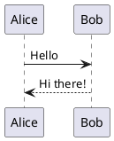

# Cài đặt Công cụ Development

## Thời lượng: 1 giờ

## Tổng quan

Hướng dẫn cài đặt các công cụ bổ sung cần thiết cho các labs.

---

## 1. Diagram Tools

### PlantUML

**Mục đích:** Labs 4.1 - UML Diagrams

#### VS Code Extension
1. Mở VS Code
2. Extensions (Ctrl+Shift+X / Cmd+Shift+X)
3. Tìm "PlantUML" by jebbs
4. Install

#### Cài đặt Local Server (Optional)
```bash
# macOS
brew install plantuml

# Windows (với Chocolatey)
choco install plantuml
```

#### Test
Tạo file `test.puml`:

Nhấn Alt+D để preview.

---

### Mermaid

**Mục đích:** Labs 4.5 - Mermaid Diagrams

#### VS Code Extension
1. Tìm "Mermaid Preview" hoặc "Markdown Preview Mermaid Support"
2. Install

#### CLI Tool
```bash
npm install -g @mermaid-js/mermaid-cli
```

#### Test
```bash
mmdc -i input.mmd -o output.png
```

---

### Draw.io / diagrams.net

**Mục đích:** Labs 1.4, 4.x - Architecture diagrams

#### VS Code Extension
1. Tìm "Draw.io Integration"
2. Install
3. Tạo file `.drawio.svg` hoặc `.drawio.png`

#### Web Version
- https://app.diagrams.net/

---

## 2. API Tools

### Postman

**Mục đích:** Labs 2.3, 4.6 - API testing

#### Cài đặt
- Download từ: https://www.postman.com/downloads/

#### Hoặc dùng CLI
```bash
# macOS
brew install --cask postman

# Windows
winget install Postman.Postman
```

---

### HTTPie

**Mục đích:** CLI HTTP client

```bash
# macOS
brew install httpie

# Windows
pip install httpie
```

#### Sử dụng
```bash
# GET request
http GET https://api.github.com/users/octocat

# POST with JSON
http POST https://httpbin.org/post name=John age:=25
```

---

### REST Client (VS Code)

**Mục đích:** Test API trong VS Code

1. Install extension "REST Client" by Huachao Mao
2. Tạo file `.http`:
```http
### Get users
GET https://jsonplaceholder.typicode.com/users

### Create user
POST https://jsonplaceholder.typicode.com/users
Content-Type: application/json

{
 "name": "John Doe",
 "email": "john@example.com"
}
```
3. Click "Send Request"

---

## 3. Database Tools

### DBeaver

**Mục đích:** Labs 3.12 - Database management

#### Cài đặt
```bash
# macOS
brew install --cask dbeaver-community

# Windows
winget install dbeaver.dbeaver
```

#### Hỗ trợ
- PostgreSQL
- MySQL
- MongoDB
- Redis
- Và nhiều database khác

---

### Redis CLI & Redis Insight

**Mục đích:** Labs 3.12 - Redis

```bash
# macOS
brew install redis

# Start Redis server
redis-server

# Redis CLI
redis-cli
```

#### Redis Insight (GUI)
- Download: https://redis.com/redis-enterprise/redis-insight/

---

## 4. Kubernetes Tools

### Helm

**Mục đích:** Labs 3.4 - Kubernetes package manager

```bash
# macOS
brew install helm

# Windows
choco install kubernetes-helm
```

#### Verify
```bash
helm version
```

---

### k9s

**Mục đích:** Kubernetes TUI

```bash
# macOS
brew install k9s

# Windows
choco install k9s
```

#### Sử dụng
```bash
k9s
# Nhấn : để gõ command
# :pods - xem pods
# :svc - xem services
# :deploy - xem deployments
```

---

### kubectx & kubens

**Mục đích:** Switch context và namespace

```bash
# macOS
brew install kubectx

# Sử dụng
kubectx # List contexts
kubectx minikube # Switch to minikube
kubens # List namespaces
kubens default # Switch to default namespace
```

---

## 5. Message Queue Tools

### RabbitMQ Management Plugin

**Mục đích:** Labs 3.5 - RabbitMQ

Khi chạy RabbitMQ trong Docker:
```bash
docker run -d --name rabbitmq \
 -p 5672:5672 \
 -p 15672:15672 \
 rabbitmq:3-management
```

Truy cập: http://localhost:15672
- Username: guest
- Password: guest

---

### Kafka Tools

**Mục đích:** Labs 3.6 - Kafka

#### Offset Explorer (Kafka Tool)
- Download: https://www.kafkatool.com/

#### kcat (kafkacat)
```bash
# macOS
brew install kcat

# Sử dụng
kcat -b localhost:9092 -L # List topics
kcat -b localhost:9092 -t my-topic -C # Consume
```

---

## 6. Monitoring Tools (Local)

### Prometheus & Grafana (Docker)

**Mục đích:** Labs 6.5 - Monitoring

```bash
# Tạo docker-compose.yml
cat << 'EOF' > monitoring/docker-compose.yml
version: '3.8'
services:
 prometheus:
 image: prom/prometheus:latest
 ports:
 - "9090:9090"
 volumes:
 - ./prometheus.yml:/etc/prometheus/prometheus.yml

 grafana:
 image: grafana/grafana:latest
 ports:
 - "3000:3000"
 environment:
 - GF_SECURITY_ADMIN_PASSWORD=admin
EOF

# Start
cd monitoring
docker-compose up -d
```

Truy cập:
- Prometheus: http://localhost:9090
- Grafana: http://localhost:3000 (admin/admin)

---

## 7. Documentation Tools

### Asciidoctor

**Mục đích:** Labs 4.4 - arc42 documentation

```bash
# macOS
brew install asciidoctor

# Windows
gem install asciidoctor
```

---

### Swagger/OpenAPI Editor

**Mục đích:** Labs 4.6 - API documentation

#### VS Code Extension
1. Tìm "OpenAPI (Swagger) Editor"
2. Install

#### Swagger UI Docker
```bash
docker run -p 8080:8080 \
 -e SWAGGER_JSON=/app/openapi.yaml \
 -v $(pwd):/app \
 swaggerapi/swagger-ui
```

---

## 8. Code Quality Tools

### SonarQube (Docker)

**Mục đích:** Labs 7.5 - Technical Debt

```bash
docker run -d --name sonarqube \
 -p 9000:9000 \
 sonarqube:lts-community
```

Truy cập: http://localhost:9000
- Username: admin
- Password: admin (đổi sau lần đầu login)

---

### ESLint / Prettier (Node.js projects)

```bash
npm install -D eslint prettier eslint-config-prettier
```

---

## Checklist Hoàn thành

### Diagram Tools
- [ ] PlantUML extension installed
- [ ] Mermaid preview works
- [ ] Draw.io integration ready

### API Tools
- [ ] Postman hoặc REST Client ready
- [ ] HTTPie installed

### Database Tools
- [ ] DBeaver installed
- [ ] Redis CLI works

### Kubernetes Tools
- [ ] Helm installed
- [ ] k9s installed (optional)
- [ ] kubectx installed (optional)

### Monitoring
- [ ] Prometheus & Grafana Docker ready

### Documentation
- [ ] OpenAPI editor ready

---

## Quick Reference

### Start Common Services (Docker)

```bash
# PostgreSQL
docker run -d --name postgres \
 -e POSTGRES_PASSWORD=postgres \
 -p 5432:5432 \
 postgres:15

# MongoDB
docker run -d --name mongodb \
 -p 27017:27017 \
 mongo:6

# Redis
docker run -d --name redis \
 -p 6379:6379 \
 redis:7

# RabbitMQ
docker run -d --name rabbitmq \
 -p 5672:5672 -p 15672:15672 \
 rabbitmq:3-management

# Kafka (với Zookeeper)
docker-compose -f kafka-compose.yml up -d
```

### Stop All Containers

```bash
docker stop $(docker ps -q)
docker rm $(docker ps -aq)
```

---

## Tiếp theo

Môi trường đã sẵn sàng! Bắt đầu với:
- `01-foundations/lab-1.1-quality-attributes/`
