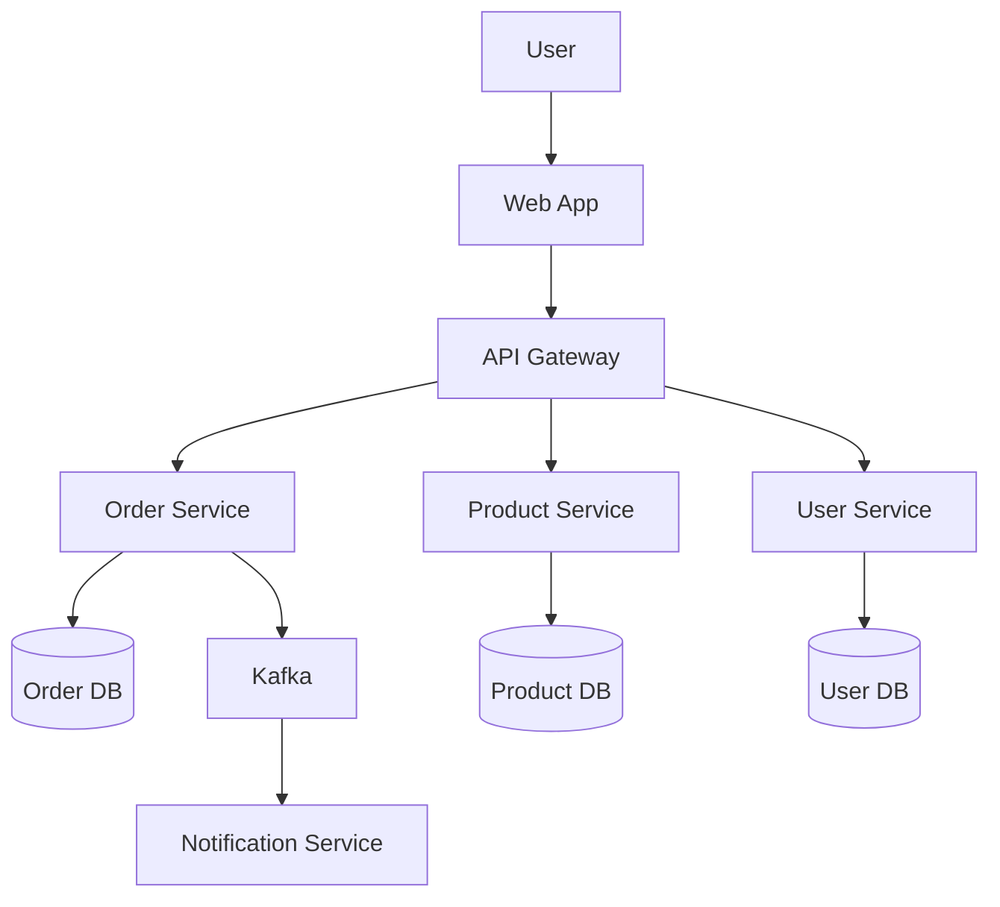

# Lab 1.4: Các Góc nhìn Kiến trúc (Architecture Views & Viewpoints)

## Thông tin Lab

| Thông tin | Giá trị |
|-----------|---------|
| **Thời lượng** | 3 giờ |
| **Độ khó** | ** Beginner |
| **Yêu cầu trước** | Hoàn thành Lab 1.1-1.3 |
| **Công cụ** | draw.io, PlantUML, Mermaid |

## Mục tiêu Học tập

Sau khi hoàn thành lab này, bạn có thể:

1. **Giải thích** khái niệm Views và Viewpoints trong kiến trúc phần mềm
2. **Phân biệt** các loại views phổ biến và đối tượng sử dụng
3. **Áp dụng** mô hình 4+1 View để mô tả kiến trúc hoàn chỉnh
4. **Tạo** nhiều views cho một hệ thống và đảm bảo tính nhất quán

---

## Phân bổ Thời gian Chi tiết

| Phần | Hoạt động | Thời gian | Ghi chú |
|------|-----------|-----------|---------|
| **Phần 1** | Khái niệm Views & Viewpoints | 30 phút | Đọc + thảo luận |
| | - 1.1 View vs Viewpoint | 10 phút | Phân biệt 2 khái niệm |
| | - 1.2 Vì sao cần nhiều Views | 10 phút | Stakeholder concerns |
| | - 1.3 Nguyên tắc tạo Views | 10 phút | Best practices |
| **Phần 2** | Mô hình 4+1 View | 30 phút | Đọc chi tiết |
| | - Logical View | 6 phút | |
| | - Process View | 6 phút | |
| | - Development View | 6 phút | |
| | - Physical View | 6 phút | |
| | - Use Case View (+1) | 6 phút | |
| **Phần 3** | Các framework khác | 20 phút | C4, ISO 42010 |
| **Phần 4** | Bài tập Thực hành | 80 phút | 4 bài tập |
| | - Bài 1: Stakeholders & Concerns | 20 phút | |
| | - Bài 2: Vẽ 4+1 Views | 35 phút | Bài chính |
| | - Bài 3: Consistency Check | 10 phút | |
| | - Bài 4: Phân tích Open-source | 15 phút | |
| **Phần 5** | Công cụ vẽ Diagram | 20 phút | Thực hành draw.io/Mermaid |
| **Tổng** | | **3 giờ** | |

---

## Phần 1: Khái niệm Cơ bản

### 1.1 View vs Viewpoint - Phân biệt hai khái niệm

| Khái niệm | Định nghĩa | Ví dụ thực tế |
|-----------|------------|---------------|
| **View** | Một bức tranh cụ thể về kiến trúc, nhìn từ một góc độ nhất định | Sơ đồ deployment của hệ thống Shopee |
| **Viewpoint** | Quy ước, template, hướng dẫn để tạo ra view | Chuẩn UML cho deployment diagram |

> [Goi y] **Cách nhớ đơn giản:**
> - **Viewpoint** = Khuôn bánh (template, quy tắc)
> - **View** = Chiếc bánh được làm từ khuôn đó (sản phẩm cụ thể)

**Ví dụ minh họa:**

```
┌─────────────────────────────────────────────────────────────┐
│ VIEWPOINT │
│ (Template: Deployment Diagram theo chuẩn UML) │
│ │
│ Quy tắc: │
│ - Node = hình hộp 3D │
│ - Artifact = hình chữ nhật │
│ - Connection = đường nối │
└─────────────────────────────────────────────────────────────┘
 │
 │ Áp dụng cho
 ▼
┌─────────────────────────────────────────────────────────────┐
│ VIEW │
│ (Deployment Diagram cụ thể của hệ thống Tiki) │
│ │
│ ┌─────────────┐ ┌─────────────┐ │
│ │ Web Server │──────│ Database │ │
│ │ (Nginx) │ │ (MySQL) │ │
│ └─────────────┘ └─────────────┘ │
└─────────────────────────────────────────────────────────────┘
```

### 1.2 Vì sao cần Nhiều Views?

Các stakeholders khác nhau quan tâm đến các khía cạnh khác nhau của hệ thống:

| Stakeholder | Họ quan tâm đến... | View phù hợp | Câu hỏi họ thường đặt ra |
|-------------|-------------------|--------------|--------------------------|
| **Developer** | Cấu trúc code, dependencies | Logical View | "Module nào phụ thuộc module nào?" |
| **DevOps** | Triển khai, infrastructure | Physical View | "Deploy lên server nào? Cần bao nhiêu RAM?" |
| **Business** | Tính năng, chi phí | Use Case View | "User có thể làm gì? Mất bao lâu phát triển?" |
| **Performance Engineer** | Xử lý song song, bottleneck | Process View | "Thread nào chạy cái gì? Đâu là điểm nghẽn?" |
| **QA/Tester** | Các scenario cần test | Use Case View | "Test case nào cần viết?" |
| **Security Analyst** | Điểm yếu bảo mật | Physical + Logical | "Dữ liệu nhạy cảm đi qua đâu?" |

**Câu chuyện thực tế:**

```
Tình huống: Họp review kiến trúc hệ thống Lazada

CEO hỏi: "Tính năng mới có thu hút được khách hàng không?"
 → Cần Use Case View

CTO hỏi: "Services nào cần thay đổi?"
 → Cần Logical View

DevOps hỏi: "Cần thêm bao nhiêu server cho Black Friday?"
 → Cần Physical View

Dev hỏi: "Team nào sẽ maintain phần này?"
 → Cần Development View

Kết luận: KHÔNG THỂ dùng một diagram cho tất cả!
```

### 1.3 Nguyên tắc Tạo Views Hiệu quả

| # | Nguyên tắc | Giải thích | Ví dụ vi phạm |
|---|------------|------------|---------------|
| 1 | **Right audience** | Mỗi view phục vụ một nhóm cụ thể | Cho CEO xem class diagram |
| 2 | **Right detail** | Mức chi tiết phù hợp với mục đích | Code-level trong system context |
| 3 | **Consistency** | Các views phải nhất quán với nhau | Service A có trong Logical nhưng không có trong Physical |
| 4 | **Up-to-date** | Views phải phản ánh thực tế hiện tại | Diagram từ 2 năm trước |
| 5 | **Minimal** | Chỉ vẽ những gì cần thiết | Cố nhồi mọi thứ vào một diagram |

---

## Phần 2: Mô hình 4+1 View (Kruchten)

### 2.1 Tổng quan

Mô hình 4+1 do **Philippe Kruchten** đề xuất năm 1995, là framework kinh điển được sử dụng rộng rãi nhất để mô tả kiến trúc phần mềm.

```
 ┌─────────────────────────┐
 │ │
 │ USE CASE VIEW │
 │ (Scenarios) │
 │ │
 │ "Hệ thống phục vụ │
 │ ai? Làm được gì?" │
 │ │
 └───────────┬─────────────┘
 │
 ┌─────────────────────────┼─────────────────────────┐
 │ │ │
 ▼ ▼ ▼
┌─────────────────────┐ ┌─────────────────────┐ ┌─────────────────────┐
│ │ │ │ │ │
│ LOGICAL VIEW │ │ PROCESS VIEW │ │ DEVELOPMENT VIEW │
│ │ │ │ │ │
│ "Cấu trúc phần │ │ "Chạy runtime │ │ "Code tổ chức │
│ mềm như thế nào?" │ │ ra sao?" │ │ thế nào?" │
│ │ │ │ │ │
│ - Classes │ │ - Processes │ │ - Modules │
│ - Packages │ │ - Threads │ │ - Repositories │
│ - Relationships │ │ - Concurrency │ │ - Build system │
│ │ │ │ │ │
└──────────┬──────────┘ └─────────────────────┘ └──────────┬──────────┘
 │ │
 └────────────────────────┬───────────────────────────┘
 │
 ▼
 ┌─────────────────────────┐
 │ │
 │ PHYSICAL VIEW │
 │ (Deployment) │
 │ │
 │ "Phần mềm chạy trên │
 │ phần cứng nào?" │
 │ │
 │ - Servers │
 │ - Networks │
 │ - Cloud resources │
 │ │
 └─────────────────────────┘
```

### 2.2 Chi tiết từng View

#### Logical View (View Logic nghiệp vụ)

| Thuộc tính | Chi tiết |
|------------|----------|
| **Mục đích** | Mô tả cấu trúc các thành phần phần mềm và mối quan hệ |
| **Dành cho** | Designers, Developers, Technical Leads |
| **Nội dung** | Modules, classes, packages, interfaces, relationships |
| **Ký hiệu** | UML Class Diagram, Package Diagram, Component Diagram |
| **Câu hỏi trả lời** | "Hệ thống gồm những modules nào? Chúng liên kết ra sao?" |

**Ví dụ cho hệ thống E-Commerce:**

```
┌─────────────────────────────────────────────────────────────────────┐
│ LOGICAL VIEW - E-Commerce │
├─────────────────────────────────────────────────────────────────────┤
│ │
│ ┌──────────────┐ ┌──────────────┐ ┌──────────────┐ │
│ │ User │ │ Product │ │ Order │ │
│ │ Module │ │ Module │ │ Module │ │
│ ├──────────────┤ ├──────────────┤ ├──────────────┤ │
│ │ - UserSvc │ │ - CatalogSvc │ │ - OrderSvc │ │
│ │ - AuthSvc │ │ - SearchSvc │ │ - CartSvc │ │
│ │ - ProfileSvc │ │ - InventorySvc│ │ - CheckoutSvc│ │
│ └──────┬───────┘ └──────┬───────┘ └──────┬───────┘ │
│ │ │ │ │
│ │ ┌───────────────┼────────────────────┘ │
│ │ │ │ │
│ ▼ ▼ ▼ │
│ ┌──────────────┐ ┌──────────────┐ │
│ │ Payment │ │ Notification │ │
│ │ Module │ │ Module │ │
│ ├──────────────┤ ├──────────────┤ │
│ │ - PaymentSvc │ │ - EmailSvc │ │
│ │ - RefundSvc │ │ - SMSSvc │ │
│ │ - WalletSvc │ │ - PushSvc │ │
│ └──────────────┘ └──────────────┘ │
│ │
└─────────────────────────────────────────────────────────────────────┘
```

#### Process View (View Xử lý runtime)

| Thuộc tính | Chi tiết |
|------------|----------|
| **Mục đích** | Mô tả hành vi runtime, xử lý đồng thời, luồng dữ liệu |
| **Dành cho** | Performance engineers, System integrators, DevOps |
| **Nội dung** | Processes, threads, synchronization, async flows |
| **Ký hiệu** | Activity Diagram, Sequence Diagram, Data Flow Diagram |
| **Câu hỏi trả lời** | "Request xử lý thế nào? Có bao nhiêu thread? Đâu là bottleneck?" |

**Ví dụ: Order Processing Flow**

```
┌─────────────────────────────────────────────────────────────────────┐
│ PROCESS VIEW - Order Flow │
├─────────────────────────────────────────────────────────────────────┤
│ │
│ User API Gateway Services DB │
│ │ │ │ │ │
│ │ 1. Place Order │ │ │ │
│ │─────────────────────│ │ │ │
│ │ │ 2. Validate │ │ │
│ │ │─────────────────│ │ │
│ │ │ │ 3. Check Stock │ │
│ │ │ │─────────────────│ │
│ │ │ │─────────────────│ │
│ │ │ │ │ │
│ │ │ │ 4. Reserve Stock │ │
│ │ │ │─────────────────│ │
│ │ │ │ │ │
│ │ │ ┌──────────────┴──────────────┐ │ │
│ │ │ │ ASYNC (Message Queue) │ │ │
│ │ │ │ ┌────────┐ ┌────────┐ │ │ │
│ │ │ │ │Payment │ │Notify │ │ │ │
│ │ │ │ │Process │ │Service │ │ │ │
│ │ │ │ └────────┘ └────────┘ │ │ │
│ │ │ └─────────────────────────────┘ │ │
│ │ │ │ │ │
│ │ 5. Order Confirmed │ │ │ │
│ │─────────────────────│ │ │ │
│ │ │ │ │ │
│ │
│ Legend: │
│ ───── : Synchronous call │
│ ═════ : Asynchronous message │
│ │
└─────────────────────────────────────────────────────────────────────┘
```

#### Development View (View Tổ chức code)

| Thuộc tính | Chi tiết |
|------------|----------|
| **Mục đích** | Mô tả cách tổ chức source code, repositories, build |
| **Dành cho** | Programmers, Managers, Build engineers |
| **Nội dung** | Folder structure, repositories, modules, dependencies |
| **Ký hiệu** | Component Diagram, Folder tree, Dependency graph |
| **Câu hỏi trả lời** | "Code ở đâu? Team nào maintain phần nào? Build thế nào?" |

**Ví dụ: Monorepo Structure**

```
┌─────────────────────────────────────────────────────────────────────┐
│ DEVELOPMENT VIEW - Repository Structure │
├─────────────────────────────────────────────────────────────────────┤
│ │
│ ecommerce-platform/ │
│ │ │
│ ├── services/ ← Backend services │
│ │ ├── user-service/ ← Team: Identity │
│ │ │ ├── src/ │
│ │ │ ├── tests/ │
│ │ │ └── Dockerfile │
│ │ ├── order-service/ ← Team: Orders │
│ │ ├── product-service/ ← Team: Catalog │
│ │ ├── payment-service/ ← Team: Payments │
│ │ └── notification-service/ ← Team: Platform │
│ │ │
│ ├── libs/ ← Shared libraries │
│ │ ├── common/ ← Utilities, constants │
│ │ ├── auth/ ← JWT, OAuth │
│ │ └── messaging/ ← Kafka, RabbitMQ clients │
│ │ │
│ ├── clients/ ← Frontend applications │
│ │ ├── web/ ← React SPA │
│ │ ├── mobile/ ← React Native │
│ │ └── admin/ ← Admin dashboard │
│ │ │
│ ├── infrastructure/ ← IaC │
│ │ ├── terraform/ │
│ │ ├── kubernetes/ │
│ │ └── docker-compose.yml │
│ │ │
│ └── docs/ ← Documentation │
│ ├── architecture/ │
│ └── api/ │
│ │
│ Dependencies: │
│ ┌────────────────┐ │
│ │ order-service │──depends── libs/common │
│ │ │──depends── libs/messaging │
│ │ │──calls──── product-service │
│ │ │──calls──── payment-service │
│ └────────────────┘ │
│ │
└─────────────────────────────────────────────────────────────────────┘
```

#### Physical View (View Triển khai vật lý)

| Thuộc tính | Chi tiết |
|------------|----------|
| **Mục đích** | Mô tả cách software mapping lên hardware/infrastructure |
| **Dành cho** | System engineers, DevOps, Network admins |
| **Nội dung** | Servers, networks, cloud resources, deployment topology |
| **Ký hiệu** | Deployment Diagram, Infrastructure Diagram |
| **Câu hỏi trả lời** | "Chạy trên server nào? Cần bao nhiêu resources? Network topology?" |

**Ví dụ: Cloud Deployment**

```
┌─────────────────────────────────────────────────────────────────────┐
│ PHYSICAL VIEW - AWS Cloud Deployment │
├─────────────────────────────────────────────────────────────────────┤
│ │
│ ┌─────────────────────────────────────────────────────────────────┐│
│ │ AWS Cloud ││
│ │ ││
│ │ ┌──────────────────────────────────────────────────────────┐ ││
│ │ │ VPC │ ││
│ │ │ │ ││
│ │ │ ┌─────────────────┐ ┌─────────────────┐ │ ││
│ │ │ │ Public Subnet │ │ Public Subnet │ │ ││
│ │ │ │ (AZ-1) │ │ (AZ-2) │ │ ││
│ │ │ │ │ │ │ │ ││
│ │ │ │ ┌─────────────┐ │ │ ┌─────────────┐ │ │ ││
│ │ │ │ │ ALB │ │ │ │ ALB │ │ │ ││
│ │ │ │ │(Load Balancer)│ │ │(Load Balancer)│ │ ││
│ │ │ │ └──────┬──────┘ │ │ └──────┬──────┘ │ │ ││
│ │ │ └────────┼────────┘ └────────┼────────┘ │ ││
│ │ │ │ │ │ ││
│ │ │ ┌────────┼──────────────────────┼────────┐ │ ││
│ │ │ │ ▼ ▼ │ │ ││
│ │ │ │ Private Subnet (AZ-1) Private (AZ-2)│ │ ││
│ │ │ │ ┌───────────────────────────────────┐ │ │ ││
│ │ │ │ │ EKS Cluster │ │ │ ││
│ │ │ │ │ ┌─────┐ ┌─────┐ ┌─────┐ ┌─────┐ │ │ │ ││
│ │ │ │ │ │User │ │Order│ │Prod │ │Pay │ │ │ │ ││
│ │ │ │ │ │Svc │ │Svc │ │Svc │ │Svc │ │ │ │ ││
│ │ │ │ │ │x3 │ │x5 │ │x3 │ │x3 │ │ │ │ ││
│ │ │ │ │ └─────┘ └─────┘ └─────┘ └─────┘ │ │ │ ││
│ │ │ │ └───────────────────────────────────┘ │ │ ││
│ │ │ └────────────────────────────────────────┘ │ ││
│ │ │ │ ││
│ │ │ ┌──────────────────────────────────────────────────────┐│ ││
│ │ │ │ Data Layer ││ ││
│ │ │ │ ┌──────────┐ ┌──────────┐ ┌──────────┐ ││ ││
│ │ │ │ │ RDS │ │ ElastiCache│ │ MSK │ ││ ││
│ │ │ │ │ (MySQL) │ │ (Redis) │ │ (Kafka) │ ││ ││
│ │ │ │ │ Multi-AZ │ │ Cluster │ │ Cluster │ ││ ││
│ │ │ │ └──────────┘ └──────────┘ └──────────┘ ││ ││
│ │ │ └──────────────────────────────────────────────────────┘│ ││
│ │ │ │ ││
│ │ └───────────────────────────────────────────────────────────┘ ││
│ │ ││
│ └──────────────────────────────────────────────────────────────────┘│
│ │
│ Resources Summary: │
│ - EKS: 6 nodes (m5.xlarge) │
│ - RDS: db.r5.2xlarge (Multi-AZ) │
│ - ElastiCache: cache.r5.large x3 │
│ - MSK: kafka.m5.large x3 │
│ │
└─────────────────────────────────────────────────────────────────────┘
```

#### Use Case View (+1) - View Tình huống sử dụng

| Thuộc tính | Chi tiết |
|------------|----------|
| **Mục đích** | Validate kiến trúc qua các scenarios thực tế |
| **Dành cho** | Tất cả stakeholders |
| **Nội dung** | User stories, use cases, key scenarios |
| **Ký hiệu** | Use Case Diagram, User Journey |
| **Câu hỏi trả lời** | "User có thể làm gì? Scenario quan trọng nhất là gì?" |

**Ví dụ: E-Commerce Use Cases**

```
┌─────────────────────────────────────────────────────────────────────┐
│ USE CASE VIEW (+1) - Key Scenarios │
├─────────────────────────────────────────────────────────────────────┤
│ │
│ ┌────────────────────┐ │
│ │ E-Commerce │ │
│ │ System │ │
│ └────────────────────┘ │
│ │ │
│ ┌───────────────┬──────────┴───────────┬───────────────┐ │
│ │ │ │ │ │
│ ▼ ▼ ▼ ▼ │
│ ┌──────┐ ┌──────┐ ┌──────┐ ┌──────┐ │
│ │Browse│ │Search│ │ Cart │ │Order │ │
│ │Prods │ │Prods │ │Manage│ │Manage│ │
│ └──────┘ └──────┘ └──────┘ └──────┘ │
│ │ │ │ │ │
│ │ │ │ │ │
│ ▼ ▼ ▼ ▼ │
│ ┌──────┐ ┌──────┐ ┌──────┐ ┌──────┐ │
│ │View │ │Filter│ │Add │ │Track │ │
│ │Detail│ │Sort │ │Remove│ │Status│ │
│ └──────┘ └──────┘ └──────┘ └──────┘ │
│ │ │
│ ▼ │
│ ┌──────┐ │
│ │Check │ │
│ │ out │ │
│ └──────┘ │
│ │
│ Actors: │
│ Customer: Browse, Search, Cart, Checkout │
│ Admin: Product Management, Order Management │
│ Seller: Inventory, Pricing │
│ │
│ Key Scenarios (dùng để validate architecture): │
│ 1. Flash Sale: 100K concurrent users │
│ 2. Checkout: Complete in < 3 seconds │
│ 3. Search: Return results in < 500ms │
│ 4. Recovery: System back online in < 5 minutes │
│ │
└─────────────────────────────────────────────────────────────────────┘
```

---

## Phần 3: Các Framework Khác

### 3.1 C4 Model (Simon Brown)

C4 Model cung cấp 4 levels từ tổng quan đến chi tiết, giúp "zoom in" dần vào hệ thống:

```
Level 1: CONTEXT (Bối cảnh) Level 2: CONTAINER (Thùng chứa)
"Hệ thống này làm gì?" "Ứng dụng/DB nào trong hệ thống?"

┌─────────────────────┐ ┌─────────────────────────────┐
│ [Person] │ │ E-Commerce System │
│ Customer/Admin │ │ ┌─────┐ ┌─────┐ ┌─────┐ │
│ │ │ │ │ Web │ │ API │ │ DB │ │
│ ▼ │ │ │ App │ │ Svc │ │ │ │
│ ┌────────────┐ │ │ └─────┘ └─────┘ └─────┘ │
│ │ E-Commerce │ │ │ │
│ │ System │ │ └─────────────────────────────┘
│ └────────────┘ │
└─────────────────────┘

Level 3: COMPONENT (Thành phần) Level 4: CODE (Mã nguồn)
"Bên trong container có gì?" "Class/function cụ thể"

┌─────────────────────────────┐ ┌─────────────────────────────┐
│ API Service │ │ OrderController │
│ ┌────────┐ ┌────────┐ │ │ ┌───────────────────────┐ │
│ │Order │ │Product │ │ │ │ + createOrder() │ │
│ │Control │ │Control │ │ │ │ + getOrder() │ │
│ └────────┘ └────────┘ │ │ │ + updateStatus() │ │
│ ┌────────┐ ┌────────┐ │ │ │ - validateOrder() │ │
│ │Payment │ │User │ │ │ └───────────────────────┘ │
│ │Control │ │Control │ │ │ │
│ └────────┘ └────────┘ │ └─────────────────────────────┘
└─────────────────────────────┘
```

| Level | Tên | Nội dung | Audience | Khi nào dùng |
|-------|-----|----------|----------|--------------|
| 1 | **System Context** | Hệ thống và môi trường xung quanh | Everyone | Giới thiệu tổng quan |
| 2 | **Container** | Applications, services, databases | Technical | Planning, discussion |
| 3 | **Component** | Bên trong một container | Developers | Detailed design |
| 4 | **Code** | Classes, interfaces | Developers | Implementation |

> [Goi y] **Tip:** Hầu hết projects chỉ cần Level 1-3. Level 4 thường auto-generate từ code.

### 3.2 ISO/IEC 42010 - Tiêu chuẩn quốc tế

ISO/IEC 42010 là tiêu chuẩn quốc tế cho mô tả kiến trúc phần mềm. Các khái niệm chính:

```
┌─────────────────────────────────────────────────────────────────────┐
│ ISO/IEC 42010 Framework │
├─────────────────────────────────────────────────────────────────────┤
│ │
│ ┌─────────────┐ has ┌─────────────┐ │
│ │ Architecture│─────────────│ Stakeholder │ │
│ │ Description │ └──────┬───────┘ │
│ └──────┬──────┘ │ │
│ │ │ has │
│ │ contains ▼ │
│ │ ┌─────────────┐ │
│ │ │ Concern │ │
│ ▼ └─────────────┘ │
│ ┌─────────────┐ ▲ │
│ │ View │─────────────────────┘ │
│ └──────┬──────┘ addresses │
│ │ │
│ │ conforms to │
│ ▼ │
│ ┌─────────────┐ │
│ │ Viewpoint │ │
│ └─────────────┘ │
│ │
│ Key Concepts: │
│ - Stakeholder: Ai quan tâm đến kiến trúc │
│ - Concern: Họ quan tâm đến điều gì │
│ - View: Mô tả cụ thể cho một concern │
│ - Viewpoint: Template/quy ước để tạo view │
│ - Correspondence: Quan hệ giữa các views │
│ │
└─────────────────────────────────────────────────────────────────────┘
```

### 3.3 So sánh các Framework

| Tiêu chí | 4+1 View | C4 Model | ISO 42010 |
|----------|----------|----------|-----------|
| **Năm ra đời** | 1995 | 2006 | 2011 |
| **Tác giả** | Kruchten | Simon Brown | ISO/IEC |
| **Số levels/views** | 5 views | 4 levels | Không giới hạn |
| **Độ linh hoạt** | Trung bình | Cao | Rất cao |
| **Học dễ** | Dễ | Dễ | Khó |
| **Tooling** | UML tools | Structurizr | Nhiều tools |
| **Phù hợp** | Enterprise | Mọi quy mô | Enterprise, chuẩn hóa |

---

## Phần 4: Bài tập Thực hành

### Bài tập 1: Xác định Stakeholders & Concerns (20 phút)

**Đề bài:** Cho hệ thống **Online Learning Platform** (tương tự Coursera, Udemy):

Điền vào bảng sau:

| # | Stakeholder | Vai trò | Concerns (2-3 mỗi người) | View phù hợp |
|---|-------------|---------|--------------------------|--------------|
| 1 | | | | |
| 2 | | | | |
| 3 | | | | |
| 4 | | | | |
| 5 | | | | |
| 6 | | | | |

**Gợi ý stakeholders:** Student, Instructor, Admin, DevOps, Content Manager, Finance

---

### Bài tập 2: Vẽ 4+1 Views cho E-Commerce (35 phút)

**Đề bài:** Thiết kế kiến trúc cho hệ thống E-Commerce với các yêu cầu:

**Functional Requirements:**
- User registration/login (OAuth2)
- Product catalog với search
- Shopping cart
- Order processing
- Payment integration (VNPay, MoMo)
- Notification (email/SMS)

**Non-functional Requirements:**
- 10,000 concurrent users
- Response time < 2 seconds
- 99.9% availability

**Deliverables (5 diagrams):**

1. **Use Case View:** Vẽ 5 use cases chính với actors
2. **Logical View:** Vẽ domain entities và relationships
3. **Process View:** Vẽ order checkout flow (sequence diagram)
4. **Development View:** Vẽ folder structure và team ownership
5. **Physical View:** Vẽ deployment diagram (cloud-based)

**Template cho mỗi diagram:**

```
┌─────────────────────────────────────────┐
│ [Tên View] │
│ │
│ [Vẽ diagram ở đây] │
│ │
│ │
│ │
│ Notes: │
│ - [Giải thích các quyết định] │
│ │
└─────────────────────────────────────────┘
```

---

### Bài tập 3: Kiểm tra Consistency (10 phút)

**Đề bài:** Cho 3 views sau của một hệ thống:

**Logical View:**
```
Services: OrderService, PaymentService, NotificationService
```

**Development View:**
```
Repositories: order-service, payment-service (NotificationService ở đâu?)
```

**Physical View:**
```
Deployment: Single server running all services
```

**Câu hỏi:**
1. Có những inconsistency nào giữa các views?
2. Đề xuất cách sửa để đảm bảo consistency?
3. Làm sao để ngăn inconsistency xảy ra trong tương lai?

---

### Bài tập 4: Phân tích Open-source Project (15 phút)

**Đề bài:** Chọn MỘT trong các projects sau để phân tích:

| Project | Link | Mô tả |
|---------|------|-------|
| **Spring PetClinic** | github.com/spring-projects/spring-petclinic | Sample Spring app |
| **eShopOnContainers** | github.com/dotnet-architecture/eShopOnContainers | .NET microservices |
| **Microservices Demo** | github.com/GoogleCloudPlatform/microservices-demo | GCP sample |

**Phân tích theo template:**

```
Project: _______________

1. Views đã có (liệt kê):
 □ Context Diagram
 □ Container Diagram
 □ Component Diagram
 □ Deployment Diagram
 □ Sequence Diagrams
 □ Other: _______________

2. Strengths (điểm mạnh):
 -
 -

3. Weaknesses (điểm yếu):
 -
 -

4. Recommendations (đề xuất cải thiện):
 -
 -
```

---

## Lời giải Mẫu (Sample Solutions)

### Đáp án Bài tập 1: Stakeholders & Concerns

| # | Stakeholder | Vai trò | Concerns | View phù hợp |
|---|-------------|---------|----------|--------------|
| 1 | **Student** | Người học | Đăng ký khóa học, xem video, làm bài quiz, nhận chứng chỉ | Use Case View |
| 2 | **Instructor** | Giảng viên | Upload content, theo dõi tiến độ học viên, xem analytics | Use Case + Logical |
| 3 | **Admin** | Quản trị | Quản lý users, courses, revenue, settings | Use Case View |
| 4 | **DevOps** | Vận hành | Deploy, scale, monitor, security | Physical View |
| 5 | **Developer** | Phát triển | Code structure, APIs, dependencies | Development + Logical |
| 6 | **Finance** | Tài chính | Revenue tracking, payment processing, refunds | Use Case View |

### Đáp án Bài tập 2: 4+1 Views cho E-Commerce

#### 2.1 Use Case View

```
┌─────────────────────────────────────────────────────────────────────┐
│ USE CASE VIEW │
├─────────────────────────────────────────────────────────────────────┤
│ │
│ Customer Admin │
│ │ │ │
│ ├── [Register/Login] ├── [Manage Products] │
│ │ │ │ │
│ │ └──includes── [OAuth2] ├── [Manage Orders] │
│ │ │ │
│ ├── [Browse Products] └── [View Reports] │
│ │ │ │
│ │ └──includes── [Search] │
│ │ │
│ ├── [Manage Cart] │
│ │ │ │
│ │ ├──includes── [Add Item] │
│ │ └──includes── [Remove Item] │
│ │ │
│ ├── [Checkout] │
│ │ │ │
│ │ └──includes── [Payment] │
│ │ │ │
│ │ ├── [VNPay] │
│ │ └── [MoMo] │
│ │ │
│ └── [Track Order] │
│ │
│ Key Scenario: Flash Sale │
│ - 10,000 concurrent users │
│ - Add to cart < 1s │
│ - Checkout complete < 3s │
│ │
└─────────────────────────────────────────────────────────────────────┘
```

#### 2.2 Logical View

```
┌─────────────────────────────────────────────────────────────────────┐
│ LOGICAL VIEW │
├─────────────────────────────────────────────────────────────────────┤
│ │
│ ┌────────────────────────────────────────────────────────────────┐ │
│ │ Domain Entities │ │
│ │ │ │
│ │ ┌──────────┐ 1 * ┌──────────┐ * * ┌──────────┐ │ │
│ │ │ User │───────────│ Order │───────────│ OrderItem│ │ │
│ │ │ │ │ │ │ │ │ │
│ │ │-id │ │-id │ │-id │ │ │
│ │ │-email │ │-status │ │-quantity │ │ │
│ │ │-password │ │-total │ │-price │ │ │
│ │ └──────────┘ │-createdAt│ └────┬─────┘ │ │
│ │ │ └──────────┘ │ │ │
│ │ │ │ │ │ │
│ │ │ 1 │ 1 │ * │ │
│ │ │ │ │ │ │
│ │ ▼ * ▼ 1 ▼ 1 │ │
│ │ ┌──────────┐ ┌──────────┐ ┌──────────┐ │ │
│ │ │ Cart │ │ Payment │ │ Product │ │ │
│ │ │ │ │ │ │ │ │ │
│ │ │-items[] │ │-method │ │-name │ │ │
│ │ │-total │ │-status │ │-price │ │ │
│ │ └──────────┘ │-txnId │ │-stock │ │ │
│ │ └──────────┘ └──────────┘ │ │
│ │ │ │ │
│ │ │ * │ │
│ │ ▼ 1 │ │
│ │ ┌──────────┐ │ │
│ │ │ Category │ │ │
│ │ │ │ │ │
│ │ │-name │ │ │
│ │ │-parent │ │ │
│ │ └──────────┘ │ │
│ └────────────────────────────────────────────────────────────────┘ │
│ │
│ ┌────────────────────────────────────────────────────────────────┐ │
│ │ Services │ │
│ │ │ │
│ │ ┌───────────┐ ┌───────────┐ ┌───────────┐ ┌───────────┐ │ │
│ │ │UserService│ │OrderService│ │ProductSvc │ │PaymentSvc │ │ │
│ │ └───────────┘ └───────────┘ └───────────┘ └───────────┘ │ │
│ │ │ │
│ │ ┌───────────┐ ┌───────────┐ │ │
│ │ │CartService│ │NotifySvc │ │ │
│ │ └───────────┘ └───────────┘ │ │
│ └────────────────────────────────────────────────────────────────┘ │
│ │
└─────────────────────────────────────────────────────────────────────┘
```

#### 2.3 Process View (Checkout Flow)

```
┌─────────────────────────────────────────────────────────────────────┐
│ PROCESS VIEW - Checkout Sequence │
├─────────────────────────────────────────────────────────────────────┤
│ │
│ User WebApp APIGateway OrderSvc ProductSvc PaymentSvc │
│ │ │ │ │ │ │ │
│ │ Click │ │ │ │ │ │
│ │Checkout │ │ │ │ │ │
│ │────────│ │ │ │ │ │
│ │ │ POST │ │ │ │ │
│ │ │/orders │ │ │ │ │
│ │ │─────────│ │ │ │ │
│ │ │ │ validate │ │ │ │
│ │ │ │─────────│ │ │ │
│ │ │ │ │ check │ │ │
│ │ │ │ │ stock │ │ │
│ │ │ │ │──────────│ │ │
│ │ │ │ │ OK │ │ │
│ │ │ │ │──────────│ │ │
│ │ │ │ │ reserve │ │ │
│ │ │ │ │ stock │ │ │
│ │ │ │ │──────────│ │ │
│ │ │ │ │ │ │ │
│ │ │ │ │ create │ │ │
│ │ │ │ │ payment │ │ │
│ │ │ │ │──────────────────────│ │
│ │ │ │ │ │ │ │
│ │ │ │ │ payment_url │ │
│ │ │ │ │──────────────────────│ │
│ │ │ │─────────│ │ │ │
│ │ │─────────│ │ │ │ │
│ │────────│ │ │ │ │ │
│ │ │ │ │ │ │ │
│ │ Redirect to VNPay │ │ │ │ │
│ │═════════════════════════════════════════════════════│ │
│ │ │ │ │ │ │ │
│ │ ...payment flow... │ │ │ │
│ │ │ │ │ │ │ │
│ │ │ │ webhook │ │ │ │
│ │ │ │═════════════════════════════════│ │
│ │ │ │ │ │ │ │
│ │ │ │ update │ │ │ │
│ │ │ │ order │ │ │ │
│ │ │ │─────────│ │ │ │
│ │ │ │ │ ══════════════════ │ │
│ │ │ │ │ [Kafka: order.paid] │ │
│ │ │ │ │ │ │ │
│ │ │
│ Legend: │
│ ───── : Synchronous HTTP call │
│ ═════ : Asynchronous message (Kafka/webhook) │
│ │
│ Performance Notes: │
│ - Total time budget: 3 seconds │
│ - Stock check: < 100ms (cached) │
│ - Payment creation: < 500ms │
│ - External payment: user-dependent │
│ │
└─────────────────────────────────────────────────────────────────────┘
```

#### 2.4 Development View

```
┌─────────────────────────────────────────────────────────────────────┐
│ DEVELOPMENT VIEW │
├─────────────────────────────────────────────────────────────────────┤
│ │
│ ecommerce/ │
│ │ │
│ ├── services/ │
│ │ ├── user-service/ ← Team: Identity (3 devs) │
│ │ │ ├── src/ │
│ │ │ │ ├── controllers/ │
│ │ │ │ ├── services/ │
│ │ │ │ ├── repositories/ │
│ │ │ │ └── models/ │
│ │ │ ├── tests/ │
│ │ │ ├── Dockerfile │
│ │ │ └── package.json │
│ │ │ │
│ │ ├── product-service/ ← Team: Catalog (2 devs) │
│ │ ├── order-service/ ← Team: Orders (4 devs) │
│ │ ├── payment-service/ ← Team: Payments (2 devs) │
│ │ └── notification-service/ ← Team: Platform (2 devs) │
│ │ │
│ ├── libs/ │
│ │ ├── common/ ← Shared utilities │
│ │ │ ├── logger/ │
│ │ │ ├── errors/ │
│ │ │ └── validators/ │
│ │ └── messaging/ ← Kafka client wrapper │
│ │ │
│ ├── clients/ │
│ │ ├── web-app/ ← Team: Frontend (3 devs) │
│ │ │ └── (React + TypeScript) │
│ │ └── admin-app/ ← Team: Frontend │
│ │ │
│ ├── infrastructure/ │
│ │ ├── terraform/ ← Team: DevOps (2 devs) │
│ │ ├── kubernetes/ │
│ │ │ ├── base/ │
│ │ │ ├── staging/ │
│ │ │ └── production/ │
│ │ └── docker-compose.yml │
│ │ │
│ └── docs/ │
│ ├── architecture/ │
│ ├── api/ │
│ └── runbooks/ │
│ │
│ Build Dependencies: │
│ ┌─────────────────────────────────────────────────────────────┐ │
│ │ order-service ────depends──── libs/common │ │
│ │ │ ────depends──── libs/messaging │ │
│ │ │ │ │
│ │ All services ────depends──── libs/common │ │
│ └─────────────────────────────────────────────────────────────┘ │
│ │
└─────────────────────────────────────────────────────────────────────┘
```

#### 2.5 Physical View

```
┌─────────────────────────────────────────────────────────────────────┐
│ PHYSICAL VIEW - AWS Deployment │
├─────────────────────────────────────────────────────────────────────┤
│ │
│ ┌───────────────┐ │
│ │ CloudFlare │ │
│ │ (CDN) │ │
│ └───────┬───────┘ │
│ │ │
│ ┌──────────────────────────────┼──────────────────────────────────┐│
│ │ AWS VPC (10.0.0.0/16) ││
│ │ │ ││
│ │ ┌───────────────────────────┼───────────────────────────────┐ ││
│ │ │ Public Subnets (10.0.1.0/24) │ ││
│ │ │ │ │ ││
│ │ │ ┌──────────────────────┴──────────────────────┐ │ ││
│ │ │ │ Application Load Balancer │ │ ││
│ │ │ │ (HTTPS:443) │ │ ││
│ │ │ └──────────────────────┬──────────────────────┘ │ ││
│ │ │ │ │ ││
│ │ └───────────────────────────┼───────────────────────────────┘ ││
│ │ │ ││
│ │ ┌───────────────────────────┼───────────────────────────────┐ ││
│ │ │ Private Subnets (10.0.2.0/24) │ ││
│ │ │ │ │ ││
│ │ │ ┌──────────────────────┴──────────────────────┐ │ ││
│ │ │ │ EKS Cluster │ │ ││
│ │ │ │ │ │ ││
│ │ │ │ ┌─────────┐ ┌─────────┐ ┌─────────┐ │ │ ││
│ │ │ │ │ user │ │ product │ │ order │ │ │ ││
│ │ │ │ │ service │ │ service │ │ service │ │ │ ││
│ │ │ │ │ (x2) │ │ (x2) │ │ (x3) │ │ │ ││
│ │ │ │ └─────────┘ └─────────┘ └─────────┘ │ │ ││
│ │ │ │ │ │ ││
│ │ │ │ ┌─────────┐ ┌─────────┐ │ │ ││
│ │ │ │ │ payment │ │ notify │ │ │ ││
│ │ │ │ │ service │ │ service │ │ │ ││
│ │ │ │ │ (x2) │ │ (x2) │ │ │ ││
│ │ │ │ └─────────┘ └─────────┘ │ │ ││
│ │ │ │ │ │ ││
│ │ │ │ Node Group: 4 x m5.xlarge (4 vCPU, 16GB) │ │ ││
│ │ │ └─────────────────────────────────────────────┘ │ ││
│ │ │ │ ││
│ │ └────────────────────────────────────────────────────────────┘ ││
│ │ ││
│ │ ┌────────────────────────────────────────────────────────────┐ ││
│ │ │ Data Layer │ ││
│ │ │ │ ││
│ │ │ ┌──────────────┐ ┌──────────────┐ ┌──────────────┐ │ ││
│ │ │ │ RDS │ │ ElastiCache │ │ MSK │ │ ││
│ │ │ │ (MySQL) │ │ (Redis) │ │ (Kafka) │ │ ││
│ │ │ │ │ │ │ │ │ │ ││
│ │ │ │ db.r5.xlarge │ │ cache.r5.lg │ │ kafka.m5.lg │ │ ││
│ │ │ │ Multi-AZ │ │ x3 nodes │ │ x3 brokers │ │ ││
│ │ │ └──────────────┘ └──────────────┘ └──────────────┘ │ ││
│ │ │ │ ││
│ │ └────────────────────────────────────────────────────────────┘ ││
│ │ ││
│ └──────────────────────────────────────────────────────────────────┘│
│ │
│ Resource Summary: │
│ ├── EKS: 4 nodes x m5.xlarge = 16 vCPU, 64GB RAM │
│ ├── RDS: db.r5.xlarge (4 vCPU, 32GB) Multi-AZ │
│ ├── ElastiCache: 3 x cache.r5.large = 39GB cache │
│ ├── MSK: 3 brokers x kafka.m5.large │
│ └── Estimated cost: ~$3,500/month │
│ │
└─────────────────────────────────────────────────────────────────────┘
```

### Đáp án Bài tập 3: Consistency Check

| # | Inconsistency | Mô tả | Cách sửa |
|---|---------------|-------|----------|
| 1 | **Missing repository** | NotificationService có trong Logical View nhưng không có repository tương ứng trong Development View | Thêm `notification-service` repo vào Development View |
| 2 | **Deployment mismatch** | Logical có 3 services riêng biệt nhưng Physical chỉ có 1 server | Clarify: Nếu monolith thì OK. Nếu microservices thì cần 3 containers/pods |
| 3 | **Naming inconsistency** | "NotificationService" (Logical) vs có thể "notify-service" (Development) | Thống nhất naming convention |

**Cách ngăn inconsistency:**
1. **Single source of truth**: Dùng Structurizr DSL để generate tất cả views từ một source
2. **Automated checks**: CI pipeline kiểm tra consistency
3. **Regular reviews**: Review architecture docs khi có thay đổi code
4. **Living documentation**: Docs as code, version control

### Đáp án Bài tập 4: Open-source Analysis

**Project: eShopOnContainers**

```
1. Views đã có:
 x Context Diagram (System overview)
 x Container Diagram (Microservices architecture)
 x Component Diagram (cho một số services)
 x Deployment Diagram (Docker Compose, Kubernetes)
 x Sequence Diagrams (ordering process)
 x Domain Model (DDD aggregates)

2. Strengths:
 - Rất chi tiết, đầy đủ các views
 - Có cả diagrams và text explanations
 - Cập nhật thường xuyên
 - Có nhiều deployment options (local, AKS, etc.)

3. Weaknesses:
 - Quá nhiều diagrams, khó navigate
 - Một số diagrams outdated so với code
 - Thiếu C4 Level 4 (Code diagrams)
 - Không có interactive/zoomable views

4. Recommendations:
 - Sử dụng Structurizr để tạo interactive diagrams
 - Thêm "Getting Started" với minimal views
 - Auto-generate một số diagrams từ code
 - Thêm decision logs (ADRs) cho architecture choices
```

---

## Các Lỗi Thường Gặp (Common Mistakes)

### Lỗi khi Tạo Views

| # | Lỗi | [Khong] Biểu hiện | [OK] Cách tránh | Ví dụ |
|---|-----|-------------|---------------|-------|
| 1 | **Inconsistent views** | Element có trong view này nhưng không có trong view khác | Cross-check giữa các views; dùng tooling | OrderService trong Logical nhưng không có trong Physical |
| 2 | **Wrong audience** | Technical details cho business stakeholders | Tailored views cho từng audience | Cho CEO xem class diagram với 50 classes |
| 3 | **Wrong detail level** | Code-level details trong Context diagram | Đúng level chi tiết cho từng view | Vẽ từng method trong System Context |
| 4 | **Outdated views** | Views không phản ánh code hiện tại | Update views khi code thay đổi; docs as code | Diagram từ 2 năm trước, code đã thay đổi 80% |
| 5 | **Too much in one view** | Cố nhồi mọi thứ vào một diagram | Một view, một mục đích | 100 elements trong 1 diagram |
| 6 | **No legend** | Không giải thích ký hiệu | Luôn có legend/key | Dùng màu sắc nhưng không giải thích ý nghĩa |
| 7 | **Missing relationships** | Chỉ vẽ boxes, không có arrows | Mô tả cả relationships | 10 services không có đường nối |
| 8 | **Inconsistent notation** | Mỗi view dùng ký hiệu khác nhau | Thống nhất notation trong team | View 1 dùng UML, View 2 dùng tự chế |

### Anti-patterns trong Architecture Documentation

```
[Khong] "The Whiteboard Hero":
 - Vẽ trên whiteboard rồi chụp ảnh
 - Không ai maintain
 - Không version control

[Khong] "The Novel":
 - 200 trang Word document
 - Không ai đọc hết
 - Không navigate được

[Khong] "The Perfectionist":
 - Chờ kiến trúc hoàn hảo mới document
 - Kết quả: không bao giờ document

[Khong] "The Outdated":
 - Docs từ thời khởi tạo project
 - Code đã thay đổi 90%
 - Gây hiểu lầm

[Khong] "The Overloader":
 - Một diagram chứa mọi thứ
 - 200 elements, 500 relationships
 - Không ai hiểu

[OK] BEST PRACTICE:
 - Docs as code (Structurizr, Mermaid)
 - Version control
 - Update khi code thay đổi
 - Right level for right audience
```

---

## Tiêu chí Chấm điểm (Grading Rubric)

### Tổng quan

| Bài tập | Điểm tối đa | Trọng số |
|---------|-------------|----------|
| Bài 1: Stakeholders & Concerns | 20 điểm | 20% |
| Bài 2: 4+1 Views | 40 điểm | 40% |
| Bài 3: Consistency Check | 15 điểm | 15% |
| Bài 4: Open-source Analysis | 25 điểm | 25% |
| **Tổng** | **100 điểm** | **100%** |

### Rubric Chi tiết

#### Bài 1: Stakeholders & Concerns (20 điểm)

| Tiêu chí | Điểm | Mô tả |
|----------|------|-------|
| Xác định đủ 6 stakeholders | 6 | 1 điểm/stakeholder |
| Concerns phù hợp | 8 | 2 concerns đúng/stakeholder = 1.33 điểm |
| View mapping đúng | 6 | 1 điểm/stakeholder |

#### Bài 2: 4+1 Views (40 điểm)

| View | Điểm | Tiêu chí |
|------|------|----------|
| **Use Case View** | 8 | 5 use cases (5đ), actors đúng (2đ), scenario (1đ) |
| **Logical View** | 8 | Entities đúng (4đ), relationships (2đ), services (2đ) |
| **Process View** | 8 | Flow đúng (4đ), sync/async (2đ), performance notes (2đ) |
| **Development View** | 8 | Structure hợp lý (4đ), team mapping (2đ), dependencies (2đ) |
| **Physical View** | 8 | Deployment đúng (4đ), resources (2đ), networking (2đ) |

#### Bài 3: Consistency Check (15 điểm)

| Tiêu chí | Điểm |
|----------|------|
| Phát hiện đủ inconsistencies | 6 |
| Giải thích rõ ràng | 4 |
| Đề xuất cách sửa | 3 |
| Prevention strategies | 2 |

#### Bài 4: Open-source Analysis (25 điểm)

| Tiêu chí | Điểm |
|----------|------|
| Liệt kê đúng views có sẵn | 8 |
| Phân tích strengths | 6 |
| Phân tích weaknesses | 6 |
| Recommendations hợp lý | 5 |

---

## Phần 5: Công cụ Vẽ Diagram

### So sánh các Tool

| Tool | Loại | Giá | Ưu điểm | Nhược điểm | Phù hợp cho |
|------|------|-----|---------|------------|-------------|
| **draw.io** | GUI | Free | Dễ dùng, nhiều templates | Manual, không version control tốt | Quick diagrams, beginners |
| **PlantUML** | Text-based | Free | Version control, CI/CD | Syntax learning curve | UML diagrams, automation |
| **Mermaid** | Text-based | Free | Render trong Markdown | Ít features hơn PlantUML | Quick diagrams trong docs |
| **Structurizr** | C4 focused | Freemium | C4 native, DSL, workspace | Chỉ cho C4 | C4 Model, enterprise |
| **Lucidchart** | GUI | Paid | Collaboration real-time | Đắt | Team collaboration |
| **Visio** | GUI | Paid | Microsoft integration | Windows only, đắt | Enterprise MS stack |

### Ví dụ Mermaid



**Code Mermaid:**

```
graph TD
 A[User] --> B[Web App]
 B --> C[API Gateway]
 C --> D[Order Service]
 C --> E[Product Service]
 D --> F[(Database)]
 E --> F
 D -.-> G[Kafka]
 G -.-> H[Notification]
```

### Ví dụ PlantUML

```plantuml
@startuml
!include https://raw.githubusercontent.com/plantuml-stdlib/C4-PlantUML/master/C4_Container.puml

Person(user, "Customer", "Người mua hàng")
System_Boundary(ecommerce, "E-Commerce System") {
 Container(webapp, "Web Application", "React", "SPA cho người dùng")
 Container(api, "API Gateway", "Kong", "Routing, auth")
 Container(order, "Order Service", "Node.js", "Xử lý đơn hàng")
 ContainerDb(db, "Database", "PostgreSQL", "Lưu trữ dữ liệu")
}

Rel(user, webapp, "Uses", "HTTPS")
Rel(webapp, api, "Calls", "REST")
Rel(api, order, "Routes to", "gRPC")
Rel(order, db, "Reads/Writes", "SQL")
@enduml
```

---

## Tự đánh giá (30 câu)

### Mức cơ bản (Câu 1-10)

1. View là gì trong kiến trúc phần mềm?
2. Viewpoint là gì? Khác View như thế nào?
3. Vì sao một hệ thống cần nhiều views?
4. Mô hình 4+1 View do ai đề xuất và khi nào?
5. Logical View mô tả điều gì?
6. Process View mô tả điều gì?
7. Development View mô tả điều gì?
8. Physical View mô tả điều gì?
9. Use Case View (+1) đóng vai trò gì?
10. Stakeholder concerns là gì?

### Mức trung bình (Câu 11-20)

11. C4 Model gồm những levels nào?
12. Level 1 (Context) của C4 chứa gì?
13. Level 2 (Container) của C4 chứa gì?
14. Level 3 (Component) của C4 chứa gì?
15. ISO/IEC 42010 quy định những gì?
16. Làm sao đảm bảo consistency giữa các views?
17. Khi nào cần thêm views mới?
18. Living documentation là gì?
19. Làm sao giữ views up-to-date với code?
20. So sánh 4+1 View và C4 Model?

### Mức nâng cao (Câu 21-30)

21. Làm sao tạo views trong Agile/iterative?
22. Automated view generation có thể dùng tools nào?
23. View maintenance strategies hiệu quả?
24. Views đặc thù cho microservices?
25. Security-focused views cần những gì?
26. Views cho legacy systems modernization?
27. Structurizr DSL là gì và cách dùng?
28. "Diagram as code" có lợi ích gì?
29. View completeness đánh giá thế nào?
30. Common view mistakes và cách tránh?

**Gợi ý đáp án:**

- **Câu 1:** View là một mô tả cụ thể về kiến trúc, nhìn từ một góc độ nhất định, phục vụ cho một nhóm stakeholders cụ thể.
- **Câu 4:** Philippe Kruchten đề xuất năm 1995 trong bài báo "The 4+1 View Model of Architecture".
- **Câu 11:** C4 gồm 4 levels: Context (L1), Container (L2), Component (L3), Code (L4).
- **Câu 27:** Structurizr DSL là ngôn ngữ text-based để mô tả kiến trúc theo C4 Model, cho phép version control và generate multiple views từ một source.

---

## Bài tập Mở rộng (10 bài)

### EL1: Complete 4+1 Views cho E-commerce (***)

```
Đề bài: Hoàn thiện đầy đủ 5 views cho hệ thống E-commerce

Yêu cầu:
- Mỗi view phải có ít nhất 10 elements
- Sử dụng draw.io hoặc PlantUML
- Export PDF và source file
- Viết 1 trang giải thích mỗi view

Deliverables:
1. Use Case View (PDF + source)
2. Logical View (PDF + source)
3. Process View (PDF + source)
4. Development View (PDF + source)
5. Physical View (PDF + source)
6. Explanation document (5 trang)

Thời gian: 4 giờ
```

### EL2: C4 Complete Set - 4 Levels (****)

```
Đề bài: Tạo đầy đủ 4 levels của C4 Model cho một hệ thống

Chọn một trong các hệ thống:
- Online Banking
- Food Delivery
- Video Streaming

Yêu cầu:
- Level 1: System Context
- Level 2: Container Diagram
- Level 3: Component Diagram (cho 2 containers)
- Level 4: Code Diagram (cho 1 component)

Tool: Structurizr hoặc PlantUML C4

Thời gian: 3 giờ
```

### EL3: Tailored Views cho Stakeholders (***)

```
Đề bài: Tạo 3 versions của cùng một kiến trúc cho 3 audiences khác nhau

Audiences:
1. C-Level (CEO, CTO) - Executive summary
2. Development Team - Technical details
3. Operations Team - Deployment focus

Yêu cầu:
- Cùng một hệ thống
- 3 presentations khác nhau
- Level of detail phù hợp
- Language phù hợp (business vs technical)

Thời gian: 2 giờ
```

### EL4: View Automation với Structurizr (****)

```
Đề bài: Thiết lập Structurizr DSL để auto-generate views

Tasks:
1. Cài đặt Structurizr CLI
2. Viết .dsl file mô tả kiến trúc
3. Generate C4 diagrams
4. Integrate vào CI/CD pipeline
5. Auto-update khi code thay đổi

Deliverables:
- .dsl file
- Generated diagrams
- CI/CD config
- Documentation

Thời gian: 3 giờ
```

### EL5: Microservices Views (****)

```
Đề bài: Tạo views đặc thù cho microservices architecture

Views cần tạo:
1. Service Mesh Diagram
2. Event Flow Diagram
3. Data Flow Diagram
4. Deployment Topology
5. Service Dependencies

Bonus:
- Auto-generate từ Kubernetes manifests
- Include service mesh (Istio)

Thời gian: 3 giờ
```

### EL6: View Consistency Checking (***)

```
Đề bài: Xây dựng checklist và process để kiểm tra consistency

Tasks:
1. Tạo checklist items
2. Cross-reference template
3. Automation script (optional)
4. Sample inconsistencies và fixes

Deliverables:
- Checklist document
- Cross-reference matrix
- Example analysis
- Remediation guide

Thời gian: 2 giờ
```

### EL7: Living Documentation (****)

```
Đề bài: Thiết lập "Living Documentation" system

Components:
1. Architecture docs trong Git
2. Auto-generate từ code annotations
3. Diagrams as code (Mermaid/PlantUML)
4. CI/CD integration
5. Published website

Tools: MkDocs, Structurizr, GitHub Actions

Thời gian: 4 giờ
```

### EL8: Security Views (****)

```
Đề bài: Tạo security-focused architecture views

Views:
1. Trust Boundaries Diagram
2. Data Flow Diagram (with sensitive data)
3. Authentication Flow
4. Authorization Matrix
5. Threat Model Diagram

Standard: STRIDE threat modeling

Thời gian: 3 giờ
```

### EL9: Multi-Environment Deployment Views (***)

```
Đề bài: Tạo deployment views cho multiple environments

Environments:
1. Development (local Docker)
2. Staging (Kubernetes - small)
3. Production (Kubernetes - HA)
4. DR (Disaster Recovery)

Highlight differences:
- Resources
- Scaling
- Security
- Networking

Thời gian: 2 giờ
```

### EL10: View Presentation Skills (***)

```
Đề bài: Chuẩn bị và trình bày architecture views

Tasks:
1. Chuẩn bị slides (max 10)
2. Practice presentation (10 phút)
3. Record video
4. Peer review

Criteria:
- Clarity of explanation
- Appropriate detail level
- Visual quality
- Q&A handling

Thời gian: 2 giờ + practice
```

---

## Bài nộp

| # | Sản phẩm | Bài tập | Hình thức |
|---|----------|---------|-----------|
| 1 | Stakeholder-Concern-View mapping | Bài 1 | File Word/PDF |
| 2 | 5 diagrams (4+1 views) | Bài 2 | draw.io/PDF + source |
| 3 | Consistency analysis report | Bài 3 | File Word/PDF |
| 4 | Open-source project analysis | Bài 4 | File Word/PDF |

---

## Tài liệu Tham khảo

### Sách

1. **Philippe Kruchten** - "The 4+1 View Model of Architecture" (IEEE Software, 1995)
2. **Simon Brown** - "The C4 Model for Visualising Software Architecture" (Leanpub)
3. **Paul Clements et al.** - "Documenting Software Architectures: Views and Beyond" (CMU SEI, 2010)
4. **Len Bass et al.** - "Software Architecture in Practice" (4th ed., 2021)

### Websites

1. [C4 Model Official](https://c4model.com/) - Tài liệu chính thức C4
2. [Structurizr](https://structurizr.com/) - Tool cho C4
3. [PlantUML](https://plantuml.com/) - Diagram as code
4. [draw.io](https://draw.io/) - Free diagramming
5. [Mermaid](https://mermaid.js.org/) - Diagrams trong Markdown

---

## Nguồn Tham khảo Học thuật (Academic References)

### Đại học Quốc tế

| Trường | Khóa học | Nội dung liên quan | Link/Tài liệu |
|--------|----------|-------------------|---------------|
| **CMU SEI** | Views and Beyond | Cách tiếp cận "Views and Beyond" cho documentation | [SEI Digital Library](https://resources.sei.cmu.edu/) |
| **MIT** | 6.033 Computer System Engineering | System documentation, design docs | [MIT OCW](https://ocw.mit.edu/courses/6-033-computer-system-engineering-spring-2018/) |
| **Stanford** | CS 190 Software Design Studio | Architecture documentation practices | Stanford internal |
| **UC Berkeley** | CS 169 Software Engineering | Agile documentation | [Berkeley CS 169](https://cs169.saas-class.org/) |
| **ETH Zurich** | Software Architecture | Architecture views, modeling | [ETH Course Catalog](https://www.vorlesungen.ethz.ch/) |
| **TU Munich** | Software Architecture | UML, C4, documentation | [TUM Informatics](https://www.in.tum.de/) |

### (VN) Đại học Việt Nam

| Trường | Môn học | Nội dung |
|--------|---------|----------|
| **ĐH Bách Khoa TP.HCM** | CO4027 - Tài liệu hóa Kiến trúc | Views, UML, documentation standards |
| **ĐH Bách Khoa Hà Nội** | IT4995 - Architecture Documentation | 4+1, C4, IEEE 42010 |
| **ĐH FPT** | SWD392 - Software Design | UML diagrams, architecture views |
| **VNU-UET** | INT3507 - Phân tích thiết kế HTTT | System modeling, views |
| **ĐH RMIT Vietnam** | COSC2658 - Software Architecture | C4 Model, documentation |

### Papers quan trọng

| Paper | Tác giả | Năm | Đóng góp |
|-------|---------|-----|----------|
| "The 4+1 View Model of Architecture" | Philippe Kruchten | 1995 | Framework 4+1 View |
| "Documenting Software Architectures: Views and Beyond" | Clements et al. | 2002 | CMU SEI approach |
| "The C4 Model for Software Architecture" | Simon Brown | 2018 | C4 Model |
| "ISO/IEC/IEEE 42010:2011" | ISO/IEC/IEEE | 2011 | International standard |
| "Software Architecture in Practice" | Bass, Clements, Kazman | 2021 | Comprehensive guide |

### Online Courses (MOOCs)

| Platform | Course | Instructor | Focus |
|----------|--------|------------|-------|
| **Coursera** | Software Architecture | University of Alberta | General views |
| **Udemy** | C4 Model Masterclass | Multiple | C4 practical |
| **Pluralsight** | Documenting Software Architecture | Various | Documentation |
| **O'Reilly** | Software Architecture Fundamentals | Neal Ford | Views, patterns |

### Exercises & Practice Materials

| Source | Type | Link |
|--------|------|------|
| **C4 Model Examples** | Sample diagrams | [c4model.com/examples](https://c4model.com/#Examples) |
| **Structurizr Examples** | DSL examples | [structurizr.com/dsl](https://structurizr.com/dsl) |
| **PlantUML Examples** | UML samples | [plantuml.com/guide](https://plantuml.com/guide) |
| **arc42 Examples** | Template examples | [arc42.org/examples](https://arc42.org/examples) |
| **GitHub - Architecture Samples** | Real projects | Search "architecture documentation" |

### Additional Resources

| Resource | Description |
|----------|-------------|
| [AWS Architecture Center](https://aws.amazon.com/architecture/) | AWS reference architectures với diagrams |
| [Azure Architecture Center](https://docs.microsoft.com/en-us/azure/architecture/) | Azure patterns và diagrams |
| [Google Cloud Architecture](https://cloud.google.com/architecture) | GCP reference architectures |
| [InfoQ Architecture](https://www.infoq.com/architecture-design/) | Articles về architecture |
| [Martin Fowler's Blog](https://martinfowler.com/) | Architecture patterns, views |

---

## Tiếp theo

 **Hoàn thành Module 01 - Foundations!**

Bạn đã học được:
- [OK] Quality Attributes và cách đánh giá
- [OK] Tradeoff Analysis và ra quyết định
- [OK] Architecture Principles (SOLID, DRY, KISS...)
- [OK] Architecture Views và 4+1 Model

**Chuyển đến:** `02-architecture-patterns/` để học các mẫu kiến trúc phổ biến!
