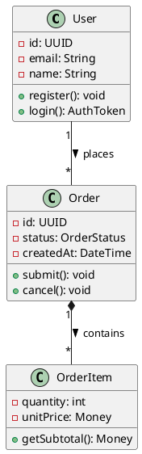
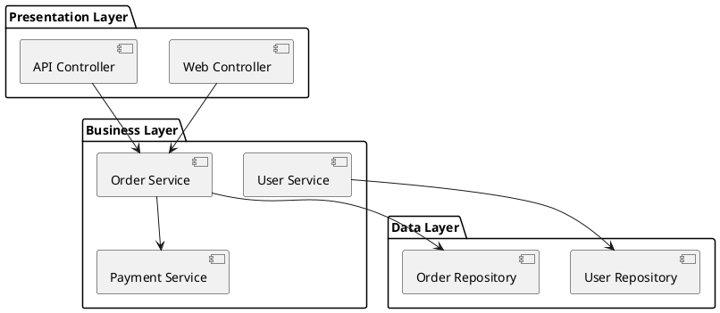
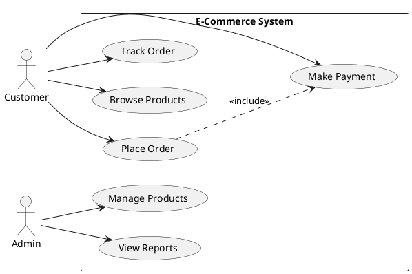
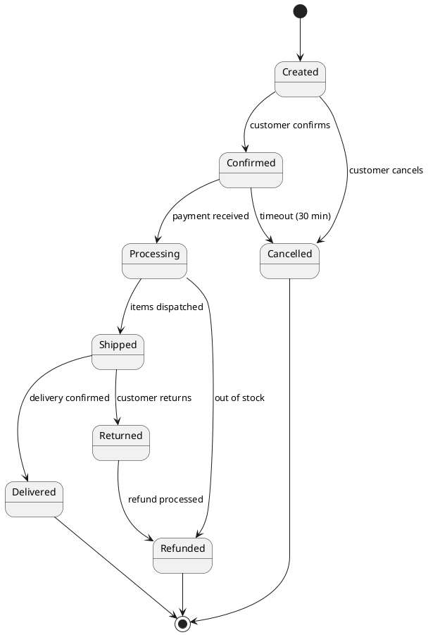
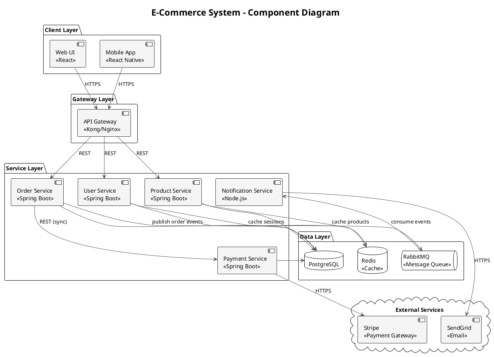
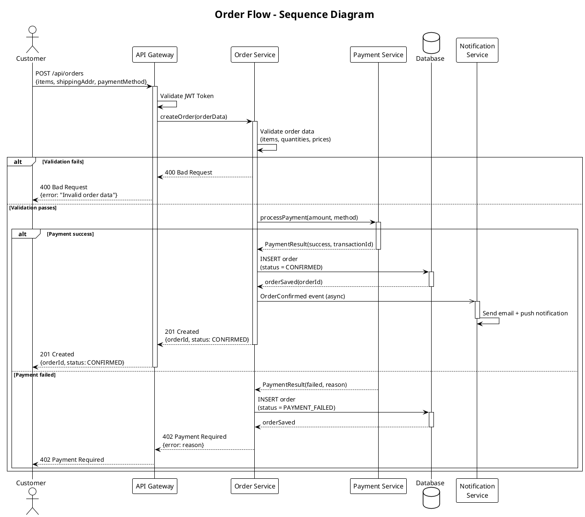
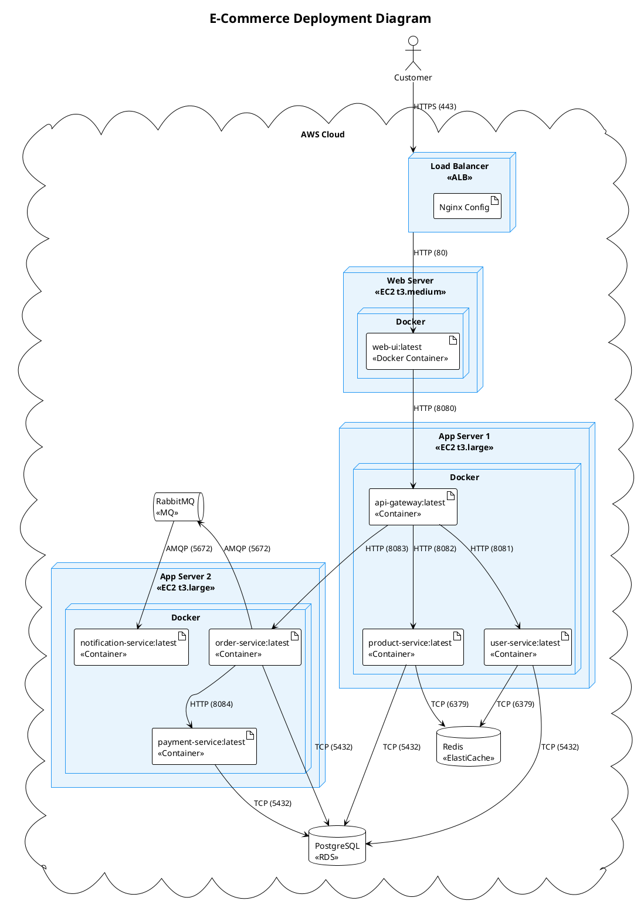
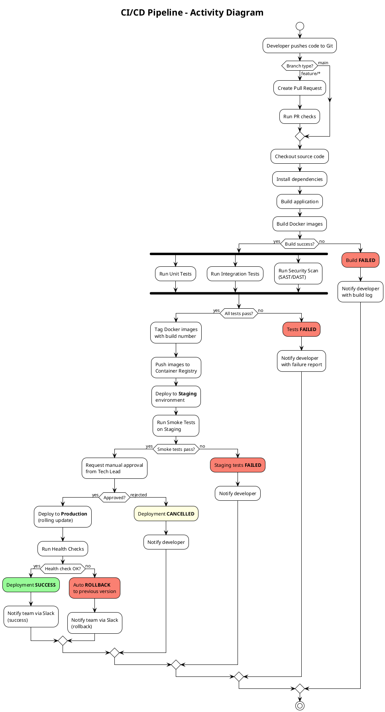

# Lab 3.1: UML for Architecture Documentation

## Tổng quan

| Thông tin | Giá trị |
|-----------|---------|
| **Thời lượng** | 3 giờ |
| **Độ khó** | Beginner → Intermediate |
| **Yêu cầu trước** | Hoàn thành Lab 1.1 (Software Architecture Fundamentals) |
| **Công cụ** | PlantUML, draw.io, VS Code + PlantUML Extension |
| **Ngôn ngữ** | UML 2.x |
| **Hình thức** | Cá nhân / Nhóm 2-3 người |

---

## Mục tiêu Học tập

Sau khi hoàn thành lab này, sinh viên có thể:

1. **Giải thích** vai trò và mục đích của UML trong việc documentation kiến trúc phần mềm
2. **Phân biệt** các loại UML diagrams (structural vs behavioral) và biết chọn đúng loại cho từng tình huống kiến trúc
3. **Tạo** được 4 loại diagram kiến trúc quan trọng: Component, Sequence, Deployment, Activity bằng PlantUML
4. **Đánh giá** chất lượng của UML diagrams dựa trên tiêu chí rõ ràng, đúng notation, và phù hợp audience
5. **Áp dụng** UML kết hợp với Agile workflow — "just enough" documentation, diagram-as-code, living documentation

---

## Phân bổ Thời gian

| Thời gian | Hoạt động | Chi tiết |
|-----------|-----------|----------|
| 00:00 – 00:30 | Lý thuyết UML 2.x | Overview, categories, architecture-relevant subset |
| 00:30 – 00:55 | Lab 1: Component Diagram | Vẽ e-commerce system components bằng PlantUML |
| 00:55 – 01:20 | Lab 2: Sequence Diagram | Vẽ order flow: User → API → Services → DB |
| 01:20 – 01:25 | Nghỉ giải lao | — |
| 01:25 – 01:50 | Lab 3: Deployment Diagram | Map components lên Docker containers/servers |
| 01:50 – 02:15 | Lab 4: Activity Diagram | Vẽ CI/CD pipeline flow |
| 02:15 – 02:35 | Self-Assessment | Trả lời 30 câu hỏi |
| 02:35 – 02:55 | Review & Discussion | Peer review diagrams, thảo luận best practices |
| 02:55 – 03:00 | Wrap-up | Deliverables checklist, hướng dẫn Extend Labs |

**Tổng: 3 giờ (180 phút)**

---

## Lý thuyết

### 1. UML 2.x Overview

**UML (Unified Modeling Language)** là ngôn ngữ mô hình hóa trực quan chuẩn do **OMG (Object Management Group)** quản lý. UML 2.x (phiên bản hiện tại: 2.5.1) định nghĩa **14 loại diagrams** chia thành 2 nhóm chính.

**Tại sao cần UML trong kiến trúc phần mềm?**

- **Communication**: Tạo ngôn ngữ chung giữa developers, architects, stakeholders
- **Documentation**: Ghi lại các quyết định kiến trúc (architecture decisions) bằng hình ảnh
- **Analysis**: Phát hiện vấn đề thiết kế trước khi viết code
- **Onboarding**: Giúp thành viên mới hiểu hệ thống nhanh hơn

```
 UML 2.x Diagrams (14 loại)
 │
 ┌─────────────────┴──────────────────┐
 │ │
 Structural (7) Behavioral (7)
 │ │
 ┌───────────┼───────────┐ ┌─────────────┼─────────────┐
 │ │ │ │ │ │
 Static Composite Deploy Interaction State/Flow Use Case
 │ │ │ │ │ │
 - Class - Composite - Deploy - Sequence - State Machine - Use Case
 - Package Structure - Profile - Communication - Activity
 - Object - Timing
 - Interaction
 Overview
```

### 2. Structural Diagrams — Mô tả cấu trúc tĩnh

#### 2.1 Class Diagram

**Mục đích**: Mô tả cấu trúc của classes, attributes, methods, và relationships.

**Dùng trong kiến trúc**: Domain model, API contracts, data transfer objects.

| Ký hiệu | Ý nghĩa | Ví dụ |
|----------|---------|-------|
| `─────` | Association (liên kết) | Customer — Order |
| `◇─────` | Aggregation (gộp lỏng) | Department ◇── Employee |
| `◆─────` | Composition (gộp chặt) | Order ◆── OrderItem |
| `△─────` | Inheritance (kế thừa) | SavingsAccount △── Account |
| `- - - ▷` | Implementation (triển khai) | UserService - - ▷ IUserService |
| `- - - >` | Dependency (phụ thuộc) | Controller - - -> Service |

**PlantUML ví dụ:**



#### 2.2 Component Diagram

**Mục đích**: Mô tả các component ở mức cao và cách chúng tương tác qua interfaces.

**Dùng trong kiến trúc**: System decomposition, service boundaries, dependency mapping.

| Element | Ký hiệu PlantUML | Mô tả |
|---------|-------------------|-------|
| Component | `[Component Name]` | Đơn vị phần mềm độc lập |
| Interface (provided) | `() "Name"` | Interface mà component cung cấp |
| Interface (required) | Dùng `-->` đến interface | Interface mà component cần |
| Package | `package "Name" {}` | Nhóm các components |
| Dependency | `-->` | Quan hệ phụ thuộc |

#### 2.3 Deployment Diagram

**Mục đích**: Mô tả cách phần mềm được triển khai trên infrastructure vật lý/ảo.

**Dùng trong kiến trúc**: Infrastructure planning, cloud architecture, container orchestration.

| Element | Stereotype | Mô tả |
|---------|-----------|-------|
| Node | `<<device>>`, `<<execution environment>>` | Server, VM, container |
| Artifact | `<<artifact>>` | File deploy (.jar, .war, Docker image) |
| Communication path | `--` hoặc `..` | Kết nối mạng giữa nodes |
| Deployment specification | `<<deployment spec>>` | Cấu hình deploy |

#### 2.4 Package Diagram

**Mục đích**: Tổ chức các phần tử UML thành namespaces/modules.

**Dùng trong kiến trúc**: Module structure, layer separation, dependency management.



### 3. Behavioral Diagrams — Mô tả hành vi động

#### 3.1 Sequence Diagram

**Mục đích**: Mô tả tương tác giữa các đối tượng theo trình tự thời gian.

**Dùng trong kiến trúc**: API flows, integration patterns, error handling flows.

| Element | Ký hiệu PlantUML | Mô tả |
|---------|-------------------|-------|
| Participant | `participant "Name"` | Actor hoặc object tham gia |
| Synchronous message | `->` | Gọi đồng bộ, chờ kết quả |
| Asynchronous message | `->>` | Gửi không chờ |
| Return message | `-->` | Trả về kết quả (nét đứt) |
| Alt fragment | `alt ... else ... end` | Rẽ nhánh điều kiện |
| Loop fragment | `loop ... end` | Lặp |
| Opt fragment | `opt ... end` | Tùy chọn (optional) |
| Activation | `activate` / `deactivate` | Đang thực thi |

#### 3.2 Activity Diagram

**Mục đích**: Mô tả workflow, business process, hoặc thuật toán.

**Dùng trong kiến trúc**: CI/CD pipelines, business processes, data processing flows.

| Element | Ký hiệu PlantUML | Mô tả |
|---------|-------------------|-------|
| Start | `(*)` hoặc `start` | Điểm bắt đầu |
| End | `stop` hoặc `end` | Điểm kết thúc |
| Action | `:Action;` | Hành động |
| Decision | `if ... then ... else ... endif` | Rẽ nhánh |
| Fork/Join | `fork` / `fork again` / `end fork` | Xử lý song song |
| Swimlane | `|Swimlane|` | Phân vùng trách nhiệm |

#### 3.3 Use Case Diagram

**Mục đích**: Mô tả chức năng hệ thống từ góc nhìn người dùng.

**Dùng trong kiến trúc**: Requirements validation, scope definition, stakeholder communication.



#### 3.4 State Machine Diagram

**Mục đích**: Mô tả vòng đời (lifecycle) của một entity qua các trạng thái.

**Dùng trong kiến trúc**: Entity lifecycle management, workflow states, protocol modeling.



### 4. UML Tools — Công cụ vẽ UML

| Tool | Loại | Ưu điểm | Nhược điểm | Giá |
|------|------|---------|------------|-----|
| **PlantUML** | Text-based | CI/CD integration, version control friendly, nhiều diagram types | Cần học cú pháp, layout tự động đôi khi không đẹp | Miễn phí |
| **draw.io** | GUI drag-drop | Miễn phí, dễ sử dụng, export nhiều format | Khó maintain trong team lớn, manual positioning | Miễn phí |
| **Lucidchart** | GUI online | Collaboration real-time, professional, template phong phú | Bản miễn phí giới hạn, cần internet | Freemium |
| **Mermaid** | Text-based | Tích hợp Markdown/GitHub, đơn giản | Ít diagram types hơn PlantUML, limited customization | Miễn phí |
| **Enterprise Architect** | Desktop | Full UML 2.x support, code generation, reverse engineering | Đắt tiền, learning curve cao | Paid |

**Khuyến nghị cho lab này**: Sử dụng **PlantUML** vì:
- Text-based → dễ version control với Git
- Tích hợp VS Code qua extension
- Render online tại [plantuml.com/plantuml](https://www.plantuml.com/plantuml)
- Phù hợp philosophy "Diagram as Code"

### 5. UML trong Agile Teams

Trong Agile, UML không phải để tạo tài liệu nặng nề mà để **giao tiếp hiệu quả**:

| Nguyên tắc | Giải thích |
|-------------|-----------|
| **Just Enough** | Chỉ vẽ diagram khi cần truyền đạt ý tưởng phức tạp |
| **Diagram as Code** | Dùng PlantUML/Mermaid để diagrams nằm cùng source code |
| **Living Documentation** | Diagrams phải được cập nhật khi code thay đổi |
| **Whiteboard Sketches** | Phác thảo nhanh trên bảng trắng rồi chụp ảnh cũng là UML hợp lệ |
| **Right Audience** | Component Diagram cho architects, Sequence cho developers, Use Case cho stakeholders |

### 6. Architecture-Relevant UML Subset

Không phải tất cả 14 loại UML diagrams đều cần thiết cho architecture documentation. Bảng sau đây liệt kê **subset quan trọng nhất**:

| Diagram | Tầm quan trọng | Khi nào dùng | Audience |
|---------|----------------|--------------|----------|
| **Component** | ***** | System decomposition, service boundaries | Architects, Tech Leads |
| **Deployment** | ***** | Infrastructure planning, cloud architecture | DevOps, Architects |
| **Sequence** | **** | API flows, integration points, error flows | Developers |
| **Activity** | **** | CI/CD pipelines, business workflows | DevOps, BA |
| **Class** | *** | Domain model, API contracts | Developers |
| **State Machine** | *** | Entity lifecycle, workflow states | Developers, BA |
| **Package** | ** | Module organization, layer structure | Architects |
| **Use Case** | ** | Requirements scope, stakeholder buy-in | BA, Stakeholders |

---

## Step-by-step Labs

### Lab 1: Component Diagram — E-Commerce System (25 phút)

**Mục tiêu**: Vẽ Component Diagram cho hệ thống e-commerce bằng PlantUML, thể hiện rõ các service boundaries và interfaces.

**Bối cảnh**: Bạn được giao thiết kế kiến trúc cho một hệ thống e-commerce gồm Web UI, mobile app, API Gateway, và nhiều microservices.

#### Bước 1: Xác định components

Liệt kê các components chính của hệ thống:

| Component | Trách nhiệm |
|-----------|-------------|
| Web UI | Giao diện web cho customer |
| Mobile App | Ứng dụng mobile |
| API Gateway | Routing, authentication, rate limiting |
| User Service | Quản lý user, authentication |
| Product Service | Catalog, search, inventory |
| Order Service | Order management, order lifecycle |
| Payment Service | Payment processing, refunds |
| Notification Service | Email, SMS, push notifications |
| Database (PostgreSQL) | Persistent storage |
| Message Queue (RabbitMQ) | Async communication |
| Cache (Redis) | Session, product cache |

#### Bước 2: Xác định interfaces và dependencies

Vẽ sơ đồ các kết nối giữa components:
- Web UI → API Gateway (REST/HTTPS)
- API Gateway → các Services (REST)
- Order Service → Payment Service (sync call)
- Order Service → Notification Service (async via MQ)
- Các Services → Database
- Các Services → Cache

#### Bước 3: Viết PlantUML code

Tạo file `lab1-component.puml`:



#### Bước 4: Render và kiểm tra

- Cài VS Code extension "PlantUML" (jebbs.plantuml)
- Nhấn `Alt+D` để preview diagram
- Hoặc paste code vào [plantuml.com/plantuml/uml](https://www.plantuml.com/plantuml/uml)

#### Checklist Lab 1

- [ ] Tất cả 11 components được thể hiện
- [ ] Có phân tách layer rõ ràng (Client / Gateway / Service / Data)
- [ ] Ghi chú technology stack trên mỗi component
- [ ] Mũi tên có label mô tả protocol (REST, HTTPS, async)
- [ ] External services được đặt trong cloud boundary

---

### Lab 2: Sequence Diagram — Order Flow (25 phút)

**Mục tiêu**: Vẽ Sequence Diagram chi tiết cho luồng đặt hàng, bao gồm cả happy path và error handling.

**Bối cảnh**: Customer đặt hàng → API Gateway nhận request → OrderService xử lý → PaymentService thanh toán → lưu Database → gửi notification.

#### Bước 1: Xác định participants

| Participant | Vai trò |
|-------------|---------|
| Customer | Người dùng cuối |
| API Gateway | Entry point, authentication |
| Order Service | Orchestrator cho order flow |
| Payment Service | Xử lý thanh toán |
| Database | Lưu trữ dữ liệu |
| Notification Service | Gửi thông báo |

#### Bước 2: Xác định flow

**Happy path:**
1. Customer gửi POST /orders
2. API Gateway xác thực JWT token
3. API Gateway forward đến Order Service
4. Order Service validate order data
5. Order Service gọi Payment Service
6. Payment Service xử lý thanh toán → success
7. Order Service lưu order vào Database
8. Order Service gửi event đến Notification Service
9. Trả kết quả về Customer

**Error path:**
- Payment fails → trả lỗi 402
- Validation fails → trả lỗi 400

#### Bước 3: Viết PlantUML code

Tạo file `lab2-sequence.puml`:



#### Bước 4: Phân tích diagram

Sau khi render, hãy kiểm tra:
- Thứ tự messages có logic không?
- Alt fragment có bao phủ cả success và failure?
- Synchronous (`->`) vs Asynchronous (`->>`) đã đúng chưa?
- Activation bars (activate/deactivate) có khớp không?

#### Checklist Lab 2

- [ ] Có đầy đủ 6 participants
- [ ] Happy path hoàn chỉnh từ Customer đến Database
- [ ] Error handling với alt fragment (payment fails, validation fails)
- [ ] Phân biệt sync (`->`) và async (`->>`) messages
- [ ] Mỗi message có label mô tả rõ action và data
- [ ] Activation bars (activate/deactivate) chính xác

---

### Lab 3: Deployment Diagram — Docker Containers (25 phút)

**Mục tiêu**: Vẽ Deployment Diagram map các components lên Docker containers chạy trên cloud servers.

**Bối cảnh**: E-commerce system từ Lab 1 được deploy trên 2 servers (web server + app server) sử dụng Docker containers, cùng managed database trên cloud.

#### Bước 1: Xác định infrastructure

| Node | Loại | Chứa gì |
|------|------|---------|
| Load Balancer | Cloud service | Nginx reverse proxy |
| Web Server | Docker host | Web UI container |
| App Server 1 | Docker host | API Gateway, User Svc, Product Svc |
| App Server 2 | Docker host | Order Svc, Payment Svc, Notification Svc |
| DB Server | Managed service | PostgreSQL RDS |
| Cache Server | Managed service | Redis ElastiCache |
| Message Broker | Managed service | RabbitMQ |

#### Bước 2: Xác định communication paths

- Client → Load Balancer (HTTPS:443)
- Load Balancer → Web Server (HTTP:80)
- Web Server → App Server 1 (HTTP:8080)
- App Server 1 App Server 2 (HTTP:8080)
- App Servers → DB Server (TCP:5432)
- App Servers → Cache Server (TCP:6379)
- App Servers → Message Broker (AMQP:5672)

#### Bước 3: Viết PlantUML code

Tạo file `lab3-deployment.puml`:



#### Bước 4: Kiểm tra và cải thiện

Kiểm tra diagram:
- Mỗi container có đúng image name và tag?
- Port numbers có chính xác?
- Phân tách server hợp lý (không quá tải 1 server)?
- Managed services (RDS, ElastiCache) nằm ngoài Docker?

#### Checklist Lab 3

- [ ] Nodes có stereotype rõ ràng (<<EC2>>, <<RDS>>, <<Docker Container>>)
- [ ] Artifacts (containers) nằm đúng trong nodes
- [ ] Communication paths có ghi protocol và port
- [ ] Managed services (DB, Cache, MQ) tách riêng
- [ ] Cloud boundary bao bọc toàn bộ infrastructure

---

### Lab 4: Activity Diagram — CI/CD Pipeline (25 phút)

**Mục tiêu**: Vẽ Activity Diagram cho CI/CD pipeline, thể hiện các stages song song và điều kiện rẽ nhánh.

**Bối cảnh**: Pipeline CI/CD cho e-commerce system: Developer push code → Build → Test → Deploy to Staging → Approval → Deploy to Production.

#### Bước 1: Xác định activities

| Stage | Activities | Điều kiện |
|-------|-----------|-----------|
| Trigger | Developer push code to Git | Branch = main hoặc feature/* |
| Build | Compile, build Docker images | Build pass? |
| Test (parallel) | Unit tests, Integration tests, Security scan | All pass? |
| Deploy Staging | Deploy to staging environment | Auto |
| Approval | Manual approval from Tech Lead | Approved? |
| Deploy Production | Rolling update to production | Health check pass? |
| Notify | Send notification (Slack/email) | Always |

#### Bước 2: Xác định parallel flows

- Unit Tests, Integration Tests, Security Scan chạy **song song**
- Nếu bất kỳ test nào fail → pipeline dừng

#### Bước 3: Viết PlantUML code

Tạo file `lab4-activity.puml`:



#### Bước 4: Phân tích diagram

Kiểm tra:
- `fork` / `end fork` dùng đúng cho parallel activities?
- Mỗi `if` đều có cả nhánh `then` và `else`?
- Kết thúc bằng `stop` ở tất cả paths?
- Có rollback mechanism khi production health check fail?

#### Checklist Lab 4

- [ ] Pipeline có đủ stages: Build → Test → Deploy Staging → Approval → Deploy Production
- [ ] Parallel activities (Unit Test, Integration Test, Security Scan) dùng `fork`
- [ ] Decision points (`if/else`) cho mỗi stage
- [ ] Error handling: notify developer khi fail
- [ ] Rollback mechanism khi production deploy fail
- [ ] Có manual approval gate trước production

---

## Self-Assessment — 30 Câu hỏi Tự đánh giá

### Câu 1-10: Kiến thức cơ bản (Basic)

**Câu 1.** UML là viết tắt của gì?
- A) Universal Modeling Language
- B) Unified Modeling Language
- C) Unified Markup Language
- D) Universal Markup Language

> **Đáp án: B** — UML = Unified Modeling Language, được OMG (Object Management Group) phát triển và duy trì từ năm 1997. Phiên bản hiện tại là UML 2.5.1.

**Câu 2.** UML 2.x định nghĩa bao nhiêu loại diagrams?
- A) 7
- B) 10
- C) 14
- D) 20

> **Đáp án: C** — UML 2.x có 14 loại diagrams: 7 structural (Class, Object, Package, Component, Composite Structure, Deployment, Profile) và 7 behavioral (Use Case, Activity, State Machine, Sequence, Communication, Timing, Interaction Overview).

**Câu 3.** Component Diagram thuộc nhóm nào?
- A) Behavioral Diagrams
- B) Structural Diagrams
- C) Interaction Diagrams
- D) State Diagrams

> **Đáp án: B** — Component Diagram là một Structural Diagram, mô tả cấu trúc tĩnh của hệ thống ở mức component.

**Câu 4.** Sequence Diagram mô tả điều gì?
- A) Cấu trúc class
- B) Deployment infrastructure
- C) Tương tác giữa các đối tượng theo trình tự thời gian
- D) State transitions

> **Đáp án: C** — Sequence Diagram thuộc nhóm Interaction Diagrams (con của Behavioral), mô tả cách các đối tượng tương tác theo thời gian qua messages.

**Câu 5.** Ký hiệu `◆────` trong Class Diagram biểu diễn quan hệ gì?
- A) Association
- B) Aggregation
- C) Composition
- D) Dependency

> **Đáp án: C** — Composition (hình thoi đặc ◆) thể hiện quan hệ "whole-part" mạnh: part không thể tồn tại độc lập nếu whole bị xóa. Ví dụ: Order ◆── OrderItem (xóa Order → xóa OrderItem).

**Câu 6.** Deployment Diagram tập trung vào:
- A) Business logic
- B) Physical/virtual infrastructure và cách phần mềm được triển khai
- C) Database schema
- D) User interface layout

> **Đáp án: B** — Deployment Diagram mô tả nodes (servers, VMs, containers), artifacts (deployable files), và communication paths giữa chúng.

**Câu 7.** Lifeline trong Sequence Diagram biểu diễn:
- A) Một method call
- B) Giá trị return
- C) Một participant tồn tại theo thời gian (đường dọc nét đứt)
- D) Một điều kiện

> **Đáp án: C** — Lifeline là đường dọc nét đứt xuất phát từ participant box, biểu diễn sự tồn tại của participant theo thời gian.

**Câu 8.** Trong PlantUML, cú pháp nào tạo một component?
- A) `class [MyComponent]`
- B) `[MyComponent]`
- C) `component MyComponent`
- D) Cả B và C đều đúng

> **Đáp án: D** — PlantUML cho phép cả hai cú pháp: `[MyComponent]` (shorthand) và `component "MyComponent"` (full syntax).

**Câu 9.** Use Case Diagram chủ yếu dành cho audience nào?
- A) Developers
- B) DevOps engineers
- C) Business stakeholders và Business Analysts
- D) Database administrators

> **Đáp án: C** — Use Case Diagram mô tả chức năng hệ thống từ góc nhìn người dùng, giúp stakeholders hiểu scope và requirements mà không cần kiến thức kỹ thuật.

**Câu 10.** Sự khác biệt chính giữa Aggregation và Composition là gì?
- A) Aggregation dùng nét đứt, Composition dùng nét liền
- B) Aggregation là "weak ownership" (part có thể tồn tại độc lập), Composition là "strong ownership" (part phụ thuộc vào whole)
- C) Chúng giống nhau hoàn toàn
- D) Aggregation chỉ dùng trong Sequence Diagram

> **Đáp án: B** — Aggregation (◇): Department ◇── Employee → Employee vẫn tồn tại khi Department bị xóa. Composition (◆): Order ◆── OrderItem → OrderItem bị xóa khi Order bị xóa.

### Câu 11-20: Kiến thức trung bình (Intermediate)

**Câu 11.** Fragment `alt` trong Sequence Diagram dùng để:
- A) Lặp lại một nhóm messages
- B) Biểu diễn rẽ nhánh (if-else) giữa các scenarios
- C) Đánh dấu messages optional
- D) Gom nhóm messages tham khảo

> **Đáp án: B** — `alt` (alternative) fragment biểu diễn rẽ nhánh điều kiện, tương tự if-else. `loop` dùng cho lặp, `opt` dùng cho optional, `ref` dùng cho tham khảo.

**Câu 12.** Activity Diagram khác Sequence Diagram ở điểm nào?
- A) Activity tập trung vào workflow/process flow, Sequence tập trung vào interaction giữa objects theo thời gian
- B) Activity chỉ dùng cho code, Sequence chỉ dùng cho business
- C) Activity không hỗ trợ parallel, Sequence thì có
- D) Chúng giống nhau

> **Đáp án: A** — Activity Diagram mô tả luồng hoạt động (workflow, algorithm, process), còn Sequence Diagram mô tả tương tác giữa các đối tượng theo trình tự thời gian. Activity hỗ trợ fork/join cho parallel processing.

**Câu 13.** State Machine Diagram phù hợp nhất khi nào?
- A) Khi cần mô tả database schema
- B) Khi entity có nhiều trạng thái và transitions phức tạp (ví dụ: Order lifecycle)
- C) Khi cần vẽ infrastructure
- D) Khi cần liệt kê requirements

> **Đáp án: B** — State Machine Diagram lý tưởng cho entity lifecycle management: Order (Created → Confirmed → Processing → Shipped → Delivered), Payment (Pending → Authorized → Captured → Refunded).

**Câu 14.** Package Diagram dùng để:
- A) Mô tả deployment infrastructure
- B) Tổ chức elements thành namespaces/modules, thể hiện dependencies giữa packages
- C) Vẽ sequence of events
- D) Thiết kế UI

> **Đáp án: B** — Package Diagram tổ chức các UML elements thành groups (packages), thể hiện module structure và inter-package dependencies. Hữu ích cho layer separation (Presentation / Business / Data).

**Câu 15.** Trong PlantUML, sự khác nhau giữa `->` và `->>` trong Sequence Diagram là gì?
- A) `->` là association, `->>` là dependency
- B) `->` là synchronous message (đợi reply), `->>` là asynchronous message (fire-and-forget)
- C) Không có sự khác biệt
- D) `->` là đường nét liền, `->>` là đường nét đứt

> **Đáp án: B** — `->` biểu diễn synchronous call (caller đợi callee trả lời), `->>` biểu diễn asynchronous message (caller không đợi, tiếp tục thực thi). Async thường dùng cho message queues, events.

**Câu 16.** Stereotype trong UML là gì?
- A) Một loại diagram mới
- B) Metadata bổ sung cho element, viết trong `<<...>>` (ví dụ: `<<interface>>`, `<<service>>`)
- C) Một loại relationship
- D) Tên của tool

> **Đáp án: B** — Stereotype mở rộng vocabulary của UML, cho phép gắn thêm ý nghĩa lên elements. Ví dụ: `<<Docker Container>>`, `<<REST API>>`, `<<database>>`.

**Câu 17.** Khi nào nên dùng Component Diagram thay vì Class Diagram?
- A) Khi cần chi tiết về attributes và methods
- B) Khi cần mô tả hệ thống ở mức cao (high-level), tập trung vào service boundaries và interfaces
- C) Khi cần vẽ database schema
- D) Khi cần mô tả user stories

> **Đáp án: B** — Component Diagram ở mức trừu tượng cao hơn Class Diagram. Component Diagram phù hợp cho architecture overview, service decomposition. Class Diagram phù hợp cho domain model chi tiết.

**Câu 18.** UML có phù hợp trong Agile development không?
- A) Không, UML chỉ dùng trong Waterfall
- B) Có, nhưng nên áp dụng nguyên tắc "just enough" — chỉ vẽ khi cần, giữ diagrams đơn giản
- C) Có, phải vẽ đầy đủ 14 loại diagrams trước khi code
- D) Chỉ dùng Use Case Diagram

> **Đáp án: B** — Trong Agile, UML được dùng như công cụ giao tiếp, không phải tài liệu nặng nề. "Diagram as Code" (PlantUML/Mermaid) giúp diagrams sống cùng source code và được version control.

**Câu 19.** Trong Deployment Diagram, "Node" biểu diễn:
- A) Một class trong code
- B) Một thiết bị vật lý hoặc môi trường thực thi (server, VM, container)
- C) Một test case
- D) Một API endpoint

> **Đáp án: B** — Node là computational resource: physical device (server), virtual machine, Docker container, Kubernetes pod, cloud instance.

**Câu 20.** PlantUML có ưu điểm gì so với GUI tools (draw.io, Lucidchart)?
- A) Đẹp hơn
- B) Text-based nên dễ version control (Git), tích hợp CI/CD, review qua Pull Request
- C) Nhanh hơn khi vẽ tay
- D) Miễn phí (draw.io cũng miễn phí)

> **Đáp án: B** — PlantUML là "diagram as code": text-based nên diff được trong Git, review được trong PR, generate tự động trong CI/CD pipeline. Đây là lợi thế lớn nhất so với GUI tools.

### Câu 21-30: Kiến thức nâng cao (Advanced)

**Câu 21.** Khi thiết kế microservices, loại UML diagram nào quan trọng nhất?
- A) Class Diagram
- B) Component Diagram (service boundaries) và Sequence Diagram (inter-service communication)
- C) Use Case Diagram
- D) Object Diagram

> **Đáp án: B** — Microservices cần Component Diagram để xác định service boundaries, interfaces, và dependencies. Sequence Diagram để mô tả inter-service communication, especially async patterns (events, message queues).

**Câu 22.** "Living Documentation" trong context UML nghĩa là gì?
- A) Tài liệu in ra giấy
- B) Diagrams được tự động generate/update từ code hoặc cùng version control với code, luôn phản ánh trạng thái hiện tại
- C) Diagrams vẽ một lần rồi không bao giờ đổi
- D) Chỉ dùng whiteboard

> **Đáp án: B** — Living Documentation: diagrams luôn đồng bộ với code. Đạt được bằng cách: (1) diagram-as-code nằm cùng repo, (2) auto-generate từ code (reverse engineering), (3) CI pipeline validate diagrams.

**Câu 23.** So sánh PlantUML với Mermaid:
- A) PlantUML hỗ trợ nhiều diagram types hơn, cú pháp phong phú hơn. Mermaid đơn giản hơn, tích hợp trực tiếp trong GitHub Markdown
- B) Mermaid tốt hơn PlantUML mọi mặt
- C) Chúng hoàn toàn giống nhau
- D) PlantUML chỉ hỗ trợ Class Diagram

> **Đáp án: A** — PlantUML hỗ trợ gần đầy đủ UML 2.x, nhiều tùy chỉnh. Mermaid đơn giản hơn, ít diagram types, nhưng render native trong GitHub/GitLab Markdown mà không cần plugin.

**Câu 24.** Khi Sequence Diagram quá phức tạp (>20 participants), nên làm gì?
- A) Vẽ hết trong một diagram
- B) Tách thành nhiều diagrams nhỏ hơn, mỗi diagram tập trung vào một flow cụ thể, dùng `ref` fragment để tham chiếu
- C) Bỏ Sequence Diagram, chỉ viết text
- D) Dùng Class Diagram thay thế

> **Đáp án: B** — Chia nhỏ theo use case hoặc sub-flow. Dùng `ref` fragment trong PlantUML để tham chiếu đến diagram khác. Mỗi diagram nên có 5-8 participants.

**Câu 25.** UML anti-pattern "The Big Ball of Mud Diagram" là gì?
- A) Diagram quá đẹp
- B) Một diagram chứa quá nhiều elements, không có tổ chức, mọi thứ kết nối với nhau → không truyền tải được thông tin
- C) Diagram không có màu sắc
- D) Diagram chỉ có 2 elements

> **Đáp án: B** — Anti-pattern này xảy ra khi cố gắng nhét tất cả vào một diagram. Giải pháp: chia theo abstraction level, theo concern, theo audience.

**Câu 26.** Trong CI/CD pipeline, UML diagrams (PlantUML) có thể được generate tự động bằng cách nào?
- A) Không thể tự động
- B) Dùng PlantUML CLI/JAR trong CI pipeline để render .puml → .png/.svg, publish lên wiki/docs site
- C) Chỉ vẽ tay
- D) Dùng Microsoft Word

> **Đáp án: B** — Ví dụ: `java -jar plantuml.jar *.puml -tsvg` trong CI pipeline (GitHub Actions, GitLab CI). Output (.svg/.png) được publish lên documentation site hoặc wiki tự động mỗi commit.

**Câu 27.** Nên dùng UML hay C4 Model cho architecture documentation?
- A) Chỉ UML
- B) Chỉ C4
- C) Kết hợp cả hai: C4 cho high-level context/container views, UML cho detailed component/sequence views
- D) Không dùng cái nào

> **Đáp án: C** — C4 Model (Context, Container, Component, Code) cung cấp framework cho abstraction levels. UML cung cấp notation chi tiết. Kết hợp: C4 Context → C4 Container → UML Component/Sequence cho detail.

**Câu 28.** Khi nào KHÔNG cần vẽ UML?
- A) Khi hệ thống quá phức tạp
- B) Khi code đủ rõ ràng (self-documenting), hệ thống đơn giản, hoặc team nhỏ ngồi cùng nhau có thể trao đổi trực tiếp
- C) Khi có nhiều stakeholders
- D) Khi dùng microservices

> **Đáp án: B** — UML tốn effort. Không cần khi: (1) code đã self-documenting, (2) team nhỏ, co-located, (3) prototype/throwaway code, (4) trivial CRUD app. Cần khi: complex integrations, distributed teams, critical decisions.

**Câu 29.** Trong PlantUML, làm sao tạo parallel activities trong Activity Diagram?
- A) Dùng `if/else`
- B) Dùng `fork` / `fork again` / `end fork`
- C) Dùng `alt`
- D) Không thể tạo parallel

> **Đáp án: B** — PlantUML syntax: `fork` bắt đầu parallel, `fork again` thêm nhánh song song, `end fork` kết thúc (tất cả nhánh phải hoàn thành). Tương đương fork/join bars trong UML notation.

**Câu 30.** Một Component Diagram tốt cho microservices architecture cần có những gì?
- A) Chỉ cần tên services
- B) Service boundaries rõ ràng, interfaces/APIs giữa services, protocol (REST/gRPC/async), external dependencies, data stores, và technology stack annotations
- C) Source code bên trong
- D) Chỉ cần database schema

> **Đáp án: B** — Component Diagram cho microservices cần: (1) rõ boundaries, (2) interfaces + protocol, (3) sync vs async communication, (4) shared resources (DB, cache, MQ), (5) external services, (6) technology annotations.

---

## Extend Labs — 10 Bài tập Mở rộng

### EL1: Complete E-Commerce Domain Model (***)

**Mục tiêu**: Vẽ Class Diagram đầy đủ cho e-commerce domain.

**Yêu cầu**:
- Tối thiểu 15 classes: User, Customer, Admin, Product, Category, Cart, CartItem, Order, OrderItem, Payment, Shipping, Address, Review, Coupon, Inventory
- Đầy đủ attributes (ít nhất 3 per class) và methods (ít nhất 2 per class)
- Sử dụng tất cả relationship types: Association, Aggregation, Composition, Inheritance, Dependency
- Ghi rõ multiplicity (1..1, 1..*, 0..*)
- Viết bằng PlantUML, render ra PNG/SVG
- Kèm theo 1 đoạn paragraph giải thích domain model

**Deliverable**: File `el1-domain-model.puml` + rendered image + 1 trang giải thích

---

### EL2: Complete Interaction Flows (***)

**Mục tiêu**: Vẽ 3 Sequence Diagrams cho các flows quan trọng.

**Yêu cầu**:
- **Flow 1**: User Registration + Email Verification
- **Flow 2**: Product Search → Add to Cart → Checkout → Payment
- **Flow 3**: Admin xem reports → export PDF
- Mỗi flow phải có: happy path + ít nhất 1 error path
- Sử dụng fragments: `alt`, `loop`, `opt`
- Phân biệt sync và async messages

**Deliverable**: 3 files `.puml` + rendered images

---

### EL3: Microservices Architecture Diagram (****)

**Mục tiêu**: Vẽ Component Diagram cho hệ thống microservices phức tạp.

**Yêu cầu**:
- Ít nhất 8 microservices với clear bounded contexts
- API Gateway pattern
- Event-driven communication (Kafka/RabbitMQ)
- Service mesh hoặc sidecar pattern
- Database per service pattern
- Shared infrastructure (monitoring, logging, tracing)
- Ghi chú technology stack cho mỗi service

**Deliverable**: File `el3-microservices.puml` + 1 trang giải thích architectural decisions

---

### EL4: Kubernetes Deployment Architecture (****)

**Mục tiêu**: Vẽ Deployment Diagram cho Kubernetes cluster.

**Yêu cầu**:
- Multi-node Kubernetes cluster (3 nodes)
- Pods, Services, Ingress Controller
- Namespaces (dev, staging, production)
- Persistent Volumes cho databases
- ConfigMaps và Secrets
- Horizontal Pod Autoscaler
- Cloud resources (AWS EKS, RDS, S3)

**Deliverable**: File `el4-k8s-deployment.puml` + rendered image

---

### EL5: Order State Machine (***)

**Mục tiêu**: Vẽ State Machine Diagram chi tiết cho Order lifecycle.

**Yêu cầu**:
- Ít nhất 8 states: Draft, Submitted, PaymentPending, Confirmed, Processing, Shipped, Delivered, Cancelled, Refunded, Returned
- Mỗi transition có: event trigger + guard condition (nếu có)
- Sub-states cho Payment (Pending → Authorized → Captured)
- Error states và recovery paths
- Timeout transitions

**Deliverable**: File `el5-order-state.puml` + rendered image

---

### EL6: PlantUML + CI/CD Automation (****)

**Mục tiêu**: Tạo pipeline tự động render PlantUML diagrams.

**Yêu cầu**:
- Tạo GitHub Actions workflow render `.puml` → `.svg`
- Commit generated images vào repo (hoặc publish lên GitHub Pages)
- Validate PlantUML syntax trong PR checks
- Auto-update README với latest diagrams
- Version control cho diagrams

**Deliverable**: `.github/workflows/plantuml.yml` + sample `.puml` files + README

---

### EL7: Reverse Engineering — Code to UML (****)

**Mục tiêu**: Generate UML diagrams từ existing codebase.

**Yêu cầu**:
- Chọn 1 open-source project (Spring Pet Clinic, TodoMVC, etc.)
- Dùng tool generate Class Diagram từ code (IntelliJ, Visual Paradigm, hoặc custom script)
- So sánh generated diagram với manually drawn diagram
- Đánh giá: generated diagram có đủ thông tin cho architecture documentation không?
- Đề xuất cải thiện

**Deliverable**: Generated diagram + manual diagram + 1 trang comparison

---

### EL8: UML + C4 Model Hybrid (***)

**Mục tiêu**: Kết hợp C4 Model với UML cho documentation đa tầng.

**Yêu cầu**:
- Vẽ C4 Level 1: System Context Diagram (dùng PlantUML + C4-PlantUML library)
- Vẽ C4 Level 2: Container Diagram
- Vẽ UML Component Diagram (zoom vào 1 container)
- Vẽ UML Sequence Diagram (zoom vào 1 component)
- Tạo navigation giữa các diagrams (hyperlinks)

**Deliverable**: 4 files `.puml` + rendered images + navigation document

---

### EL9: Living Documentation System (****)

**Mục tiêu**: Xây dựng hệ thống documentation tự động cập nhật.

**Yêu cầu**:
- Diagrams nằm trong repo, cùng version control với code
- CI pipeline auto-render diagrams khi có thay đổi
- Publish lên static site (GitHub Pages / MkDocs)
- Embed diagrams trong README và wiki
- Alert khi diagram không được update sau 30 ngày (stale detection)

**Deliverable**: Repo mẫu + CI config + docs site

---

### EL10: Architecture Presentation for Stakeholders (***)

**Mục tiêu**: Tạo bộ diagrams cho các audiences khác nhau.

**Yêu cầu**:
- **Executive view**: 1 high-level Context Diagram (non-technical, focus business value)
- **Technical Lead view**: Component Diagram + Sequence Diagram (focus architecture decisions)
- **Developer view**: Class Diagram + detailed Sequence Diagram (focus implementation)
- **DevOps view**: Deployment Diagram + Activity Diagram cho CI/CD
- Mỗi view kèm 3-5 bullet points giải thích
- Tất cả dùng PlantUML

**Deliverable**: 6 files `.puml` + 1 trang presentation guide

---

## Deliverables Checklist

Sinh viên cần nộp các sản phẩm sau:

| # | Deliverable | Format | Nguồn |
|---|-------------|--------|-------|
| 1 | Component Diagram — E-Commerce System | `.puml` + `.png`/`.svg` | Lab 1 |
| 2 | Sequence Diagram — Order Flow | `.puml` + `.png`/`.svg` | Lab 2 |
| 3 | Deployment Diagram — Docker Containers | `.puml` + `.png`/`.svg` | Lab 3 |
| 4 | Activity Diagram — CI/CD Pipeline | `.puml` + `.png`/`.svg` | Lab 4 |
| 5 | Self-Assessment answers | Text/PDF | 30 câu hỏi |
| 6 | (Bonus) Ít nhất 1 Extend Lab | `.puml` + docs | EL1-EL10 |

**Yêu cầu chung cho mỗi diagram**:
- [ ] File `.puml` có thể render thành công (không syntax error)
- [ ] Sử dụng đúng UML notation
- [ ] Có title rõ ràng
- [ ] Có đủ elements theo yêu cầu lab
- [ ] Labels trên arrows/connections mô tả đầy đủ
- [ ] Có stereotype/annotation cho technology stack (khi phù hợp)
- [ ] Diagram readable — không quá cluttered

---

## Lỗi Thường Gặp — 10 Common Mistakes

| # | Lỗi | Mô tả | Cách sửa |
|---|------|-------|----------|
| 1 | **Quá chi tiết** | Nhét quá nhiều elements vào 1 diagram, không ai đọc được | Chia nhỏ theo concern/abstraction level. Mỗi diagram tập trung 1 khía cạnh |
| 2 | **Quá sơ sài** | Diagram chỉ có 2-3 boxes kết nối nhau, không thêm thông tin gì so với text | Thêm labels, stereotypes, technology annotations, interfaces |
| 3 | **Không có legend** | Người đọc không hiểu ký hiệu, màu sắc, hoặc viết tắt trong diagram | Thêm legend/chú thích ở góc diagram. PlantUML: dùng `legend` block |
| 4 | **Sai notation** | Dùng nhầm ký hiệu: Aggregation Composition, sync async | Review lại UML 2.x specification. Dùng đúng ký hiệu theo chuẩn |
| 5 | **Diagram outdated** | Diagram vẽ từ 6 tháng trước, code đã thay đổi nhiều → misleading | "Diagram as Code" + CI/CD auto-render. Xóa diagrams không còn đúng |
| 6 | **Thiếu context** | Diagram không có title, không biết đang mô tả hệ thống nào, scope gì | Luôn có title, scope description, date, và author trên mỗi diagram |
| 7 | **Wrong abstraction level** | Dùng Class Diagram để mô tả system architecture (quá chi tiết), hoặc Component Diagram cho method-level design (quá high-level) | Chọn diagram type phù hợp với abstraction level cần truyền tải |
| 8 | **Mũi tên không rõ hướng** | Dependency arrows chỉ sai hướng hoặc thiếu label → hiểu nhầm ai gọi ai | Mũi tên dependency luôn chỉ từ dependent → dependency. Thêm label mô tả action |
| 9 | **Không phân biệt sync/async** | Sequence Diagram dùng cùng một loại mũi tên cho cả sync call và async message | Sync: `->` (mũi tên đặc). Async: `->>` (mũi tên hở). Ghi chú protocol (REST/async/event) |
| 10 | **Lạm dụng UML** | Vẽ UML cho mọi thứ kể cả khi không cần thiết (ví dụ: simple CRUD endpoint) | UML là công cụ giao tiếp, không phải mục đích. Chỉ vẽ khi diagram adds value |

---

## Rubric — Thang chấm điểm (100 điểm)

### Tổng quan điểm

| Tiêu chí | Điểm tối đa | Mô tả |
|----------|-------------|-------|
| Đúng UML Notation | 30 | Sử dụng đúng ký hiệu, elements, relationships theo chuẩn UML 2.x |
| Rõ ràng & Dễ đọc | 25 | Diagram truyền tải thông tin rõ ràng, layout hợp lý, không cluttered |
| Đầy đủ Nội dung | 25 | Bao phủ tất cả elements yêu cầu, không thiếu components/participants |
| Tính thẩm mỹ | 10 | Layout cân đối, labels gọn gàng, sử dụng color/grouping hợp lý |
| Self-Assessment | 10 | Trả lời đúng ≥ 24/30 câu hỏi |
| **Tổng** | **100** | |

### Chi tiết từng tiêu chí

**1. Đúng UML Notation (30 điểm)**

| Điểm | Mô tả |
|------|-------|
| 26-30 | Đúng hoàn toàn tất cả notation: elements, relationships, stereotypes, multiplicity |
| 21-25 | Hầu hết đúng, 1-2 lỗi nhỏ về notation |
| 16-20 | Có nhiều lỗi notation nhưng diagram vẫn có thể hiểu được |
| 11-15 | Sai nhiều notation, khó phân biệt các loại relationships |
| 0-10 | Sai cơ bản, không theo chuẩn UML |

**2. Rõ ràng & Dễ đọc (25 điểm)**

| Điểm | Mô tả |
|------|-------|
| 21-25 | Diagram rõ ràng, có title, labels đầy đủ, flow dễ follow, đúng audience |
| 16-20 | Khá rõ, thiếu 1-2 labels hoặc title |
| 11-15 | Đọc được nhưng cần effort để hiểu |
| 6-10 | Khó đọc, layout rối, thiếu nhiều labels |
| 0-5 | Không thể đọc hiểu |

**3. Đầy đủ Nội dung (25 điểm)**

| Điểm | Mô tả |
|------|-------|
| 21-25 | Tất cả 4 labs hoàn chỉnh, đủ elements theo yêu cầu, có error handling |
| 16-20 | 4 labs hoàn thành nhưng thiếu 1-2 elements |
| 11-15 | 3/4 labs hoàn thành |
| 6-10 | 2/4 labs hoàn thành |
| 0-5 | ≤ 1 lab hoàn thành |

**4. Tính thẩm mỹ (10 điểm)**

| Điểm | Mô tả |
|------|-------|
| 9-10 | Layout cân đối, grouping logic (packages/boundaries), consistent styling |
| 7-8 | Khá đẹp, minor layout issues |
| 5-6 | Chấp nhận được |
| 3-4 | Layout rối, không consistent |
| 0-2 | Không có tổ chức visual |

**5. Self-Assessment (10 điểm)**

| Điểm | Mô tả |
|------|-------|
| 9-10 | Đúng ≥ 27/30 câu |
| 7-8 | Đúng 24-26/30 câu |
| 5-6 | Đúng 20-23/30 câu |
| 3-4 | Đúng 15-19/30 câu |
| 0-2 | Đúng < 15/30 câu |

### Bonus Points (tối đa +10)

| Bonus | Điểm |
|-------|------|
| Hoàn thành ≥ 1 Extend Lab | +5 |
| Sử dụng PlantUML themes/skinparams đẹp | +2 |
| Diagrams có version history (Git commits) | +3 |

---

## Tài liệu Tham khảo

1. **OMG UML 2.5.1 Specification** — [omg.org/spec/UML](https://www.omg.org/spec/UML/)
2. **Martin Fowler** — *UML Distilled* (3rd Edition) — Tóm tắt UML thực dụng
3. **PlantUML Documentation** — [plantuml.com](https://plantuml.com/)
4. **draw.io (diagrams.net)** — [app.diagrams.net](https://app.diagrams.net/)
5. **Mermaid Documentation** — [mermaid.js.org](https://mermaid.js.org/)
6. **C4 Model** — Simon Brown — [c4model.com](https://c4model.com/)
7. **C4-PlantUML** — [github.com/plantuml-stdlib/C4-PlantUML](https://github.com/plantuml-stdlib/C4-PlantUML)
8. **IEEE 42010** — Systems and Software Engineering — Architecture Description
9. **arc42** — Architecture Documentation Template — [arc42.org](https://arc42.org/)
