# Lab 3.5: Mermaid Diagrams

## Tổng quan

| Thông tin | Giá trị |
|-----------|---------|
| **Thời lượng** | 2 giờ |
| **Độ khó** | Beginner |
| **Yêu cầu** | Kiến thức cơ bản về diagrams |

## Mục tiêu Học tập

Sau khi hoàn thành lab này, sinh viên có thể:

1. **Giải thích** advantages của text-based diagrams
2. **Tạo** các loại Mermaid diagrams phổ biến
3. **Integrate** Mermaid vào documentation workflow
4. **Convert** diagrams giữa tools

---

## Phần 1: Why Mermaid?

### 1.1 Text-based Diagrams

**Advantages:**
- Version control friendly (git diff)
- No special tools needed
- Easy to update
- Consistent styling
- Can be generated from code

**Disadvantages:**
- Less flexible layout
- Limited styling options
- Learning curve for syntax


### 1.2 Where Mermaid Works

| Platform | Support |
|----------|---------|
| GitHub | [OK] Native |
| GitLab | [OK] Native |
| Notion | [OK] Code block |
| VS Code | [OK] Extension |
| Confluence | [OK] Plugin |
| Documentation sites | [OK] Most support |

---

## Phần 2: Diagram Types

### 2.1 Flowchart

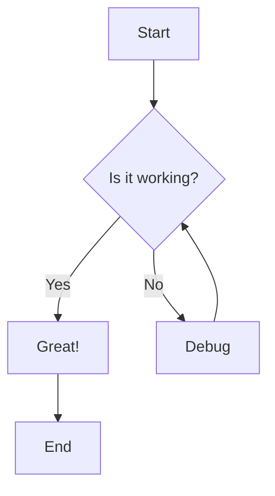

**Syntax:**

```
flowchart TD
 A[Rectangle] --> B{Diamond}
 B -->|Yes| C[Action]
 B -->|No| D[Other Action]
```

**Directions:**
- `TD` = Top Down
- `LR` = Left Right
- `BT` = Bottom Top
- `RL` = Right Left

### 2.2 Sequence Diagram

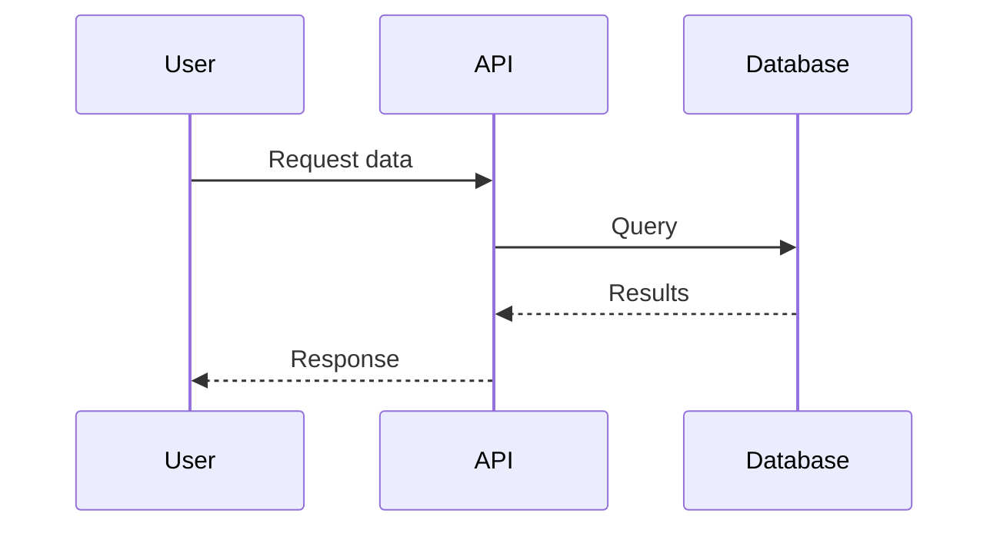

**Syntax:**

```
sequenceDiagram
 participant A as Alice
 participant B as Bob

 A->>B: Solid arrow (request)
 B-->>A: Dashed arrow (response)
 A-)B: Async message
```

**Arrow Types:**
- `->>` Solid line, arrowhead
- `-->>` Dashed line, arrowhead
- `-)` Solid line, open arrow (async)
- `--)` Dashed line, open arrow

### 2.3 Class Diagram

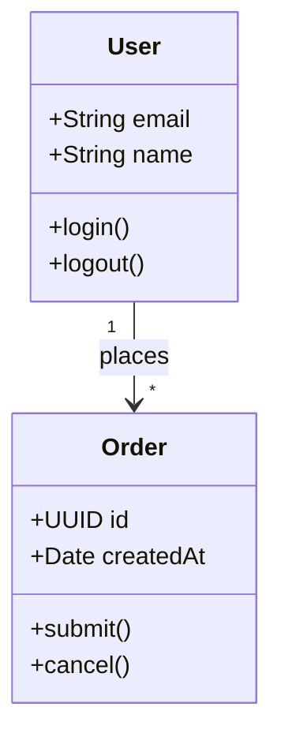

**Syntax:**

```
classDiagram
 class ClassName {
 +publicAttribute
 -privateAttribute
 #protectedAttribute
 +publicMethod()
 -privateMethod()
 }
 ClassA <|-- ClassB : inherits
 ClassA *-- ClassC : composition
 ClassA o-- ClassD : aggregation
```

### 2.4 Entity Relationship Diagram

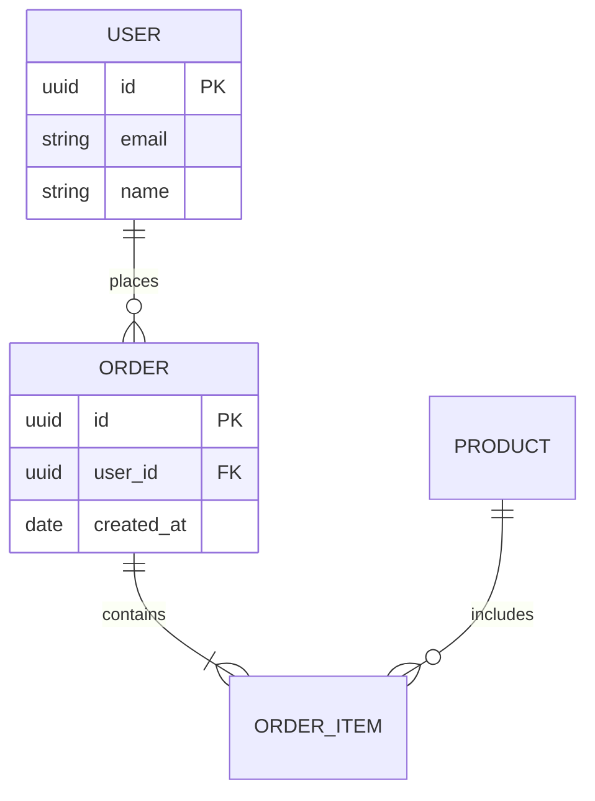

**Cardinality:**
- `||` exactly one
- `o|` zero or one
- `}|` one or more
- `o{` zero or more

### 2.5 State Diagram

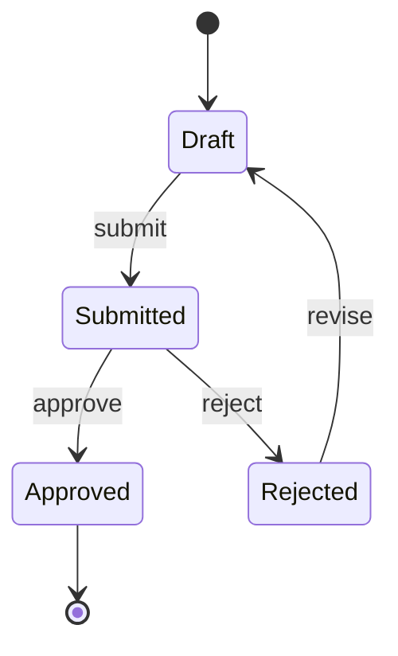

### 2.6 Gantt Chart

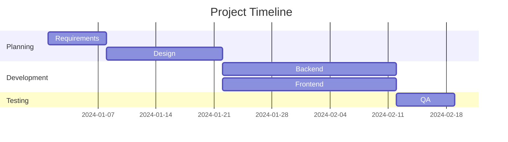

### 2.7 Pie Chart

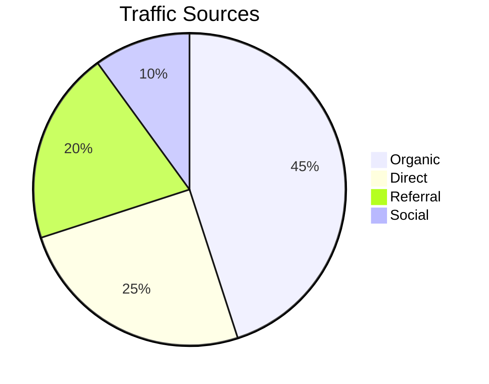

### 2.8 C4 Context Diagram

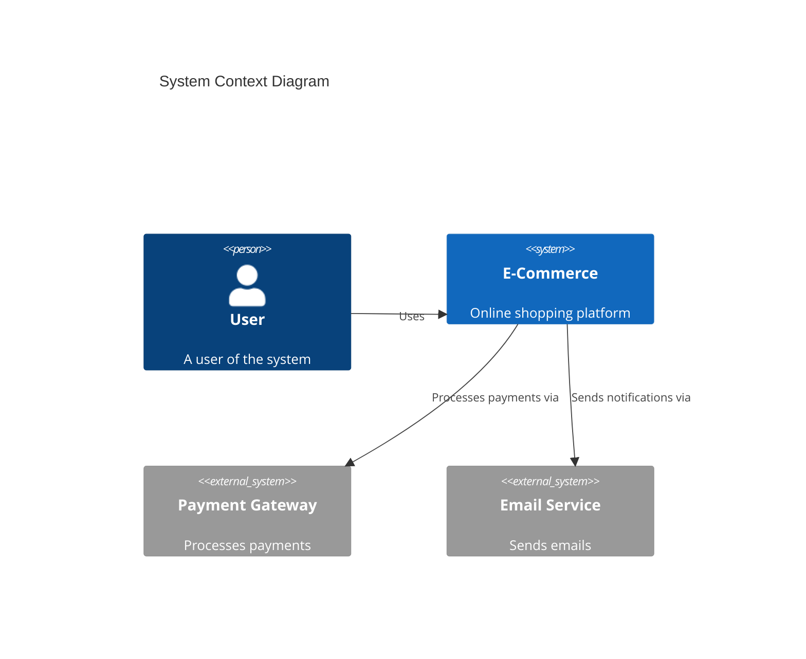

---

## Phần 3: Bài tập Thực hành

### Bài tập 1: Basic Diagrams (30 phút)

Create các Mermaid diagrams sau:

**1. Flowchart: User Registration**
- Start
- Enter email
- Validate email (decision)
- Enter password
- Validate password (decision)
- Create account
- Send verification email
- End

**2. Sequence: Password Reset**
- User → Frontend: Click "Forgot Password"
- Frontend → API: Request reset
- API → Email Service: Send email
- Email Service → User: Reset link
- User → Frontend: Click link
- Frontend → API: Verify token
- API → Frontend: Allow reset
- User → Frontend: Enter new password
- Frontend → API: Update password

### Bài tập 2: Class Diagram (20 phút)

Create Class Diagram cho **Library System**:

**Classes:**
- Book (id, title, isbn, borrow(), return())
- Member (id, name, email, borrowBook())
- Loan (id, borrowDate, dueDate, returnDate)
- Author (id, name, biography)

**Relationships:**
- Book has many Authors (many-to-many)
- Member has many Loans
- Loan references one Book

### Bài tập 3: ER Diagram (20 phút)

Create ER Diagram cho **E-Commerce**:

**Entities:**
- User
- Product
- Category
- Order
- OrderItem
- Review

**Relationships và cardinality:**
- User places many Orders
- Order contains many OrderItems
- Product belongs to Category
- Product has many Reviews
- User writes Reviews

### Bài tập 4: State Diagram (15 phút)

Create State Diagram cho **Order Lifecycle**:

**States:**
- Created
- Pending Payment
- Paid
- Processing
- Shipped
- Delivered
- Cancelled
- Refunded

**Transitions:**
- Created → Pending Payment (checkout)
- Pending Payment → Paid (payment success)
- Pending Payment → Cancelled (timeout/cancel)
- Paid → Processing (confirm)
- Processing → Shipped (ship)
- Shipped → Delivered (deliver)
- Delivered → Refunded (return)

---

## Phần 4: Advanced Features

### 4.1 Subgraphs

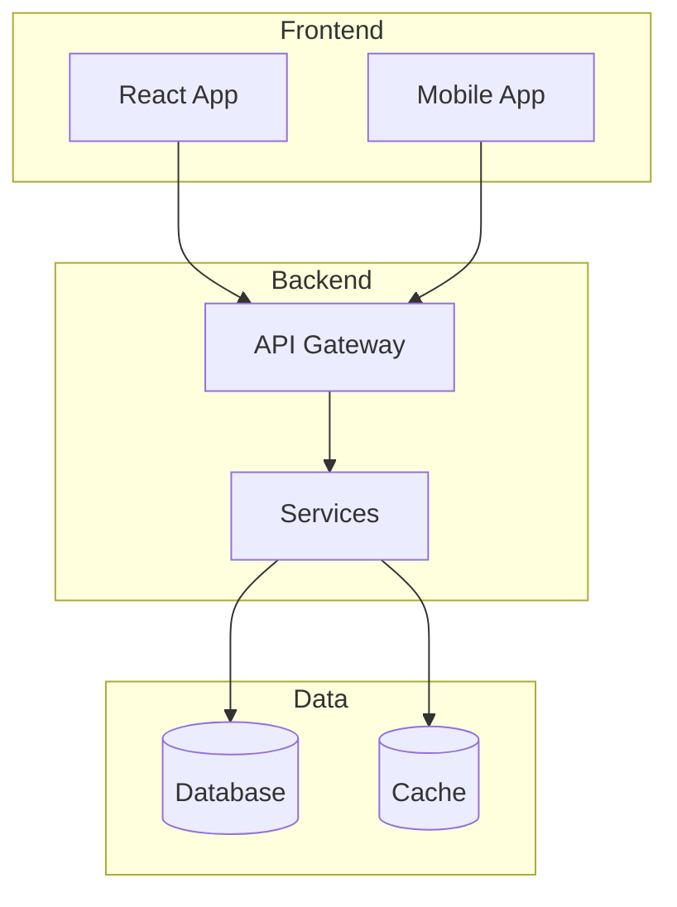

### 4.2 Styling

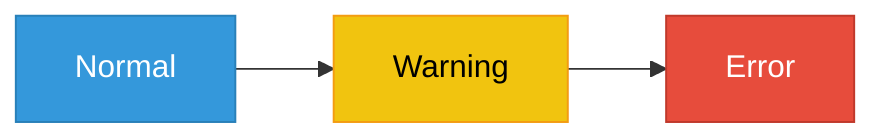

### 4.3 Notes in Sequence

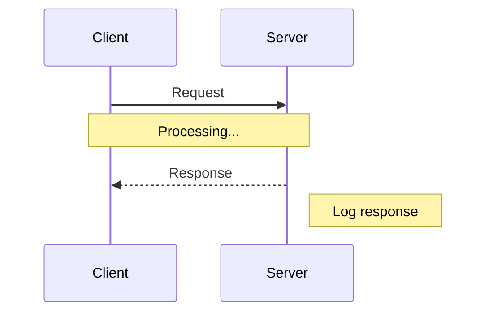

---

## Phần 5: Integration

### VS Code Setup

1. Install extension: "Markdown Preview Mermaid Support"
2. Create `.md` file
3. Add mermaid code block
4. Preview with Cmd+Shift+V

### GitHub

Ví dụ nội dung file `.md`. **Lưu ý:** fence ngoài phải dùng **bốn** dấu backtick (````) thì bên trong mới gõ được khối ` ```mermaid ` mà không làm vỡ Markdown.

````markdown
# My Document

Here's a diagram:


GitHub will render this automatically!
````

### Export Options

| Format | How |
|--------|-----|
| PNG | Use mermaid.live |
| SVG | Use mermaid CLI |
| PDF | Export from mermaid.live |

---

## Phần 6: Self-Assessment

### Quiz (5 phút)

1. Mermaid flowchart direction `TD` means:
 - A) Top Down
 - B) Two Dimensional
 - C) Through Direct
 - D) Time Delta

2. Trong Sequence Diagram, `-->>` represents:
 - A) Sync request
 - B) Dashed response
 - C) Error
 - D) Async message

3. ER Diagram cardinality `||--o{` means:
 - A) One to one
 - B) One to zero or more
 - C) Many to many
 - D) Zero to one

4. Mermaid diagrams are:
 - A) Binary files
 - B) Text-based
 - C) Image files
 - D) Video format

### Đáp án
1. A | 2. B | 3. B | 4. B

### Câu 5-30 (Trung bình → Nâng cao)

5. Mermaid là gì?
6. Mermaid hỗ trợ những loại diagrams nào?
7. Flowchart trong Mermaid?
8. Sequence Diagram trong Mermaid?
9. Class Diagram trong Mermaid?
10. ER Diagram trong Mermaid?
11. State Diagram trong Mermaid?
12. Gantt Chart trong Mermaid?
13. Pie Chart trong Mermaid?
14. Direction options (TD, LR, BT, RL)?
15. Node shapes trong Flowchart?
16. Arrow types trong Mermaid?
17. Subgraphs trong Flowchart?
18. Participants trong Sequence Diagram?
19. Loops và Alt trong Sequence?
20. Notes trong diagrams?
21. Mermaid Live Editor?
22. GitHub Mermaid support?
23. VS Code extensions?
24. Mermaid trong documentation?
25. Styling Mermaid diagrams?
26. Themes trong Mermaid?
27. Mermaid limitations?
28. Mermaid vs PlantUML?
29. Mermaid automation?
30. Mermaid best practices?

**Đáp án gợi ý:**
- 5: JavaScript-based diagramming tool từ text
- 6: Flowchart, Sequence, Class, ER, State, Gantt, Pie, etc.
- 28: Mermaid simpler syntax, PlantUML more features

---

## Extend Labs (10 bài)

### EL1: System Documentation
```
Mục tiêu: Complete docs
- All diagram types
- Architecture docs
- API flows
Độ khó: ***
```

### EL2: Microservices Architecture
```
Mục tiêu: Distributed diagrams
- Service interactions
- Event flows
- Deployment view
Độ khó: ****
```

### EL3: Database Documentation
```
Mục tiêu: Data modeling
- ER diagrams
- Relationships
- Cardinality
Độ khó: ***
```

### EL4: Workflow Documentation
```
Mục tiêu: Business flows
- Order processing
- User journeys
- State machines
Độ khó: ***
```

### EL5: CI/CD Integration
```
Mục tiêu: Automation
- Generate from code
- Include in PRs
- Wiki integration
Độ khó: ***
```

### EL6: Interactive Diagrams
```
Mục tiêu: Clickable diagrams
- Links trong diagrams
- Navigation
- Tooltips
Độ khó: ***
```

### EL7: Custom Styling
```
Mục tiêu: Branding
- Custom themes
- Corporate colors
- Consistent style
Độ khó: ***
```

### EL8: Diagram as Code
```
Mục tiêu: Version control
- Git-based docs
- Review process
- History tracking
Độ khó: ***
```

### EL9: Project Planning
```
Mục tiêu: Gantt charts
- Project timeline
- Dependencies
- Milestones
Độ khó: **
```

### EL10: Living Documentation
```
Mục tiêu: Always current
- Generate từ code
- Sync với codebase
- Automated updates
Độ khó: ****
```

---

## Deliverables

- [ ] Flowchart + Sequence (Bài tập 1)
- [ ] Class Diagram (Bài tập 2)
- [ ] ER Diagram (Bài tập 3)
- [ ] State Diagram (Bài tập 4)

---

## Tài liệu Tham khảo

1. [Mermaid Official Docs](https://mermaid.js.org/)
2. [Mermaid Live Editor](https://mermaid.live/)
3. [GitHub Mermaid Support](https://docs.github.com/en/get-started/writing-on-github/working-with-advanced-formatting/creating-diagrams)

---

## Phân bổ Thời gian: Lý thuyết 30', Thực hành vẽ diagram 90', Review 30', Mở rộng 30' = 3 giờ

## Lời giải Mẫu
- Sử dụng notation chuẩn (UML, C4, ArchiMate)
- Diagram phải có legend và description
- Phù hợp với audience (technical/business)

## Các Lỗi Thường Gặp
| Lỗi | Cách sửa |
|-----|----------|
| Quá chi tiết hoặc quá sơ sài | Chọn level phù hợp |
| Không có legend | Thêm chú thích ký hiệu |
| Outdated diagrams | Living documentation |

## Chấm điểm: Đúng notation 30, Rõ ràng 25, Đầy đủ 25, Aesthetic 20 = 100

## Tham khảo: CMU SEI, C4 Model (Simon Brown), arc42, IEEE 42010, ĐH Bách Khoa
